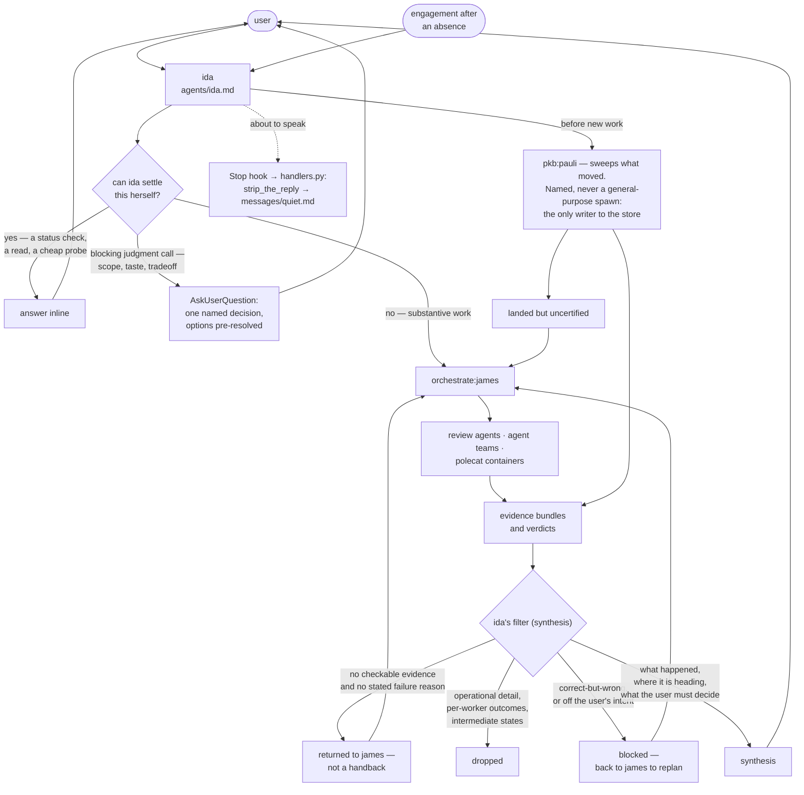

# ida

The interactive face: one agent, ida, who is the only agent in the framework that talks to the user.

## How it works

Everything the user says arrives at ida. Ida either answers it, escalates one named decision, or delegates it to `orchestrate:james` — and everything that comes back is filtered before the user sees it. The filter is the point of this plugin.

Engagement after an absence starts one step earlier. Before taking new work, ida commissions a sweep from `pkb:pauli`, and routes whatever finished uncertified to james for certification.

Ida holds between steps rather than driving ahead: after each step control returns to the user, who owns the sequence. Academic integrity is carried here — research data is immutable, and research, teaching, and publication outputs reach the user with full receipts before anything is marked done. The sign-off floor itself is not ida's alone: the `one-way-door` axiom binds every agent at an irreversible, outward-facing act, and ida's charter is the stricter domain layer over it.

### She does not touch the knowledge base — as a rule, not as a limitation

Her frontmatter declares a narrow `tools` list and exactly two delegation targets, `orchestrate:james` and `pkb:pauli`. Those are the only agents she may spawn, and a general-purpose spawn is forbidden outright for the sweep: pauli is the only writer to the store, and a spawn that lands anywhere else reads a graph it cannot correct.

The prohibition is written as a rule she keeps rather than a capability she lacks, because the capability claim is not true of the runtime. `specs/agents/agent-authority.md` records an observed spawned ida holding `Agent, Artifact, Bash, Edit, Read, Skill, ToolSearch, Write` plus the full PKB MCP namespace, against a frontmatter granting four tools and no MCP at all. A rule survives an allowlist that does not hold; "she has no tools for it" stops being a reason the moment the harness hands her some.

The sweep stays hers to commission for a reason that is not about tooling. Re-engagement after an absence is an event only she observes — she is the agent in the room when the user comes back. Commissioning is her act; the sweep, and every write it makes, is pauli's.

### The standard she applies to what comes back

Two floors, and they are different questions.

**Is this a handback at all?** The evidence rule is `lib/doctrine/handback.md`, `@include`d into her body and written nowhere else in this plugin. A return that does not clear it is not a thin handback to be summarised charitably; it goes back to james rather than to the user — and she does not verify the claim, re-run the work, or fill the gap herself.

**Is this what was actually wanted?** She is the only layer holding the user's intent, and a brief carries the ask, never the ambition behind it. So she judges every delivered artifact against the intent, not against the brief it was written from — and blocks work that is correct-but-wrong, which is a planning failure and goes back to be replanned rather than into another fix loop. A worker's self-reported success is never rubber-stamped, and "fixed" means the originally-failing behaviour was observed passing, not that a diff exists.

### The contract between ida and james

Two signatures land on `done`, in this order, and neither substitutes for the other (`specs/enforcement/workflow.md`).

**Certification is james's**, at unit completion. He commissions the review the graph already carries — the review nodes `brief` emitted as blocking dependencies — reads the verdict, and writes it onto the task record. What it certifies is mechanics, quality, and compliance with the brief. He supplies no judgment of his own there and never relays a worker's own claim of success in its place.

**Acceptance is ida's**, against the user's intent. Certification without acceptance ships work nobody weighed against what was wanted; acceptance without certification asks her to vouch for mechanics she never saw.

Ida routes but never certifies. The sweep detects uncertified work but never certifies it either. There is no status and no frontmatter field for certification: it is prose on the task record.

## What it provides

| Kind  | Name         | Purpose                                                                                                                                               |
| ----- | ------------ | ----------------------------------------------------------------------------------------------------------------------------------------------------- |
| Agent | `ida`        | The interactive face. Coordinates research work, delegates to james, filters returns.                                                                 |
| Skill | `strategize` | ida's own thinking pass: fix the altitude, test the plan against the effectual commitments, route each piece. Commissions pauli for every graph read. |
| Hook  | `Stop`       | The quiet gate — reminds ida to strip her reply to load-bearing content before she speaks to the person.                                              |

No commands. `strategize` is the one skill ida runs herself; every other plugin's skills reach her only as work she delegates to `orchestrate:james` or `pkb:pauli`.

`strategize` holds no PKB tools, because ida holds none — her declared `tools` are `Read`, `Skill`, `Agent`, `AskUserQuestion` and `Dispatch`. Every look at the graph inside it is a whole question commissioned from `pkb:pauli`, never a tool call ida makes. That is the point rather than a workaround: ida is the only agent holding the user's intent and the standard the work is held to, and context spent on retrieval is context taken from the one job nobody else can do.

## Configuration

No `userConfig` field. The agent, the skill and the hook read no environment variable, and nothing this plugin ships carries an endpoint, host, account, or credential.

## Depends on

- `lib/doctrine/handback.md`, resolved by `@include` at build time — the doctrine is not copied into this plugin.
- `lib/hooks/` for the hook runtime, injected at build time (`manifest/plugin.toml`).
- The `orchestrate` plugin at runtime, for **james**, to whom she delegates everything substantive.
- The `pkb` plugin at runtime, for **pauli**, who runs her engagement sweep and performs every write to the task graph.
- The axioms in `lib/axioms/`, applied globally as rule context rather than inlined via `@include`.
