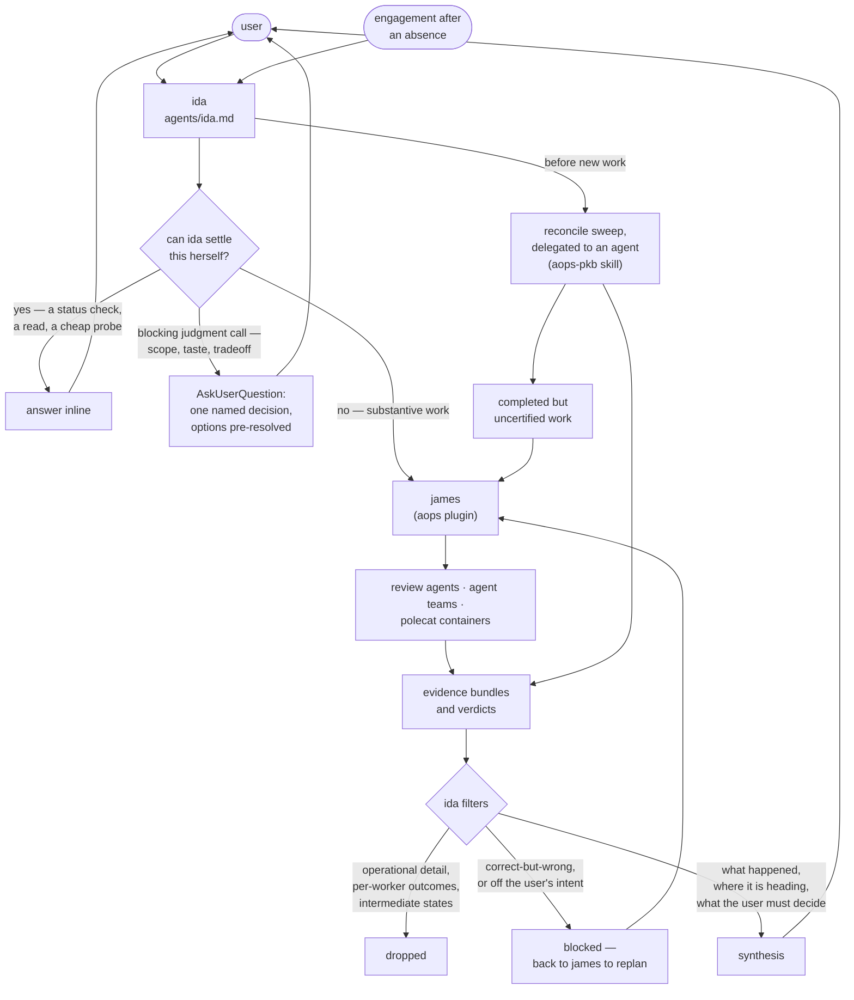

# aops-ida

The interactive face: one agent, ida, who is the only agent in the framework that talks to the user.

## How it works

Everything the user says arrives at ida. Ida either answers it, escalates one named decision, or delegates it to james — and everything that comes back is filtered before the user sees it. The filter is the point of this plugin.

Engagement after an absence starts one step earlier. Before taking new work, ida commissions a reconcile sweep — delegated to a spawned agent, since she holds no knowledge-base tools of her own — and routes whatever finished uncertified to james for certification.

<!-- NS: this needs to be reconciled with the other graphs from other plugins.
- the contract between Ida and James has to be made explicit. Ida must be prohibited from doing substantive work if she is to keep the user's context clean. Ida should strictly synthesise output from James. Presumably if Ida needs to even check on the progress of async work, it should be James who goes looking, so Ida never even touches the PKB?
- What standards does Ida use to determine whether the input from James is good enough?
- why is Ida doing a reconcile sweep and not Pauli?
- what is 'certification'? where are the diffferent places it can be done?

-->

Ida holds between steps rather than driving ahead: after each step control returns to the user, who owns the sequence. Academic integrity is carried here — research data is immutable, and research, teaching, and publication outputs reach the user with full receipts before anything is marked done. The sign-off floor itself is not ida's alone: the `one-way-door` axiom binds every agent at an irreversible, outward-facing act, and ida's charter is the stricter domain layer over it.

## What it provides

| Kind  | Name  | Purpose                                                                               |
| ----- | ----- | ------------------------------------------------------------------------------------- |
| Agent | `ida` | The interactive face. Coordinates research work, delegates to james, filters returns. |

No skills, no commands, no hooks. Ida invokes skills the other plugins ship.

## Configuration

None. This plugin reads no environment variable and declares no `userConfig` field. No endpoint, host, path, token, or credential appears in anything it ships.

## Depends on

- `lib/doctrine/` — `bar`, `launder`, `probe`, `delegation`, `epistemics`, `governing-rules`, `halt`, `memory`, inlined into `agents/ida.md` at build time.
- The `aops` plugin at runtime, for **james**. Ida delegates all substantive work to him; without him she has nowhere to send it.
- The `aops-pkb` plugin at runtime, for the **reconcile** skill her engagement sweep is delegated to run.
