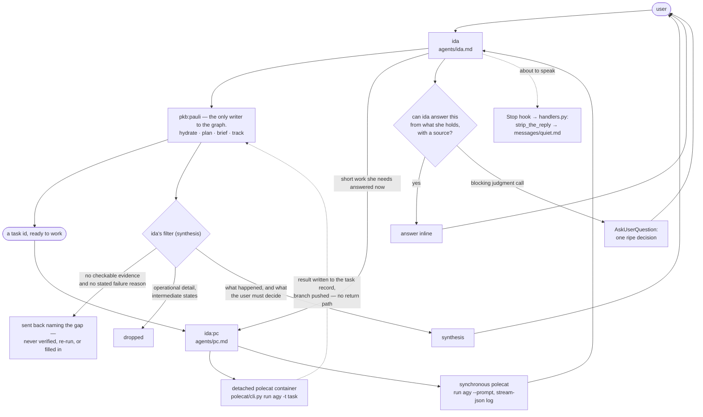

# ida

The interactive face: one agent, ida, who is the only agent in the framework
that talks to the user — and the launcher she uses to get work done.

## How it works

Everything the user says arrives at ida. She does three things with it: asks
`pkb:pauli` what is known and what the plan is, hands ready work to `ida:pc` to
run in a container, and keeps track of what is in flight. Everything that comes
back is filtered before the user sees it. The filter is the point of this
plugin.

Ida holds between steps rather than driving ahead: after each step control
returns to the user, who owns the sequence. Academic integrity is carried here —
research data is immutable, and research, teaching, and publication outputs
reach the user with full receipts before anything is marked done. The sign-off
floor itself is not ida's alone: the `one-way-door` axiom binds every agent at
an irreversible, outward-facing act, and ida's charter is the stricter domain
layer over it.

### She does not touch the knowledge base — as a rule, not as a limitation

Her frontmatter declares a narrow `tools` list and exactly two delegation
targets, `pkb:pauli` and `ida:pc`. Those are the only agents she may spawn.

The prohibition is written as a rule she keeps rather than a capability she
lacks, because the capability claim is not true of the runtime.
`specs/agents/agent-authority.md` records an observed spawned ida holding
`Agent, Artifact, Bash, Edit, Read, Skill, ToolSearch, Write` plus the full PKB
MCP namespace, against a frontmatter granting four tools and no MCP at all. A
rule survives an allowlist that does not hold; "she has no tools for it" stops
being a reason the moment the harness hands her some.

### The standard she applies to what comes back

Two floors, and they are different questions.

**Is this a handback at all?** Every load-bearing claim carries checkable
evidence or a stated reason for failure (`agents/ida.md`, "What comes back"). A
return that does not clear it goes back naming the gap — she does not verify the
claim, re-run the work, or fill it in herself.

**Is this what was actually wanted?** She is the only layer holding the user's
intent, and a brief carries the ask, never the ambition behind it. So she judges
every delivered artifact against the intent, not against the brief it was
written from — and blocks work that is correct-but-wrong, which is a planning
failure and goes back to be replanned rather than into another fix loop. A
worker's self-reported success is never rubber-stamped, and "fixed" means the
originally-failing behaviour was observed passing, not that a diff exists.

### Two ways to run a polecat, and every polecat runs agy

**Detached**, given a task id: a `polecat run agy` under tmux that returns the
moment the container is up. There is no return path — the worker writes its
result onto the task record and pushes its branch, and ida learns what happened
by asking pauli, not by waiting. This is the default for anything real.

**Synchronous**, given a prompt: blocks until the run finishes, output
redirected to a `stream-json` log. It is the only route by which work reaches an
agent's turn while that turn is still open, which is what makes it worth having
— without it there is no way to get a local answer at all. Keep it to work
short enough that the user is still waiting.

`agy` exits `0` on failure, so the reported `status` is the only truth about a
synchronous run; `pc` reads it and never retries silently.

## What it provides

| Kind  | Name         | Purpose                                                                                                                                               |
| ----- | ------------ | ----------------------------------------------------------------------------------------------------------------------------------------------------- |
| Agent | `ida`        | The interactive face. Plans through pauli, launches polecats through pc, tracks work, filters returns.                                                |
| Agent | `pc`         | The polecat launcher. A task id starts a detached container; a prompt runs one synchronously and returns its output.                                  |
| Skill | `strategize` | ida's own thinking pass: fix the altitude, test the plan against the effectual commitments, route each piece. Commissions pauli for every graph read. |
| Hook  | `Stop`       | The quiet gate — reminds ida to strip her reply to load-bearing content before she speaks to the person.                                              |
| CLI   | polecat      | The container launcher, at `${CLAUDE_PLUGIN_ROOT}/polecat/cli.py`.                                                                                    |

No commands. `strategize` is the one skill ida runs herself; every other
plugin's skills reach her only as work she delegates.

`strategize` holds no PKB tools, because ida holds none. Every look at the graph
inside it is a whole question commissioned from `pkb:pauli`, never a tool call
ida makes. That is the point rather than a workaround: ida is the only agent
holding the user's intent and the standard the work is held to, and context
spent on retrieval is context taken from the one job nobody else can do.

## Configuration

No `userConfig` field. The agent, the skill and the hook read no environment
variable, and nothing this plugin ships carries an endpoint, host, account, or
credential.

The polecat CLI reads its own set, with no defaults: `POLECAT_HOME`,
`POLECAT_IMAGE` and `AOPS_SESSIONS` are required, and `AOPS_POLECAT_CONFIG`,
`POLECAT_RULES_DIR`, `POLECAT_AGENT_HOME`, `POLECAT_WORKER_MODEL`,
and `PKB_MCP_URL` are optional (`timeout`, `git_identity`, and `telemetry`
are configured in `polecat.yaml` with no env fallback). A missing required value
is a loud failure, never a guess.

## Depends on

- `lib/hooks/` for the hook runtime and `lib/polecat/` for the container
  launcher, both injected at build time (`manifest/plugin.toml`).
- The `pkb` plugin at runtime, for **pauli**, who answers every question about
  the graph and performs every write to it.
- Docker, and an image built from this repository, for the polecat containers.
- The axioms in `lib/axioms/`, applied globally as rule context rather than
  copied into this plugin.
