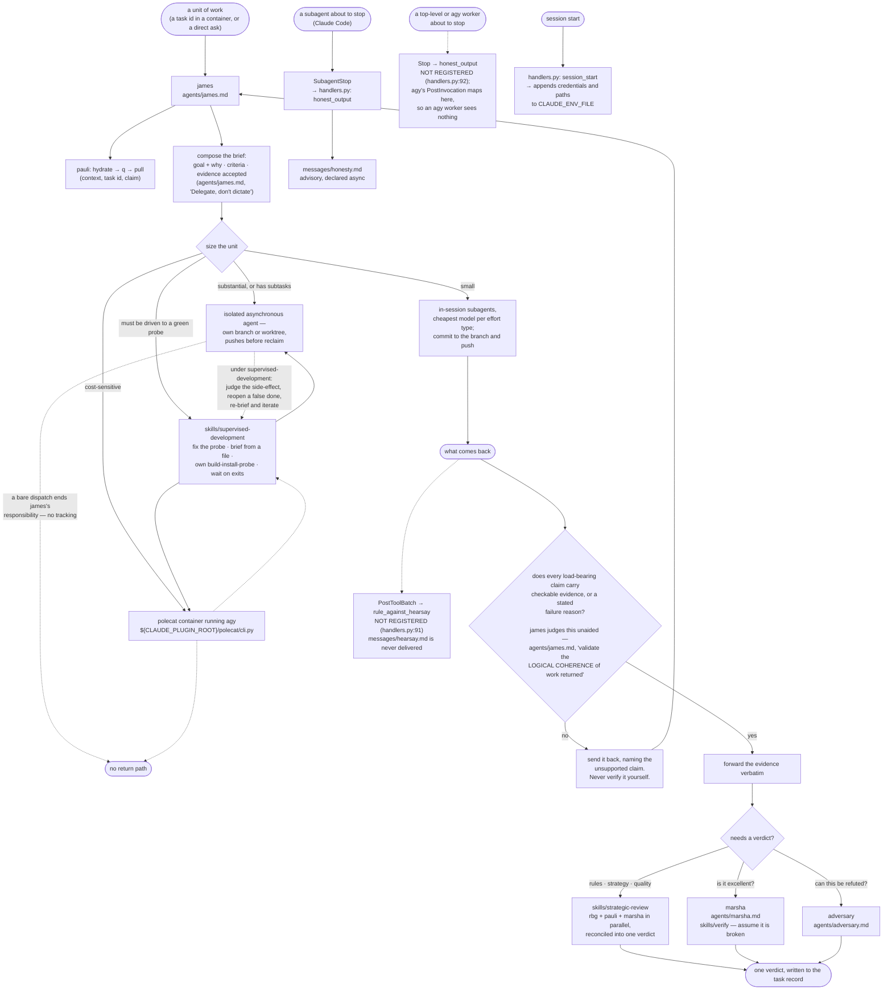

# orchestrate

The worker side: james, who takes a unit of work and sees it through; marsha,
who judges whether what he produced is any good; adversary, who tries to knock
it down; and the two hooks that carry the handback contract to both ends of the
exchange.

James is the persona a polecat container boots into (`lib/polecat/cli.py`,
`DEFAULT_AGENT`). Nothing here dispatches containers, and nothing here talks to
the user.

The design is one doctrine aimed at opposite ends of one exchange — read this paragraph as the intent, and the defect note under it for which halves currently run. `honest_output` fires at a stopping agent's own turn boundary, which is the last moment its report can still carry its evidence — a returned result cannot be amended once it reaches the caller. `rule_against_hearsay` is meant to fire in the caller's context the instant a report lands, and to tell it what to do with one that arrived without proof: send it back. Not verify it, not re-run it, not fill the gap. Each half is written in its own message file — `hooks/messages/honesty.md` for the worker, `hooks/messages/hearsay.md` for the receiver — and nowhere else in this plugin's hook code. `SubagentStop` cannot carry the receiver's half, because it fires on the stopping subagent's own context and its injection is never visible to the session that dispatched it. A tool-batch event cannot carry the worker's half, because a worker's own tool calls are not its handback. Hence two hooks.

**Open defect, 2026-08-08 — one of the two halves is registered.** `handlers.py` registers `SessionStart` and `SubagentStop` only; the `PostToolBatch` and `Stop` entries are commented out (`handlers.py:91-92`). `hooks.template.json` still declares all four, so on Claude Code the dispatcher is spawned for `PostToolBatch` and `Stop` and finds no handler. Two consequences, both current: **`hooks/messages/hearsay.md` is never delivered to anyone** — the receiver's half of the doctrine, the half that tells a caller to bounce an unproven report, does not run — and because agy's `PostInvocation` maps to the canonical `Stop` in `lib/hooks/dispatch.py`, **an agy worker never sees `hooks/messages/honesty.md` either**. What survives is `honest_output` on a Claude Code subagent. Until this is decided, the obligations both messages carry are held by instructions rather than by hooks: the receiver's half by `agents/james.md` ("validate the LOGICAL COHERENCE of work returned"), and the worker-side shape by whoever writes the brief — which is why `skills/supervised-development` §2 requires the brief to state the handback shape rather than assume a worker was told.

A bare dispatch has no return path by design: the worker writes its result to the task record and pushes its branch, and nothing in this plugin waits for it. `supervised-development` is the surface for work that must actually land — it keeps the loop open, judges what comes back against evidence the worker did not author, and re-briefs until a pre-registered probe is green.

## What it provides

| Kind  | Name                     | Purpose                                                                                                                                        |
| ----- | ------------------------ | ---------------------------------------------------------------------------------------------------------------------------------------------- |
| Agent | `james`                  | Briefs and dispatches work; bounces reports that arrive without proof. Never instructs method, never re-does work.                             |
| Agent | `marsha`                 | QA. Judges whether an artifact is outstanding, and runs it to find out.                                                                        |
| Agent | `adversary`              | Red-team review: attacks the evidence, the logic, and the scope. Never builds or fixes.                                                       |
| Skill | `supervised-development` | Drives a delegated change to a green probe: brief from a file, own the build-install-probe cycle, judge the side-effect, reopen a false done.  |
| Skill | `strategic-review`       | Deploys rbg, pauli, and marsha in parallel and reconciles their findings into one verdict. Bound to james.                                     |
| Skill | `verify`                 | Marsha's QA pass: assume it is broken, then prove otherwise. Bound to marsha; commissioned, never invoked directly.                            |
| Hook  | `SubagentStop`           | The handback doctrine plus the worker-side register, delivered to a Claude Code subagent about to hand back. The only handback hook that runs. |
| Hook  | `SessionStart`           | Writes session credentials and paths into `CLAUDE_ENV_FILE`.                                                                                   |
| Hook  | `PostToolBatch`, `Stop`  | Declared in `hooks.template.json`, handlers commented out — the dispatcher runs and does nothing. See the open defect above.                   |

No commands.

## Configuration

No `userConfig` field. The `SessionStart` hook reads five environment variables and has no defaults for any of them — every one is absent-tolerant, and absence simply means that value is not carried into the session:

- `CLAUDE_ENV_FILE` — where the client expects per-session environment exports. Unset, the hook is a silent no-op.
- `AOPS_BOT_GH_TOKEN` — when present, becomes `GH_TOKEN` and `GITHUB_TOKEN` for the session, and pins `GIT_SSH_COMMAND` and a git credential helper so the session cannot reach GitHub through the operator's own SSH identity.
- `AOPS_SESSIONS`, `PKB_MCP_URL`, `PKB_MCP_TOOL_PREFIX` — forwarded verbatim.

No endpoint, host, registry, account or credential is written into anything this plugin ships.

## Depends on

- `lib/hooks/` for the hook runtime, injected at build time (`manifest/plugin.toml`).
- The `rbg` and `pkb` plugins at runtime, for `rbg:rbg` and `pkb:pauli`, whom `strategic-review` always deploys, and for the `services` MCP server provided by `pkb` (`plugins/pkb/manifest/mcp.template.json`) which `james` accesses via `mcpServers: [services, plugin:pkb:services]`.
- The `ida` plugin, which ships the polecat launcher that starts the containers james runs inside.
