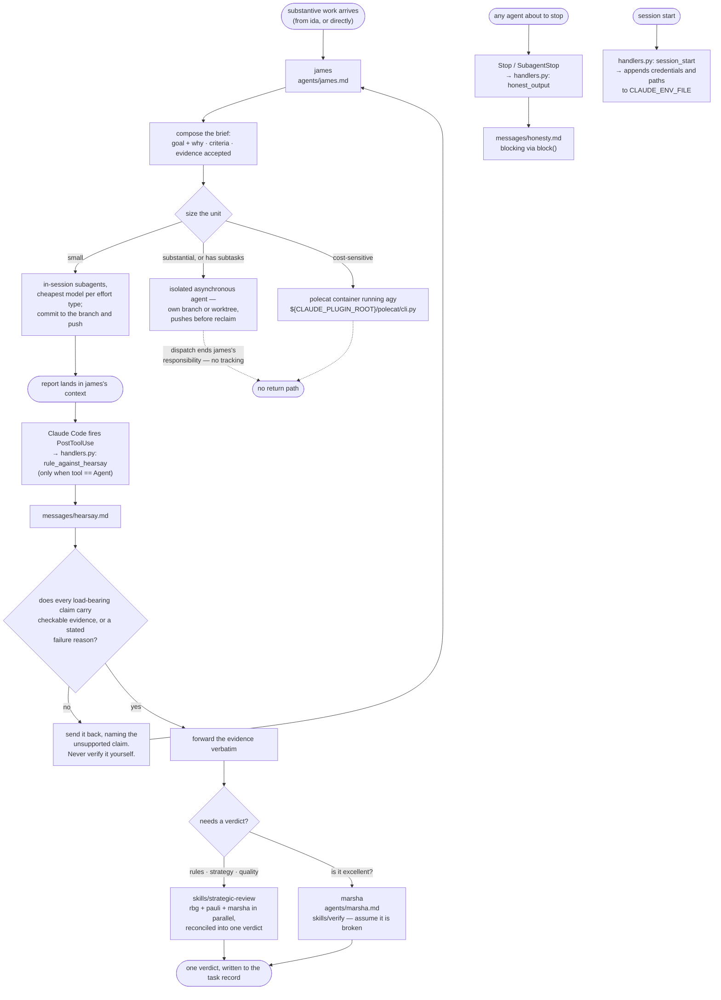

# orchestrate

Dispatch, review, and the contract that binds what comes back. James briefs work and sends it out; marsha judges whether what returns is any good; two hooks carry the handback doctrine to both ends of that exchange.

The two hooks are the same doctrine aimed at opposite ends of one exchange. `honest_output` fires at a stopping agent's own turn boundary, which is the last moment its report can still carry its evidence — a returned result cannot be amended once it reaches the caller. `rule_against_hearsay` fires in the caller's context the instant a report lands, and tells it what to do with one that arrived without proof: send it back. Not verify it, not re-run it, not fill the gap. Each half is written in its own message file — `hooks/messages/honesty.md` for the worker, `hooks/messages/hearsay.md` for the receiver — and nowhere else in this plugin's hook code.

`SubagentStop` cannot carry the receiver's half, because it fires on the stopping subagent's own context and its injection is never visible to the session that dispatched it. `PostToolUse` cannot carry the worker's half, because a worker's own tool calls are not its handback. Hence two hooks.

Asynchronous work has no return path here by design. James's responsibility ends at dispatch: the worker writes its result to the task record and pushes its branch, and nothing in this plugin waits for it.

## What it provides

| Kind  | Name               | Purpose                                                                                                             |
| ----- | ------------------ | ------------------------------------------------------------------------------------------------------------------- |
| Agent | `james`            | Briefs and dispatches work; bounces reports that arrive without proof. Never instructs method, never re-does work.  |
| Agent | `marsha`           | QA. Judges whether an artifact is outstanding, and runs it to find out.                                             |
| Skill | `strategic-review` | Deploys rbg, pauli, and marsha in parallel and reconciles their findings into one verdict. Bound to james.          |
| Skill | `verify`           | Marsha's QA pass: assume it is broken, then prove otherwise. Bound to marsha; commissioned, never invoked directly. |
| Hook  | `PostToolBatch`    | The handback doctrine (rule against hearsay), delivered to the receiver when a subagent's report lands.             |
| Hook  | `SubagentStart`    | The handback doctrine (honesty / evidence reminder), delivered to a subagent starting its turn.                     |
| Hook  | `SessionStart`     | Writes session credentials and paths into `CLAUDE_ENV_FILE`.                                                        |
| Hook  | `Stop`             | Closes session tracing and telemetry.                                                                               |
| CLI   | polecat            | The container launcher, at `${CLAUDE_PLUGIN_ROOT}/polecat/cli.py`.                                                  |

No commands.

## Configuration

No `userConfig` field. The `SessionStart` hook reads five environment variables and has no defaults for any of them — every one is absent-tolerant, and absence simply means that value is not carried into the session:

- `CLAUDE_ENV_FILE` — where the client expects per-session environment exports. Unset, the hook is a silent no-op.
- `AOPS_BOT_GH_TOKEN` — when present, becomes `GH_TOKEN` and `GITHUB_TOKEN` for the session, and pins `GIT_SSH_COMMAND` and a git credential helper so the session cannot reach GitHub through the operator's own SSH identity.
- `AOPS_SESSIONS`, `PKB_MCP_URL`, `PKB_MCP_TOOL_PREFIX` — forwarded verbatim.

The polecat CLI reads its own set, also with no defaults: `POLECAT_HOME`, `POLECAT_IMAGE` and `AOPS_SESSIONS` are required, and `AOPS_POLECAT_CONFIG`, `POLECAT_RULES_DIR`, `POLECAT_AGENT_HOME`, `POLECAT_WORKER_MODEL`, `POLECAT_PRINT_TIMEOUT` and `PKB_MCP_URL` are optional. A missing required value is a loud failure, never a guess.

No endpoint, host, registry, account or credential is written into anything this plugin ships.

## Depends on

- `lib/hooks/` for the hook runtime, and `lib/polecat/` for the container launcher, both injected at build time (`manifest/plugin.toml`).
- The `rbg` and `pkb` plugins at runtime, for `rbg:rbg` and `pkb:pauli`, whom `strategic-review` always deploys, and for the `services` MCP server provided by `pkb` (`plugins/pkb/manifest/mcp.template.json`) which `james` accesses via `mcpServers: [services, plugin:pkb:services]`.
- Docker, and an image built from this repository, for the polecat containers.
