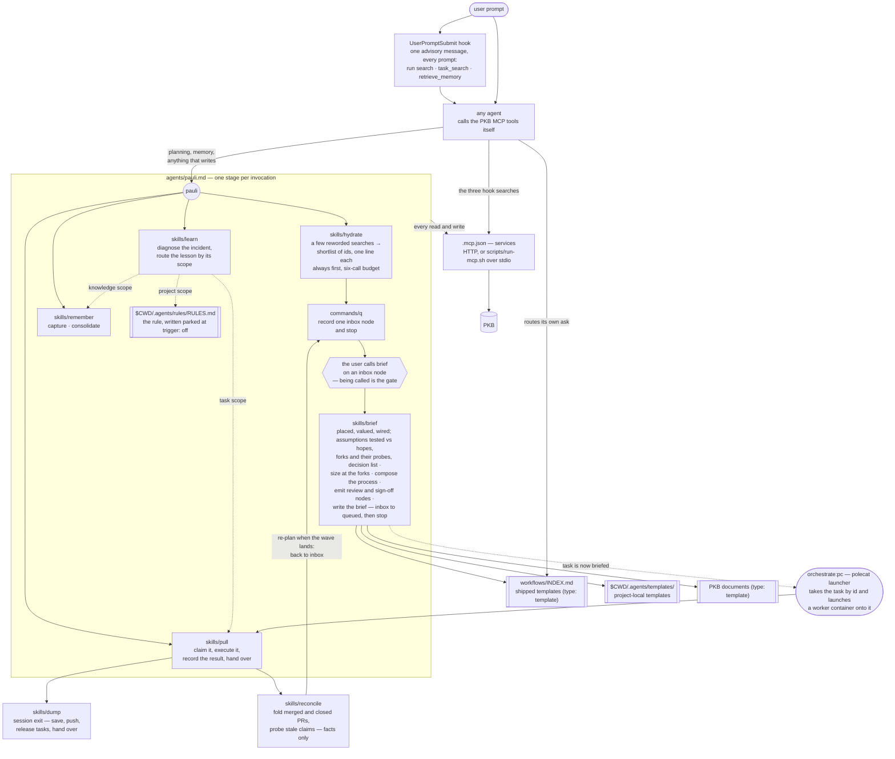

# pkb

Pauli — memory, effectual planning, workflow composition, and the client wiring
for a Personal Knowledge Base.

## How it works

### The hook asks; nothing checks

The hook fires on every prompt and never calls the PKB itself. Establishing an
MCP session on the critical path of every turn is not affordable, and a slow
server would stall the turn. It emits one advisory message
(`hooks/messages/pkb-context.md`, editable without touching code) naming three
MCP tool calls to issue before answering — `pkb__search`, `pkb__task_search`,
`pkb__retrieve_memory` (hosted under the `services` MCP server as `mcp__services__pkb__*`). It names no skill and does not invoke `hydrate`.

Compliance is voluntary. The handler returns an advisory, which is context
injection only; nothing reads back whether the agent searched. Agents can act on
it because they hold the PKB tools directly — james, marsha, rbg and pauli all
inherit the full MCP namespace (including `services` / `mcp__services__pkb__*`). `ida` is the one agent whose declared `tools`
exclude them, and the message covers that case: say the tools are unavailable
and work from what is visible, rather than guessing at what the PKB would have
said.

The `hydrate` skill is a different mechanism with a similar name, and the
difference is that it runs. The hook asks the agent to search and never checks;
the skill actually issues the searches, spends a six-call budget, and returns a
shortlist. There, it is always first and never skipped.

What it returns is **pointers, not prose**: ids with a line each, saying what
the thing is and why it might bear on the ask. It does not open them. The
searching is close to mechanical — the judgment it adds is cutting the returned
lines down to the handful worth a read. Reading them is `brief`'s job, once, on
the asks that turn out to be worth it.

### Mutation is a convention, not a boundary

Everything that mutates the PKB is routed through pauli by instruction. That is
doctrine, not permission: pauli, james, marsha and rbg all omit `tools` to work
around a harness materialization defect (`specs/agents/agent-authority.md`), so
each inherits its parent's full effective set including the PKB MCP namespace.
James holds read, knowledge-write, and task-lifecycle operations outright by its
own charter, and routes only graph mutation — creating, reparenting, decomposing
— to pauli. Restore the boundary as a tool grant when the harness defect is
fixed.

### Stages advance by invocation, not by trigger

Each skill runs, then stops; no stage fires the next. `inbox` is the signal that
an ask has been captured but not yet worked out — there is no second flag beside
the status.

Two breakpoints are the user's, and no agent crosses either. The first is
promotion: `brief` runs only when the user calls it, so being called _is_ the
gate, and it is the only thing that moves a task to `queued`. The second is the
pull request and the one-way-door sign-offs `brief` wired into the graph.

### Capture is hydrate plus one write

`/q` runs `hydrate` and records one `inbox` node carrying the ask and the
shortlist. That is the whole of capture: no parent judgment, no valuation, no
edges, no decisions.
Every judgment made at capture time is one made on the thinnest context anyone
will ever have about the ask, and capture that costs more than a few seconds is
capture that stops happening. `brief` does all of it afterwards, on a node that
already exists.

### The composer is not the executor

`brief` fires when the user calls it, on a captured ask. It places and values the
unit, sorts its assumptions, names its forks, sizes it, composes its process,
emits its review nodes, and writes the brief into the task body — then stops at
`queued`. Dispatch happens later and **by task id**, never by handing the
freshly-composed text to a worker as a prompt. The executor's first act is to
read the brief cold from the task, which is what makes the brief bind rather
than merely restate the reasoning that produced it.

`orchestrate`'s `dispatch` routes that unit to a worker surface. It composes
nothing.

### Sizing is a fork question, not a size question

A dispatchable unit is the largest chunk containing no unresolved fork. `brief`
cuts only at an unresolved fork or a responsibility boundary, and defaults to no
cut — one container-sized unit. Where a fork is blocked on missing information,
what gets dispatched is the probe `brief` designed: the cheapest experiment that
discriminates between the branches.

### The return channel writes facts, and nothing else

`reconcile` establishes what is true about work the graph still claims is in
flight — merged and closed pull requests, abandoned claims, rotted criteria —
and writes that back. It closes nothing on its own judgment, prunes nothing,
scores nothing, and certifies nothing. Where a fact it wrote changes what should
happen next, it returns the affected tasks to `inbox` rather than re-planning
them.

### Routing and composing are different jobs

**Routing** is picking which template a class of work follows, and the tree that
does it lives in `workflows/INDEX.md`. Any agent reads it directly; no skill
stands between them and it. Most of what it routes never gets a process composed
at all — a simple question is answered and halted, a follow-up continues the
session, an email is triaged.

**Composition** is assembling a full process for work that has been released for
dispatch, and it happens in `brief` §5 — read in context, every time, never
carried in pauli's own text. The three template layers sit outside the box
because they are sources, not stages: the shipped library, project-local
`$CWD/.agents/templates/`, and PKB documents with `type: template`. They form
one namespace; a PKB template composes exactly like a shipped one.

The output lands on the task as its checklist: the composed steps, in order,
plus one pointer bullet naming the templates and the proportionality call. The
checklist is not the gate, though — obligations that must block acceptance also
become real nodes, and where a step is both, the node wins. An empty review set
is a library gap `brief` halts on: it records the gap, leaves the task
`blocked`, and writes no brief.

### Remembering

Consolidation turns episodic records into canonical topic notes — synthesis,
not collection. The standard for what that means is
[`skills/remember/references/quality.md`](skills/remember/references/quality.md).

## What it provides

### Agent

| Agent   | Does                                                                                                              |
| ------- | ----------------------------------------------------------------------------------------------------------------- |
| `pauli` | Logician, effectual strategist, and custodian of the PKB. Every mutation routes here. Call first, and call often. |

### Skills

| Skill       | Does                                                                                                                                                                                                                     |
| ----------- | ------------------------------------------------------------------------------------------------------------------------------------------------------------------------------------------------------------------------ |
| `hydrate`   | A few reworded searches, cut to a shortlist of ids the caller can ask more about.                                                                                                                                        |
| `brief`     | Place, value, and wire one task; sort its assumptions, name its forks and probes; size at the forks, compose the process from the three layers, emit the review nodes, write the brief. `inbox` to `queued`, then stops. |
| `pull`      | Claim a queued task, execute it, record the result on the task, and hand over.                                                                                                                                           |
| `reconcile` | Establish what is true about in-flight and finished work, write it back, return the affected tasks to `inbox`.                                                                                                           |
| `remember`  | Capture knowledge as it emerges; consolidate episodic records into durable notes.                                                                                                                                        |
| `learn`     | Diagnose an incident back to the structural cause, then route the lesson to the one destination its scope claims.                                                                                                        |
| `dump`      | Session exit — save and push work, release claimed tasks with a report, and emit a final handover.                                                                                                                       |

### Command

| Command | Does                                                                    |
| ------- | ----------------------------------------------------------------------- |
| `/q`    | Quick-queue a thought onto the graph: `hydrate`, then one `inbox` node. |

### Hook

| Event              | Does                                                                                    |
| ------------------ | --------------------------------------------------------------------------------------- |
| `UserPromptSubmit` | Injects the instruction to ground the prompt in the PKB, and names the searches to run. |

Wording lives in `hooks/messages/pkb-context.md` and is editable without
touching code. Claude Code fires this event directly; on Antigravity it arrives
as `PreInvocation`.

## Configuration

There are no defaults. No URL, host, port, path, or token is baked into anything
this plugin ships.

| Setting       | Where it comes from | For                                                                                                                                                                                                                                                                                                                                                                                                                                                                                                                                                                                                       |
| ------------- | ------------------- | --------------------------------------------------------------------------------------------------------------------------------------------------------------------------------------------------------------------------------------------------------------------------------------------------------------------------------------------------------------------------------------------------------------------------------------------------------------------------------------------------------------------------------------------------------------------------------------------------------- |
| `pkb_mcp_url` | client `userConfig` | The streamable-HTTP endpoint of the PKB MCP server. Claude Code reads it into `.mcp.json`.                                                                                                                                                                                                                                                                                                                                                                                                                                                                                                                |
| `PKB_MCP_URL` | environment         | The same endpoint, for clients that launch the server over stdio via `scripts/run-mcp.sh`. Required there; the script exits non-zero without it. On agy, `mcp_config.json` invokes the script but sets no `env` for it — the value must already be in the process environment that launches agy. Inside an aops-crew container that is guaranteed (the entrypoint exports it). On a bare host, exporting it is still not enough: the launcher path itself carries `${extensionPath}`, which only the aops-crew image rewrites, so `agy plugin install` outside that image cannot start the server at all. |
| `ACA_DATA`    | environment         | The PKB root. There is no special user template layer: the PKB repo's own `.agents/templates/` is the project tier by the ordinary rule, like any other repository's.                                                                                                                                                                                                                                                                                                                                                                                                                                     |

`$ACA_DATA` is the PKB's storage, reached through the MCP tools. Nothing in this
plugin reads or writes it as a filesystem path.

## Depends on

- A PKB MCP server, reachable at the configured endpoint. The server is external
  to this plugin; the plugin ships client wiring only.
- `lib/hooks/`, injected into `hooks/` at build time.
- `lib/axioms/`, applied as global rule context for pauli.
- `uv`, for the stdio launcher only.
