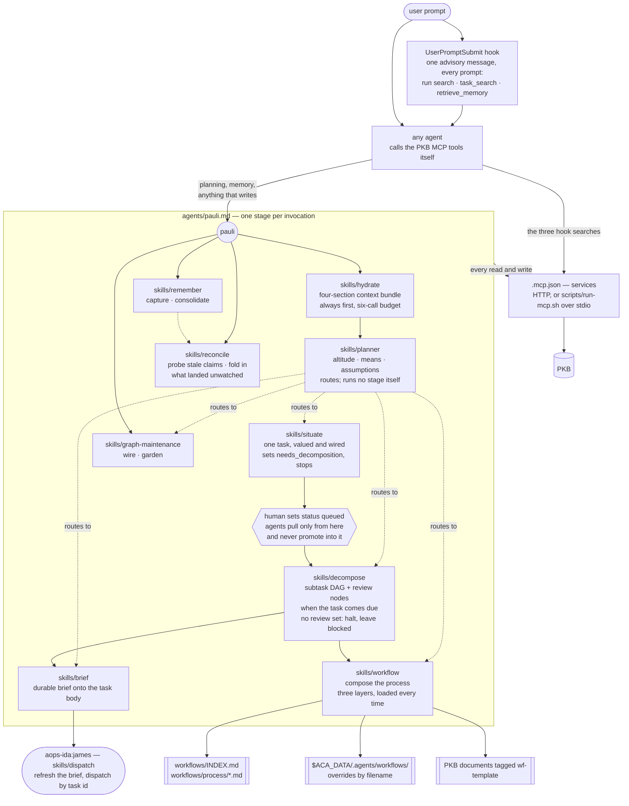

# aops-pkb

Pauli — memory, effectual planning, workflow composition, and the client wiring
for a Personal Knowledge Base.

## How it works

### The hook asks; nothing checks

The hook fires on every prompt and never calls the PKB itself. Establishing an
MCP session on the critical path of every turn is not affordable, and a slow
server would stall the turn. It emits one advisory message
(`hooks/messages/pkb-context.md`, editable without touching code) naming three
MCP tool calls to issue before answering — `search`, `task_search`,
`retrieve_memory`. It names no skill and does not invoke `hydrate`.

Compliance is voluntary. The handler returns an advisory, which is context
injection only; nothing reads back whether the agent searched. Agents can act on
it because they hold the PKB tools directly — james, marsha, rbg and pauli all
inherit the full MCP namespace. `ida` is the one agent whose declared `tools`
exclude them, and the message covers that case: say the tools are unavailable
and work from what is visible, rather than guessing at what the PKB would have
said.

The `hydrate` skill is a different mechanism with a similar name. It is pauli's,
runs inside pauli's pipeline, spends a six-call budget, and appends a
four-section bundle to a task. There, it is always first and never skipped. The
hook's read is neither pauli's nor enforced.

### Mutation is a convention, not a boundary

Everything that mutates the PKB is routed through pauli by instruction. That is
doctrine, not permission: pauli, james, marsha and rbg all omit `tools` to work
around a harness materialization defect (`specs/agents/agent-authority.md`), so
each inherits its parent's full effective set including the PKB MCP namespace.
James holds read, knowledge-write, and task-lifecycle operations outright by its
own charter, and routes only graph mutation — creating, reparenting, decomposing
— to pauli. Restore the boundary as a tool grant when the harness defect is
fixed.

### Stages advance by invocation, not by trigger

Each skill runs in its own invocation and stops. No stage fires the next one.
`hydrate` emits a bundle. `situate` sets `needs_decomposition: true` and halts —
nothing polls for that flag. `decompose` runs when the task comes due, `brief`
just before dispatch. `planner` is a router: it fixes the altitude, names the
means and assumptions, then sends the work to the stage that owns it.

The gate in the middle is a person. `queued` means the user has released the
work for agent dispatch; agents pull only from there and never promote into it.
Reconcile obeys the same gate — an abandoned claim goes back to `ready`, never
`queued`. So the pipeline cannot run end to end unattended.

### Briefing and dispatching are two hands

`brief` composes the delegation brief and appends it to the subtask body, then
dispatches by task id — the executor reads it fresh, so the composer is never
the executor. James, running `skills/dispatch`, composes the brief immediately
before dispatch and freshly each time, because context moves between passes. The
two meet at the stable-artifact clause: a brief written in an earlier invocation
and unchanged since may be dispatched directly. Pauli's `brief` writes the
durable brief onto the task; james re-reads it at dispatch time and refreshes it
if the context has moved.

### Composing a workflow

`workflow` runs inside pauli, called by `decompose` at composition time — every
time, never carried in pauli's own text. Its three template layers sit outside
the box because they are sources, not stages: the shipped library, the user's
`$ACA_DATA/.agents/workflows/`, and PKB documents tagged `wf-template`. They form
one namespace; a PKB template composes exactly like a shipped one.

The output is prose named on the task: the templates by name, the order, and a
one-sentence proportionality call. Not a file, not a document. `decompose`
persists it as part of the record. An empty review set is a library gap —
decompose records it, leaves the task `blocked`, and writes no DAG.

### Remembering

`remember` is not a command. It fires on a standing obligation inlined into
pauli, ida, james and marsha at build time: write facts, decisions, and state to
the knowledge base the moment they emerge, without waiting to be asked. Any
agent under that obligation reaches for the skill; pauli holds the write.

Consolidation is synthesis, not collection. Episodic records — daily notes,
meeting notes, task bodies, transcripts — become canonical topic notes, and a
topic area with five or more of those earns a Map of Content. Merging five
memories into five bullets is not consolidation; if you cannot name the
principle they are all instances of, the material is not ready.

## What it provides

### Agent

| Agent   | Does                                                                                                              |
| ------- | ----------------------------------------------------------------------------------------------------------------- |
| `pauli` | Logician, effectual strategist, and custodian of the PKB. Every mutation routes here. Call first, and call often. |

### Skills

| Skill      | Does                                                                                                              |
| ---------- | ----------------------------------------------------------------------------------------------------------------- |
| `hydrate`  | Emit a right-sized context bundle so nothing downstream starts cold.                                              |
| `situate`  | Turn a hydrated ask into one valued, well-connected task, then stop.                                              |
| `workflow` | Compose the process this work runs under, from the shipped library, the user layer, and the PKB.                  |
| `pull`     | Claim a queued task, execute it, record the result on the task, and hand over.                                    |
| `remember` | Capture knowledge as it emerges; consolidate episodic records into durable notes.                                 |
| `learn`    | Diagnose an incident back to the structural cause, then route the lesson to the one destination its scope claims. |
| `dump`     | Session exit — bail, close, hand back partial work, or pause with the work still in progress.                     |

### Command

| Command | Does                                                          |
| ------- | ------------------------------------------------------------- |
| `/q`    | Quick-queue a thought onto the graph. Delegates to `situate`. |

### Hook

| Event              | Does                                                                                    |
| ------------------ | --------------------------------------------------------------------------------------- |
| `UserPromptSubmit` | Injects the instruction to ground the prompt in the PKB, and names the searches to run. |

Wording lives in `hooks/messages/pkb-context.md` and is editable without
touching code. Claude Code fires this event directly; on Antigravity it arrives
as `PreInvocation`.

## Configuration

There are no defaults. No URL, host, port, path, or token is baked into anything
this plugin ships.

| Setting       | Where it comes from | For                                                                                                                                                                                                                                                                                                                                                                                                                                                                                                                                                                                                       |
| ------------- | ------------------- | --------------------------------------------------------------------------------------------------------------------------------------------------------------------------------------------------------------------------------------------------------------------------------------------------------------------------------------------------------------------------------------------------------------------------------------------------------------------------------------------------------------------------------------------------------------------------------------------------------- |
| `pkb_mcp_url` | client `userConfig` | The streamable-HTTP endpoint of the PKB MCP server. Claude Code reads it into `.mcp.json`.                                                                                                                                                                                                                                                                                                                                                                                                                                                                                                                |
| `PKB_MCP_URL` | environment         | The same endpoint, for clients that launch the server over stdio via `scripts/run-mcp.sh`. Required there; the script exits non-zero without it. On agy, `mcp_config.json` invokes the script but sets no `env` for it — the value must already be in the process environment that launches agy. Inside an aops-crew container that is guaranteed (the entrypoint exports it). On a bare host, exporting it is still not enough: the launcher path itself carries `${extensionPath}`, which only the aops-crew image rewrites, so `agy plugin install` outside that image cannot start the server at all. |
| `ACA_DATA`    | environment         | The PKB root. `$ACA_DATA/.agents/workflows/` overrides and extends the shipped workflow library by filename. Unset means there is no user layer — not an error.                                                                                                                                                                                                                                                                                                                                                                                                                                           |

`$ACA_DATA` is the PKB's storage, reached through the MCP tools. Nothing in this
plugin reads or writes it as a filesystem path.

## Depends on

- A PKB MCP server, reachable at the configured endpoint. The server is external
  to this plugin; the plugin ships client wiring only.
- `lib/hooks/`, injected into `hooks/` at build time.
- `lib/axioms/`, applied as global rule context for pauli.
- `uv`, for the stdio launcher only.
