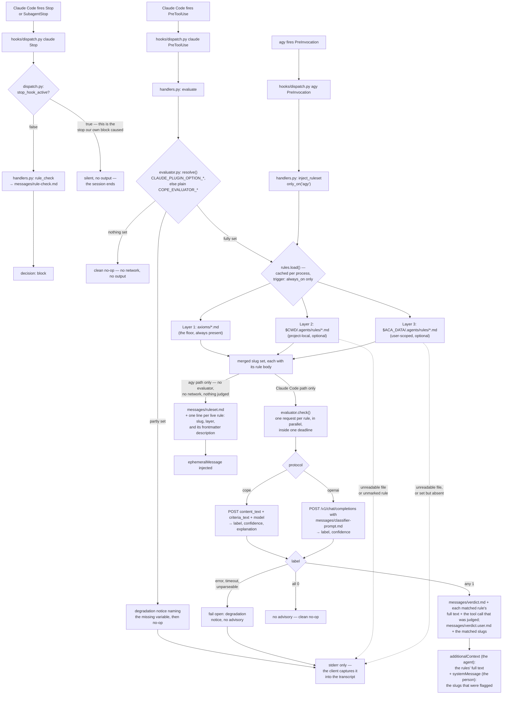

# rbg

In-session rule checking on two layers.

**Turn by turn**, on every tool call, it asks a small language model whether the call matches any rule in a three-layer rule set, and injects the matched rule into the agent's context so it can correct itself. Advisory, never a block.

**At a stop**, it asks once for the stop to be held, so the agent runs an explicit rule check over the whole turn's work and cites what makes each finding checkable.

Whether that ask is honoured as a disposition or lands as an advisory is the shared runtime's and the manifest's business (`specs/ARCHITECTURE.md`, Hooks).



## What this plugin provides

| Component                    | File                                   | Purpose                                                                                                               |
| ---------------------------- | -------------------------------------- | --------------------------------------------------------------------------------------------------------------------- |
| `PreToolUse` hook            | `hooks/dispatch.py` (shared, injected) | Entry point Claude Code executes on every tool call.                                                                  |
| `PreInvocation` hook         | `hooks/dispatch.py` (shared, injected) | Entry point agy executes on every turn.                                                                               |
| `Stop` / `SubagentStop` hook | `hooks/dispatch.py` (shared, injected) | Entry point Claude Code executes at a turn boundary; agy reaches it as `PostInvocation`.                              |
| Evaluation handler           | `hooks/handlers.py` — `evaluate`       | Loads the rule set, sends the tool call for judgment, injects what came back.                                         |
| Ruleset handler              | `hooks/handlers.py` — `inject_ruleset` | Injects the live rule roster once per turn. agy only.                                                                 |
| Stop handler                 | `hooks/handlers.py` — `rule_check`     | Returns `block` once per chain, directing the agent to run the rule check and cite what makes its findings checkable. |
| Evaluator client             | `hooks/evaluator.py`                   | Configuration gate, both wire protocols, the deadline, and the fail-open policy.                                      |
| Rule loader                  | `hooks/rules.py`                       | Three-layer loading; carries each rule's body as its policy text.                                                     |
| Hook wording                 | `hooks/messages/*.md`                  | `verdict.md`, `verdict.user.md`, `ruleset.md`, `rule-check.md`, and `classifier-prompt.md`. Editable without code.    |

## The rule set

Three layers, merged. A later layer can only add a slug not already claimed — it can never override an axiom's entry, so a project or user rule file cannot weaken the floor by reusing its filename.

Every layer counts only the `*.md` files declaring `trigger: always_on`, the same line `build/axioms.py` draws when it emits a client's native rule mechanism. A rules directory also holds reference material — an index, a path table, a note-taking convention, a stub — and only a policy can be classified, so only a marked file is sent to the evaluator.

Missing or unreadable layer 2 or layer 3 degrades to whatever did load. Layer 1 is the plugin's own `axioms/`, injected by the build, so its absence is a broken build rather than a session to warn about; an unreadable `axioms/` directory, or an unreadable file inside it, is still reported.

Nothing else is dropped quietly. A file skipped for want of the marker is named, with the layer's directory — except the shipped `axioms/`, whose non-rule files (`README.md`, `AXIOMS-REVIEW.md`) are a known set nobody in the session can act on. `$ACA_DATA` set to a path with no `.agents/rules/` directory is named too, because setting the variable is a claim that the layer exists. `$ACA_DATA` unset, and a project with no `.agents/rules/` directory, are ordinary absences and say nothing.

Every degradation is printed to stderr, which the client captures into the transcript. It is not rate-limited and does not reach the hook's response, so a fault is legible in the log and nowhere else — including to the person who is the only one who could go and fix the file. A fault report is never a gate: the tool call proceeds either way.

## How the judgment is made

The evaluation is a small language model's judgment call, reached over the [Reflexes](https://reflexes.sh) evaluator contract ([SPEC.md](https://github.com/zentropi-ai/reflexes/blob/main/SPEC.md), §4). The contract is one policy in, one verdict out: cope sends a rule's own markdown as the `policy` and the tool call as the `content`, and gets back a `label` of 0 or 1. Because each rule is asked about separately, a match names the rule it matched, which is what makes the advisory actionable rather than a vague warning.

Every live rule is evaluated on every tool call, in parallel, inside one deadline. Nothing is pre-filtered: a rule quietly left out of the check is a rule quietly switched off.

Two protocols are supported, so the same mechanism serves a hosted API and a local model:

- `cope` — the CoPE label API: `POST` with `{"content_text", "criteria_text", "model"}`, answering `{"label", "confidence", "explanation"}`. Spoken by the hosted Zentropi service and by a self-hosted CoPE server alike; the model is open-weights, so remote and local are the same protocol pointed at different hosts.
- `openai` — any OpenAI-compatible `/v1/chat/completions` server: Ollama, vLLM, LocalAI, llama.cpp, or a hosted provider. The classifier instruction is `hooks/messages/classifier-prompt.md`.

**No evaluator match is ever a verdict.** A match is one model's reading of one rule against one tool call, injected for the agent to weigh. Nothing on this layer blocks, and no confidence score will make it (`specs/enforcement/enforcement.md`, Dual-layer rule enforcement channel). Refusal is reserved for structural impossibility and is never a rule verdict, so `evaluate` never returns one even though the shared runtime can render it (`specs/ARCHITECTURE.md`, Hooks).

**Unconfigured, the evaluator judges nothing.** No endpoint ships with this plugin, so an installation that has not set one gets a clean no-op on every tool call — no network call, no output, no error. This is a legitimate state and is never reported as a fault. Configure some of the variables but not all and you get one degradation notice naming what is missing, then the same no-op: guessing the missing value is a default this plugin may not have.

**It fails open, always.** A dead socket, a slow endpoint, an error status, a body that will not parse — none produce an advisory, and none delay or block the tool call beyond the deadline. The reason is reported and the call proceeds. There are no retries: a retry in front of every tool call multiplies the stall the agent is waiting through.

**What leaves the machine.** When an evaluator is configured, every tool call's name and input are sent to it, once per live rule — including file paths, command strings, and file contents, truncated to the first 4000 characters of rendered input. Point `COPE_EVALUATOR_URL` at a locally hosted model if that is not acceptable for the work in front of you.

## The stop gate

`Stop` and `SubagentStop` fire at a **turn** boundary — the last moment that turn's work can still be corrected, and, unlike `PreToolUse`, a point where the whole turn is available to judge rather than one call at a time. `rule_check` returns `{"decision": "block", "reason": ...}` to ask for the handback to be held. The reason is `hooks/messages/rule-check.md`: run the rule check over all three layers, and cite what makes each finding checkable rather than claiming compliance. It says nothing about the handback evidence contract, which is `orchestrate`'s.

A turn boundary is not a session boundary. `Stop` fires every time the session's own agent finishes a response, so an interactive session reaches this gate once per turn, not once at the end.

- **The once-per-chain guard is not this handler's.** It belongs to the shared runtime and applies to every stop hook (`specs/ARCHITECTURE.md`, Hooks). This handler's own contribution is one further silence: while `background_tasks` are running it returns nothing, because a handback is not being written yet and the chain allows only one block.
- **With no message to deliver, it does not block.** An empty or missing `hooks/messages/rule-check.md` would cost the agent a turn to be told nothing, so the handler lets the stop through and reports the fault on stderr.
- **The hook obliges the check; it does not perform it.** No transcript is read here, and nothing inspects what the agent did with the turn it was given. A hook that graded the answer would be a mechanical verdict on the substance of an agent's work, which this framework does not do.
- **It fires on every stop, without discriminating whose.** The payload carries no per-agent identity, so a face's `Stop` and a worker's `SubagentStop` reach the same handler with the same message.

## On agy

`PreToolUse` carries a tool call, so that is where the evaluation runs. agy has no session-level event at all, so `SessionStart` and `SessionEnd` can never fire there.

The manifest wires `PreInvocation` and `PostInvocation` under `agy`. What is not wired there is the _evaluator_: with no tool event mapped, `evaluate` never runs on agy. **On agy the rules are stated, never checked** — no request is made, so `COPE_EVALUATOR_URL` and its companions are inert on that client however they are configured, and nothing this plugin does on agy puts anything on the network. `PostInvocation` maps to canonical `Stop`, so `rule_check` does run there and its text reaches the agent as an `injectSteps` advisory; which clients and events honour a block is the shared runtime's rule (`specs/ARCHITECTURE.md`, Hooks).

What agy's `PreInvocation` does carry is the turn itself, which is enough to state which rules are live: `inject_ruleset` injects a one-line-per-rule roster, each line marked with the layer it came from. The roster is scoped to agy — Claude Code is already covered at `PreToolUse` and has its `UserPromptSubmit` hook owned by `pkb`, so a second injection there would be redundant. That scope is declared twice, both times explicitly: the manifest wires `PreInvocation` under `agy` only, and the handler carries `only_on_clients = {"agy"}` via the `only_on` decorator, which `lib/hooks/dispatch.py` honours by skipping out-of-scope handlers before running them.

Layer 1 is already baked into each client's native rule mechanism by `trigger: always_on` in `build/axioms.py`, and the roster does not duplicate that. Layers 2 and 3 are what no build step can carry: a project's rules live in the checkout the session happens to open, a user's wherever `$ACA_DATA` points; neither is knowable at build or install time, and both can change between one turn and the next. Claude Code covers that gap at `PreToolUse`, where `evaluate` reloads all three layers in every hook process, so a rule file edited mid-session is live on the next tool call. agy has no such surface, so the roster covers it.

**What a roster line contains.** One line per live rule, and the line is the rule's frontmatter `description` — nothing else. No rule body reaches the roster, whatever its length: bodies are not truncated or summarised, they are simply not in it. The body has two other destinations — it goes to the evaluator as the `policy`, whole, and on a match into the advisory, whole, because a rule named without its content is a scolding the agent cannot act on. The roster is composed at hook time from the rule files as they are on disk for that turn, sorted by layer then slug.

The sharp edge is a rule file with `trigger: always_on` and no `description`: its line is a bare slug, a name with no content behind it. Every shipped axiom carries a description, so this can only bite a project- or user-authored rule — exactly the kind the roster exists to announce.

## Configuration

Every value arrives from the environment. No endpoint, host, model name, token, or path is baked into anything this plugin ships, and nothing here has a default.

`manifest/plugin.template.json` declares no `userConfig` options, so every setting below travels as a plain environment variable. `lib/polecat/env_contract.py` forwards all five into containers by name, and `lib/polecat/cli.py` fills any the host left unset from the operator's `polecat.yaml` `cope:` block.

`evaluator._setting` reads two keys per setting, in order: `CLAUDE_PLUGIN_OPTION_<NAME>` first, then `<NAME>`; first non-empty wins. The first is the route a Claude Code `userConfig` option would take if one were declared — Claude Code exports each declared option into the hook's environment as `CLAUDE_PLUGIN_OPTION_<KEY>`, the option key uppercased. Substitution into the hook's `command` string is not available: the hook is shell form, and a shell-form plugin hook whose `command` references `${user_config.*}` fails with an error instead of running. With nothing declared, the first lookup never matches and the plain variable resolves.

**`COPE_EVALUATOR_API_KEY` cannot be marked as a secret while no option is declared.** A `userConfig` option declared `"sensitive": true` is the only way this plugin can tell the client it is handing over a secret rather than a setting, and that declaration changes where the secret lands: masked as it is typed, and stored in secure storage instead of `settings.json` — the macOS Keychain, or `~/.claude/.credentials.json` where no supported keychain is available. An environment variable carries no such marking, and a secret exported into the process environment is readable by everything else in it. A local evaluator needs no credential, so this costs nothing on loopback; it is a live consideration for any hosted endpoint.

| Variable                         | Purpose                                                                                                                                                                                      | Default                                                          |
| -------------------------------- | -------------------------------------------------------------------------------------------------------------------------------------------------------------------------------------------- | ---------------------------------------------------------------- |
| `COPE_EVALUATOR_URL`             | Full URL of the evaluator endpoint — a hosted CoPE label API, a self-hosted CoPE server, or a local OpenAI-compatible server.                                                                | none — with it unset, cope evaluates nothing.                    |
| `COPE_EVALUATOR_PROTOCOL`        | Which wire protocol that URL speaks: `cope` or `openai`. Any other value is refused rather than guessed.                                                                                     | none — required alongside the URL.                               |
| `COPE_EVALUATOR_MODEL`           | Model identifier sent with each request.                                                                                                                                                     | none — required alongside the URL.                               |
| `COPE_EVALUATOR_API_KEY`         | Bearer token for the endpoint. Omit it for a local server that needs no auth; the `Authorization` header is then not sent at all.                                                            | none — optional, and its absence is not an error.                |
| `COPE_EVALUATOR_TIMEOUT`         | Seconds allowed for the whole evaluation of one tool call, across all rules. The longest a tool call can be held up. Unparseable or non-positive values fall back with a degradation notice. | 5.0 seconds. Not an endpoint or a credential — a latency budget. |
| `COPE_EVALUATOR_TRACE_PATH`      | A JSON Lines file every rule evaluation is appended to — see Tracing.                                                                                                                        | none — with it unset, nothing is traced.                         |
| `COPE_EVALUATOR_OTEL_TRACE_PATH` | An OTLP JSON file the same evaluations are appended to as OTel spans, alongside (never instead of) `COPE_EVALUATOR_TRACE_PATH` — see Tracing.                                                | none — with it unset, nothing is emitted.                        |
| `ACA_DATA`                       | Path to the PKB repo; enables layer 3 (`$ACA_DATA/.agents/rules/*.md`). Set to a path with no such directory, the loader says so.                                                            | none — absence just means layer 3 doesn't load.                  |

`ACA_DATA` is shared with the rest of the framework rather than owned by this plugin, which is why it is named here as a dependency rather than as one of this plugin's own settings. Every one of these is inert on agy except `ACA_DATA`, which still selects layer 3 for the roster.

## Tracing

Every rule the evaluator asks about — matched, clean, or failed alike — can be recorded as one JSON Lines record per evaluation, appended to `COPE_EVALUATOR_TRACE_PATH` (`hooks/evaluator_trace.py`). This is the tuning data behind the instability described below, and the only channel that carries it: the advisory names only a flagged rule, and `AOPS_HOOK_LOG_PATH` (`lib/hooks/dispatch.py`'s fire log) carries no rule-level detail at all.

Setting the path is the whole enablement — there is no separate toggle. With it unset, tracing is off and nothing is attempted. A destination that cannot be created or written to is reported once per sweep on stderr and then left alone; a trace failure never affects the tool call it was recording, and no record is ever rewritten once appended.

Each line carries: a timestamp; the session id; the client, event, and tool name; the rendered tool call the evaluator judged (the same truncated `content` sent as the request body); the rule's slug and layer; the rule's own body — the exact policy text sent to the model; the label, confidence, and reason (or the error, when the rule went unanswered); the per-rule latency; the model id and protocol; the concurrency limit in force (`evaluator.MAX_CONCURRENCY`); and a best-effort `sweep_temperature` (`"cold"` for a session's first sweep, `"warm"` after — a proxy for cache state, not a read of the server's own KV slots). Never a credential: the API key is never in scope for anything this module writes.

### As OTel spans, in OTLP JSON

The same per-rule records can additionally be emitted as OpenTelemetry spans encoded in OTLP JSON, appended to `COPE_EVALUATOR_OTEL_TRACE_PATH` (`hooks/evaluator_otel_trace.py`). This is a second, independent sink: either, both, or neither path may be set, and setting one never disables the other.

Real spans built with `opentelemetry-sdk`, and the real OTLP wire schema (`resourceSpans` → `scopeSpans` → `spans`) via `opentelemetry-exporter-otlp-json-file`'s `FileSpanExporter` — not the SDK's debug-only `ConsoleSpanExporter` JSON, and not OTLP's protobuf-over-HTTP network exporter. It needs no endpoint, host, or credential: the destination is a plain file path, exported synchronously per span (`SimpleSpanProcessor`, not batched) so nothing is lost when the hook process exits.

One span per rule evaluation, named `rbg.rule_evaluation.<slug>`, carrying every field the JSON Lines line does as a span attribute (`sweep_id`, `session_id`, `client`, `event`, `tool`, `content`, `rule_slug`, `rule_layer`, `rule_text`, `label`, `confidence`, `reason`, `error`, `latency_ms`, `model`, `protocol`, `concurrency`, `sweep_temperature`) except `ts`, which the span's own `startTimeUnixNano` / `endTimeUnixNano` already carry — the span's duration is derived from `latency_ms` so the two agree. `error` also sets the span status to `ERROR` (`OK` otherwise), the OTel-native way to filter for failed evaluations. `handlers.evaluate` generates one `sweep_id` per sweep and hands it to both sinks, so the JSON Lines record and the OTel span for the same tool call carry the identical id and can be joined on it. Every span's resource carries `service.name=rbg-evaluator`. Same fail-open contract as the JSON Lines trace: an unimportable SDK or an unwritable destination is reported once per sweep on stderr and never affects the tool call.

Every span is also given whatever W3C trace context Claude Code exported as `TRACEPARENT` (and `TRACESTATE`) into the hook subprocess's environment, so it lands in the same trace as the session that triggered it rather than as an orphaned root. Claude Code exports that context only when its native-export contract is fully populated — `CLAUDE_CODE_ENABLE_TELEMETRY`, `CLAUDE_CODE_ENHANCED_TELEMETRY_BETA`, and `OTEL_TRACES_EXPORTER=otlp` together — and even then it is one trace/span id pair per Claude Code process, not one per tool call, so every rule-evaluation span in a session nests under the same parent; `sweep_id` is what groups one tool call's spans together. With no `TRACEPARENT` present, a span starts as a fresh root.

## Running against a local model

Run local on GPU. Fall back to the hosted Zentropi API otherwise.

The classifier is open-weights ([`zentropi-ai/cope-b-a4b`](https://huggingface.co/zentropi-ai/cope-b-a4b)), so the `cope` protocol can point at loopback instead of a hosted service. Take the Q4_K_M GGUF from [`mradermacher/cope-b-a4b-GGUF`](https://huggingface.co/mradermacher/cope-b-a4b-GGUF) and a llama.cpp build at b10155 or later, compiled with CUDA.

Two processes serve it: `llama-server` holding the model, and `scripts/cope_eval_shim.py` in front of it translating the CoPE label API onto single-token completions. Start both with one command:

```bash
python3 scripts/cope_eval_stack.py start \
  --server-bin <llama.cpp>/build/bin/llama-server \
  --model <path>/cope-b-a4b.Q4_K_M.gguf \
  --log-dir <state-dir> \
  --warmup .agents/rules
```

On WSL, prefix that with `LD_LIBRARY_PATH=/usr/lib/wsl/lib` so the CUDA loader finds the driver libraries; both processes inherit the launcher's environment. Add `--host`, `--upstream-port`, or `--shim-port` to move off `127.0.0.1:8090` and `127.0.0.1:8099`, and `--extra-args` to append llama-server flags, which land last and so override the ones the launcher sets.

`--warmup <rules-dir>` classifies a throwaway tool call against every `trigger: always_on` rule there before the command returns, so the first real tool call is not the one that pays for cold policy prefixes. A rule that fails to warm is reported and the stack still comes up.

`cope_eval_stack.py status` reports both endpoints; `cope_eval_stack.py stop` shuts down only the processes `start` recorded, and only after confirming the recorded PID is still running them. Both need the same `--log-dir`.

To watch llama-server's own output, run the two by hand instead:

```bash
llama-server --host 127.0.0.1 --port 8090 --model <path>/cope-b-a4b.Q4_K_M.gguf \
  -ngl 99 --n-cpu-moe 99 --swa-full --ctx-size 24576 --parallel 8 -ub 1024 --jinja
python3 scripts/cope_eval_shim.py --port 8099 --upstream http://127.0.0.1:8090
```

Set `--threads` and `--threads-batch` to suit the host. `--swa-full` is not optional: without it the model's sliding-window attention disables prefix caching, and every rule reprocesses its policy on every tool call. `--n-cpu-moe 99` keeps expert tensors on the CPU and offloads everything else, which is what lets a 10 GB card run a 16 GB quantisation. `curl http://127.0.0.1:8099/v1/health` reports the shim's own status and whether llama-server is answering.

Then point the evaluator at the shim:

| Variable                  | Value                                                                                                                                                                     |
| ------------------------- | ------------------------------------------------------------------------------------------------------------------------------------------------------------------------- |
| `COPE_EVALUATOR_URL`      | `http://127.0.0.1:8099/v1/label`                                                                                                                                          |
| `COPE_EVALUATOR_PROTOCOL` | `cope`                                                                                                                                                                    |
| `COPE_EVALUATOR_MODEL`    | `cope-b-a4b` — passed through to llama-server, which serves the one model it was started with.                                                                            |
| `COPE_EVALUATOR_API_KEY`  | Leave unset. The shim needs no credential, ignores any `Authorization` header it is sent, and forwards none.                                                              |
| `COPE_EVALUATOR_TIMEOUT`  | `15`. The first sweep after a cold server start can still exceed it; those rules go unevaluated and the tool call proceeds, which is what `--warmup` is there to prevent. |

An upstream that is unreachable, slow, or answering with anything other than `0` or `1` gets a 5xx from the shim and never a label — which `evaluate` fails open on, as it does on any other evaluator failure.

### CUDA is required, not preferred

Same host, same `cope-b-a4b` Q4_K_M, served once by a CPU-only llama.cpp build and once by a CUDA build on an RTX 3080:

| Sweep                                                  | CPU build                                                | CUDA build     |
| ------------------------------------------------------ | -------------------------------------------------------- | -------------- |
| Cold `--warmup` over the 22 axioms                     | 189 s; 18 of 22 answered, 4 exceeded the shim's deadline | 19 s; 22 of 22 |
| Warm `PreToolUse` sweep, 23 rules, layers 1 and 2 only | 1.5 s to 41 s, rising with use                           | 3.4 s to 4.4 s |

Read the second row's conditions before carrying the number anywhere: those are warm sweeps of one repeated call over a rule set with no layer 3. A session that sets `$ACA_DATA` adds layer 3 and the figures move — measured on the CUDA build over the 25 rules that configuration produces, alternating two different tool calls: **46 s** for the first sweep, then 14.3, 8.3, 11.6, 5.1, 4.6, 8.3, 5.9 s.

So on a GPU the honest figure is roughly **5–14 s warm**, which straddles rather than clears the 15 s budget, and the first sweep of a session pays far more. `--warmup` takes a single directory, so warming `lib/axioms` leaves layers 2 and 3 cold; that unpaid cost is what the 46 s is. Warm every layer that is live, or expect a session's opening tool calls to go partly unevaluated. On the CPU build the whole range sits above the budget and the check is effectively off.

Under WSL the CUDA build needs `LD_LIBRARY_PATH=/usr/lib/wsl/lib` to find the driver; without it the binary reports `no CUDA-capable device is detected` and silently serves on the CPU, which looks like a working stack that is ten times too slow.

### A verdict is not reproducible, and some are simply wrong

**Verdicts vary run to run on identical input.** Six consecutive `PreToolUse` sweeps of the same two tool calls returned different match sets each time — a clean `Read` flagged `launch-claim` twice and `full-observability, launch-claim` the third time; the same violating `Bash` call flagged four rules, then five, then four again. This is at `temperature 0`. Batched inference is not bitwise deterministic — batch composition changes the order of floating-point reductions — so a policy whose logit sits near the decision boundary can land either side of it. The effect is worst under contention: on the CPU build, an 8-wide sweep and the identical sweep issued one rule at a time disagreed on two of twenty-three verdicts, reproducibly; on the CUDA build the two agreed on two runs of three. **Treat a single match as a prompt to look, never as a fact about the call.**

**Some false positives are stable.** A plain read-only `Read` of a README is flagged `durable-capture` and `launch-claim` on every sequential run. That is not noise; it is the rule set. `rules.py` sends each axiom's markdown body verbatim as `criteria_text`, and an axiom is doctrine written for an agent to read, not a CoPE criteria document — it has no `Excludes` section, so nothing tells the classifier that reading a file cannot be a failure to capture knowledge. Judged in isolation the raw prose is not hopeless (a read scores 0 at confidence 0.83, a state-writing call scores 1 at 0.76), but the margins are thin, and thin margins are what the non-determinism above tips over. Rewriting the axioms as criteria documents with contrastive `Includes` / `Excludes` widens the margin — a hand-written one for the same rule scored 0.99 both ways — and is the open work here.

## Depends on

- `lib/hooks/` — shared hook runtime (`dispatch.py`), injected into `hooks/` at build time. It carries the payload normaliser, the handler registry loader, the three `Result` dispositions and their per-client rendering, the `stop_hook_active` self-loop guard, and `load_message_pair`.
- `lib/axioms/` — injected into `axioms/` at build time; layer 1 of the rule set.
- An evaluator endpoint, external and operator-supplied: a Reflexes-compatible CoPE label API or an OpenAI-compatible chat-completions server. Nothing is bundled, and the hook runtime uses only the Python standard library — no `reflexes` package, no `httpx`, nothing to install.
