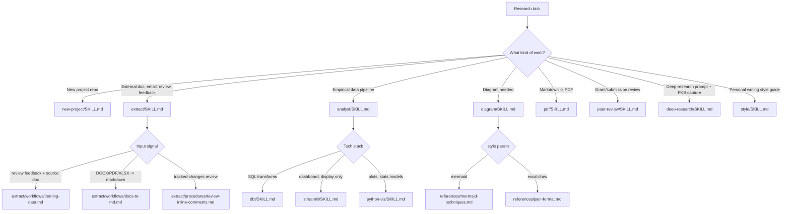

# aops-tools

Domain research skills for academicOps: data analysis, document conversion,
diagramming, peer review, and project scaffolding.

The routing decision (`K`, `ES`, `AS`, `DS` above) is made by the invoking
agent reading each `SKILL.md`'s description and, for `extract`, `analyst`,
and `diagram`, the "Workflow Routing" / style-parameter section inside the
skill itself — there is no separate router script.

## Provides

| Skill           | For                                                                                                 |
| --------------- | --------------------------------------------------------------------------------------------------- |
| `analyst`       | Technology-agnostic principles for an empirical research data pipeline.                             |
| `dbt`           | SQL transformation layer — the dbt-specific HOW for `analyst`.                                      |
| `streamlit`     | Dashboard presentation layer (display only) — the Streamlit-specific HOW for `analyst`.             |
| `python-viz`    | matplotlib/seaborn/statsmodels — the Python-specific HOW for `analyst`.                             |
| `pdf`           | Markdown to academically-typeset PDF, via `pdf/scripts/generate_pdf.py`.                            |
| `extract`       | Routes an input (document, email, review, feedback) to the matching extraction/conversion workflow. |
| `diagram`       | Mermaid or Excalidraw diagrams, selected by a `style` parameter.                                    |
| `peer-review`   | Peer review of research funding applications and academic submissions.                              |
| `deep-research` | Authors deep-research prompts and captures the resulting documents into the PKB.                    |
| `style`         | Builds a personal writing style guide from writing samples.                                         |
| `new-project`   | Scaffolds a new research project repository end to end.                                             |

## Configuration

No value in this plugin has a default. Skills that touch personal data read
it from `$ACA_DATA` (personal data directory, outside the repo). Skills that
touch a sibling plugin's source (e.g. `new-project`'s bot-deployment
workflow) read it from `$AOPS`/`$AOPS_SRC_DIR`. No path, host, or credential
is written into any skill file — every such value comes from the environment
at the point a skill is run.

## Depends on

- `uv` for the Python-backed skills (`pdf`, `extract`'s `pdf2md.py`,
  `deep-research`'s `rewrite.py`, `analyst`'s `assumption_checks.py`).
- `gh` CLI for `new-project` and `peer-review`'s repository/label operations.
- `rclone` for `deep-research`'s Google Drive fetch step.
- The PKB MCP server for any skill that searches or writes memory
  (`extract`, `deep-research`, `new-project`).
