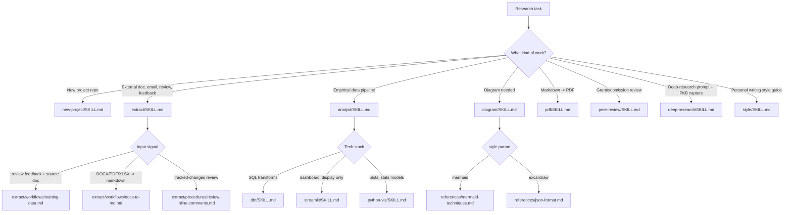

# tools

Domain research skills for academicOps: data analysis, document conversion,
diagramming, peer review, and project scaffolding.

The routing decision (`K`, `ES`, `AS`, `DS` above) is made by the invoking
agent reading each `SKILL.md`'s description and, for `extract`, `analyst`,
and `diagram`, the "Workflow Routing" / style-parameter section inside the
skill itself — there is no separate router script.

## Provides

| Skill           | For                                                                                                 |
| --------------- | --------------------------------------------------------------------------------------------------- |
| `analyst`       | Technology-agnostic principles for an empirical research data pipeline.                             |
| `dbt`           | SQL transformation layer — the dbt-specific HOW for `analyst`.                                      |
| `streamlit`     | Dashboard presentation layer (display only) — the Streamlit-specific HOW for `analyst`.             |
| `python-viz`    | matplotlib/seaborn/statsmodels — the Python-specific HOW for `analyst`.                             |
| `pdf`           | Markdown to academically-typeset PDF, via `skills/pdf/scripts/generate_pdf.py`.                     |
| `extract`       | Routes an input (document, email, review, feedback) to the matching extraction/conversion workflow. |
| `diagram`       | Mermaid or Excalidraw diagrams, selected by a `style` parameter.                                    |
| `peer-review`   | Peer review of research funding applications and academic submissions.                              |
| `deep-research` | Authors deep-research prompts and captures the resulting documents into the PKB.                    |
| `style`         | Builds a personal writing style guide from writing samples.                                         |
| `new-project`   | Scaffolds a new research project repository end to end.                                             |

## Configuration

No path, host, or credential is written into any file this plugin ships — every
value below comes from the environment at the point a skill runs. There is one
fallback: `peer-review` uses `~/brain` when `$ACA_DATA` is unset. This plugin
reads no `userConfig` fields.

| Setting                   | Where it comes from | For                                                                                                                                                                                                                       |
| ------------------------- | ------------------- | ------------------------------------------------------------------------------------------------------------------------------------------------------------------------------------------------------------------------- |
| `ACA_DATA`                | environment         | The personal data directory, outside any repo. `extract` writes sensitive material under `$ACA_DATA/processed/`, `pdf` reads `$ACA_DATA/assets/signature.png`, `peer-review` assembles rounds under `$ACA_DATA/reviews/`. |
| `AOPS`                    | environment         | The academicOps repo root. `new-project`'s closing report resolves the setup commands it deliberately defers to the user against it.                                                                                      |
| `AOPS_SRC_DIR`            | environment         | The conventional parent of checked-out project repos. Polecat resolves a registered project to `$AOPS_SRC_DIR/<repo>` at read time, so `new-project` writes no path into the registry.                                    |
| `AOPS_SESSIONS`           | environment         | The sessions repo. `new-project` registers a project by editing `$AOPS_SESSIONS/polecat.yaml`, and mounts per-project credentials from `$AOPS_SESSIONS/secrets/<slug>/`.                                                  |
| `POLECAT_HOME`            | environment         | Machine-local polecat config. A project that does not sit at the conventional location gets a `paths:` override in `$POLECAT_HOME/local.yaml`.                                                                            |
| `AOPS_BOT_GH_TOKEN`       | target-repo secret  | PAT the full-tier bot uses to push. `new-project`'s bot-deployment workflow sets it on the target repo with `gh secret set`; the value comes from the operator.                                                           |
| `CLAUDE_CODE_OAUTH_TOKEN` | target-repo secret  | Authenticates the @claude handler on a deployed repo. Provisioned by `claude setup-github`, never by hand.                                                                                                                |

## Depends on

- `uv` for the Python-backed skills (`pdf`, `extract`'s `pdf2md.py`,
  `deep-research`'s `rewrite.py`, `analyst`'s `assumption_checks.py`).
- `gh` CLI for `new-project` and `peer-review`'s repository/label operations.
- `rclone` for `deep-research`'s Google Drive fetch step.
- The PKB MCP server for any skill that searches or writes memory
  (`extract`, `deep-research`, `new-project`).
