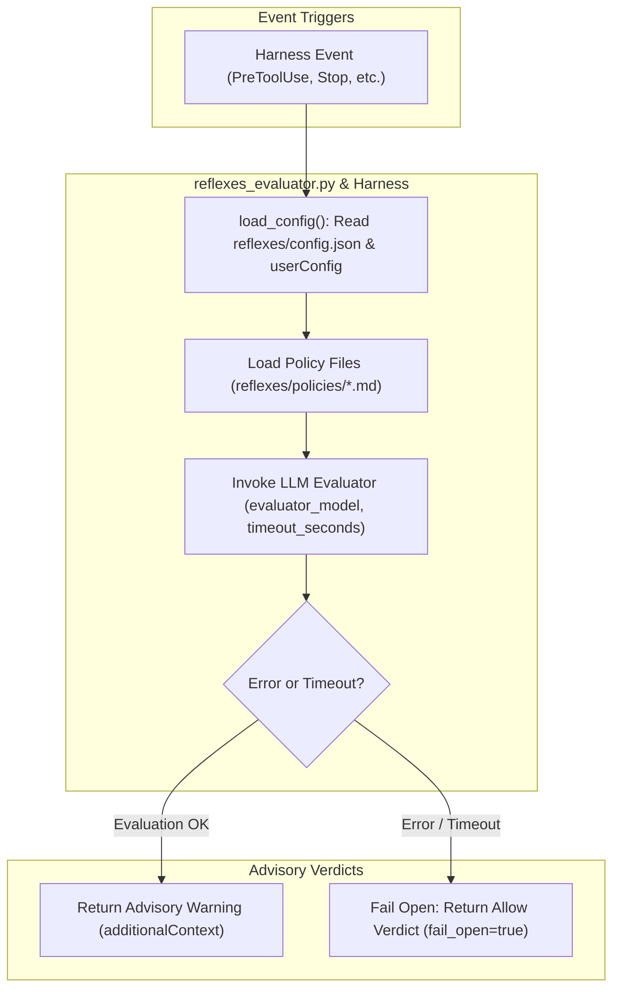

# reflexes-cope: Safety Harness Policies & Advisory Evaluator

`reflexes-cope` is an optional plugin for academicOps containing the Reflexes/CoPE safety harness policy definitions, evaluator hook, and derived CoPE rule files.

## Control Flow & Advisory Contract

Per v0.5 topology rules, `reflexes-cope` operates under an **advisory-only** contract:
- Policy evaluator output is an overridable advisory consumed by a deciding agent.
- No autonomous deny or blocking verdicts are produced.
- Strict fail-open resilience on evaluator outage or exception.

## Control Flow & Architecture



## Customisation Surface

`reflexes-cope` is configurable via `reflexes/config.json` and plugin manifest `userConfig`.

### Plugin Configuration (`userConfig` & `config.json`)

| Parameter | Type | Default | Description |
| :--- | :--- | :--- | :--- |
| `evaluator_model` | `string` | `"claude-3-5-haiku-20241022"` | LLM model used for policy evaluation. |
| `provider` / `evaluator_provider` | `string` | `"anthropic"` | LLM provider for evaluator model calls. |
| `timeout_seconds` | `number` | `5.0` | Timeout threshold in seconds before failing open. |
| `fail_open` | `boolean` | `true` | Return allow verdict when evaluator encounters an exception or timeout. |

### Configuration File (`reflexes/config.json`)

```json
{
  "evaluator_model": "claude-3-5-haiku-20241022",
  "provider": "anthropic",
  "timeout_seconds": 5.0,
  "fail_open": true
}
```

## Installation & Quickstart

### Claude Code

```bash
claude plugin install reflexes-cope@academicOps
```

### Antigravity (`agy`)

```bash
agy plugin install ./dist/reflexes-cope-antigravity
```

## Contents

- `reflexes/policies/` — Axiom policy definitions (`Costly-Ops-Approval.md`, `Halt-On-Failure.md`, `Evidence-Immutable.md`, etc.).
- `reflexes/config.py` & `config.json` — Evaluator configuration loader and JSON settings.
- `hooks/gates/reflexes_evaluator.py` — Advisory policy evaluator gate.
- `specs/reflexes-integration.md` — Design specification.
