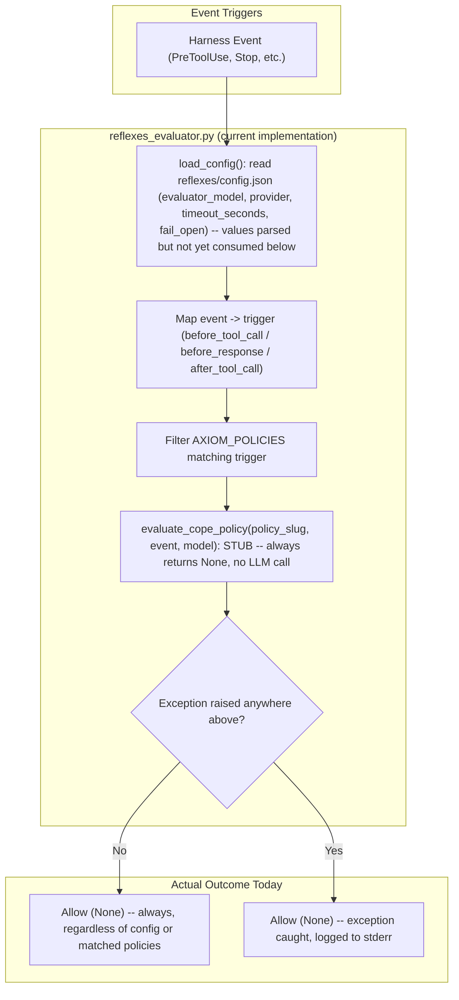

# reflexes-cope: Safety Harness Policies & Advisory Evaluator

`reflexes-cope` is an optional plugin for academicOps containing the Reflexes/CoPE safety harness policy definitions, evaluator hook, and derived CoPE rule files.

## Control Flow & Advisory Contract

Per v0.5 topology rules, `reflexes-cope` operates under an **advisory-only** contract:

- Policy evaluator output is an overridable advisory consumed by a deciding agent.
- No autonomous deny or blocking verdicts are produced.
- Strict fail-open resilience on evaluator outage or exception.

## Control Flow & Architecture

**As of the current build, `evaluate_cope_policy()` is an unimplemented stub.** It unconditionally `return`s `None` for every policy, every event — see `hooks/gates/reflexes_evaluator.py`. The flowchart below reflects what actually runs today, not the intended design; the "Invoke LLM Evaluator" behaviour it will eventually gain is tracked as a separate follow-up (see Customisation Surface below).



## Customisation Surface

**As of the current build, none of these knobs change runtime behaviour.** `reflexes/config.py` genuinely parses `reflexes/config.json` into a `ReflexesConfig` dataclass, and the `userConfig` manifest entries below are declared — but `evaluate_cope_policy()`, the only place that would consult `evaluator_model`, `provider`/`evaluator_provider`, or `timeout_seconds` to make an LLM call, is a stub that returns `None` before looking at any of them. `fail_open` is likewise unread; the code fails open by construction (the `try`/`except` in `reflexes_evaluator()` always returns `None` on error) regardless of this flag's value. Tracked: `aops` task for implementing `evaluate_cope_policy` (filed alongside this PR revision — see repo task tracker).

`reflexes-cope` is configurable via `reflexes/config.json` and plugin manifest `userConfig`.

### Plugin Configuration (`userConfig` & `config.json`)

| Parameter                         | Type      | Default                       | Description                                                                                                                                       |
| :-------------------------------- | :-------- | :---------------------------- | :------------------------------------------------------------------------------------------------------------------------------------------------ |
| `evaluator_model`                 | `string`  | `"claude-3-5-haiku-20241022"` | LLM model used for policy evaluation. **Not yet wired** — see caveat above.                                                                       |
| `provider` / `evaluator_provider` | `string`  | `"anthropic"`                 | LLM provider for evaluator model calls. **Not yet wired** — see caveat above.                                                                     |
| `timeout_seconds`                 | `number`  | `5.0`                         | Timeout threshold in seconds before failing open. **Not yet wired** — see caveat above.                                                           |
| `fail_open`                       | `boolean` | `true`                        | Return allow verdict when evaluator encounters an exception or timeout. **Not yet wired** — see caveat above (already fail-open unconditionally). |

### Configuration File (`reflexes/config.json`)

```json
{
  "evaluator_model": "claude-3-5-haiku-20241022",
  "provider": "anthropic",
  "timeout_seconds": 5.0,
  "fail_open": true
}
```

## Installation & Quickstart

### Claude Code

```bash
claude plugin install reflexes-cope@academicOps
```

### Antigravity (`agy`)

```bash
agy plugin install ./dist/reflexes-cope-antigravity
```

## Contents

- `reflexes/policies/` — Axiom policy definitions (`Costly-Ops-Approval.md`, `Halt-On-Failure.md`, `Evidence-Immutable.md`, etc.).
- `reflexes/config.py` & `config.json` — Evaluator configuration loader and JSON settings.
- `hooks/gates/reflexes_evaluator.py` — Advisory policy evaluator gate.
- `specs/reflexes-integration.md` — Design specification.
