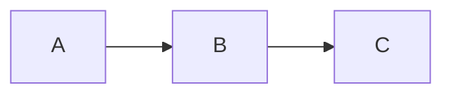
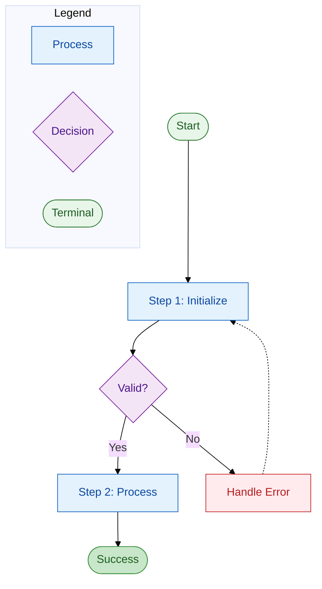
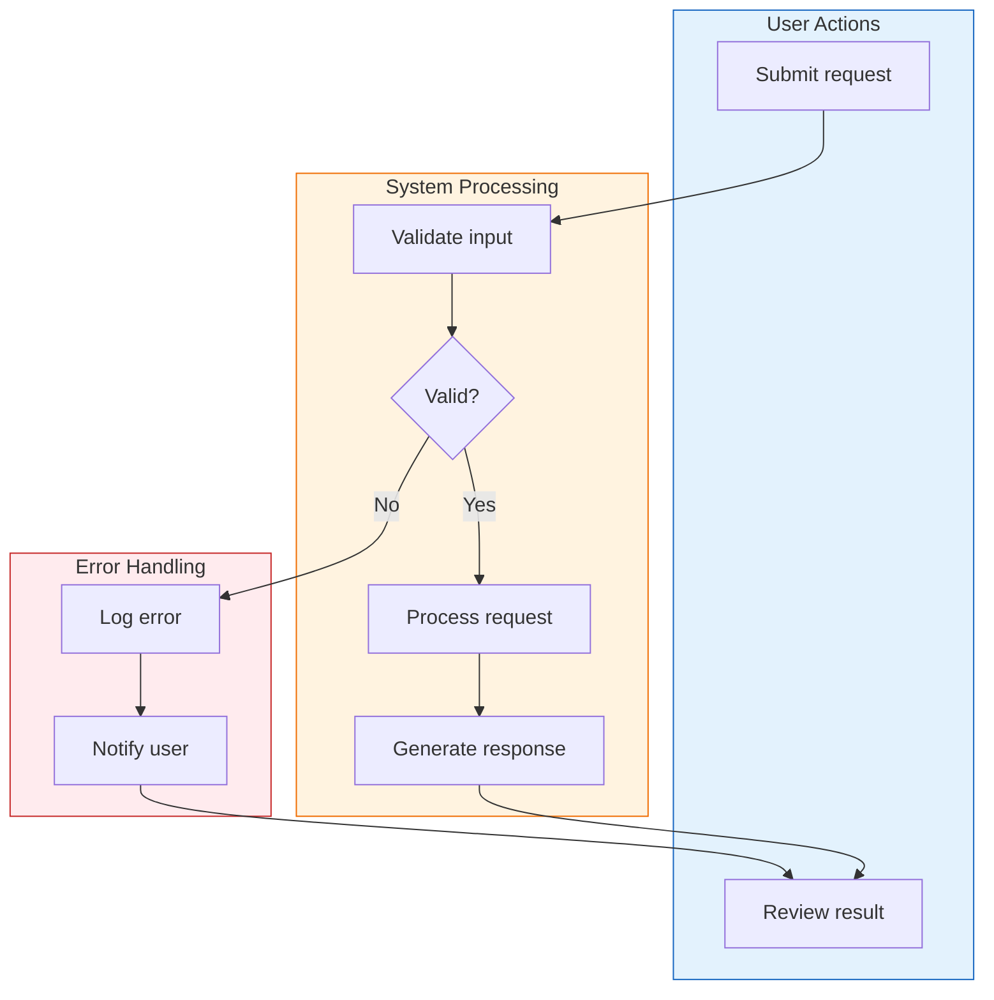

# Mermaid Flowchart Design Skill

**Purpose**: Create Mermaid flowcharts that are clear, readable, and visually attractive.

**Key principle**: One message per chart. Hierarchy and chunking. Obvious flow. Distinct shapes for distinct semantics.

## When to Use This Skill

Use this skill when:

- Creating Mermaid flowcharts for documentation
- Designing process flows, decision trees, or system diagrams
- Documenting execution flows or workflows
- Any task requiring code-based structured diagrams

**Contrast with excalidraw**: Use excalidraw for hand-drawn, organic mind maps. Use flowchart for structured, code-based Mermaid diagrams.

## Universal Chart Craft

### Define One Message Per Chart

- Write a one-line purpose before starting ("This chart shows how a session moves from prompt to cleanup")
- Remove anything that doesn't serve that message
- Use separate charts for deep sub-processes

### Use Hierarchy and Chunking

- Group related steps into visual blocks (subgraphs: "INIT", "PROMPT", "HYDRATE")
- Keep each block under 6-9 nodes
- If it grows, split to a new chart or link out

### Make the Flow Obvious

- Use consistent direction (top-down or left-right)
- Minimize backward arrows and edge crossings
- Put the "happy path" on a straight spine; move exceptions/loops to the side

### Use Distinct Shapes for Distinct Semantics

| Shape         | Mermaid Syntax | Use For       |
| ------------- | -------------- | ------------- |
| Rectangle     | `[text]`       | Process steps |
| Diamond       | `{text}`       | Decisions     |
| Rounded       | `([text])`     | Start/End     |
| Parallelogram | `[/text/]`     | Data/IO       |
| Stadium       | `([text])`     | Terminals     |

### Write Tight, Scannable Labels

- Start with a **verb** ("Invoke skill", "Verify criteria", "HALT + ask user")
- Aim for 3-9 words
- Split long text across `<br/>` lines or move detail to notes/legends

## Color and Styling

### Color for Meaning, Not Decoration

- Limit to **4-6 color roles** (e.g., Start/Success, Hooks/Blocks, Skills, Tools, Outcomes)
- Use **contrast ≥ 4.5:1** for text on fills
- Avoid red-green pairs for accessibility
- Prefer blue/orange/purple combos

### Recommended Palette

```
classDef start fill:#e8f5e9,stroke:#2e7d32,color:#1b5e20
classDef success fill:#c8e6c9,stroke:#388e3c,color:#1b5e20
classDef hook fill:#ffebee,stroke:#c62828,color:#b71c1c
classDef skill fill:#e3f2fd,stroke:#1565c0,color:#0d47a1
classDef tool fill:#fff3e0,stroke:#ef6c00,color:#e65100
classDef decision fill:#f3e5f5,stroke:#7b1fa2,color:#4a148c
```

### Typography

- Choose a legible UI font (Inter, Segoe UI, Roboto, system-ui)
- Font size 13-16px for screens
- Use consistent casing (Title Case or Sentence case)

## Mermaid-Specific Techniques

### Start with Init Block for Theme and Spacing

```mermaid
%%{init: {
  'theme': 'base',
  'themeVariables': {
    'primaryColor': '#e3f2fd',
    'primaryTextColor': '#0d47a1',
    'primaryBorderColor': '#1565c0',
    'lineColor': '#666',
    'fontSize': '14px'
  },
  'flowchart': {
    'nodeSpacing': 40,
    'rankSpacing': 50,
    'curve': 'basis'
  }
}}%%
```

### Use classDef + class Over Many style Lines

Define once; apply everywhere:

```mermaid
classDef hook fill:#ffebee,stroke:#c62828,color:#b71c1c
classDef skill fill:#e3f2fd,stroke:#1565c0,color:#0d47a1

A[Start]:::start --> B[Process]:::skill
B --> C{Decision}:::decision
```

### Decision Shapes for Gates

```mermaid
C{Passed?} -->|Yes| D[Continue]
C -->|No| E[Handle Error]
```

### Edge Labels and Styles

```mermaid
A -->|primary path| B
A -.->|optional path| C
A ==>|emphasized| D
```

- **Solid** for mandatory paths
- **Dashed** (`-.->`) for optional paths
- Label key branches on the edge, not inside nodes

### Layout Direction

- `TD` (top-down) is good for process flows
- `LR` (left-right) for wide screens to shorten tall stacks



### Swimlanes via Subgraphs

```mermaid
subgraph INIT["Initialization"]
    A[Load config]
    B[Validate]
end

subgraph PROCESS["Processing"]
    C[Execute]
    D[Verify]
end

style INIT fill:#fff8e1,stroke:#ffe082
style PROCESS fill:#e8f5e9,stroke:#a5d6a7
```

### Interactivity with click

```mermaid
A[Component] --> B[Details]
click A "https://docs.example.com/component" "View docs"
```

### Maintainable IDs

- Use consistent naming: `PHASE_STEP`, `PHASE_DECISION`
- Avoid spaces in IDs
- Favor ASCII and underscores; hyphens can be tricky with some selectors

## Quality Checklist

Before considering a flowchart complete:

**Structure**:

- [ ] One clear message and audience defined
- [ ] Happy path is straight, exceptions branch clearly
- [ ] Decision nodes use diamond shape `{}`
- [ ] Each subgraph has ≤9 nodes

**Visual**:

- [ ] 4-6 color roles max; color-blind-safe
- [ ] Labels convey meaning (not just color)
- [ ] Font 14px, consistent casing, short verb labels
- [ ] Node and rank spacing adjusted; minimal edge crossings

**Technical**:

- [ ] Legend included if color meanings aren't obvious
- [ ] Interactive links for deep detail where appropriate
- [ ] Tested rendering in target environment

## Anti-Patterns to Avoid

**Visual Sins**:

- Too many colors (rainbow explosion)
- All nodes same size/color (no hierarchy)
- Arrow spaghetti (crossing paths everywhere)
- Text walls in nodes (paragraphs in shapes)

**Structural Sins**:

- No clear message (what is this chart FOR?)
- Mixing multiple processes in one chart
- Backwards arrows crossing the main flow
- Inconsistent direction (mixing TD and LR logic)

**Maintenance Sins**:

- Many individual `style` lines instead of `classDef`
- Hardcoded colors without semantic meaning
- IDs with spaces or special characters

## Template: Standard Process Flow



## Template: Swimlane Workflow



## Summary

**Core Principles**:

1. **One message** per chart - define purpose first
2. **Hierarchy** through subgraphs and visual grouping
3. **Distinct shapes** for distinct semantics (diamonds for decisions)
4. **Color for meaning** - limited palette, accessible contrasts
5. **Tight labels** - verb-first, 3-9 words
6. **Maintainable code** - classDef over style, consistent IDs

**Quick Wins**:

- Start with `%%{init:...}%%` block for consistent theming
- Use subgraphs for swimlanes and logical grouping
- Define `classDef` once, apply with `:::className`
- Put happy path straight, branch exceptions to the side
- Add legend subgraph if color meanings aren't obvious
