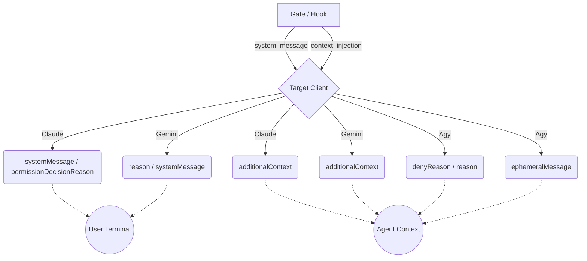

# Hook Client Translation — Spec & SSoT

> **State.** The single source of truth for how the Universal Hook Router translates
> between Claude Code, Gemini CLI, and Antigravity CLI (agy), and how the build keeps
> installed assets in sync with what the hooks expect. Per-gate forensic detail →
> [`specs/GATES.md`](../GATES.md). Enforcement currency → [`specs/ENFORCEMENT-MAP.md`](../ENFORCEMENT-MAP.md).

## Problem this solves

Per-client hook knowledge (event names, output-channel rules, field names, tool names,
config shapes) was duplicated across `router.py`, `scripts/build.py`,
`scripts/transforms/*`, and `lib/tool_categories.py` as inline prose with **no single
source of truth and no cross-client conformance test**. Each client's hook API is new,
sparsely documented, and changes upstream. Result: ~20 regressions in three weeks —
wrong wire fields, silent verdict drops, tool calls unrecognised on one surface, gate
advisories delivered to the user instead of the agent.

## Design: two SSoT tables + thin renderers + two test layers

### Table 1 — Client/event channel spec (`aops-core/hooks/client_spec.py`)

Pure-python (no heavy deps so the build can import it). One record per
`(client, internal_event)`:

| field              | meaning                                                                           |
| ------------------ | --------------------------------------------------------------------------------- |
| `wire_event`       | event name on the wire (e.g. internal `UserPromptSubmit` → agy `PreInvocation`)   |
| `config_shape`     | `wrapper` (matcher/hooks[]) · `flat` (bare handler list) · `claude`               |
| `can_block`        | does this event express a deny/block?                                             |
| `agent_channel`    | how `context_injection` reaches the AGENT (field path / injectStep kind / `None`) |
| `user_channel`     | how `system_message` reaches the USER (field / `None`)                            |
| `block`            | wire expression of deny/ask                                                       |
| `timeout_floor_ms` | per-(client,event) cold-start floor (agy PreToolUse = 15000)                      |

Drives BOTH the runtime renderers AND the build's `hooks.json` generation. The
event-name map (both directions) lives here ONCE — replacing the three divergent copies
(`router.GEMINI_EVENT_MAP`, `build.CLAUDE_TO_GEMINI_EVENTS`, `transforms/hooks.py`).

Contested cells are NOT guessed — they are filled from empirical measurement. Claude
USER-visibility cells are measured by the PTY harness (Test Layer C, `scripts/pty_hook_probe.py`
→ `tests/hooks/fixtures/pty_capabilities.json`). The agy cells were measured 2026-06-25 and
recorded in `tests/hooks/fixtures/client_capabilities.json`, which is now a **frozen record**:
its generating harness (`scripts/verify_hook_formats.py`) and the test that re-asserted it were
deleted 2026-06-26, so the agy values stand as recorded measurements, no longer test-guarded
(agy re-measurement is pending the Layer C agy port).

### Table 2 — Tool registry (`lib/tool_registry.py`, extends `lib/tool_categories.py`)

One record per ABSTRACT tool: `canonical`, `category`
(read/write/spawn/destructive/skill), and the per-client concrete name. Drives BOTH the
build's text/frontmatter rewriting (replacing `tool_translation.py` and the agent maps)
AND runtime recognition (`extract_subagent_type`, `SPAWN_TOOLS`, sentinel, enforcer).
Fixes the agy gap: agy's vocabulary (`view_file`, `run_command`, `invoke_subagent`, …)
is currently unknown at runtime, so sentinel/enforcer/spawn matching silently fails on agy.

### Renderers (thin, structural only)

`render_claude` / `render_gemini` / `render_agy` read Table 1 and map
`CanonicalHookOutput(verdict, system_message, context_injection)` → the wire dict. Policy
(which channel, can-block, field names) is DATA; only the structural nesting is code.

### Test layer A — unit matrix (fast, CI, deterministic)

`run_router(client, event, payload)` unified fixture + per-client **interpreter**
`interpret(client, event, output) -> Delivered(agent_sees, user_sees, blocked, accepted)`
mirroring how each real client consumes output (the agy accept-contract is the agy
interpreter). ONE parametrized `(client × event × scenario)` matrix asserts the router
conforms to Table 1 and that the core invariants hold. **No per-client test bodies.**

Core invariants:

- **A. accepted** — output validates against the client's schema / protojson accept-contract.
- **B. injection reaches agent** — `context_injection` present ⇒ `agent_sees` contains it,
  OR Table 1 says no agent channel ⇒ router blocked-to-deliver (if `can_block`) or
  dropped-with-logged-warning. _This is the property that keeps regressing._
- **C. verdict fidelity** — deny ⇒ blocked; allow ⇒ not blocked (agy: allow ≠ `{}`).
- **D. no leak** — `system_message` only on user channels; advisory never on a user-only field.

### Test layer C — PTY user-visibility harness (opt-in)

`scripts/pty_hook_probe.py` → `tests/hooks/fixtures/pty_capabilities.json`. Drives a REAL
INTERACTIVE `claude` inside a **tmux** pane (not `claude -p`), fires each candidate
hook-output shape with unique sentinels, and captures BOTH surfaces: the rendered pane
(`tmux capture-pane` = what the HUMAN sees) and the session transcript JSONL (what the
model received). Parameterized per `client` (Claude now; agy — which has its own
interactive TUI — added later via the same matrix shape, no schema change).

- **USER_SAW** (primary signal — the gap the old harness could not see) — sentinel rendered
  in the tmux pane = the HUMAN saw it. Measured for `SENTINELA` (advisory/reason channel)
  and `SENTINELB` (systemMessage/stopReason banner) independently, so a single probe proves
  whether the user sees ONE or BOTH payloads (e.g. warn mode renders BOTH `Stop says:` AND
  `Stop hook feedback:`).
- **AGENT_CTX** — sentinel injected into MODEL context: present in the `hookAdditionalContext`
  field (additionalContext channel) OR in a user/assistant message the model read (a blocking
  Stop `reason`). Authoritative for **Stop**. For **UPS/PreToolUse** additionalContext rides a
  `type:"attachment"` record — the SAME record that logs a user-only `systemMessage` — so it
  is structurally ambiguous there; for those events `AGENT_CTX` under-reports and the
  established C✓ comes from MODEL ECHO (invariant #14). The harness states this scope honestly
  rather than overclaiming.
- **IN_TRANSCRIPT** — sentinel anywhere in the transcript JSONL, INCLUDING raw
  hook-stdout `attachment`/`system` records (logged regardless of model visibility). "Shown in
  the agent transcript" literally — but NOT proof the model read it.

Output is committed as `pty_capabilities.json` — the empirical SSoT for user-visibility,
carrying per cell BOTH the measured signal AND each probe's CLAIMED audience. When Claude
changes its TTY rendering upstream, a signal flips. **This is what ends the guessing about
what the user sees.**

> **Coverage not yet re-added (after the headless Layer B deletion).** The PTY harness
> authoritatively measures USER-visibility (all events) and AGENT-context (Stop) for
> **Claude**. NOT yet ported from the deleted headless harness: (a) **agy** wire-acceptance +
> the `ephemeralMessage` real-plugin measurements (the agy rows below remain backed by the
> 2026-06-25 measurements recorded in prose, no longer by a live test); (b) `--resume`
> **persistence**; (c) PreToolUse **deny-blocks** verification; (d) a clean MODEL-ECHO
> agent-context lane for UPS/PreToolUse. Re-adding (a) and (d) to `pty_hook_probe.py` (agy has
> its own interactive TUI, driven identically) is the tracked follow-up — the matrix and
> fixture schema are already parameterized by `client` for it.
>
> **PreToolUse-deny user-visibility — capture gap, NOT U✗.** The `permissionDecisionReason`
> deny rows below are `U✓` on the basis of CLIENT DESIGN (Claude renders a denial toast) +
> `router.py` — they are NOT contradicted by the PTY fixture even though its
> `pretool-deny-reason` cell records `user_saw_a=false`. That `false` is a CAPTURE GAP: the
> denial toast is transient and scrolled out of the pane before the post-quiescence snapshot
> (the cell carries this in `measurement_caveats`; `agent_ctx_a=true` proves the hook fired
> and the reason reached the model). So PreToolUse-deny **U is design-asserted, not
> PTY-captured** — do not read it as PTY-proven, and do not downgrade it to U✗.

## Authoritative channel matrix (per client)

> **Why this table exists.** The disposition layer in [`../ENFORCEMENT-MAP.md`](../ENFORCEMENT-MAP.md) §1.1 (`silent`/`same`/`file` + ephemeral) is only _achievable_ against these per-client capability cells. **U** = USER-visible (human sees it in the terminal). **C** = injected into MODEL/agent context. **P** = PERSISTS beyond the current turn. `✓`/`✗`/`—`. The load-bearing trap: **the same field changes audience by event** — Claude `additionalContext` is `U✗` on UPS/PreToolUse but `U✓` on Stop.

**Claude Code** (`output_for_claude` + PTY harness, 2.1.x):

| channel (wire field)                                    | U | C | P | basis                                                                                                                               |
| :------------------------------------------------------ | - | - | - | :---------------------------------------------------------------------------------------------------------------------------------- |
| `hookSpecificOutput.additionalContext` (Pre/UPS/Post)   | ✗ | ✓ | ✓ | agent-only context, no block. **U✗ PTY-proven 2026-06-26** (`ups-/pretool-additionalcontext`). `router.py:991`                      |
| `hookSpecificOutput.permissionDecisionReason` (deny)    | ✓ | ✓ | ✓ | deny reason shown to user AND fed to agent on the blocked call. `router.py:976-983`                                                 |
| `hookSpecificOutput.additionalContext` (Stop, no-block) | ✓ | ✓ | ✓ | warn-deliver: reaches agent next turn AND **renders to user as `Stop hook feedback:`** — PTY-proven 2026-06-26. `router.py:930-938` |
| `decision="block"` + `reason` (Stop)                    | ✓ | ✓ | ✓ | block-to-halt: user sees `Stop hook error:`, agent sees reason (markers stripped for user). `router.py:925-929`                     |
| `systemMessage` / `stopReason`                          | ✓ | ✗ | ✗ | USER-only banner `Stop says:`; agent does NOT see it (transcript only). PTY-proven. `router.py:950-952`                             |

**Gemini CLI** (`output_for_gemini`):

| channel (wire field)                   | U | C | P | basis                                                                                                                                                                   |
| :------------------------------------- | - | - | - | :---------------------------------------------------------------------------------------------------------------------------------------------------------------------- |
| `hookSpecificOutput.additionalContext` | ✗ | ✓ | ✓ | injected into agent prompt (BeforeAgent/AfterTool); agent-only. `router.py:869-879`                                                                                     |
| `reason` (decision="deny")             | ✓ | ✗ | ✗ | USER-visible denial; model never sees it (recovery → `additionalContext`). On **Stop** the agent advisory must ride a block, so its `reason` is U✓. `router.py:865-873` |
| `systemMessage`                        | ✓ | ✗ | ✗ | USER-only banner. `router.py:859-860`                                                                                                                                   |

**Antigravity (agy)** (`output_for_agy`; `client_spec.py`) — ONE model-facing stream, **no user-only split the router emits**:

| channel (wire field)             | U | C | P | basis                                                                                                                                                                                    |
| :------------------------------- | - | - | - | :--------------------------------------------------------------------------------------------------------------------------------------------------------------------------------------- |
| `injectSteps[].ephemeralMessage` | ✗ | ✓ | ✗ | **LIVE-PROVEN 2026-06-25 (agy 1.0.12):** model echoes it (C✓), absent from user terminal (U✗), not recalled on resume (P✗). The channel the router actually emits. `router.py:1072-1083` |
| `injectSteps[].userMessage`      | ✗ | ✓ | ✓ | persists as a user turn; **defined but NOT emitted** by the renderer (not live-measurable on 1.0.12). `client_spec.py:90-91`                                                             |
| `denyReason` (PreToolUse deny)   | ✗ | ✓ | ✓ | top-level deny reason fed to model on the blocked call. `router.py:1054-1057`                                                                                                            |
| `reason` (Stop)                  | ✗ | ✓ | ✓ | StopHookResult reason fed to the model. `router.py:1087-1095`                                                                                                                            |
| PreToolUse advisory              | — | — | — | **n/a** — agy PreToolHookResult has only `allowTool`/`denyReason`; advisory on a PreToolUse allow RAISES. `router.py:1058-1061`                                                          |

**Differences that drive the disposition layer:** (1) agy injectSteps are model-facing, never a user banner — `silent`-to-user is automatic and `same` is impossible (no user channel). (2) agy PreToolUse cannot carry advisory at all. (3) Claude/Gemini have **no agent-only Stop channel** — any agent-visible Stop payload is also user-visible, so `silent`-on-Stop needs the reminder relocated to the next UPS. (4) `ephemeral`-to-agent is agy-native (`ephemeralMessage` P✗); Claude/Gemini `additionalContext` persists.

## Payload Routing Flowchart

> **State Mapping.** Two complementary SSoTs in [`../ENFORCEMENT-MAP.md`](../ENFORCEMENT-MAP.md): the **§1 macro matrix** owns rule→mechanism→trigger→mode routing, and **§1.1 Per-message routing (agent-first)** owns per-fire _disposition_ — agent template (always present) + user message (`silent`/`same`/`file`) + ephemeral-to-agent target. This file owns the **wire mechanics** below (which client field carries each channel); ENFORCEMENT-MAP owns who-sees-what.

## Regression-avoidance invariants (24) — encoded as permanent test anchors

The hard-won invariants from three weeks of agy fixes. Full list with WHY in the PR / git
history; the load-bearing ones:

1. agy rejects unknown protojson fields → only documented fields; never `metadata`.
2. agy PreToolUse allow = explicit `{"allowTool":true}`; `{}` = deny.
3. `allowTool`/`denyReason` top-level, never nested in `permissionOverrides` (repeated list).
4. agy PostToolUse / unmapped event = `{}` only.
5. injectSteps `userMessage`/`ephemeralMessage` are SCALAR strings; prefer `ephemeralMessage`.
6. PreInvocation/PostInvocation tolerate `short_reason` — never raise.
7. Claude `hookSpecificOutput` only for {PreToolUse, UserPromptSubmit, PostToolUse, PostToolBatch} (+Stop iff harness-verified).
8. agy `toolCall`/`error` at ROOT of stdin; root-first extraction.
9. agy flat handler list for PreInvocation/PostInvocation/Stop; wrapper only for Pre/PostToolUse.
10. agy PreToolUse timeout floor ≥ 15000ms.
11. substitute `${CLAUDE_PLUGIN_ROOT}` for agy; agy agent bodies use Claude tool names.
12. never `--dangerously-skip-permissions` on agy; `AOPS_AGY_CLIENT` worker posture; Stop never worker-skipped.
13. plugin dir FRONT of sys.path; provider from `--client`; prebake venv (staging + runtime registry).
14. verify agy injection by MODEL ECHO not transcript grep; test SEMANTIC verdict not literal dict.
15. cowork ships NO hooks.

## Phasing (regression-safe)

- **P0** unit-matrix safety net (router vs table, current behavior) + live conformance harness.
- **P1** SSoT tables (`client_spec.py`, `tool_registry.py`); router reads them; output byte-identical.
- **P2** renderers become thin table-driven functions.
- **P3** build imports the SSoT; delete orphaned `transforms/` duplicates; regen dist.
- **P4** corrections (each = one table-cell flip, harness-driven): agy PreToolUse format,
  agy hard stop-block, Claude Stop inject retirement.
- **P5** ENFORCEMENT-MAP row; update `specs/GATES.md` + `aops-core/skills/aops/references/hooks.md`; cleanup; PR.
