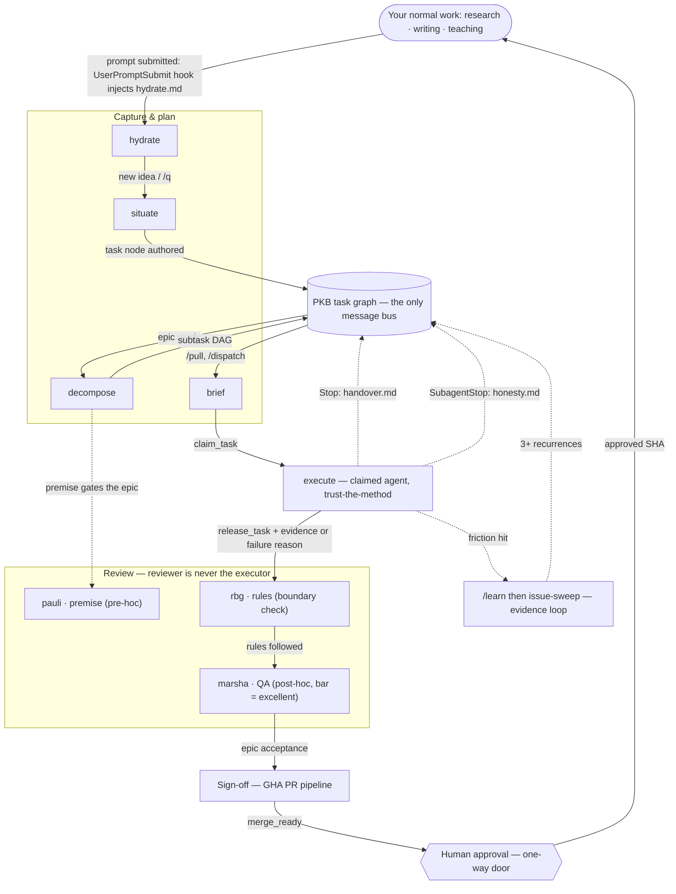

# Framework Flow & Trigger Map

**What this is.** The operative map of how a unit of work moves through academicOps: the
component classes, and — the load-bearing part — **what triggers movement between them**, including
where the security / review / QA mechanisms sit. This is a **state** doc (current truth), not a
tutorial. For _why_ enforcement is shaped this way (the "agents all the way down" design), read the
spec: [`specs/enforcement/enforcement.md`](enforcement/enforcement.md). One fact, one home — where a
mechanism's detail lives in its own spec, this map links out rather than restating it.

**Status legend.** ✅ wired (code/hook exists) · ⚠ convention or partial (followed by agents /
partially built) · ○ planned (designed, not built). Each row cites where the claim comes from;
grep-verify before relying on a ✅ for anything load-bearing.

## The flow

**Cross-cutting, always on (not a single edge):**

- **Structural prevention** — the only mechanical layer. Every polecat worker runs inside a Docker
  container with no ambient host credentials and a scoped mount. Prevention by construction, not
  detection. (`enforcement.md` §1.)
- **Auto-mode classifier** — a model-based per-tool-call admission check built into Claude Code,
  configured in prose. It is itself a judgment call, not a deterministic pattern match.
  (`enforcement.md` §3, [`auto-mode-classifier.md`](enforcement/auto-mode-classifier.md).)
- **Subagent-handback reminder** — a wired `PostToolUse` hook fires whenever the `execute` agent's
  `Agent` tool call returns, injecting `verify.md` ("check subagent outputs — they're lazy and lie
  often"). Reminder only, no verdict — same delivery-channel class as the hooks above. Note:
  `enforcement.md` §2 and the README currently say no `PostToolUse` hook exists; that's stale and
  tracked separately (`aops_6c8c4c82`). (`hooks.template.json`, `router.py`.)

## What triggers each move

| From → To                            | Trigger                                                                        | Mechanism                                                                                                                                            | Status                                                                                       |
| ------------------------------------ | ------------------------------------------------------------------------------ | ---------------------------------------------------------------------------------------------------------------------------------------------------- | -------------------------------------------------------------------------------------------- |
| user prompt → **hydrate**            | prompt submitted                                                               | `UserPromptSubmit` hook injects `hydrate.md` (search PKB first)                                                                                      | ✅ `hooks.template.json`, `router.py`                                                        |
| hydrate → **situate**                | new idea / fragment (`/q`)                                                     | `situate` skill                                                                                                                                      | ✅ [`situate/SKILL.md`](../aops/skills/situate/SKILL.md)                                     |
| situate → **PKB**                    | task node authored                                                             | `create_task`                                                                                                                                        | ✅ `situate/SKILL.md`, `task-contract.md`                                                    |
| PKB → **decompose**                  | break down a goal / epic                                                       | `decompose` skill (reachable via `Skill()`, not a registered slash command)                                                                          | ⚠ skill-only                                                                                 |
| decompose → **PKB**                  | subtask DAG emitted with standing pauli/rbg/marsha nodes wired by `depends_on` | `decompose` plans only — never dispatches                                                                                                            | ✅ `enforcement.md` §5, `workflow.md`                                                        |
| decompose → **pauli**                | premise must clear before the epic proceeds                                    | early-blocking premise node (pre-hoc lens)                                                                                                           | ✅ `enforcement.md` §5, `premise-gate.md`                                                    |
| PKB → **brief**                      | dispatch (`/pull`, `/dispatch`)                                                | `brief` skill — the identity that writes a brief never executes it; dispatch surfaces trust decomposition's premise judgment, they don't re-judge it | ✅ `task-contract.md`, `workflow.md`:45                                                      |
| brief → **execute**                  | `claim_task`                                                                   | task-graph boundary (a convention agents follow, not code that checks it)                                                                            | ⚠ convention · `task-contract.md`                                                            |
| execute ↻ execute                    | `Agent` tool call returns (subagent handback)                                  | `PostToolUse` hook injects `verify.md` ("check subagent outputs — they're lazy and lie often")                                                       | ✅ `hooks.template.json`, `router.py`                                                        |
| execute → **rbg**                    | `release_task` carrying independent evidence or a stated failure reason        | evidence contract                                                                                                                                    | ⚠ convention · `evidence-contract.md`                                                        |
| rbg → **marsha**                     | rules-followed check passes                                                    | boundary review reads contract + handback only, never the transcript                                                                                 | ✅ lenses exist                                                                              |
| marsha → **sign-off**                | epic acceptance                                                                | GHA PR pipeline (`rbg-review.yml`, `agent-qa.yml`, mechanical `lint`/`pytest`/`typecheck`)                                                           | ⚠ partial — some workflow files are known stubs; see Known gaps                              |
| execute → **PKB** (via Stop)         | `Stop`                                                                         | `handover.md` injected — a reminder, no verdict, cannot block exit                                                                                   | ✅ `hooks.template.json`, `router.py`                                                        |
| execute → **PKB** (via SubagentStop) | `SubagentStop`                                                                 | `honesty.md` injected — a reminder, no verdict, cannot block exit                                                                                    | ✅ `hooks.template.json`, `router.py`                                                        |
| sign-off → **human approval**        | `merge_ready`                                                                  | GitHub branch ruleset requires a human PR-review approval before the required check goes green                                                       | ✅ [`.github/rulesets/pr-review-and-merge.yml`](../.github/rulesets/pr-review-and-merge.yml) |
| human approval → merge               | approved SHA                                                                   | one-way door — a distinct, named human authorisation, not agent judgment                                                                             | ✅ [`human-approval.md`](../aops/workflows/gates/human-approval.md)                          |
| execute → **/learn**                 | friction encountered                                                           | `/learn` files forensic facts (1 friction = 1 filing), no fix proposed                                                                               | ✅ `enforcement.md` §"Evidence loop"                                                         |
| /learn → framework change            | ≥3 recurrences (or explicit user direction)                                    | `/issue-sweep` — a detached pass; user gates every disposition                                                                                       | ✅ `enforcement.md` §"Evidence loop"                                                         |

## The task lifecycle, in one line

`hydrate → situate → decompose → brief → execute → evaluate` — six stages coordinated **only**
through the PKB graph (a task's frontmatter + body is the message bus; no stage calls another
directly). `evaluate` is steps 3–5 of the [five-step workflow shape](enforcement/workflow.md):
boundary-check (rbg) → QA-around (marsha) → sign-off. The same shape recurses at every grain — a
single subtask, an epic, or a multi-epic release all run it. (`workflow.md`.) `/supervisor` runs
this same shape across a _set_ of tasks rather than one — a different axis, not a different
mechanism. (`workflow.md`, `specs/polecat/supervisor.md`.)

## Where the review / QA / security mechanisms sit

| Mechanism                                                                | Class                 | When it fires                                                             | Can it block?                       |
| ------------------------------------------------------------------------ | --------------------- | ------------------------------------------------------------------------- | ----------------------------------- |
| Container isolation                                                      | structural prevention | around every polecat worker, always                                       | yes — by construction               |
| Auto-mode classifier                                                     | harness judgment      | per tool call, before the agent's own loop closes                         | yes — admission                     |
| Hook injections (`hydrate.md`, `handover.md`, `honesty.md`, `verify.md`) | delivery channel      | prompt submit; `Stop`; `SubagentStop`; `PostToolUse` on subagent handback | **no** — reminders only             |
| Task-graph boundary (`claim`→`release`)                                  | accountability        | at claim-in and release-out                                               | convention, not code                |
| pauli / rbg / marsha lenses                                              | agent judgment        | premise (pre-hoc); rules + QA (post-hoc)                                  | yes — block epic acceptance         |
| Workflow gate templates                                                  | prose components      | composed into a plan at decomposition time                                | via the plan they compose           |
| GHA PR pipeline (sign-off)                                               | workflow-level review | on PR                                                                     | yes — required checks + human click |

## Known gaps (honest wired-vs-planned)

- **Stop hook injects text only.** The ratified design envisions the harness _dispatching_ a
  reflection/audit subagent on `Stop`; `router.py` does not do this yet — text injection only.
  (`enforcement.md` §2, flagged there as an open implementation gap.) ○ planned.
- **`claim_task` / `release_task` is a documented convention**, not a code-enforced boundary — no
  hook verifies it. ⚠ convention.
- **PR pipeline is partly stubbed.** Per the README's own audit, `pr-pipeline.yml` is an empty stub
  and `agent-qa.yml` references a path that does not exist in this repo — treat the sign-off row as
  the intended shape, and grep the actual `.github/workflows/` before relying on any single job.
- **`decompose` is not a registered slash command** — reachable only via an explicit `Skill()`
  call from another flow.

## Sibling documents

- [`specs/enforcement/enforcement.md`](enforcement/enforcement.md) — the design spec (the _why_): the
  "agents all the way down" governing principle and the seven mechanism groups.
- [`specs/enforcement/workflow.md`](enforcement/workflow.md) — the five-step workflow shape and the
  planner's risk-scaled review-depth call.
- [`specs/enforcement/task-contract.md`](enforcement/task-contract.md) · [`evidence-contract.md`](enforcement/evidence-contract.md) — the claim/release boundary and the universal evidence shape.
- [`aops/workflows/INDEX.md`](../aops/workflows/INDEX.md) — the routing tree and the composable
  process/gate template library.
- `README.md` §"How it works" — the slim, user-facing version of this diagram, which links here for
  the full trigger map.
