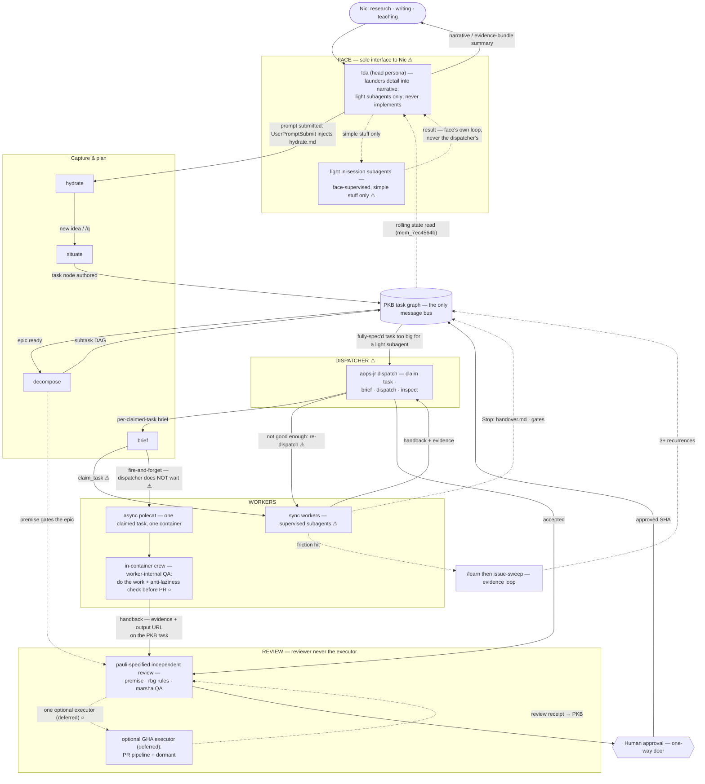

# Framework Flow & Trigger Map

**What this is.** The operative map of how a unit of work moves through academicOps: the
component classes, and — the load-bearing part — **what triggers movement between them**, including
where the security / review / QA mechanisms sit. This is a **state** doc: current truth stays
accurate, and the adopted **target architecture** (the FACE → DISPATCHER → WORKERS → REVIEW
layering, ratified 2026-07-19 and refined the same day by Nic's rulings, `note_ad2ed3d2`: unified
worker contract, pauli-specified independent review, any-deny-wins accepted) is carried alongside
it, with every missing piece honestly marked.
For _why_ enforcement is shaped this way (the "agents all the way down" design), read the spec:
[`specs/enforcement/enforcement.md`](enforcement/enforcement.md). One fact, one home — where a
mechanism's detail lives in its own spec, this map links out rather than restating it.

**Status legend.** ✅ wired (code/hook exists) · ⚠ convention or partial (followed by agents /
partially built) · ○ planned (designed, not built). Each row cites where the claim comes from;
grep-verify before relying on a ✅ for anything load-bearing.

## The role layering (target)

The target architecture is a strict layering. Each layer talks to its neighbours **only** through
the PKB task graph (still the only message bus) — never by holding a channel open. That rule
applies across session and async boundaries (face↔dispatcher, dispatcher↔polecat, review↔human);
in-session **sync subagents** are the one explicitly sanctioned direct supervised channel, living
_within_ a single dispatcher session, with outcomes still recorded to the PKB:

1. **FACE** — the sole interface to Nic. Launders all agent activity into narrative; answers
   self-answerable questions; may run _light_ in-session subagents for simple stuff; **never
   implements** and is never in the dispatch/receive/reconcile loop.
   ([`head-role-charter.md`](interactive-experience/head-role-charter.md).) Ida is the framework's
   one shipped head persona (`aops/agents/ida.md`); Junior is Nic's personal, machine-local
   cross-project orchestrator, out of this repo's scope — but its coordinator _machinery_ (polecat
   CLI + dispatch skill) now lives here as the `aops-jr` plugin (commit `44aef037`). ⚠ personas
   shipped; face-exclusivity is convention, not enforced.
2. **DISPATCHER** — receives fully-spec'd tasks too big for a light subagent, briefs and delegates to workers, **checks** their
   work, and re-dispatches when it's not good enough. This layer is the forcing function for
   scope→surface mapping (field finding #1844: a program-scope node was mis-routed straight to a
   single polecat worker). ⚠ `aops-jr` dispatch skill exists; the supervision loop is
   instruction-led.
3. **WORKERS — one unified contract** ([`task-contract.md`](enforcement/task-contract.md) is the
   home): any worker on any surface — polecat container, in-session subagent, agent team — claims
   a fully-spec'd task (an "epic" is just a task with children) and returns **evidence + an output
   URL, written to the PKB task**. Whether the dispatcher sync-waits on the handback or
   fires-and-forgets is a **cadence choice made at dispatch**, not a contract difference. The
   polecat instance keeps its shape: one claimed task → **one** container → one PR. With the full
   harness comes the obligation to demonstrate compliance + QA **internally** — that is the
   worker's business, not review. The polecat instance of this internal-QA obligation is the
   in-container crew: do the work + anti-laziness QA before the PR goes up (○ planned — these
   instructions do not exist today, smeared across the dispatch skill and
   [`supervisor.md`](polecat/supervisor.md)). Because the crew runs inside the worker's own
   container, it can never discharge the layer-4 independence requirement.
4. **REVIEW — pauli-specified independence** ([`workflow.md`](enforcement/workflow.md) is the
   doctrine home): at decomposition, pauli specifies the required level of **independent** review
   for the assembled workflow. Independence is about **who** reviews (never the worker's own
   session), not where. Executors are WHO-independent surfaces only: an independent polecat
   session validating a code change (marsha lens); dispatch-layer subagents for textual/rules
   compliance (rbg lens). Proof is always written to the PKB — typically a review task + receipt.
   The GHA PR pipeline is one **optional executor, currently deferred** — approval stays manual
   for now. ○ dormant (see Known gaps).
5. **Human approval** — unchanged one-way door: a GitHub APPROVED review from Nic's account on the
   SHA, branch-protection enforced.

## The flow

Status marks inside nodes: unmarked = ✅ wired; ⚠ / ○ as legend.

**Cross-cutting, always on (not a single edge):**

- **Structural prevention** — the only mechanical layer. Every polecat worker runs inside a Docker
  container with no ambient host credentials and a scoped mount. Prevention by construction, not
  detection. (`enforcement.md` §1.)
- **Auto-mode classifier** — a model-based per-tool-call admission check built into Claude Code,
  configured in prose. It is itself a judgment call, not a deterministic pattern match.
  (`enforcement.md` §3, [`auto-mode-classifier.md`](enforcement/auto-mode-classifier.md).)
- **Honesty check** — always on, in every register, never suppressed (`note-36c15a69` v0.5.3/4);
  delivered today as the `SubagentStop` `honesty.md` injection and the Stop handover reminder.
  This stays in **core**, so it fires on every surface regardless of which other plugins load.
- **Subagent-handback reminder** — a wired `PostToolUse` hook fires whenever the `Agent` tool call
  returns, injecting `verify.md` ("check subagent outputs — they're lazy and lie often"). Reminder
  only, no verdict. Note: `enforcement.md` §2 and the README currently say no `PostToolUse` hook
  exists; that's stale and tracked separately (`aops_6c8c4c82`).
  (`aops/templates/hooks.template.json`, `router.py`.)

## What triggers each move

Current-truth rows first, then the target-layer rows the new architecture adds.

| From → To                            | Trigger                                                                        | Mechanism                                                                                                                                                                                                                                                                                  | Status                                                                                                                   |
| ------------------------------------ | ------------------------------------------------------------------------------ | ------------------------------------------------------------------------------------------------------------------------------------------------------------------------------------------------------------------------------------------------------------------------------------------ | ------------------------------------------------------------------------------------------------------------------------ |
| user prompt → **hydrate**            | prompt submitted                                                               | `UserPromptSubmit` hook injects `hydrate.md` (search PKB first)                                                                                                                                                                                                                            | ✅ `aops/templates/hooks.template.json`, `router.py`                                                                     |
| hydrate → **situate**                | new idea / fragment (`/q`)                                                     | `situate` skill                                                                                                                                                                                                                                                                            | ✅ [`situate/SKILL.md`](../aops/skills/situate/SKILL.md)                                                                 |
| situate → **PKB**                    | task node authored                                                             | `create_task`                                                                                                                                                                                                                                                                              | ✅ `situate/SKILL.md`, `task-contract.md`                                                                                |
| PKB → **decompose**                  | break down a goal / epic                                                       | `decompose` skill (reachable via `Skill()`, not a registered slash command)                                                                                                                                                                                                                | ⚠ skill-only                                                                                                             |
| decompose → **PKB**                  | subtask DAG emitted with standing pauli/rbg/marsha nodes wired by `depends_on` | `decompose` plans only — never dispatches                                                                                                                                                                                                                                                  | ⚠ convention (shipped instruction, agent-followed) · `enforcement.md` §5, `workflow.md`                                  |
| decompose → **pauli**                | premise must clear before the epic proceeds                                    | early-blocking premise node (pre-hoc lens)                                                                                                                                                                                                                                                 | ⚠ convention (shipped instruction, agent-followed) · `enforcement.md` §5, `decompose/SKILL.md` Step 2, `workflow.md`     |
| PKB → **brief**                      | dispatch (`/pull`, `/dispatch`)                                                | `brief` skill — the identity that writes a brief never executes it; dispatch surfaces trust decomposition's premise judgment, they don't re-judge it                                                                                                                                       | ⚠ convention (shipped instruction, agent-followed) · `task-contract.md`, `workflow.md`:45                                |
| brief → **execute**                  | `claim_task`                                                                   | task-graph boundary (a convention agents follow, not code that checks it)                                                                                                                                                                                                                  | ⚠ convention · `task-contract.md` (target: closed by task-bound gate, below)                                             |
| execute ↻ execute                    | `Agent` tool call returns (subagent handback)                                  | `PostToolUse` hook injects `verify.md` ("check subagent outputs — they're lazy and lie often")                                                                                                                                                                                             | ✅ `aops/templates/hooks.template.json`, `router.py`                                                                     |
| execute (any tool) → warn            | `Agent` call without an explicit model                                         | `require_subagent_model` gate — `PreToolUse`, warn verdict                                                                                                                                                                                                                                 | ✅ `aops/hooks/gates/registry.py`, [`hook-gate-system.md`](enforcement/hook-gate-system.md)                              |
| execute → Stop reminder              | first `Stop` of a session                                                      | `exit_reflection_reminder` gate — warn, once per session, per-session JSON state                                                                                                                                                                                                           | ✅ `aops/hooks/gates/registry.py`, `gates/state.py`                                                                      |
| execute → **rbg**                    | `release_task` carrying independent evidence or a stated failure reason        | evidence contract                                                                                                                                                                                                                                                                          | ⚠ convention · `evidence-contract.md`                                                                                    |
| rbg → **marsha**                     | rules-followed check passes                                                    | boundary review reads contract + handback only, never the transcript                                                                                                                                                                                                                       | ⚠ convention (lenses shipped as agent instructions; nothing checks compliance)                                           |
| marsha → **sign-off**                | epic acceptance                                                                | GHA PR pipeline (`rbg-review.yml`, `agent-qa.yml`, mechanical `lint`/`pytest`/`typecheck`)                                                                                                                                                                                                 | ⚠ partial — some workflow files are known stubs; see Known gaps                                                          |
| execute → **PKB** (via Stop)         | `Stop`                                                                         | `handover.md` injected — a reminder, no verdict, cannot block exit (today)                                                                                                                                                                                                                 | ✅ `aops/templates/hooks.template.json`, `router.py`                                                                     |
| execute → **PKB** (via SubagentStop) | `SubagentStop`                                                                 | `honesty.md` injected — a reminder, no verdict, cannot block exit                                                                                                                                                                                                                          | ✅ `aops/templates/hooks.template.json`, `router.py`                                                                     |
| sign-off → **human approval**        | `merge_ready`                                                                  | GitHub branch ruleset requires the `admit-status` check; the ruleset file encodes the requirement, but the check's only setter (`admit-on-review.yml`) was deleted in `b2e7c670` — the check currently **fails closed**; restore or re-home the setter before relying on the approval flow | ⚠ partial — [`.github/rulesets/pr-review-and-merge.yml`](../.github/rulesets/pr-review-and-merge.yml); see Known gaps #5 |
| human approval → merge               | approved SHA                                                                   | one-way door — a distinct, named human authorisation, not agent judgment                                                                                                                                                                                                                   | ✅ [`human-approval.md`](../aops/workflows/gates/human-approval.md)                                                      |
| execute → **/learn**                 | friction encountered                                                           | `/learn` files forensic facts (1 friction = 1 filing), no fix proposed                                                                                                                                                                                                                     | ✅ `enforcement.md` §"Evidence loop"                                                                                     |
| /learn → framework change            | ≥3 recurrences (or explicit user direction)                                    | `/issue-sweep` — a detached pass; user gates every disposition                                                                                                                                                                                                                             | ✅ `enforcement.md` §"Evidence loop"                                                                                     |

**Target-layer rows** (the new architecture; nothing below is fully wired yet):

| From → To                           | Trigger                                                        | Mechanism                                                                                                                                                                                                                        | Status                                                                                                            |
| ----------------------------------- | -------------------------------------------------------------- | -------------------------------------------------------------------------------------------------------------------------------------------------------------------------------------------------------------------------------- | ----------------------------------------------------------------------------------------------------------------- |
| FACE → **dispatcher**               | a fully-spec'd task too big for a light subagent               | face files/points at the task in the PKB; dispatcher claims it — face never supervises workers                                                                                                                                   | ⚠ `aops-jr/skills/dispatch/SKILL.md` exists; the face/dispatcher split is convention                              |
| dispatcher → **worker**             | fully-spec'd task due                                          | brief-then-dispatch per claimed task (dispatch skill) — the worker owns internal decomposition of its children                                                                                                                   | ⚠ instruction-led                                                                                                 |
| sync worker → **dispatcher**        | handback                                                       | dispatcher **checks** the work; re-dispatches when not good enough — a full supervision loop                                                                                                                                     | ⚠ "inspect completed work" is in the dispatch skill; the re-dispatch loop has no forcing function                 |
| dispatcher → **async polecat**      | whole claimed task (may have children) assigned to one polecat | polecat CLI spins the container; dispatcher does **not** wait — review happens downstream                                                                                                                                        | ⚠ CLI wired (`aops-jr/polecat/cli.py`); non-waiting is convention                                                 |
| polecat internal → **PR**           | crew judges the work genuinely done                            | in-container agent crew: workers + anti-laziness check before the PR goes up (crew QA) — target home `aops/skills/crew`, seeded via `/crew` in `cli.py` (container enables only aops/aops-tools, so the skill must live in core) | ○ planned — instructions do not exist today                                                                       |
| worker → **PKB** (partial handback) | work partially completed (non-derivable choices refused)       | `partial` terminal status + draft deliverable + continue task, per [`spec-partial-work-tight-loop-delivery.md`](polecat/spec-partial-work-tight-loop-delivery.md) §§3–4                                                          | ⚠ `partial` in taxonomy + mem server enum (#414); client emit (`aops-8d3e43a1`) and §6 orphan loop-closer still ○ |
| polecat PR → **GHA review**         | PR opened by a polecat                                         | GHA PR pipeline reviews the PR (optional GHA executor, deferred)                                                                                                                                                                 | ○ dormant — see Known gaps #5                                                                                     |
| PKB / review outcomes → **FACE**    | rolling state read (`mem_7ec4564b`)                            | face launders evidence bundles into narrative for Nic; never re-reviews                                                                                                                                                          | ⚠ convention                                                                                                      |
| work session → **Stop denied**      | session did work with no task bound                            | `gate_task_bound` — stateful Stop **deny** gate; full predicate design in Known gaps #2                                                                                                                                          | ○ planned (`aops-strict`)                                                                                         |
| work session → **Stop denied**      | bound task concluded without the handover skill having run     | `gate_handover_called` — stateful Stop gate, **deny** verdict                                                                                                                                                                    | ○ planned (`aops-strict`)                                                                                         |
| surface → **its own gate set**      | which plugins the surface loads                                | plugin-scoped hooks: core ships warn-level gates everywhere; `aops-strict` adds the deny gates only where it's installed. Gate code never branches on session type (`note_296e5520`)                                             | ○ — mechanism sanctioned; `aops-strict` not built; `aops-jr` ships no hooks yet                                   |
| merged PR → **epic complete**       | PR merged after human approval                                 | someone must `complete_task` the epic and unblock dependents — currently unowned (dispatcher's next queue pass, or a GHA step)                                                                                                   | ○ unowned today                                                                                                   |

## Component-assignment rule

When deciding where a new piece of the framework lives, apply these five clauses in order — they
resolve the "who gets what, and how do we keep them separate but linked" ambiguity:

1. **Identity → agents.** Persona, voice, standing lens (`aops/agents/*.md`). No procedural skill
   matter in runtime agent definitions.
2. **Procedure → skills.** Anything with steps. Agents are m:n _dispatchers_ of skills — never fold
   a procedure into an agent prompt.
3. **Guarantees → gates.** If a behaviour must be _enforced_ rather than followed, it is a gate
   with a verdict ([`hook-gate-system.md`](enforcement/hook-gate-system.md)). Skills and agent
   definitions are instruction-only; only a deny verdict is a guarantee.
4. **Placement → plugins.** Which surfaces get a component is decided _solely_ by which plugin
   carries it — never by session-type branching inside the component.
5. **Cross-session state → the graph.** Anything that must survive a session boundary lives in the
   PKB task graph, not in an agent's context or a local file.

## Plugin topology

Compact map; detail lives (or will live) in each plugin's own spec/README.

| Plugin        | Carries                                                                                                         | Loaded where                                                                           | Status                                                  |
| ------------- | --------------------------------------------------------------------------------------------------------------- | -------------------------------------------------------------------------------------- | ------------------------------------------------------- |
| `aops`        | agents (ida, james, marsha, pauli, rbg) · core skills · reminder hooks + the two warn gates · honesty always-on | every surface, including polecat containers                                            | ✅ `aops/`                                              |
| `aops-tools`  | domain skills (analyst, extract, diagram, …)                                                                    | interactive surfaces + polecat containers                                              | ✅ `aops-tools/`                                        |
| `aops-jr`     | coordinator machinery only: polecat CLI + dispatch skill; "contains no task-execution skills of its own"        | Junior's combined face+dispatcher machine — not Ida/face-only surfaces, not containers | ✅ extracted (commit `44aef037`) · ⚠ ships no hooks yet |
| `aops-strict` | self-contained stateful blocking gates: task-bound + handover recorders **and** their Stop deny gates           | surfaces where work is claimed (dispatcher/worker sessions); face TBD (open Q1)        | ○ planned — does not exist                              |
| `aops-ts`     | (precedent) ships its own `hooks/hooks.json` — demonstrates per-plugin hook discovery                           | —                                                                                      | ✅ `aops-ts/hooks/hooks.json`                           |

### Ida vs Junior — same contracts, different plugin stack

The **only** sanctioned differentiation mechanism is plugin presence: "Gate code never branches on
session type; surface differences exist only through resolved config and plugin presence"
(`note_296e5520`, ratified — supersedes launch-time mode switches, `mem-47da1659`).

- **Ida (face)**: loads `aops` (+ `aops-tools`). Gets the reminders and warn gates; is bound by the
  head charter (never implements, so the task-bound deny gate has nothing to catch — conversational
  sessions that never claim and never edit are never blocked).
- **Junior's machine (face + dispatcher)**: adds `aops-jr` (coordinator skills) and, when built,
  `aops-strict` (deny gates). Junior himself stays out-of-tree
  (`~/brain/.agents/agents/junior.md`); this repo ships only the machinery he loads.
- Both share every core contract — honesty, evidence, claim/release — because core ships everywhere.

## The task lifecycle, in one line

`hydrate → situate → decompose → brief → execute → evaluate` — six stages coordinated **only**
through the PKB graph (a task's frontmatter + body is the message bus; no stage calls another
directly). `evaluate` is steps 3–5 of the [five-step workflow shape](enforcement/workflow.md):
boundary-check (rbg) → QA-around (marsha) → sign-off. The same shape recurses at every grain — a
single subtask, an epic, or a multi-epic release all run it. (`workflow.md`.) The dispatcher runs
this same shape across a _set_ of tasks rather than one — a different axis, not a different
mechanism. (`workflow.md`, `specs/polecat/supervisor.md`.)

## Where the review / QA / security mechanisms sit

| Mechanism                                                                                                         | Class                 | When it fires                                                                                    | Can it block?                                    |
| ----------------------------------------------------------------------------------------------------------------- | --------------------- | ------------------------------------------------------------------------------------------------ | ------------------------------------------------ |
| Container isolation                                                                                               | structural prevention | around every polecat worker, always                                                              | yes — by construction                            |
| Auto-mode classifier                                                                                              | harness judgment      | per tool call, before the agent's own loop closes                                                | yes — admission                                  |
| Hook injections (`hydrate.md`, `handover.md`, `honesty.md`, `verify.md`)                                          | delivery channel      | prompt submit; `Stop`; `SubagentStop`; `PostToolUse` on subagent handback                        | **no** — reminders only                          |
| Gate engine (`gate_dispatch.py`) — warn gates                                                                     | code verdict          | `PreToolUse`, `Stop`; verdict merge deny>warn>allow                                              | plumbing yes; **no deny gates registered today** |
| `aops-strict` deny gates (task-bound, handover)                                                                   | code verdict          | `Stop` on strict-equipped surfaces                                                               | ○ planned — yes, deny                            |
| Task-graph boundary (`claim`→`release`)                                                                           | accountability        | at claim-in and release-out                                                                      | convention today; deny gate when strict lands    |
| Dispatcher supervision loop                                                                                       | agent judgment        | on every sync-worker handback                                                                    | ⚠ yes by re-dispatch, instruction-led            |
| In-container crew QA — **worker-internal QA, not review** (layer 3; never satisfies pauli-specified independence) | agent judgment        | inside the polecat, before the PR goes up                                                        | ○ planned — yes, PR doesn't go up                |
| pauli / rbg / marsha lenses                                                                                       | agent judgment        | premise (pre-hoc); rules + QA (post-hoc) — as specified at decomposition, uniform across cadence | yes — block epic acceptance                      |
| Workflow gate templates                                                                                           | prose components      | assembled into a plan at decomposition time                                                      | via the plan they assemble into                  |
| GHA PR pipeline (optional executor, deferred / sign-off)                                                          | workflow-level review | on PR                                                                                            | yes when active — required checks + human click  |

## Build order

The dependency-ordered next moves (each an `aops`-project epic; numbers cross-reference Known gaps
below — detail lives there, one fact one home):

1. **`aops-strict`**: recorders + task-bound / handover **deny** gates (gaps #1–#3). Any-deny-wins
   is accepted by ruling (`note_ad2ed3d2`; gap #7 resolved) — the multi-plugin Stop-hook merge
   spike is **dropped**, so this is the next build.
2. **`/crew` skill in core** + seeding via `cli.py` (gap #4).
3. **Router reminder migration** into the gate engine (gap #8).

**Deferred (background, not in the ordered list):** optional-GHA-executor activation, including
restoring the `admit-status` setter (gap #5) — human approval stays manual for now
(`note_ad2ed3d2`). Everything else in Known gaps is background hygiene or awaits a ruling (open
questions).

## Known gaps (honest wired-vs-planned)

The complete gap list for the target architecture. Verify recon-sourced items (#5, #6) against
source before implementing.

1. **`aops-strict` plugin does not exist.** The entire blocking-gate layer — recorders and deny
   gates, self-contained in one plugin so ida-vs-jr differentiation stays purely plugin presence —
   is unbuilt. ○
2. **`gate_task_bound`** — Stop **deny** when `did_work && !task_bound`; `did_work` watches native
   `Write`/`Edit`/`NotebookEdit` only (anchored to Native-Edit-HALT: shell edits of tracked files
   are already forbidden, so native tools are the sanctioned _and observable_ mutation channel — a
   bash escape is a doctrine violation, not a gate gap) and resets on `release_task`/
   `complete_task` (closing the claim-A→complete-A→keep-mutating hole). ○
3. **`gate_handover_called`** — Stop **deny** until the handover skill has run for a bound task. ○
4. **In-container crew instructions do not exist.** Today they are smeared across the dispatch
   skill and [`supervisor.md`](polecat/supervisor.md). Target: `aops/skills/crew` in **core** (the
   container enables only aops/aops-tools, so a skill in `aops-jr` could never execute there),
   seeded via a `/crew` invocation in the polecat CLI's initial prompt (`aops-jr/polecat/cli.py`). ○
5. **Optional GHA executor (deferred) is dormant.** `pr-pipeline.yml` is a stub; the review workflows are
   `workflow_call`-only with no caller; `rbg-review.yml` is gated on a human label + non-bot actor,
   so nothing fires on polecat PRs. Single-reader recon — grep `.github/workflows/` before
   building on any row. ○ activation needed. **Also: the human-approval mechanism is half-wired** —
   the ruleset file encodes the `admit-status` requirement, but its only setter
   (`admit-on-review.yml`, 542 lines) was deleted in `b2e7c670`, so no repo-tracked workflow can
   ever turn the check green, and `comment-triage-status` is documented as posted by the
   `pr-pipeline.yml` stub. The door currently fails closed (doctrine intact), but the described
   approval→green flow is broken; restore or re-home the setter before relying on it. ⚠
6. **Blocking is advisory-only on agy/polecat surfaces.** `emit.py`'s agy branch degrades a deny
   verdict to `injectSteps` (`TODO(agy-deny-format)`), and polecats run via agy — so requirement-5
   guarantees cannot land inside containers today; the guarantee relocates to the container exit
   check (crew, gap #4). ○
7. **Multi-plugin Stop-hook merge semantics — resolved by ruling** (2026-07-19, `note_ad2ed3d2`):
   any-deny-wins is **accepted**; the verification spike is dropped. The core-warn + strict-deny
   two-plugin design proceeds on that basis.
8. **`router.py` retirement.** Two hook systems fire on the same events (router reminder injections
   - gate engine). Target: router's SessionStart env plumbing stays as infra; its reminders become
     core **warn** gates in the gate engine. Must preserve the Stop early-return when
     `background_tasks` is non-empty (`router.py`) and honesty always-on in core (`note-36c15a69`). ○
9. **Async-epic review-node re-scope — resolved by ruling** (2026-07-19, `note_ad2ed3d2`): review
   nodes are determined by the workflow pauli assembles at decomposition, uniform across cadence
   ([`workflow.md`](enforcement/workflow.md)); there is no per-surface layer-count question.
10. **`claim_task` / `release_task` is a documented convention**, not a code-enforced boundary — no
    hook verifies it today. ⚠ convention; gap #2 is the closing move.
11. **Dispatcher supervision loop has no forcing function.** "Inspect completed work" is in the
    dispatch skill, but check-and-re-dispatch on inadequate sync work is instruction-led. ⚠
12. **Face-exclusivity is convention.** Nothing prevents an Ida session from implementing; the
    head charter binds by instruction only. Scope→surface mis-routing (field finding #1844) is
    mitigated by the dispatcher layer, not enforced at the conversational layer. ⚠
13. **Stop hook injects text only** (current core). The ratified design also envisions the harness
    _dispatching_ a reflection/audit subagent on `Stop`; not built. (`enforcement.md` §2.) ○
14. **`decompose` is not a registered slash command** — reachable only via an explicit `Skill()`
    call from another flow. ⚠

### Open questions (carried from the ratified blueprint; 1 remains)

1. **`aops-strict` universality** — does the face machine ever load the strict plugin (deny gates
   on Ida sessions that do claim work), or is strict strictly a dispatcher/worker concern?
2. ~~**Gap #7 outcome**~~ — closed by ruling (2026-07-19, `note_ad2ed3d2`): any-deny-wins accepted;
   no redesign needed.
3. ~~**Gap #9 ruling**~~ — closed by ruling (2026-07-19, `note_ad2ed3d2`): review nodes are
   determined by the workflow pauli assembles at decomposition, uniform across cadence
   ([`workflow.md`](enforcement/workflow.md)); no per-surface layer-count question remains.

## Sibling documents

- [`specs/enforcement/enforcement.md`](enforcement/enforcement.md) — the design spec (the _why_): the
  "agents all the way down" governing principle and the seven mechanism groups.
- [`specs/enforcement/hook-gate-system.md`](enforcement/hook-gate-system.md) — the function-per-gate
  engine: registry, per-session state, verdict merge, emit formats.
- [`specs/enforcement/workflow.md`](enforcement/workflow.md) — the five-step workflow shape and the
  risk-scaled review-depth call (pauli's, at decomposition).
- [`specs/enforcement/task-contract.md`](enforcement/task-contract.md) · [`evidence-contract.md`](enforcement/evidence-contract.md) — the claim/release boundary and the universal evidence shape.
- [`specs/interactive-experience/head-role-charter.md`](interactive-experience/head-role-charter.md) —
  the FACE role: what the head is and is never allowed to become.
- [`specs/polecat/supervisor.md`](polecat/supervisor.md) — epic supervision contract (current home of
  the material the crew skill will absorb).
- `aops-strict` spec — ○ planned, no home yet; gate designs live in Known gaps #1–3 until it exists.
- [`aops/workflows/INDEX.md`](../aops/workflows/INDEX.md) — the routing tree and the composable
  process/gate template library.
- `README.md` §"How it works" — the slim, user-facing version of this diagram, which links here for
  the full trigger map.
