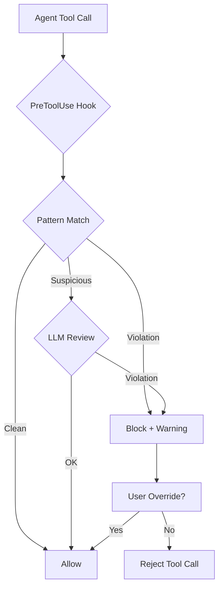

# Agent Behavior Watchdog

**Status**: DRAFT - needs design work
**Priority**: P2 - addresses validation bypass and lazy behavior patterns

## Workflow

## Problem Statement

**What manual work are we automating?**

Agents exhibit documented lazy/bypass behaviors that user must catch manually:
- Using `--no-verify` to bypass validation (LOG.md 2025-11-16, 2025-11-17)
- Workarounds instead of documented tools (LOG.md 2025-11-10)
- "Let me just..." shortcuts that violate AXIOMS
- Confident diagnoses without verification (LOG.md 2025-11-18)

User quote from conversation: "i think what i want to build today is a hypervisor that just watches for dumb-ass behaviour and intervenes: 'this test didn't work, let me just bypass...'"

**Why does this matter?**

- Bad data enters knowledge base when validation bypassed
- Root causes go unfixed when workarounds succeed
- Trust in agent output degrades
- User must constantly monitor for lazy shortcuts

**Who benefits?**

Nic - catches agent misbehavior before it causes damage, enforces AXIOMS compliance.

## Comparison with Intent Router

| Aspect | Intent Router | Behavior Watchdog |
|--------|---------------|-------------------|
| Hook type | UserPromptSubmit | PreToolUse |
| Triggers on | User prompts | Agent tool calls |
| Purpose | Recommend skills | Catch bad behavior |
| Action | Inject suggestions | Block/warn/intervene |

## Scope

### Behaviors to Catch

**High priority (block/warn)**:
- `--no-verify` in git commands
- `git commit --amend` without checking authorship
- Creating backup files (`_new`, `.bak`, `_old`)
- Bypassing validation with workarounds

**Medium priority (warn)**:
- Confident diagnoses without verification ("The issue is X")
- Creating temporary test files outside test directories
- Silent failures or error swallowing

**Lower priority (log)**:
- Excessive searching when skill would be faster
- Not using TodoWrite for multi-step tasks

### Detection Approaches

**Option A: Pattern matching on tool calls**
- Intercept Bash tool calls
- Regex for `--no-verify`, `--force`, backup patterns
- Fast but limited to known patterns

**Option B: LLM-based intent analysis**
- Small model reviews agent's planned action
- Classifies as compliant/suspicious/violation
- More flexible but adds latency

**Option C: Hybrid**
- Fast regex for obvious violations (block immediately)
- LLM review for suspicious patterns (warn)

## Open Questions

1. **Which hook?** `PreToolUse` would catch before execution; `AgentResponse` catches the plan but not execution
2. **Block vs warn?** Should watchdog prevent execution or just inject warning?
3. **False positives?** How to avoid blocking legitimate uses of `--no-verify` (user-requested)?
4. **Performance?** How much latency is acceptable per agent action?
5. **User override?** How does user say "yes, I really want --no-verify this time"?

## Risks

**Risk**: Watchdog becomes annoying, user disables it
- Every warning is friction
- Must be high-signal, low-noise

**Risk**: False positives block legitimate work
- Need escape hatch for user override
- Log overrides for pattern analysis

**Risk**: Latency makes agent feel sluggish
- Pattern matching is fast
- LLM review adds 2-4s per action

## Implementation Status

| Component | Status | Notes |
|-----------|--------|-------|
| Hook type decision | Pending | PreToolUse recommended |
| Pattern matching | Not started | High priority behaviors |
| LLM review | Not started | For suspicious patterns |
| User override mechanism | Not started | Escape hatch needed |

## Next Steps

1. Audit LOG.md for complete list of bypass behaviors
2. Prototype pattern-matching approach first (fast, low risk)
3. Evaluate if LLM review adds enough value to justify latency
