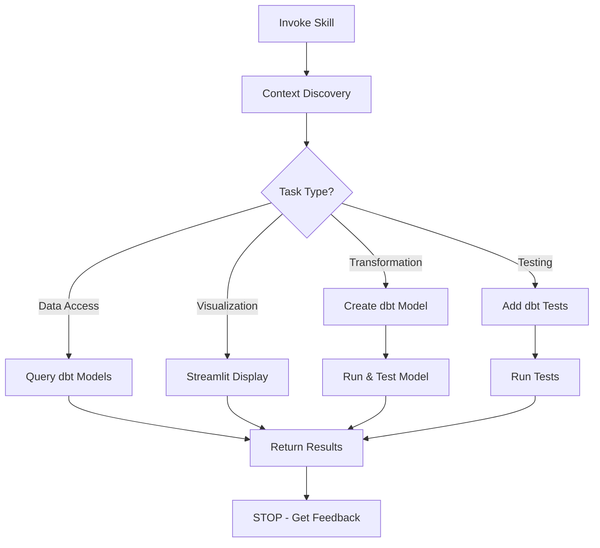

# Analyst Skill

**Status**: Implemented
See [[skills/analyst/SKILL.md]] for full implementation.

## Workflow



## Purpose

Support academic research data analysis with dbt and Streamlit, enforcing reproducibility, transparency, and academic integrity through strict transformation boundaries.

## Problem Statement

Data analysis risks:
- Transformations hidden in Streamlit (not reproducible)
- Direct queries to upstream sources (bypassing validation)
- Ad-hoc one-liners instead of reusable investigation scripts
- Missing tests for data quality claims
- Documentation scattered or missing

## Solution

A skill enforcing the transformation boundary rule: ALL data transformation in dbt, Streamlit for display only. Provides collaborative single-step workflow with checkpoint after each action.

## How It Works

### Invocation

```
Skill(skill="analyst")
```

Invoke when working with dbt pipelines, Streamlit dashboards, or research data analysis.

### Core Behaviors

**1. Transformation Boundary Rule (CRITICAL)**

| Layer | Allowed | Prohibited |
|-------|---------|------------|
| dbt | ALL SQL transformations | - |
| Streamlit | Display, formatting, filtering existing columns | Aggregations, joins, business logic |

**2. Context Discovery (Mandatory First Step)**

Before any work:
- Read README.md files (current + parents)
- Read data/README.md
- List existing dbt models
- Identify project conventions

**3. Collaborative Workflow**

One action at a time:
1. Perform ONE action (chart, model, test)
2. Show results
3. STOP and wait for feedback
4. Proceed based on user direction

**4. Data Access via dbt Only**

```python
# ✅ Correct
conn = duckdb.connect("data/warehouse.db")
df = conn.execute("SELECT * FROM fct_cases").df()

# ❌ Prohibited
df = client.query("SELECT * FROM bigquery.raw.cases").to_dataframe()
```

### Documentation

Skill includes extensive reference material:
- Instructions: dbt-workflow, streamlit-workflow, research-documentation
- References: Statistical analysis guides, visualization libraries
- Scripts: assumption_checks.py for statistical validation

## Relationships

### Depends On
- dbt for data transformation
- DuckDB/PostgreSQL for storage
- Streamlit for visualization
- [[python-dev]] for code quality

### Used By
- Research projects with dbt/ directory
- Empirical data analysis workflows
- Dashboard creation

### Framework Integration

When working in `$AOPS`: Must be invoked via [[framework]] skill with "FRAMEWORK SKILL CHECKED" token.

## Success Criteria

1. **Transformation boundary enforced**: No SQL business logic in Streamlit
2. **Reproducibility**: All transformations in version-controlled dbt models
3. **Testability**: dbt tests validate data quality claims
4. **Single-step workflow**: User feedback after each action
5. **Context discovery**: Project conventions understood before work

## Design Rationale

**Why transformation boundary?**

Academic integrity requires reproducibility. Anyone must be able to re-run `dbt build` and get identical results. Transformations in Streamlit are hidden, untested, and unreproducible.

**Why single-step workflow?**

Research is exploratory. Making assumptions about next steps leads to wasted work and scope creep. Yielding control after each action keeps user in the loop.

**Why data access through dbt?**

dbt models are the single source of truth for transformed data. Direct queries bypass validation, tests, and documentation. All access through dbt ensures consistency.
