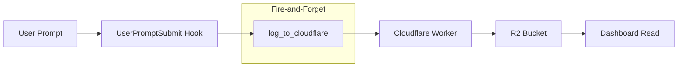

# Cloudflare R2 Prompt Logging

**Status**: Implemented
Cross-machine prompt logging system using Cloudflare R2 storage, enabling visibility into Claude Code activity across all machines/terminals.

## Workflow



## Components

### 1. Cloudflare Worker
**Location**: `~/dotfiles/scripts/cloudflare-prompts/`

- **Endpoint**: `https://prompt-logs.nicsuzor.workers.dev`
- **Routes**:
  - `POST /write` - accepts JSON or plain text
  - `GET /read` - returns all prompts chronologically
- **Auth**: Bearer token via `PROMPT_LOG_API_KEY`
- **Storage**: R2 bucket `prompt-logs`

### 2. UserPromptSubmit Hook Integration
**Location**: `$AOPS/hooks/user_prompt_submit.py`

- New function: `log_to_cloudflare(prompt)`
- **Pattern**: Fire-and-forget (subprocess.Popen, never blocks)
- **Payload**: prompt, hostname, cwd, project, timestamp (ISO UTC)
- **Failure mode**: Silent - hook never breaks if Cloudflare unreachable

### 3. Tests
**Location**: `$AOPS/tests/hooks/test_cloudflare_logging.py`

3 unit tests covering:
- Curl command construction with correct headers/payload
- Error handling (fire-and-forget behavior)
- Missing token graceful handling

## Environment Setup

Add to `~/.env`:
```bash
export PROMPT_LOG_API_KEY=<key>
```

## Implementation Status

| Component | Status | Notes |
|-----------|--------|-------|
| Cloudflare Worker | Implemented | `~/dotfiles/scripts/cloudflare-prompts/` |
| UserPromptSubmit hook | Implemented | Fire-and-forget pattern |
| Unit tests | Implemented | 3 tests in `tests/hooks/` |
| Dashboard integration | Planned | See [[cognitive-load-dashboard]] |

## Future Work

- Dashboard panel to read from R2 and display cross-machine activity
- LLM synthesis (Haiku) to cluster prompts by project/task
- Real-time activity view across all machines/terminals