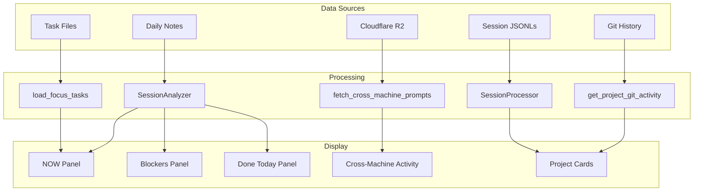

# Cognitive Load (Overwhelm) Dashboard

**Status**: Implemented
Live Streamlit [[academicOps/skills/dashboard/SKILL|Dashboard skill]] for glanceable task and session visibility.
- Feature of [[aops]]

## Workflow



## User Story

**As** Nic (academic with ADHD running parallel sessions across projects),
**I want** a live dashboard showing top tasks and real-time session activity,
**So that** I can glance from anywhere and know: what's important, what's happening, what's next.

## What This Spec Defines

**One thing**: The dashboard display layer that reads task files, session data, daily notes, and cross-machine activity.

## Data Sources

| Source | What it provides | Implementation |
|--------|------------------|----------------|
| Task files (`$ACA_DATA/tasks/`) | P0/P1 priority tasks | `load_focus_tasks()` |
| Session JSONLs | Real-time activity, todos, memory notes | `SessionProcessor` |
| Daily notes (`YYYYMMDD-daily.md`) | Focus, blockers, accomplishments | `SessionAnalyzer.parse_daily_log()` |
| Cloudflare R2 | Cross-machine prompts | `fetch_cross_machine_prompts()` |
| Git subprocess | Recent commits per project | `get_project_git_activity()` |

## Three-Question Layout

The dashboard answers three cognitive load questions:

1. **What should I do?** - Primary task + P0/P1 tasks with project tags
2. **What am I doing?** - LLM-synthesized session summaries grouped by project
3. **What did I do today?** - Accomplishments grouped by project

All sections group by project for context orientation.

### Synthesis-First Architecture
- Dashboard relies on [[session-insights-mining]] to produce [[daily notes]]
- UNLCEAR: And then _another_ component -- [[synthesize_dashboard.py]] -- generates [[synthesis.json]] 

Improvements to session-insights automatically flow to dashboard display. When synthesis is stale (>60 min), dashboard shows explicit error rather than falling back to raw data.

### Key Functions

| Function | Purpose |
|----------|---------|
| `get_dashboard_layout()` | Returns complete three-question data structure |
| `get_primary_focus()` | Gets primary task: daily log → synthesis → first P0 task |
| `get_todays_accomplishments()` | Aggregates from daily log, outcomes, git commits |
| `get_priority_tasks()` | Returns ALL P0/P1 active tasks with project info |
| `get_session_display_info()` | Extracts session identity for display |

### UX Principles

- **Raw data is not understandable** - Raw session prompts, commit hashes, task IDs mean nothing to users. LLM synthesis is essential.
- **Project context matters** - Grouping by project helps users orient quickly.
- **Limit information density** - Show top 3 P0, top 5 P1 with "X more" indicator rather than overwhelming.
- **Deduplication needed** - Primary task filtered from P0 list to avoid repetition.

## Dashboard Components

### NOW Panel
Primary focus from daily notes. Shows current task title, next action, and progress bar (subtasks done/total).

### Blockers Panel
Items marked as blockers in daily notes. Red-themed, prominent.

### Done Today Panel
Completed tasks and outcomes from daily notes. Green checkmarks.

### Cross-Machine Activity Panel
Recent prompts from all machines via Cloudflare R2. Grouped by hostname. Shows project context.

### Project Cards
Per-project view aggregating:
- Accomplishments (from daily notes)
- Priority tasks (from task files)
- Memory notes (from sessions)
- Git commits (from subprocess)

Color-coded by project (matches Peacock theme).

## Acceptance Criteria

- [x] **AC1**: Dashboard shows current task state from task files
- [x] **AC2**: Dashboard shows live session activity from session JSONLs
- [x] **AC3**: User can understand task state at a glance
- [x] **AC4**: Accessible on tablet via LAN (no auth needed)
- [x] **AC5**: Auto-refreshes (10 second interval)

## Design Principles

### Core User Need

**Context recovery during multitasking** - NOT decision support.

The user runs multiple concurrent workstreams (1-120 minute workflows) across terminals and machines. The fundamental problem is:

> "I can't remember what I was doing"

NOT:

> "I can't decide what to pick"

### Key Insight

User WANTS options visible - they can decide. Don't hide options or force single-directive mode. The issue is **amnesia during context switches**, not decision paralysis.

### Dashboard Must Answer

1. **What's running where?** - Multiple terminals, multiple projects, simultaneously
2. **Where did I leave off in project X?** - Per-project context recovery
3. **What's the state of Y?** - Quick status check without deep diving

### Requirements

- **Per-project context snapshots** - Last known state for each active workstream
- **Session identity** - Which terminal is which? Clear disambiguation
- **Glanceable status grid** - Scannable overview, not sequential reading
- **Quick re-entry support** - "I'm back in [project], remind me where I was"

### Anti-Patterns

- GPS/directive mode that hides options
- Single-focus design that ignores multitasking reality
- Over-indexing on "recommend ONE thing"
- Assuming decision paralysis when the problem is memory

## Non-Goals

- Task editing (read-only display)
- Terminal customization (separate problem)
- Authentication (local network only)
- Persistent storage (reads existing files)

---

## Session Context Panel (Implemented)

**Problem**: User returns to terminal and can't remember what they were doing.

**Solution**: Active Sessions panel shows per-session context using multiple signals.

### Data Flow

```
R2 (prompts) ──┬──> fetch_session_activity() ──> Active Sessions Panel
               │
Local JSONL ───┘   (combines prompt + TodoWrite state)
```

### Implementation

| Component | Location |
|-----------|----------|
| `parse_todowrite_state()` | `lib/session_reader.py` - Extract TodoWrite from entries |
| `extract_todowrite_from_session()` | `lib/session_analyzer.py` - Load from JSONL file |
| `fetch_session_activity()` | `skills/dashboard/dashboard.py` - Combine R2 + local |
| Active Sessions panel | `skills/dashboard/dashboard.py` - UI rendering |

### Display Format

```
📍 ACTIVE SESSIONS (3)

┌─────────────────────────────────────────────────────┐
│ abc1234 @ macbook | writing | 5m ago                │
│ "Review implementation plan..."                      │
│ ▶ Update dashboard session panel                    │
│ □ +3 pending                                        │
└─────────────────────────────────────────────────────┘
```

- **Session ID**: First 7 chars of UUID (monospace)
- **Meta**: hostname | project | time ago
- **Last prompt**: Most recent user prompt (truncated to 100 chars)
- **In-progress**: Current TodoWrite item (green, if available)
- **Pending**: Count of remaining todos (gray)

### Acceptance Criteria

- [x] Dashboard shows each active session (activity in last 2h) with last prompt
- [x] TodoWrite in_progress items shown when available
- [x] User can identify "that terminal was doing X" at a glance
- [x] 60-second cache to avoid repeated R2/filesystem calls

### Dependency

TodoWrite context only appears if agents use TodoWrite. Framework encourages this via system reminders.

---

## Technical

**Location**: `$AOPS/skills/dashboard/dashboard.py`

**Run**: `cd $AOPS && uv run streamlit run skills/dashboard/dashboard.py`

**Access**: `http://localhost:8501` or `http://<desktop-ip>:8501` from tablet

**Environment**: Requires `PROMPT_LOG_API_KEY` for cross-machine activity panel.

