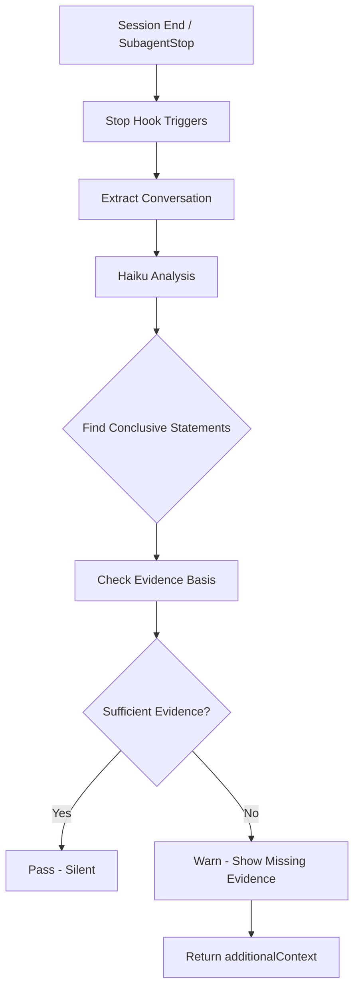

# Conclusion Verification Hook

**Status**: Draft

## Workflow



## Problem Statement

Agents make confident conclusive statements ("Confirmed: X", "The system does Y", "Your config will Z") based on incomplete verification - checking framework defaults, documentation, or capabilities rather than actual runtime state.

### Root Failure Pattern

**"Can it?" ≠ "Does it?"**

| Agent checked                | Should have checked          |
| ---------------------------- | ---------------------------- |
| Framework default value      | Actual config file           |
| Schema/model definition      | Actual table state           |
| Code capability exists       | Feature is enabled           |
| Environment variable defined | Variable is set correctly    |
| Tool exists in codebase      | Tool is installed/configured |

### Impact

- User trusts confident statements and acts on them
- Wasted compute, time, and trust when conclusions are wrong
- Pattern recurs despite being logged 10+ times in learning logs

## Proposed Solution

**Stop hook that uses a lightweight model (Haiku) to verify conclusive statements have sufficient evidential basis.**

### Design

1. **Trigger**: Stop hook (session end or SubagentStop)
2. **Detection**: Haiku scans conversation for conclusive statements
3. **Verification**: For each conclusion, check if actual state was inspected
4. **Output**: Warning if conclusions lack evidential basis

### Conclusive Statement Detection

Haiku looks for patterns indicating confident claims about runtime behavior:

```
- "Confirmed: ..."
- "The system does/will/is ..."
- "Your config/setup/environment ..."
- "Records ARE shuffled"
- "This is configured to ..."
- "X is enabled/disabled"
- Any statement about current behavior (not hypothetical)
```

### Evidence Requirements

For each conclusive statement, check if conversation contains:

1. **Read of actual config/state file** (not just source code)
2. **Command output showing runtime state** (not just capability)
3. **Explicit verification step** before the conclusion

### Verification Prompt (for Haiku)

```
Review this conversation for verification discipline.

TASK: Identify any CONCLUSIVE STATEMENTS about runtime behavior and check if they have sufficient evidential basis.

CONCLUSIVE STATEMENTS are confident claims about CURRENT state/behavior:
- "Confirmed: X"
- "Your system does/will Y"
- "This is configured to Z"
- "Records ARE shuffled" (not "can be" or "by default")

For each conclusive statement found:
1. What was claimed?
2. What evidence was provided BEFORE the claim?
3. Did evidence show ACTUAL state (config file, runtime output) or just DEFAULT/CAPABILITY?

CRITICAL DISTINCTION:
- Checking source code for default value = INSUFFICIENT
- Checking actual config file being used = SUFFICIENT
- Checking if feature exists = INSUFFICIENT
- Checking if feature is enabled in config = SUFFICIENT

Output JSON:
{
  "conclusions_found": [
    {
      "statement": "exact quote",
      "evidence_type": "actual_state | default_only | capability_only | none",
      "evidence_description": "what was checked",
      "verdict": "grounded | ungrounded"
    }
  ],
  "overall_verdict": "pass | warn",
  "warning_message": "string if warn, null if pass"
}
```

### Hook Behavior

**On pass**: Silent, no output
**On warn**: Return additionalContext with warning:

```
⚠️ VERIFICATION WARNING

The following conclusions may lack sufficient evidential basis:

1. "Confirmed: Records ARE shuffled"
   - Checked: Framework default (randomize=True in storage_config.py)
   - Missing: Actual config file (config/storage/ghc.yaml)

Before acting on these conclusions, verify actual runtime state.
```

### Non-blocking Design

- Hook always returns exit 0 (never blocks session end)
- Warning is informational, not enforced
- User sees warning and can decide to investigate

## Implementation

### File: `hooks/verify_conclusions.py`

```python
#!/usr/bin/env python3
"""
Stop hook: Verify conclusive statements have evidential basis.

Uses Claude Haiku to scan conversation for confident claims about runtime
behavior and check whether actual state (not just defaults/capabilities)
was verified before making the claim.

Exit codes:
    0: Always (non-blocking)
"""

import json
import os
import sys
from typing import Any

import anthropic

def extract_conversation(input_data: dict) -> str:
    """Extract conversation text from hook input."""
    # Hook receives transcript or can access session files
    transcript = input_data.get("transcript", "")
    if not transcript:
        # Try to read from transcript_path if provided
        path = input_data.get("transcript_path")
        if path and os.path.exists(path):
            with open(path) as f:
                transcript = f.read()
    return transcript

def verify_conclusions(transcript: str) -> dict:
    """Use Haiku to verify conclusions have evidential basis."""
    client = anthropic.Anthropic()

    prompt = """Review this conversation for verification discipline.

[PROMPT FROM SPEC ABOVE]

Conversation:
{transcript}
"""

    response = client.messages.create(
        model="claude-haiku-4-5-20241022",
        max_tokens=1024,
        messages=[{"role": "user", "content": prompt.format(transcript=transcript)}]
    )

    # Parse JSON response
    try:
        return json.loads(response.content[0].text)
    except:
        return {"overall_verdict": "pass", "conclusions_found": []}

def main():
    input_data = json.load(sys.stdin)

    transcript = extract_conversation(input_data)
    if not transcript:
        print(json.dumps({}))
        sys.exit(0)

    result = verify_conclusions(transcript)

    if result.get("overall_verdict") == "warn":
        output = {
            "hookSpecificOutput": {
                "additionalContext": result.get("warning_message", "")
            }
        }
        print(json.dumps(output))
    else:
        print(json.dumps({}))

    sys.exit(0)

if __name__ == "__main__":
    main()
```

### Configuration

Add to settings.json:

```json
{
  "hooks": {
    "Stop": [
      {
        "command": "PYTHONPATH=$AOPS AOPS=$AOPS ACA_DATA=$ACA_DATA uv run python $AOPS/hooks/verify_conclusions.py"
      }
    ]
  }
}
```

## Testing

### Unit Tests

1. Conclusive statement detection (regex/pattern matching)
2. Evidence classification (actual_state vs default_only)
3. JSON output format validation

### Integration Tests

1. **Grounded conclusion**: Agent reads actual config, makes claim → pass
2. **Ungrounded conclusion**: Agent reads defaults only, makes confident claim → warn
3. **No conclusions**: Purely exploratory session → pass
4. **Mixed**: Some grounded, some not → warn on ungrounded only

### Test Data

Use the actual failure case from today:

- Input: Session 4174881f transcript
- Expected: Warn on "Confirmed: Records ARE shuffled"
- Evidence: storage_config.py default checked, ghc.yaml NOT checked

## Risks and Mitigations

| Risk                                            | Mitigation                                           |
| ----------------------------------------------- | ---------------------------------------------------- |
| False positives (flagging grounded conclusions) | Tune prompt, allow user override                     |
| Cost (Haiku API calls)                          | Only runs at session end, short transcript excerpts  |
| Latency at session end                          | Async/background if needed                           |
| Over-reliance on automated check                | This is a safety net, not replacement for discipline |

## Success Criteria

1. Hook runs without blocking session end
2. Catches the specific failure pattern from today
3. No false positives on clearly grounded conclusions
4. Warning message is actionable (tells user what to verify)

## Open Questions

1. Should this also run on SubagentStop (for Task subagents)?
2. Should warnings be logged to learning file automatically?
3. Should there be a user-facing way to dismiss/acknowledge warnings?
4. What's the cost/latency budget for the Haiku call?

## Implementation Status

| Component            | Status      | Notes                           |
| -------------------- | ----------- | ------------------------------- |
| Hook script          | Not started | `hooks/verify_conclusions.py`   |
| Haiku prompt         | Designed    | See Verification Prompt section |
| settings.json config | Not started | Stop hook configuration         |
| Unit tests           | Not started | Pattern detection, JSON format  |
| Integration tests    | Not started | With real session data          |
