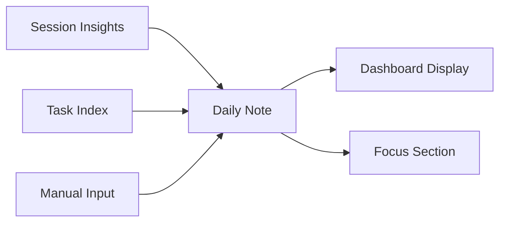

---
title: Daily Notes
type: spec
status: draft
permalink: daily-notes
tags:
- spec
- productivity
- daily-workflow
---

# Daily Notes

**Status**: Draft - needs more definition

## Workflow



## Purpose

Provides Nic with a single place to view priority tasks, progress, make notes, etc during the day.

**Produced by**: [[session-insights-skill]], manual input

### Daily Note Format (`YYYYMMDD-daily.md`)

```markdown
## Focus (user-set)
- Priority items and key context for today

## Today's story
- Synthesised insights from work completed today

## project-name
- [x] Completed task (accomplishment)
- [ ] Pending task

## another-project
- [x] Another accomplishment

## Session Log
| Session | Started | Hostname | Project | Activity |
...
```

Key structure: Focus section at top (user-set), accomplishments under project headers with `[x]` markers, session log table at end.

## Implementation Status

| Component | Status | Notes |
|-----------|--------|-------|
| Format definition | Defined | See format above |
| Auto-generation | Partial | Via session-insights |
| Dashboard integration | Implemented | [[dashboard-skill]] |
