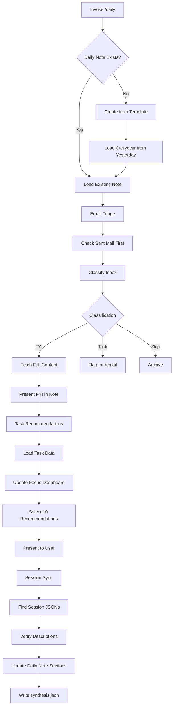

# Daily Skill

**Status**: Implemented
See [[skills/daily/SKILL.md]] for full implementation.

## Workflow



## Purpose

Manage the daily note lifecycle: morning briefing with email triage, task recommendations for focus, and session sync for progress tracking. The daily note is the single source of truth for daily work coordination.

## Problem Statement

Daily work coordination challenges:

- Email overwhelm obscures actionable items
- Task selection paralysis with large backlogs
- No visibility into daily progress across sessions
- Context lost between work sessions
- Manual overhead maintaining daily notes

Without systematic daily management:

- Important emails missed or delayed
- Work scattered without focus
- Accomplishments undocumented
- Carryover tasks forgotten

## Solution

A skill managing the complete daily note lifecycle with three core functions:

1. **Morning briefing**: Email triage and FYI presentation
2. **Task recommendations**: Smart selection across categories
3. **Session sync**: Progress aggregation from session JSONs

## How It Works

### Invocation

```
/daily
```

Or invoke skill directly:

```
Skill(skill="daily")
```

### Core Behaviors

**1. Daily Note Creation**

Location: `$ACA_DATA/sessions/YYYYMMDD-daily.md`

On creation:

- Use standard template (see SKILL.md for structure)
- Load previous day's daily note
- Copy incomplete tasks to "Carryover from Yesterday"
- Copy "Abandoned Todos" to carryover
- Note overdue items from yesterday's Focus Dashboard

**2. Email Triage (CRITICAL: Check Sent First)**

| Step | Action                                                                   |
| ---- | ------------------------------------------------------------------------ |
| 1    | Fetch sent mail (last 20)                                                |
| 2    | Fetch inbox (last 50)                                                    |
| 3    | Cross-reference: if inbox item has matching sent reply, classify as Skip |
| 4    | Classify remaining: FYI, Task, Skip, Uncertain                           |

Classification rules (LLM semantic, not keyword):

| Classification | Criteria                                                                        |
| -------------- | ------------------------------------------------------------------------------- |
| FYI            | Informational, no action needed, but should see before archiving                |
| Task           | Requires action AND no sent reply exists. Includes deliverables (attached docs) |
| Skip           | Automated, bulk, or already handled                                             |
| Uncertain      | Present to user for classification                                              |

**3. FYI Presentation**

Goal: User reads FYI content in daily note, not by opening emails.

- Group by conversation thread
- Fetch full content via `mcp__outlook__messages_get`
- Include actual content (quote short emails, summarize long)
- After presenting, ask which to archive

**4. Task Recommendations**

Load task data via `select_task.py`, then select ~10 recommendations across categories:

| Category | Selection Criteria                                                                  |
| -------- | ----------------------------------------------------------------------------------- |
| SHOULD   | Deadline/commitment pressure: overdue > due today > due this week > P0              |
| DEEP     | Long-term goal advancement: research, architecture, foundational work (>7 days out) |
| ENJOY    | Variety/energy: different project from today's work, creative tasks                 |
| QUICK    | Momentum builder: simple tasks, <15 min, approve/send/confirm type                  |
| UNBLOCK  | Remove impediments: blockers, dependencies, technical debt                          |

**5. Session Sync**

After sessions complete:

- Find session JSONs in `$ACA_DATA/dashboard/sessions/YYYYMMDD*.json`
- Extract accomplishments, timeline entries, skill compliance
- **Verify descriptions** (CRITICAL: cross-check against git log, actual changes)
- Update daily note sections via Edit tool (preserve existing content)
- Write `synthesis.json` for dashboard consumption

### Section Ownership

| Section                 | Owner  | Updated By             |
| ----------------------- | ------ | ---------------------- |
| Focus                   | User   | /daily workflow        |
| Today's Story           | /daily | Session JSON synthesis |
| Focus Dashboard         | /daily | Script output          |
| Session Log/Timeline    | /daily | Session JSON synthesis |
| Project Accomplishments | /daily | Session JSON synthesis |
| Abandoned Todos         | /daily | End-of-day             |

## Relationships

### Depends On

- Outlook MCP for email access
- [[tasks]] skill for task data and updates
- [[extractor]] for email content assessment (via /email)
- Session JSONs from session-insights

### Used By

- Morning startup workflow
- Mid-day check-ins
- End-of-day wrap-up
- Dashboard for synthesis.json consumption

### Framework Integration

Daily note is SSoT for daily coordination. Other skills read from but don't write to daily notes except through this skill.

## Success Criteria

1. **Email zero-touch**: FYI content readable without opening emails
2. **Sent-mail check**: No false Task flags for already-handled items
3. **Balanced recommendations**: All 5 categories represented when possible
4. **Verified sync**: Accomplishment descriptions match actual work (no Gemini hallucinations)
5. **Carryover captured**: Yesterday's incomplete work visible
6. **Single invocation**: Complete briefing in one /daily call

## Design Rationale

**Why check sent mail first?**

Prevents duplicate task creation. User may have already responded to an email before triage runs. Cross-referencing sent mail catches these cases.

**Why 5 recommendation categories?**

ADHD-friendly productivity: SHOULD handles obligations, DEEP advances goals, ENJOY provides energy, QUICK builds momentum, UNBLOCK removes friction. Balance prevents both burnout and stagnation.

**Why verify session descriptions?**

Gemini mining can hallucinate accomplishments. Per AXIOM #3, we don't propagate fabrications. Cross-checking against git log ensures accuracy.

**Why FYI in note, not email?**

Reduces context switching. Email clients encourage rabbit-holes. Presenting FYI content inline keeps user in daily note flow.

**Why synthesis.json?**

Enables dashboard consumption without parsing markdown. Structured data for Streamlit visualization.

## Axiom Derivations

| Axiom                     | Application                                        |
| ------------------------- | -------------------------------------------------- |
| #3 Don't Make Shit Up     | Verify session descriptions against actual changes |
| #5 Do One Thing           | Complete briefing in single invocation, then stop  |
| #26 Verify First          | Check sent mail before classifying inbox           |
| #43 Just-In-Time Context  | Surface relevant tasks/emails when starting day    |
| #46 Current State Machine | Daily note captures current day's state            |

## Error Handling

| Condition            | Behavior                                         |
| -------------------- | ------------------------------------------------ |
| Outlook unavailable  | Skip email triage, continue with recommendations |
| No session JSONs     | Skip sync, note "No sessions to sync"            |
| No tasks             | Present empty state, offer to run /tasks         |
| Previous day missing | Create fresh note without carryover              |
