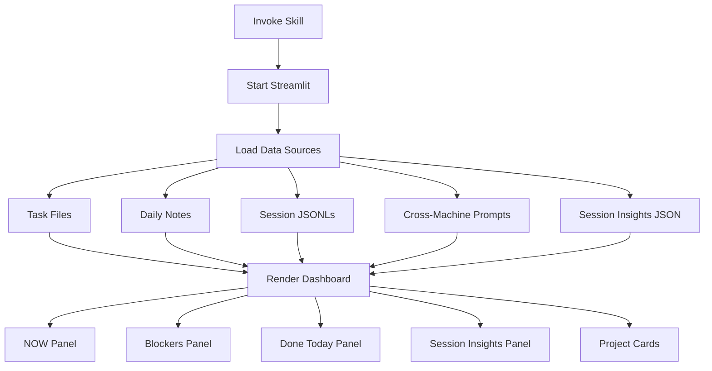

# Dashboard Skill

**Status**: Implemented
See [[skills/dashboard/SKILL.md]] for full implementation.

## Workflow



## Purpose

Provide live web dashboard for task visibility and session activity monitoring, accessible from desktop and mobile devices.

## Problem Statement

Task management visibility gaps:

- Tasks buried in terminal history
- No activity log when away
- Static Excalidraw dashboards don't auto-update
- No mobile/tablet access to task state
- No cross-machine session visibility

## Solution

Single Streamlit dashboard displaying high-priority tasks, session activity, and framework effectiveness metrics. Auto-refreshes, accessible via browser on any device.

## How It Works

### Invocation

```bash
cd $AOPS && uv run streamlit run skills/dashboard/dashboard.py
```

Access at http://localhost:8501 (desktop) or http://<ip>:8501 (mobile).

### Three-Question Layout

The dashboard answers three cognitive load questions:

1. **What should I do?** - Primary task + P0/P1 tasks with project tags
2. **What am I doing?** - LLM-synthesized session summaries grouped by project
3. **What did I do today?** - Accomplishments grouped by project

All sections group by project for context orientation.

### Dashboard Panels

**NOW Panel**: Current focus from daily notes (task, next action, progress bar)

**Blockers Panel**: Items marked as blockers (red-themed for visibility)

**Done Today Panel**: Completed tasks and outcomes

**Cross-Machine Activity Panel**: Recent prompts from all machines via Cloudflare R2

**Session Insights Panel**: Framework effectiveness metrics from Gemini analysis:

- Skill compliance rate
- Corrections count
- Failure categories
- Success patterns
- Top context gaps

**Project Cards**: Per-project view with accomplishments, priority tasks, memory notes, git commits

### Session Context Panel

**Problem**: User returns to terminal and can't remember what they were doing.

**Solution**: Active Sessions panel shows per-session context using multiple signals.

**Data Flow**:

```
R2 (prompts) ──┬──> fetch_session_activity() ──> Active Sessions Panel
               │
Local JSONL ───┘   (combines prompt + TodoWrite state)
```

**Display Format**:

```
📍 ACTIVE SESSIONS (3)

┌─────────────────────────────────────────────────────┐
│ abc1234 @ macbook | writing | 5m ago                │
│ "Review implementation plan..."                      │
│ ▶ Update dashboard session panel                    │
│ □ +3 pending                                        │
└─────────────────────────────────────────────────────┘
```

- **Session ID**: First 7 chars of UUID (monospace)
- **Meta**: hostname | project | time ago
- **Last prompt**: Most recent user prompt (truncated to 100 chars)
- **In-progress**: Current TodoWrite item (green, if available)
- **Pending**: Count of remaining todos (gray)

### Data Sources

| Source                | Implementation                                           |
| --------------------- | -------------------------------------------------------- |
| Task files            | `skills.tasks.task_loader.load_focus_tasks()`            |
| Session JSONLs        | `lib.session_reader.SessionProcessor`                    |
| Daily notes           | `lib.session_analyzer.SessionAnalyzer.parse_daily_log()` |
| Cross-machine prompts | Cloudflare R2 API                                        |
| Session Insights      | `$ACA_DATA/dashboard/insights.json`                      |
| Git activity          | `get_project_git_activity()` subprocess                  |

### Data Pipeline

```
Session JSONLs ──> Gemini script (batch, per-transcript)
                        │
                        └──> per-session structured data
                                      │
                                      ▼
                session-insights skill (Claude Code agent)
                        │
                        │  reads Gemini output + task index + R2 prompts
                        │  idempotently synthesizes:
                        │
                        ├──> YYYYMMDD-daily.md (human-readable)
                        └──> synthesis.json (machine-readable)

dashboard.py renders what's there (no LLM calls)
```

**Key points**:

- **Gemini** - reads transcripts, extracts structured per-session JSON (expensive work, done once)
- **Claude Code agent** - reads Gemini output ONLY (not transcripts), synthesizes/integrates
- **Idempotent** - skill can run from multiple machines, integrates rather than appends
- **Dual output** - same synthesis produces human-readable AND machine-readable formats
- **Dashboard is pure rendering** - no LLM calls, just displays pre-computed state

### Gemini Output Requirements

Gemini's per-session extraction must include enough for later synthesis:

- Session summary (what was worked on)
- Accomplishments (completed items)
- Learning observations (corrections, failures, successes)
- Skill compliance signals
- Context gaps identified

See [[skills/session-insights/]] for Gemini prompt and output format.

## Relationships

### Depends On

- [[tasks]] skill for task data loading
- [[skills/session-insights/]] skill for `insights.json` generation
- Streamlit for web rendering
- `lib/session_reader.py` for session parsing

### Used By

- Daily monitoring workflow
- Mobile/tablet task review
- Cross-machine activity tracking

### Integrates With

- Cloudflare R2 for cross-machine prompts (requires `PROMPT_LOG_API_KEY`)
- Peacock theme colors for project card styling

## Design Principles

### Core User Need

**Context recovery during multitasking** - NOT decision support.

The user runs multiple concurrent workstreams (1-120 minute workflows) across terminals and machines. The fundamental problem is:

> "I can't remember what I was doing"

NOT:

> "I can't decide what to pick"

### Key Insight

User WANTS options visible - they can decide. Don't hide options or force single-directive mode. The issue is **amnesia during context switches**, not decision paralysis.

### Dashboard Must Answer

1. **What's running where?** - Multiple terminals, multiple projects, simultaneously
2. **Where did I leave off in project X?** - Per-project context recovery
3. **What's the state of Y?** - Quick status check without deep diving

### UX Principles

- **Raw data is not understandable** - Raw session prompts, commit hashes, task IDs mean nothing. LLM synthesis is essential.
- **Project context matters** - Grouping by project helps users orient quickly.
- **Limit information density** - Show top 3 P0, top 5 P1 with "X more" indicator rather than overwhelming.

### Anti-Patterns

- GPS/directive mode that hides options
- Single-focus design that ignores multitasking reality
- Over-indexing on "recommend ONE thing"
- Assuming decision paralysis when the problem is memory

## Non-Goals

- Task editing (read-only display)
- Terminal customization (separate problem)
- Authentication (local network only)
- Persistent storage (reads existing files)

## Success Criteria

1. **Live updates**: Dashboard reflects current task state
2. **Mobile accessible**: Works on tablet/phone browsers
3. **Fast loading**: No Claude API calls in render path
4. **Cross-machine visibility**: Shows activity from all workstations
5. **Graceful degradation**: Missing data sources show empty panels, not errors

## Design Rationale

**Why Streamlit?**

Hot-reload development, built-in caching, responsive layout. Runs as local web server accessible from any device on the network.

**Why no Claude API?**

Dashboard renders frequently. API calls would add latency and cost. Pre-computing insights via session-insights skill (with Gemini) decouples analysis from display.

**Why Cloudflare R2?**

Cross-machine visibility requires shared storage. R2 provides S3-compatible API with global edge caching, accessible from any workstation.
