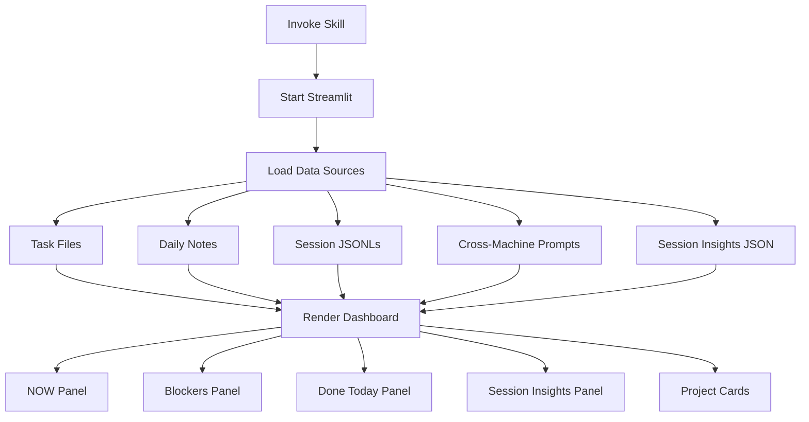

# Dashboard Skill

**Status**: Implemented
See [[skills/dashboard/SKILL.md]] for full implementation.

## Workflow



## Purpose

Provide live web dashboard for task visibility and session activity monitoring, accessible from desktop and mobile devices.

## Problem Statement

Task management visibility gaps:
- Tasks buried in terminal history
- No activity log when away
- Static Excalidraw dashboards don't auto-update
- No mobile/tablet access to task state
- No cross-machine session visibility

## Solution

Single Streamlit dashboard displaying high-priority tasks, session activity, and framework effectiveness metrics. Auto-refreshes, accessible via browser on any device.

## How It Works

### Invocation

```bash
cd $AOPS && uv run streamlit run skills/dashboard/dashboard.py
```

Access at http://localhost:8501 (desktop) or http://<ip>:8501 (mobile).

### Dashboard Panels

**NOW Panel**: Current focus from daily notes (task, next action, progress bar)

**Blockers Panel**: Items marked as blockers (red-themed for visibility)

**Done Today Panel**: Completed tasks and outcomes

**Cross-Machine Activity Panel**: Recent prompts from all machines via Cloudflare R2

**Session Insights Panel**: Framework effectiveness metrics from Gemini analysis:
- Skill compliance rate
- Corrections count
- Failure categories
- Success patterns
- Top context gaps

**Project Cards**: Per-project view with accomplishments, priority tasks, memory notes, git commits

### Data Sources

| Source | Implementation |
|--------|----------------|
| Task files | `skills.tasks.task_loader.load_focus_tasks()` |
| Session JSONLs | `lib.session_reader.SessionProcessor` |
| Daily notes | `lib.session_analyzer.SessionAnalyzer.parse_daily_log()` |
| Cross-machine prompts | Cloudflare R2 API |
| Session Insights | `$ACA_DATA/dashboard/insights.json` |
| Git activity | `get_project_git_activity()` subprocess |

### No Claude API Calls

**CRITICAL**: Dashboard does NOT call Claude API. Session Insights come from pre-computed `insights.json` created by [[session-insights]] skill via Gemini. This keeps the dashboard fast.

## Relationships

### Depends On
- [[tasks]] skill for task data loading
- [[session-insights]] skill for `insights.json` generation
- Streamlit for web rendering
- `lib/session_reader.py` for session parsing

### Used By
- Daily monitoring workflow
- Mobile/tablet task review
- Cross-machine activity tracking

### Integrates With
- Cloudflare R2 for cross-machine prompts (requires `PROMPT_LOG_API_KEY`)
- Peacock theme colors for project card styling

## Success Criteria

1. **Live updates**: Dashboard reflects current task state
2. **Mobile accessible**: Works on tablet/phone browsers
3. **Fast loading**: No Claude API calls in render path
4. **Cross-machine visibility**: Shows activity from all workstations
5. **Graceful degradation**: Missing data sources show empty panels, not errors

## Design Rationale

**Why Streamlit?**

Hot-reload development, built-in caching, responsive layout. Runs as local web server accessible from any device on the network.

**Why no Claude API?**

Dashboard renders frequently. API calls would add latency and cost. Pre-computing insights via session-insights skill (with Gemini) decouples analysis from display.

**Why Cloudflare R2?**

Cross-machine visibility requires shared storage. R2 provides S3-compatible API with global edge caching, accessible from any workstation.
