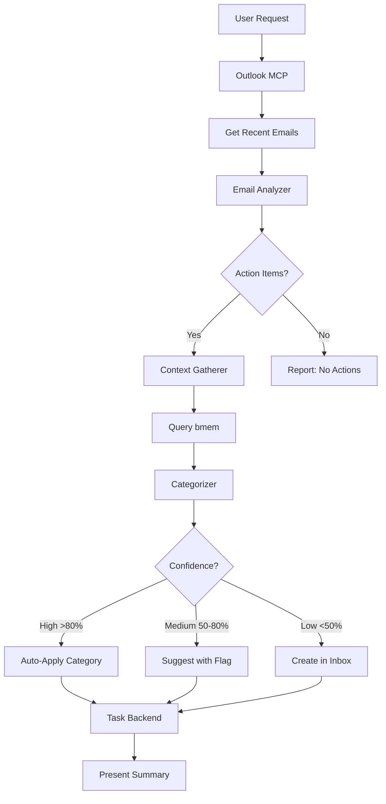

# Email to Tasks Workflow

**Status**: Draft (E2E validated, production-ready with task scripts)
**Priority**: P1 (critical missing automation)

## Workflow



## User Stories

### US1: Email to Tasks Automation

**As** Nic (academic receiving action-heavy emails about OSB votes, reviews, travel, deadlines),
**I want** action items automatically extracted from my email and filed as properly categorized tasks,
**So that** I never have to manually create tasks after reading email, context isn't lost, and nothing falls through the cracks.

### US2: Interactive Task Completion

**As** Nic (reviewing completed work and clearing my task list),
**I want** to type `/tasks` and be presented with a Claude-native input prompt that reads from task_view JSON and presents me a list of all tasks that I might have already completed, with a checkbox next to each, for me to select ones that have actually been completed,
**So that** I can efficiently archive multiple completed tasks and their associated emails in a single interaction without manually archiving them one by one.

## Acceptance Criteria

### AC for US1: Email to Tasks Automation

- [ ] **Zero manual task creation from email** - "Check my email for tasks" creates task files automatically (or asks to confirm)
- [ ] **Smart categorization using bmem context** - Tasks are properly categorized to projects with >80% high-confidence matches
- [ ] **Full email context preserved** - Tasks link back to source email (entry_id, subject, sender, date)
- [ ] **Agent knows when to invoke** - Workflow skill activates without explicit prompting for relevant requests
- [ ] **Confidence-based handling**:
  - High-confidence (>80%): Auto-apply categorization
  - Medium (50-80%): Suggest with flag for review
  - Low (<50%): Create in inbox with #needs-categorization tag
- [ ] **Fail-fast on errors** - Email access errors or task creation failures halt immediately with clear messages

### AC for US2: Interactive Task Completion

- [ ] **Slash command invocation** - `/tasks` command triggers interactive task completion workflow
- [ ] **Task list presentation** - Reads from task_view.py JSON output and displays all inbox tasks
- [ ] **Checkbox interface** - Uses Claude-native input prompts (AskUserQuestion multiSelect) to present tasks with checkboxes
- [ ] **Multi-select completion** - User can select multiple tasks that have been completed
- [ ] **Batch archiving** - Selected tasks are archived via task_archive.py in a single operation
- [ ] **Email archiving** - Associated source emails are also archived/moved when tasks are archived
- [ ] **Confirmation feedback** - User receives clear confirmation of archived tasks and emails

## Context & Problem

**Current pain point**: When Nic asks "check my email for tasks", the agent currently:

1. Queries Outlook MCP
2. Presents a summary of action items
3. **STOPS** ← This is where the workflow breaks

What should happen:

1. Query Outlook MCP
2. Analyze emails for action items using bmem context
3. Create task files in data/tasks/inbox/ via task backend
4. Link tasks to relevant projects/context
5. Present summary with created tasks

**Why this matters**:

- Email is a primary source of urgent tasks (OSB votes, reviews, travel, deadlines)
- Manual task creation after email review breaks flow and leads to dropped items
- ADHD accommodation requires zero-friction capture
- Context (what project, why urgent, related work) gets lost between email and task

**Who benefits**: Nic gets automatic task capture from email with proper categorization and linking, zero manual filing required.

## Key Design Decision: Pluggable Backend

**Architecture**: Workflow is backend-agnostic, can use either:

- **Task scripts** (task_add.py) - available NOW for immediate deployment
- **Tasks MCP** - future replacement when ready

**Why this matters**:

- No dependency on Tasks MCP for initial deployment
- Can test and refine workflow immediately using working task scripts
- Side-by-side validation when migrating to MCP
- Easy rollback if MCP has issues

**Phases**:

1. **Phase 1-2** (11-16h): Email → Tasks workflow using existing task_add.py script - DEPLOYABLE NOW
2. **Phase 3** (+4-7h): Optional MCP migration when Tasks MCP ready
3. **Phase 4**: Auto-creation with MCP primary, scripts fallback

## Success Metrics

**Quality threshold**:

- High-confidence categorizations (>80%) auto-apply
- Medium-confidence (50-80%) suggest with flag for review
- Low-confidence (<50%) create in inbox with #needs-categorization tag
- Fail-fast on email access errors or task creation failures

## Scope

### In Scope

**US1: Email to Tasks Automation**

- Agent skill for email → task workflow
- Bmem integration for context-aware categorization
- **Pluggable task backend** (switchable between task scripts and Tasks MCP)
- Task creation via backend abstraction layer
- Email metadata linking (entry_id, subject, sender, received date)
- Priority inference from email signals (ACTION REQUIRED, deadlines, sender importance)
- Project/tag assignment based on content analysis
- Agent training: when to invoke skill, how to orchestrate tools

**US2: Interactive Task Completion**

- `/tasks` slash command
- Task list reader using task_view.py JSON output
- Claude-native checkbox UI using AskUserQuestion with multiSelect
- Batch task archiving via task_archive.py
- Associated email archiving/moving via Outlook MCP
- Confirmation and feedback messaging

### Out of Scope

- Calendar deadline integration (future enhancement)
- Email auto-archiving after task creation (separate workflow)
- Task dependencies/relationships (future enhancement)
- Multi-language support (English only initially)
- Attachment processing (link to email, don't extract)

**Boundary rationale**: This skill orchestrates existing MCP tools (Outlook, bmem, Tasks). It's the "connective tissue" that makes them work together for a specific workflow. Each tool remains independent. The task backend abstraction allows testing and deployment before Tasks MCP is ready.

## Integration Test Design

### Test Setup

```bash
# Prepare test environment
# - Start Tasks MCP server in test mode (or prepare task_add.py script)
# - Prepare test email data (mock Outlook responses)
# - Prepare test bmem context (projects, goals)

# Test email scenarios:
# 1. OSB vote email (high priority, clear project)
# 2. Review request (medium priority, may need context)
# 3. Travel confirmation (low priority, administrative)
# 4. Ambiguous email (unclear action, needs categorization help)
```

### Test Execution

```bash
# Invoke skill with test email data
# Expected: Skill orchestrates tools in correct order

# Test 1: High-confidence categorization
# Input: OSB vote email
# Expected: Task created with priority=P0, project=oversight-board, tags=[osb, vote, urgent]

# Test 2: Medium-confidence categorization
# Input: Review request from unknown sender
# Expected: Task created with #needs-review tag, suggested project

# Test 3: Low-confidence categorization
# Input: Ambiguous email
# Expected: Task created in inbox with #needs-categorization

# Test 4: Multiple action items in one email
# Expected: Multiple tasks created, all linked to same email

# Test 5: No action items detected
# Expected: No tasks created, summary states "no actions found"
```

### Test Validation

```bash
# Verify tasks created
ls data/tasks/inbox/*.md | wc -l  # Count should match action items

# Verify frontmatter correct
grep "priority: P0" data/tasks/inbox/osb-vote-*.md
grep "source_email:" data/tasks/inbox/*.md  # All should have email link

# Verify categorization
grep "project: oversight-board" data/tasks/inbox/osb-vote-*.md

# Verify bmem context was used
# (Check logs show bmem query executed before task creation)
```

### Test Cleanup

```bash
# Remove test tasks
rm -rf data/tasks/inbox/test-*

# Reset bmem test context
# (Restore original projects/goals if modified)
```

### Success Conditions

- [ ] Test initially fails (skill doesn't exist yet)
- [ ] High-confidence categorization works correctly
- [ ] Medium-confidence flagging works correctly
- [ ] Low-confidence creates needs-categorization tasks
- [ ] Multiple actions per email handled
- [ ] No false positives (non-action emails don't create tasks)
- [ ] Email metadata properly linked
- [ ] Test is idempotent
- [ ] Test cleanup leaves no artifacts

## Implementation Details

### High-Level Design

**Components**:

1. **Email Analyzer**: Extracts action items from email content
2. **Context Gatherer**: Queries bmem for relevant projects/goals
3. **Categorizer**: Matches actions to projects with confidence scores
4. **Priority Inferrer**: Determines task priority from email signals
5. **Task Backend Abstraction**: Pluggable interface for task creation
   - Scripts backend: Calls task_add.py with formatted data
   - MCP backend: Calls Tasks MCP tools
6. **Agent Skill**: Ties components together, handles user interaction, selects backend

**Data Flow**:

```
User Request ("check email for tasks")
  ↓
Outlook MCP: Get recent emails
  ↓
Email Analyzer: Extract action items + metadata
  ↓
For each action:
  ↓
  Context Gatherer: Query bmem for relevant context
  ↓
  Categorizer: Match to projects (with confidence)
  ↓
  Priority Inferrer: Determine urgency
  ↓
  Task Backend: Create task (via scripts OR MCP, configurable)
  ↓
Present summary to user
```

**Backend Selection**:

- Check for Tasks MCP availability
- Fall back to task_add.py script if MCP not available
- Same data format regardless of backend
- Transparent to workflow - agent doesn't care which backend used

### Technology Choices

**Language/Tools**: Agent skill (markdown documentation) + optional Python backend adapter

**Libraries**:

- Optional: Simple Python adapter class if backend switching needs code support
- Prefer: Agent-level logic in skill documentation (check MCP, else use scripts)

**Rationale**: Skills are documentation that agents follow. Backend abstraction can be documentation-only (agent tries MCP, falls back to scripts on failure) or thin Python wrapper (if switching logic becomes complex). Start with documentation-only approach.

### Error Handling Strategy

**Fail-fast cases** (halt immediately):

- Email access fails (Outlook MCP error)
- Both task backends unavailable (MCP down AND scripts missing)
- Task creation fails in both backends (format/validation error)
- bmem query fails critically

**Graceful degradation cases** (best effort):

- Tasks MCP unavailable → fall back to task_add.py script
- bmem context unavailable → create task with #needs-categorization
- Low confidence categorization → flag for manual review
- Ambiguous priority → default to P2 (normal) with note

**Recovery mechanisms**:

- Log all failed operations to data/logs/task-capture-errors.jsonl
- Log which backend was used (MCP or scripts) for debugging
- Partial success OK (some tasks created, others failed) - report clearly
- User can manually create tasks for failed extractions

## Dependencies

### Required Infrastructure

- **Task backend** (one of):
  - Task scripts (bots/skills/tasks/scripts/*.py) - available NOW for immediate testing
  - Tasks MCP server (see: 2025-11-11_task-mcp-server.md) - future replacement
- Outlook MCP (already exists)
- bmem MCP (already exists)
- Agent skill framework (already exists)
- Session start context loading (already exists)

### Data Requirements

- bmem context includes:
  - Active projects (data/projects/*.md)
  - Current goals (data/goals/*.md)
  - Sender importance/relationships (can infer from email history)
- Email metadata from Outlook MCP:
  - entry_id, subject, from_name, from_email, received, body, has_attachments
- Task format (backend-agnostic):
  - Frontmatter fields + markdown body (obsidian-compatible bmem format)
  - Same format for both scripts and MCP backends

## Rollout Plan

### Phase 1: Validation (Experiment) - Scripts Backend

- **Start with task scripts** (available immediately, no MCP dependency)
- Implement skill with test emails
- Test categorization with real bmem context (Nic's actual projects)
- Run on 50 historical emails, measure accuracy
- Document in experiment log

**Criteria to proceed**: >80% high-confidence categorizations, <10% false positives, user approval

### Phase 2: Limited Deployment - Scripts Backend

- Deploy skill using task_add.py backend
- Require user confirmation before creating tasks: "I found 3 action items: [list]. Create tasks? (y/n)"
- Monitor for 2 weeks, collect feedback
- Refine categorization based on patterns

**Criteria to proceed**: 2 weeks of reliable operation, user comfortable with auto-creation

### Phase 3: MCP Migration (Optional)

- **When Tasks MCP ready**: Update skill to prefer MCP, fall back to scripts
- Test side-by-side (verify both backends create identical tasks)
- Gradual rollout: MCP for new tasks, scripts as backup
- Monitor for 1 week with both backends available

**Criteria to proceed**: MCP reliability >99%, no format discrepancies

### Phase 4: Full Deployment

- Auto-create tasks (user can still review/modify after)
- Primary backend: MCP (if available), fallback: scripts
- Reduce logging to summary only
- Mark as production in framework

**Rollback plan**:

- Phase 1-2: Disable skill in session start context, revert to manual task creation
- Phase 3-4: Disable MCP backend (fall back to scripts), or disable entire skill
- No data loss in any rollback scenario (tasks already created remain)

## Timeline Estimate

**Phase 1-2 (Scripts backend, no MCP dependency)**:

- **Design and specification**: 2 hours (DONE)
- **Skill documentation**: 2-3 hours
- **Integration test development**: 2-3 hours
- **Testing with real data**: 2-3 hours
- **Refinement based on testing**: 2-3 hours
- **Documentation**: 1-2 hours
- **Total Phase 1-2**: 11-16 hours

**Phase 3 (MCP migration, when ready)**:

- **Backend abstraction implementation**: 1-2 hours
- **Side-by-side testing**: 2-3 hours
- **Migration validation**: 1-2 hours
- **Total Phase 3**: 4-7 hours

**Grand Total**: 15-23 hours (but Phase 1-2 deployable independently)

**Confidence level**: High for Phase 1-2 (scripts exist, bmem exists, Outlook MCP exists). Medium for Phase 3 (depends on Tasks MCP completion).

## Failure Modes

### What Could Go Wrong?

1. **Failure mode**: Categorization quality too low (too many manual corrections)
   - **Likelihood**: Medium
   - **Impact**: High (defeats purpose if manual work remains)
   - **Mitigation**: Start with conservative thresholds (high-confidence only), expand as we validate; use bmem semantic search rather than keyword matching; collect correction data to improve
   - **Prevention**: Err on side of over-extraction, user can delete easier than recreate

2. **Failure mode**: Email action extraction misses nuanced requests
   - **Likelihood**: Medium
   - **Impact**: Medium (tasks not captured)
   - **Mitigation**: Err on side of over-extraction; prompt engineering for action detection; use bmem to understand context
   - **Prevention**: User feedback collection for missed items

3. **Failure mode**: Workflow too slow (multiple MCP calls per email)
   - **Likelihood**: Low
   - **Impact**: Medium (user waits too long)
   - **Mitigation**: Batch operations where possible, parallel MCP calls, acceptable latency is ~5-10 seconds for full email check
   - **Prevention**: Optimize critical path operations

4. **Failure mode**: Task scripts format inconsistency blocks workflow
   - **Likelihood**: Low (scripts already migrated to .md format)
   - **Impact**: Medium (would need to fix scripts first)
   - **Mitigation**: Validate task_add.py works with bmem format before starting workflow implementation; abstraction layer handles any format quirks
   - **Prevention**: Test thoroughly with scripts backend before deploying

5. **Failure mode**: Backend switching adds complexity
   - **Likelihood**: Low (abstraction is simple: try MCP, else scripts)
   - **Impact**: Low (minimal code, mostly documentation)
   - **Mitigation**: Start documentation-only (agent tries both), add code wrapper only if needed
   - **Prevention**: Keep abstraction minimal and transparent

## Monitoring and Validation

### How do we know it's working in production?

**Metrics to track**:

- Tasks created per email check (should be 2-5 typically)
- Categorization confidence distribution (aim for >60% high-confidence)
- Manual recategorization rate (target <20%)
- False positive rate (non-action emails → tasks, target <5%)
- False negative rate (harder to measure, requires user feedback)

**Monitoring approach**:

- Log all task creation events to data/logs/task-capture.jsonl
- Include: email subject, action extracted, categorization confidence, project assigned
- Weekly review: Check confidence distribution, recategorization patterns
- User feedback: "Did I miss anything?" after each email check

**Validation frequency**: Continuous logging, weekly manual review, monthly pattern analysis

## Documentation Requirements

### Code Documentation

- [ ] Skill documentation in bots/skills/tasks/workflows/email-capture.md
- [ ] Backend selection logic (try MCP, fall back to scripts)
- [ ] Decision tree for when to invoke skill
- [ ] Examples of high/medium/low confidence categorizations
- [ ] Troubleshooting guide for common issues (including backend failures)

### User Documentation

- [ ] Update bots/CORE.md with email → task workflow
- [ ] Add to session start context (agent knows to invoke for "check email for tasks")
- [ ] Document manual override process (user can reject/modify before creation)
- [ ] Add examples to ACCOMMODATIONS.md (zero-friction capture pattern)

### Maintenance Documentation

- [ ] Log format specification
- [ ] How to analyze categorization patterns
- [ ] How to improve bmem context for better matching
- [ ] Future enhancements (calendar integration, email archiving)

## Risks and Mitigations

**Risk 1**: Categorization quality too low (too many manual corrections)

- **Likelihood**: Medium
- **Impact**: High (defeats purpose if manual work remains)
- **Mitigation**: Start with conservative thresholds (high-confidence only), expand as we validate; use bmem semantic search rather than keyword matching; collect correction data to improve

**Risk 2**: Email action extraction misses nuanced requests

- **Likelihood**: Medium
- **Impact**: Medium (tasks not captured)
- **Mitigation**: Err on side of over-extraction, user can delete easier than recreate; prompt engineering for action detection; use bmem to understand context

**Risk 3**: Workflow too slow (multiple MCP calls per email)

- **Likelihood**: Low
- **Impact**: Medium (user waits too long)
- **Mitigation**: Batch operations where possible, parallel MCP calls, acceptable latency is ~5-10 seconds for full email check

**Risk 4**: Task scripts format inconsistency blocks workflow

- **Likelihood**: Low (scripts already migrated to .md format)
- **Impact**: Medium (would need to fix scripts first)
- **Mitigation**: Validate task_add.py works with bmem format before starting workflow implementation; abstraction layer handles any format quirks

**Risk 5**: Backend switching adds complexity

- **Likelihood**: Low (abstraction is simple: try MCP, else scripts)
- **Impact**: Low (minimal code, mostly documentation)
- **Mitigation**: Start documentation-only (agent tries both), add code wrapper only if needed

## Open Questions

1. Should skill ask for confirmation before creating tasks, or auto-create and notify?
   - **Initial decision**: Ask for confirmation (Phase 2), auto-create once validated (Phase 3)

2. How to handle email threads (multiple messages, same subject)?
   - **Decision**: Treat each message independently initially, deduplicate based on source_email entry_id

3. What if user wants to check specific email account vs. all accounts?
   - **Decision**: Default to all accounts, support "check QUT email for tasks" for specific account

4. How granular should action extraction be? (One task per email vs. multiple per email)
   - **Decision**: Support multiple tasks per email (some emails contain several distinct actions)

5. Should we archive/move emails after task creation?
   - **Decision**: Out of scope for MVP, separate workflow later

## Completion Checklist

- [ ] All success criteria met and verified
- [ ] Integration test passes reliably (>95% success rate)
- [ ] All failure modes addressed
- [ ] Documentation complete (code, user, maintenance)
- [ ] Experiment log entry created
- [ ] No documentation conflicts introduced
- [ ] Code follows AXIOMS.md principles (fail-fast, DRY, explicit)
- [ ] Monitoring in place and working
- [ ] Rollout plan executed successfully
- [ ] Framework ROADMAP.md updated with progress

## Post-Implementation Review

[After 2 weeks of production use]

**What worked well**: [To be completed after deployment]

**What didn't work**: [To be completed after deployment]

**What we learned**: [To be completed after deployment]

**Recommended changes**: [To be completed after deployment]
