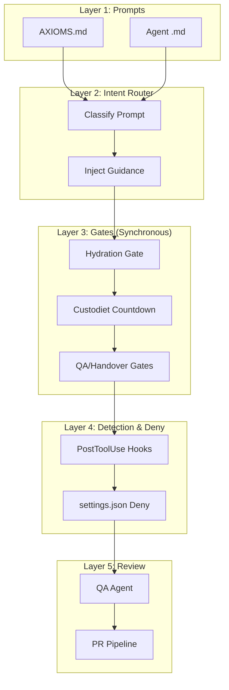

# Enforcement Architecture

**Status**: Implemented (core concepts active)

## Giving Effect

- [[aops-core/hooks/router.py]] - Central hook router and state manager
- [[aops-core/lib/gates/registry.py]] - Registry for all active enforcement gates
- [[aops-core/lib/gates/definitions.py]] - Declarative gate configurations (Hydration, Custodiet, QA, etc.)
- [[aops-core/lib/gates/engine.py]] - Generic gate engine executing triggers and policies
- [[aops-core/AXIOMS.md]] - Layer 1: Immutable principles loaded at session start
- [[aops-core/hooks/user_prompt_submit.py]] - Layer 2: Prompt hydration and intent routing
- [[aops-core/agents/custodiet.md]] - Layer 2.5: Drift detection and axiom violation checking
- [[aops-core/hooks/policy_enforcer.py]] - Layer 4: PostToolUse pattern detection hooks
- [[aops-core/hooks/gate_config.py]] - Gate mode and tool category configuration
- [[aops-core/agents/qa.md]] - Layer 5: Independent verification agent
- [[aops-core/framework/enforcement-map.md]] - Registry of all active enforcement mechanisms

## Enforcement Model

**Purpose**: Architectural philosophy for why enforcement works the way it does. For practical mechanism selection, see [[ENFORCEMENT|docs/ENFORCEMENT.md]]. For current active rules, see [[RULES]].

How the aops framework influences agent behavior. We cannot force compliance - only create encouragement with detection.

## The Hard Truth

**We cannot force agent behavior.** Claude Code has no mechanism to prevent an agent from skipping steps. Any "enforcement" is actually "encouragement with detection."

**But prompt injection IS enforcement.** "Soft" doesn't mean "not real." Prompt-level rules (Level 1 in the enforcement ladder) are the most common enforcement mechanism. When we say a rule is "enforced via CORE.md injection at SessionStart," that IS the enforcement. Don't dismiss it as "no enforcement" just because there's no blocking hook.

**The knowing-doing gap**: Agents read AXIOMS, understand them, and still skip steps due to:

- Efficiency pressure (verification takes tokens)
- Confidence from pattern-matching
- No immediate consequence
- Helpful instinct to appear competent

## Layer Defense Model

No single layer is reliable. We combine:

### Layer 1: Prompts (Instruction Surface)

| Location  | Loaded When   | Scope         |
| --------- | ------------- | ------------- |
| AXIOMS.md | Session start | Universal     |
| Agent .md | Agent spawned | Task-specific |

**Limitation**: Agents can read and ignore.

### Layer 2: Prompt Hydration (Soft Gate)

The [[specs/prompt-hydration]] process classifies prompts and suggests workflows.

**What it does**: Injects context, classification, and task-specific guidance
**What it can't do**: Force agent to follow guidance

#### Hydration Gate (Mechanical Enforcement)

**Gate**: `hydration` (PreToolUse)
**Status**: Active (warn-only mode by default)

Blocks/warns when agent attempts to use tools before invoking prompt-hydrator subagent.

**Gate Behavior**:

- **Warn mode** (default, `HYDRATION_GATE_MODE=warn`): Logs warning to stderr, allows tool use
- **Block mode** (`HYDRATION_GATE_MODE=block`): Blocks all tools (exit code 2) until hydrator invoked

**Bypass Conditions**:

- Subagent sessions (`is_subagent` in HookContext) - subagents inherit hydration from parent
- Infrastructure tools (`get_task`, `create_task`, etc.) - allows framework initialization
- Always available tools (`AskUserQuestion`, `TodoWrite`) - allows communication and planning
- Compliance agents (`prompt-hydrator`, `custodiet`, etc.) - allows enforcement itself to run

**Implementation**: `aops-core/lib/gates/definitions.py` defines the hydration gate. It starts `CLOSED` on `UserPromptSubmit` and opens `JIT` when the `prompt-hydrator` is dispatched.

### Layer 2.5: JIT Compliance Audit

Periodic compliance checking at strategic checkpoints.

#### User Intervention Priority

On every `UserPromptSubmit`, the instruction includes:

> If this prompt is a correction, suggestion, or redirection from the user while you were working on something else: **HALT your current work immediately**.

This addresses the "steamroller" pattern where agents continue planned work instead of responding to user corrections.

#### Periodic Compliance Check (Custodiet)

**Gate**: `custodiet` (PreToolUse)
**Status**: Active (warn mode by default)

Tracks tool calls and demands a compliance check after a threshold (default: 50).

**Implementation**: `aops-core/lib/gates/engine.py` manages a countdown. When `ops_since_open >= threshold`, the gate triggers a warning or block on mutating tools (Edit, Write, Bash).

**What it does**: Catches drift and violations mid-execution before user has to intervene
**What it can't do**: Force agent to follow corrections (still relies on agent compliance)

### Layer 3: Observable Checkpoints

TodoWrite and Plan Mode create visible artifacts user can review.

**What this enables**: User sees if verification steps exist, creates paper trail
**Limitation**: Agent can skip entirely

### Layer 4: Detection & Deny

- **PostToolUse Hooks**: Detect patterns like claims without evidence or diagnosis without reading.
- **Deny Rules**: Hard blocks in `settings.json` or policy engines for sensitive paths (e.g., `~/.claude/*.json`).

### Layer 5: Post-Hoc Verification

- **QA Agent**: Independent subagent verifies work against original request and acceptance criteria.
- **Handover Gate**: Blocks session exit until a valid Framework Reflection is provided and `/dump` is run.

## User Expectations

The enforcement system ensures framework compliance through real-time gating and diagnostic feedback. Users can expect the following behaviors:

### 1. Hydration Enforcement

- **Expectation**: Every new user prompt or session start must be hydrated by the `prompt-hydrator` before any non-infrastructure tools (Read, Edit, etc.) are used.
- **Behavior**: If the agent skips hydration, the system will warn (default) or block tool use. The gate opens automatically when the hydrator subagent is dispatched.
- **Verification**: Attempting a `Read` or `Edit` immediately after a user prompt without invoking the hydrator should trigger a `HYDRATION_GATE` warning or block.

### 2. Periodic Compliance Audits (Custodiet)

- **Expectation**: Agents are subject to periodic compliance checks to detect drift and axiom violations.
- **Behavior**: After 50 tool calls (default), the system warns or blocks mutating tools (Edit, Write, Bash) until the `custodiet` subagent verifies the session. A countdown (e.g., "◇ 5") appears in the gate status strip as the threshold approaches.
- **Verification**: Performing 50+ tool calls without a compliance check should trigger the `CUSTODIET_GATE` policy.

### 3. Session-End Verification (QA & Handover)

- **Expectation**: A session cannot be closed until work is verified and documented.
- **Behavior**: The `Stop` event is blocked if:
  - A "Framework Reflection" is missing or malformed in the agent's response. *(Handover gate — active)*
  - The `/dump` skill has not been run (if a task was bound to the session). *(Handover gate — active)*
  - The `/qa` skill (or `qa` agent) has not been invoked to verify results. *(QA gate — planned, not yet enforced: gate starts OPEN and has no closing trigger)*
- **Verification**: Running `Stop` without a Framework Reflection or `/dump` should return a `HANDOVER_GATE` block. The `QA_GATE` block is not yet active.

### 4. Commitment Safety

- **Expectation**: No work is left uncommitted or unpushed upon session exit.
- **Behavior**: The system blocks session exit if uncommitted changes exist in the repository. It warns if there are unpushed commits.
- **Verification**: Modifying a file and attempting to exit without committing should trigger the `COMMIT_GATE` block.

### 5. Path & Credential Protection

- **Expectation**: Critical framework files and user credentials are isolated from agent modification.
- **Behavior**: Writes to protected paths (e.g., `.claude/settings.json`, `$AOPS/aops-core/hooks/`) are blocked via `settings.json` deny rules. Agents operate with a limited-scope GitHub PAT and no SSH agent access.
- **Verification**: Attempting to write to `~/.claude/settings.json` should be blocked by the underlying client or a hard deny rule.

### 6. Transparent Gate Status

- **Expectation**: Users and agents can see the current state of enforcement gates.
- **Behavior**: A status icon strip (e.g., `💧 ◇ 12 ▶ aops-123`) is appended to system messages, indicating pending hydration, custodiet countdowns, and active task bindings.
- **Verification**: The icon strip should appear in the system message of every hook response where gates are active.

## Verification: The Top Failure Pattern

**"Can it?" ≠ "Does it?"**

Agents conflate capability with actual state:

| Agent checked           | Should have checked |
| ----------------------- | ------------------- |
| Framework default value | Actual config file  |
| Code capability exists  | Feature is enabled  |
| Tool exists             | Tool is configured  |

**Evidence Types** (require actual_state for conclusions):

- `actual_state` - Config files read, runtime output captured
- `default_only` - Only defaults checked
- `capability_only` - Only documented capabilities
- `none` - No evidence gathered

## Design Principles

1. **Layer defenses** - No single mechanism reliable
2. **Prefer observable over invisible** - TodoWrite/Plan create artifacts
3. **Accept imperfection** - Influence, not force
4. **Measure before changing** - Track compliance first
5. **Least invasive first** - Conventions before gates

## Component Responsibilities

When failures occur, we distinguish:

- **PROXIMATE CAUSE**: Agent made a mistake (non-deterministic, outside our control)
- **ROOT CAUSE**: Framework component failed its responsibility (deterministic, within our control)

> Root Cause = Component did not provide what it promised, OR did not block what it promised, OR did not detect what it promised.

### Root Cause Categories

| Category          | Definition                                             |
| ----------------- | ------------------------------------------------------ |
| Clarity Failure   | Instruction ambiguous or insufficiently emphasized     |
| Context Failure   | Component didn't provide relevant information          |
| Blocking Failure  | Component didn't block what it should have             |
| Detection Failure | Component didn't catch violation it should have        |
| Gap               | No component exists for this case - need to create one |

**Note**: Multiple categories can apply (defense-in-depth failed at multiple layers).

### Responsibilities by Phase

#### Pre-Execution Phase

| Component             | Responsibility                                                | Verification                                          |
| --------------------- | ------------------------------------------------------------- | ----------------------------------------------------- |
| AXIOMS/HEURISTICS     | Rules stated unambiguously with reasoning                     | Each rule has single interpretation + WHY             |
| Intent Router         | Correct classification, relevant context, workflow suggestion | Classification matches human judgment                 |
| Guardrails            | Task-specific emphasis applied                                | Guardrails in output match task type table            |
| Intervention Reminder | User corrections take priority over in-progress work          | Agent halts current work on user intervention         |
| Compliance Auditor    | Detect principle violations mid-execution                     | Check fires at threshold, returns relevant violations |

#### Execution Phase

| Component         | Responsibility                       | Verification                            |
| ----------------- | ------------------------------------ | --------------------------------------- |
| Agent Abstraction | Correct behavior when agent followed | Agent execution produces correct output |
| PreToolUse Hooks  | Block prohibited operations          | Hook fires on known bad input           |
| Tool Restriction  | Wrong tools unavailable              | Tool not in allowed list                |

#### Post-Execution Phase

| Component         | Responsibility                       | Verification                     |
| ----------------- | ------------------------------------ | -------------------------------- |
| PostToolUse Hooks | Detect violations, demand correction | Hook detects violation in output |
| Deny Rules        | Absolute prevention                  | Operation blocked                |
| Pre-Commit Hooks  | Block prohibited commits             | pre-commit run catches violation |

### Root Cause Analysis Protocol

When analyzing a failure:

1. **Was there a rule?** Check AXIOMS/HEURISTICS for applicable rule
2. **Did router suggest correct workflow?** Check hydrator output
3. **Did agent follow workflow?** If yes, was output correct?
4. **Should PreToolUse have blocked?** Check hook rules
5. **Should PostToolUse have detected?** Check detection hooks
6. **Should deny rule have blocked?** Check settings.json
7. **Should pre-commit have caught?** Check .pre-commit-config.yaml

If all components met their responsibilities but failure still occurred: **Gap** - create new enforcement at appropriate level.
