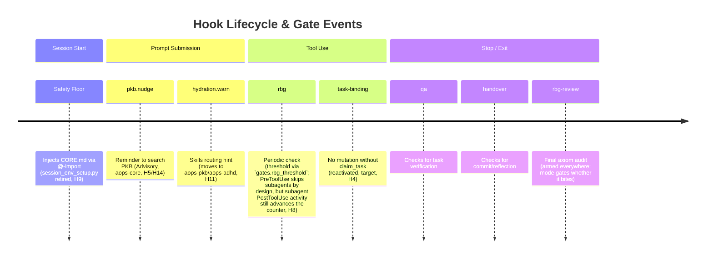

# Gates — runtime catalogue and forensic reference

**Scope.** Single source of truth for the gates that fire at session time through the academicOps hook router. Each gate section opens with a TL;DR answer card, then expands into where it lives, how it's configured, how to verify firing, and how to debug.

**Doc category.** State, per the doc-taxonomy spec (brain PKB). Kept beside the other framework-wide state docs (`AXIOMS.md`, `SURFACES.md`, `HEURISTICS.md`).

**What is NOT here.**

- **Pyramid-position assignments, axiom mapping, escalation rules** — see the enforcement map (repo-level SSoT for the L0–L7 regulatory pyramid; `rbg` blocks on it via P#65).
- **Hook router architecture, MCP wiring, hook I/O schemas, PATH bootstrap** — see [`aops-core/skills/aops/references/hooks.md`](../../aops-core/skills/aops/references/hooks.md).
- **JSONL log schema, raw-file forensics procedures** — see [`aops-core/skills/aops/references/forensics-details.md`](../../aops-core/skills/aops/references/forensics-details.md).
- **Design rationale (why the gate system is shaped this way)** — see [`specs/enforcement/enforcement.md`](enforcement.md) and [`specs/agents/rbg.md`](../agents/rbg.md).
- **Per-gate design rationale (why a given gate exists, the class of failure it defends against)** — lives in the respective agent spec: `ida` → [`specs/agents/ida.md`](../agents/ida.md#honesty-at-stop--the-ida-gate); `rbg` and `rbg-review` → [`specs/agents/rbg.md`](../agents/rbg.md#gate-rationale-what-each-surface-defends); gates without an agent spec → [`specs/enforcement/enforcement.md`](enforcement.md). GATES.md holds the operational state (what / where / config / verify / debug).

## At a glance

| Gate         | What it catches                                          | Fires on           | Close trigger                                                                                      | Open trigger       |
| ------------ | -------------------------------------------------------- | ------------------ | -------------------------------------------------------------------------------------------------- | ------------------ |
| `rbg`        | Periodic compliance / ultra-vires drift                  | PreToolUse         | tool calls >= `gates.rbg_threshold` (explicit, required — see [Config plumbing](#config-plumbing)) | call RBG           |
| `rbg-review` | Final rbg axiom audit before a task-bound session exits  | Stop               | claim_task                                                                                         | call RBG           |
| `qa`         | "Done" claimed without verification                      | Stop               | claim_task                                                                                         | Skill(verify)      |
| `handover`   | Exit without commit / task update / reflection           | Stop               | claim_task                                                                                         | Skill(End Session) |
| task-binding | Work without a bound task (**reactivated**, target — H4) | PreToolUse (write) | claim_task                                                                                         | —                  |

**`ida` gate — disposition OPEN, not retired.** See [§ `ida` gate](#ida-gate) below.

Schema lives in [`lib/polecat_config.py`](../../aops-core/lib/polecat_config.py); each `GateConfig` is defined in [`lib/gates/definitions.py`](../../aops-core/lib/gates/definitions.py); mode resolution happens in [`hooks/gate_config.py`](../../aops-core/hooks/gate_config.py). **Session scope policy (H8/H12, PreToolUse exception permanent as of aops_571771b4)**: gates fire uniformly across main sessions, subagents, and workers — the previous blanket skip of PostToolUse evaluation for subagent-attributed events is retired — except PreToolUse, which stays skipped for subagent-classified sessions as a deliberate, permanent exception, not a still-pending target — see [Subagent & worker session scope](#subagent--worker-session-scope) below.

**Reserved name.** `hydration` is accepted in the `gates.*` config schema (`HYDRATION_GATE_MODE`) but **has no `GateConfig` today** — the visible hydration behaviour (skills-routing hint on UPS) runs unconditionally in the router. See [Reserved names](#reserved-names-hydration) at the bottom.

**Historical name.** `custodiet` was the previous name for the `rbg` gate. Old references to `custodiet_*` env vars or the `custodiet` gate map one-to-one onto `rbg`.

**`sticky_until` (engine feature).** A `GateTransition` can carry `sticky_until: list[str]` — a list of hook events that will "unstick" the gate. When such a transition fires, the engine sets `gate.sticky = True` in GateState and suppresses any subsequent transition targeting a _different_ status. When any event in the `sticky_until` list fires, the engine clears the sticky latch before evaluating triggers, so the same event can fire a normal re-arm transition. Used by the QA and handover gates to keep the gate OPEN after verification/handover until UserPromptSubmit.

---

## Lifecycle and Gate Events Timeline

### Two-mode Stop-gate contract (client-agnostic)

This is the canonical statement every gate's "shared Stop-gate mechanics" link points to. Stop-gate firing is driven by the `GateStatus` latch + observable session state — **never** by `raw_input.stop_hook_active` (a Claude/Gemini-only flag that agy never sends; the router-level global bypass that keyed on it has been **deleted**).

**Only `block` mode forces a continuation.** `block` emits `DENY`: the client is prevented from stopping and the agent must act before it can exit. `warn` emits `WARN`: the advisory is delivered to the agent's context for its next turn (on Claude, non-blockingly via `hookSpecificOutput.additionalContext`) without forcing a retry — the agent may act on it or genuinely stop. This is a real behavioral difference, not just a re-fire-latch difference: a `warn` gate no longer compels anything.

**Known limitation.** No available channel can BOTH deliver separate messages to the agent and the user AND force a continuation on Stop — `decision:"block"`+`reason` is the only channel that forces a retry, and it delivers the same text to both audiences (see the per-client table below). If a future client channel supported both, block-mode gates should switch to it; until then this is the accepted trade-off for enforcement.

| Mode / gate                | Verdict | Re-fire behavior                                                                                                                                                                                      | Escape-hatch threshold (consecutive unsatisfied Stops/turn) |
| :------------------------- | :------ | :---------------------------------------------------------------------------------------------------------------------------------------------------------------------------------------------------- | :---------------------------------------------------------- |
| `warn` (any gate)          | `WARN`  | Fire-once: delivers once, then a warn-mode `Stop→OPEN` trigger latches the gate open so a retried Stop passes without re-delivering; re-arms on `UserPromptSubmit`.                                   | n/a — fire-once already bounds it                           |
| `block` (`qa`, `handover`) | `DENY`  | Persist-until-satisfied: no fire-once; re-DENYs every Stop until a satisfaction trigger opens it (verifier ran / rbg ran / handover ran).                                                             | 3 (engine default)                                          |
| `block` (`rbg-review`)     | `DENY`  | Same persist-until-satisfied behavior as above.                                                                                                                                                       | 5                                                           |
| `ida` (`block`)            | `DENY`  | Fire-once-**loud**, not persist — ida has no satisfaction predicate (there is no "ida ran" event to open the gate later), so even block mode can only force one continuation, not an open-ended loop. | n/a                                                         |
| `ida` (`warn`)             | `WARN`  | Fire-once, non-blocking — same mechanics as any other warn-mode gate.                                                                                                                                 | n/a                                                         |

The escape-hatch counter (block mode only) resets on `UserPromptSubmit` — the loop it bounds is within-turn (Stop → forced-continue → Stop …); a new user turn is new work and gets a fresh budget. Once the threshold is hit, the DENY downgrades to `WARN`-and-allow (loud, not silent).

**Per-client delivery of a BLOCK-mode DENY:**

| Client | Verdict delivery                                                                                                | Forces a retry?                                                                       |
| :----- | :-------------------------------------------------------------------------------------------------------------- | :------------------------------------------------------------------------------------ |
| Claude | `decision:"block"` + `reason` (JSON payload — exit code is not a decision channel, it is hardcoded to 0)        | Yes                                                                                   |
| Gemini | `AfterAgent` `decision:"deny"` + `reason`                                                                       | Yes                                                                                   |
| agy    | Best-effort advisory `injectSteps` — live-proven to reach the model, not the user (`ephemeralMessage` U✗/C✓/P✗) | Provisional — `terminationBehavior` hard-block is unmeasured (`AGY_STOP_PROVISIONAL`) |

Loop safety is gate-owned (fire-once latch + `stop_deny_count`, block mode only) plus the residual client-agnostic 5-blocks-in-2-min override.



Honesty/criterion-substitution checking (the `ida` gate, Stop + PreToolUse `AskUserQuestion`) is omitted from this timeline for brevity, not because it was retired — see [§ `ida` gate](#ida-gate) for its disposition.

## Hook-event coverage & UserPromptSubmit origin diagnostic

Known open issue: the `rbg-review` gate can re-arm in interactive head sessions with no human prompt visible (see the `rbg-review` gate's "Gate re-arms with NO human prompt visible" debug row above). The diagnostic instrumentation below identifies WHAT re-arms it; it does not fix the re-arm.

- **Every Claude Code hook event is subscribed and logged, log-only.** `aops-core/hooks/hooks.json` registers all 30 events the installed client emits (`vQ` enum backing the settings.json `hooks` schema; SSoT copy: `client_spec.CLAUDE_ALL_EVENTS`). 10 have a `router._call_gate_method` branch (PreToolUse/PostToolUse/UserPromptSubmit/SessionStart/Stop/SessionEnd/SubagentStart/SubagentStop/PreCompact/Notification). The other 20 (`PostToolUseFailure`, `PostToolBatch`, `UserPromptExpansion`, `StopFailure`, `PostCompact`, `PermissionRequest`, `PermissionDenied`, `Setup`, `TeammateIdle`, `TaskCreated`, `TaskCompleted`, `Elicitation`, `ElicitationResult`, `ConfigChange`, `WorktreeCreate`, `WorktreeRemove`, `InstructionsLoaded`, `CwdChanged`, `FileChanged`, `MessageDisplay`) have NO gate branch — `_call_gate_method`'s if/elif chain falls through to `return None`, so they are inert by construction (exit 0, no block) and reach `main()`'s `log_hook_event` call exactly like any handled event. Re-verify the 30-event set against `extension.js` on a Claude Code version bump — it is observed, not guaranteed stable.
- **A missing/`"unknown"` `session_id` never silently drops the log entry.** `unified_logger.log_hook_event` routes those events to a global fallback sink (`~/.claude/hooks-fallback.jsonl`, override via `AOPS_HOOK_FALLBACK_LOG`), tagged `"session_id_missing": true`.
- **UserPromptSubmit diagnostic enrichment.** Every UPS log line's `output.metadata.ups_diagnostic` carries: `prompt_id` (Claude Code ≥2.1.196; `None` elsewhere — absence is itself signal), `prompt_preview` (first 80 chars), `prompt_length`, `is_task_notification` (the `router._is_task_notification` result), and `gate_transitions` — every gate whose trigger fired on this event (`gate`, `hook_event`, `trigger_index`, `from_status`/`to_status`, `status_changed`). Captured on BOTH `execute_hooks()` branches: the task-notification short-circuit (`gate_transitions` always `[]` there — no gates run) and the normal gate-dispatch fall-through (where `rbg-review`'s unconditional UPS trigger, and any other gate's, actually shows up). This is the mechanism behind the `rbg-review` gate's verification query above — see there for a live example and the leading unverified hypothesis.
- **Gate-transition capture is engine-level**, not UPS-specific: `GenericGate._evaluate_triggers` (`aops-core/lib/gates/engine.py`) records a transition whenever a trigger's condition matched and its transition applied — even when `from_status == to_status` (e.g. `rbg-review` re-closing an already-`CLOSED` gate), because "did this event cause the trigger to fire" is the diagnostic question, not just "did the status visibly flip". `router._dispatch_gates` collects one entry per contributing gate into `CanonicalHookOutput.metadata["gate_transitions"]` for every event, not only UserPromptSubmit; `ups_diagnostic.gate_transitions` on a UPS line is the same list, just also folded into the UPS-specific blob for convenience.

## Config plumbing

**Standing rule, all gates (H3).** Posture — armed/disarmed, on/off, which mode a surface runs in — is expressed **only** through the env-var / `polecat.yaml` plumbing described in this section. No gate anywhere in this catalogue may branch its mode on session-type, on/off flags, or other state code in the repo — this generalises the constraint `rbg-review` states explicitly in its own TL;DR to every gate below.

Every gate's mode resolves from a `*_GATE_MODE` environment variable, read lazily by [`hooks/gate_config.py`](../../aops-core/hooks/gate_config.py). Resolution has exactly two steps and no third (note_296e5520 §4, DEFAULTS-NONE universal): (1) the env var, if a launcher already staged it; (2) `polecat.yaml`'s explicit `face` section, resolved by `gate_config.py` itself, for any caller that reaches this module without going through a launcher. There is NO hardcoded fallback default — if polecat.yaml cannot be located or is missing a required key, this HARD-FAILS. For polecat/crew containers, the polecat launcher reads `polecat.yaml`, selects the matching surface section (`crew` or `worker` — a complete, self-contained section, not an overlay), and stages the resolved env vars into the container before the session starts — the source repo never resolves modes itself at runtime. See `gate_config.py` for the full variable list and the `__getattr__` resolution mechanics.

**Explicit threshold required when the `rbg` gate is enabled, in EVERY surface section.** `polecat.yaml`-loaded config has no fallback: `_validate_gates` (`aops-core/lib/polecat_config.py`) hard-fails with `missing required gates.rbg_threshold` if the key is absent from any of the four surface sections — per that module's `DEFAULTS — NONE` policy (A14, fail-fast), now universal rather than polecat-only. For **direct CLI sessions** (Claude Code or Gemini without polecat), no launcher sets the env vars; `gate_config.py` resolves `polecat.yaml`'s `face` section itself and hard-fails if it cannot (missing/unlocatable/malformed file) — there is no more built-in-values fallback for this path. Set the env vars in your shell profile, or edit `polecat.yaml`'s `face:` section, to configure a direct CLI session's posture.

### Per-surface sections (polecat sessions)

`polecat.yaml` carries four explicit, independently-required, non-overlaid sections — `face`, `crew`, `worker`, `subagent` (note_296e5520 §4; no "session_defaults"/"crew_defaults"/"run_defaults" naming). The section selected is picked by the **dispatch subcommand** (`polecat crew` vs `polecat run`), resolved on the host AT DISPATCH by `polecat/cli.py` / `lib/polecat_config.py` (`PolecatConfig.for_surface(...)`). The container never self-identifies with a session-type label — it receives the already-resolved `*_GATE_MODE` env vars:

| Dispatch       | Section resolved (self-contained, no overlay)                            | Surfaces                                        |
| -------------- | ------------------------------------------------------------------------ | ----------------------------------------------- |
| `polecat crew` | `polecat.yaml:crew`                                                      | `polecat crew` interactive multi-agent sessions |
| `polecat run`  | `polecat.yaml:worker`                                                    | `polecat run` autonomous workers                |
| direct CLI     | `polecat.yaml:face`, resolved directly by `gate_config.py` (no launcher) | Direct CLI sessions (not polecat-launched)      |

For direct CLI sessions, polecat is not involved and the hook code resolves `polecat.yaml`'s `face` section itself (hard-failing if it can't). Separately, the container is marked with `AOPS_POLECAT_CONTAINER=1` (a resolved operational signal, not a policy selector); `SessionState` derives its `session_type` (`crew` if `POLECAT_CREW_NAME` is also set, else `polecat`) from it. This value is descriptive only (transcript metadata, forensics) — **no gate trigger, policy, or initial-status anywhere consults it**. Every gate has exactly one `initial_status` and one set of triggers, identical for every session type; per-surface differences exist ONLY because a different `*_GATE_MODE` value is in effect for that surface (via `polecat.yaml`'s matching section or, for a direct CLI session, its own `.claude/settings.json`/shell profile). Gate **modes** are never inferred from `session_type` — they arrive pre-resolved.

### Plugin cache lifecycle

The aops-core plugin (and therefore the gates code) runs from a versioned cache directory at runtime, not directly from the source repo on the host:

- **Claude Code on host**: `~/.claude/plugins/cache/academicOps/aops-core/<ver>/` — Claude.app picks the most recent versioned dir; **does not garbage-collect older ones**. Stale dirs are a known trap (see [`SURFACES.md`](../SURFACES.md) → "Claude Code CLI on host" → Known traps).
- **WSL crew container / polecat run**: `dist/aops-claude/` baked into the Docker image at build time. Pinned at image build until the image is rebuilt.
- **GHA runner**: agent prompt from `.github/agents/*.md`; no plugin runtime — gates do not fire.

To verify the cached copy matches source: `diff -ru ~/src/academicOps/aops-core/lib/gates/ ~/.claude/plugins/cache/academicOps/aops-core/<latest>/lib/gates/`.

### Hook env stripping (cross-cutting trap)

On Claude Code CLI on host (Mac, WSL host shell): the `env` block in CLI settings does **not** reliably propagate to hook subprocesses (`launchctl setenv` ignored; `.zshenv` partially sourced but `PATH` overridden). Gate-mode env vars set there may not reach the hooks. For direct CLI sessions, set gate env vars in your shell profile (`~/.zshenv`, `~/.bashrc`) instead, so they are in the process environment before Claude Code launches. See [`SURFACES.md`](../SURFACES.md) → "Claude Code CLI on host" → Known traps for the full trace.

The WSL crew container and polecat-launched sessions receive env directly from the polecat launcher; no `launchctl`/`.zshenv` hop, so this trap does not apply there.

### Verifying the resolved mode at runtime

```bash
python -c '
import os, sys
sys.path.insert(0, "/path/to/aops-core")
from hooks.gate_config import (
    RBG_GATE_MODE, QA_GATE_MODE, HANDOVER_GATE_MODE,
    HYDRATION_GATE_MODE, IDA_GATE_MODE, RBG_TOOL_CALL_THRESHOLD,
)
print(f"rbg={RBG_GATE_MODE} threshold={RBG_TOOL_CALL_THRESHOLD}")
print(f"qa={QA_GATE_MODE} handover={HANDOVER_GATE_MODE}")
print(f"ida={IDA_GATE_MODE} hydration={HYDRATION_GATE_MODE}")
'
```

If this fails, `polecat.yaml` is missing/unreadable or `$AOPS_SESSIONS` is unset — the same trap that causes gates to silently fail.

---

## Subagent & worker session scope

**Current state (aops_571771b4).** Gates fire **uniformly** for every session — main, dispatched subagent, or headless worker — for every event **except PreToolUse**, which stays skipped for subagent-classified sessions. This is a deliberate, permanent exception: `rbg` carries a blocking PreToolUse policy, and several subagent types (e.g. Explore, Plan) have no Agent-tool access to satisfy a compliance-block demand — blocking them on PreToolUse would be an unrecoverable deadlock, not enforcement (aops-55bcf1a2). `rbg` is the only `PreToolUse`-triggered gate, and it continues to skip a subagent's/worker's own tool calls at PreToolUse — its blocking behaviour stays scoped to the main session. PostToolUse fires uniformly regardless of `is_subagent`: ops-counter increments and other PostToolUse triggers run for subagent-classified sessions too, so a genuine Task-tool subagent's work still advances the `rbg` threshold even though it can't itself be PreToolUse-blocked. `GenericGate.on_tool_use` excludes `COMPLIANCE_SUBAGENT_TYPES` (rbg/marsha) from that increment specifically, so a compliance subagent's own internal reads can't inflate the counter its dispatch already resets (aops-d8ee59cc / aops-55bcf1a2 Bug 2). `is_subagent` is detected from several signals — explicit flag, `agent_id`/`agent_type` fields, a short-hex session ID, a `/subagents/` transcript path (`lib/hook_utils.py:is_subagent_session`).

**Worker posture override (agy).** `AOPS_AGY_CLIENT=1` — set only by `polecat/cli.py` when launching a `polecat run --model antigravity` worker — forces `is_subagent=True` for that worker's entire life so it gets the same PreToolUse skip as a real subagent (a headless agy worker has no human able to action an interactive compliance prompt); the flag also carries session-type observability labelling.

---

## `rbg` gate

> **TL;DR.** Periodic compliance check. Counts write-tool calls since the last reset; when the count reaches `gates.rbg_threshold` (explicit config key — see [Config plumbing](#config-plumbing) for when a fallback applies), the next non-infrastructure tool call fires a PreToolUse policy that dispatches the `rbg` subagent. The PreToolUse policy itself still skips subagent-classified sessions (a deliberate, permanent exception — see [Subagent & worker session scope](#subagent--worker-session-scope)), but its counter now advances uniformly on PostToolUse across main sessions, subagents, and workers (H8/H12; PreToolUse exception made permanent by aops_571771b4). Defined in [`lib/gates/definitions.py`](../../aops-core/lib/gates/definitions.py). Mode key: `gates.rbg`. Design rationale + class-of-failure: [`specs/agents/rbg.md`](../agents/rbg.md#gate-rationale-what-each-surface-defends).

### What is it

The periodic-compliance gate. Counts write operations since the last rbg audit; when the count reaches `gates.rbg_threshold`, the gate's PreToolUse policy fires on the next non-infrastructure tool call. The policy renders a compliance report from the session transcript into a temp file and instructs the agent to invoke the `rbg` subagent. A successful dispatch resets the counter.

**Design rationale + class of failure caught.** Live in the [rbg spec](../agents/rbg.md#gate-rationale-what-each-surface-defends).

### The audit file — how it's built and what it contains

`prepare_compliance_report` (`aops-core/lib/gates/custom_actions.py`) calls `create_audit_file(session_id, "rbg", ctx, bound_task_id=...)`, which:

1. **Locates the file** at a predictable per-gate, per-session path via `get_gate_file_path` (`lib/session_paths.py`).
2. **Builds the content** by parsing the live session transcript (`ctx.transcript_path`) and windowing it to the last `gates.rbg_threshold + 2` turns (`build_audit_session_context` — the `+2` overlaps the previous window so no turn is skipped between consecutive rbg fires, without re-sending the whole session). Renders through the `rbg.context` template, falling back to the plainer `rbg.audit` template if rich rendering fails.
3. **Prepends the bound task's directive** (title + body) when a task is claimed, so the reviewing `rbg` subagent can check the session stayed on-target and within authority.
4. **Appends a coverage sentinel** (`<!-- audit-complete: N turns -->`) as the last line — the `rbg` subagent's own audit procedure `tail -3`s the file to detect a truncated read (aops-e4e90f31, #1976).
5. **Redacts known secrets** (`lib/secret_redaction.redact_secrets`) before writing.

This is the same builder the `rbg-review` gate uses (see below) — one windowed context, two dispatch points (per-cadence PreToolUse, end-of-session Stop).

### Where it lives

| Concern                  | Path                                                                                                            |
| ------------------------ | --------------------------------------------------------------------------------------------------------------- |
| Gate definition (config) | `aops-core/lib/gates/definitions.py` (`GateConfig(name="rbg", ...)`, mode key `gates.rbg`)                      |
| Threshold + mode lookup  | `aops-core/hooks/gate_config.py` (`RBG_TOOL_CALL_THRESHOLD`, `RBG_GATE_MODE`)                                   |
| Audit-file builder       | `aops-core/lib/gates/custom_actions.py` (`create_audit_file`, `prepare_compliance_report`)                      |
| Templates                | `aops-core/hooks/templates/rbg-{audit,context,countdown,instruction,policy-context,policy-message,verified}.md` |
| Compliance subagent      | `aops-core/agents/rbg.md`                                                                                       |

Subagent dispatches matching `^(aops[-_](core|pkb)[:_])?rbg$` reset the counter via the gate's trigger.

### How it's configured

- **Mode key**: `gates.rbg` (see [Config plumbing](#config-plumbing) for resolution). `warn` | `block` | `off`.
- **Threshold** (write ops between checks): `gates.rbg_threshold` — required, no default, under `polecat.yaml`; `gate_config.py` falls back to 50 only for direct-CLI sessions with no launcher (see [Config plumbing](#config-plumbing)).
- **Countdown window**: 7 ops before threshold (`start_before=7` in the `CountdownConfig` literal — not currently in YAML).
- **Tool-category exclusions**: `infrastructure`, `always_available`, `read_only` tools do not trip the policy (`TOOL_CATEGORIES` in `gate_config.py`).
- **Mid-edit deferral**: while a TodoWrite has an `in_progress` item, the block is deferred via the `not_mid_edit` custom check (`custom_conditions.py`).

### How to verify it's firing

```bash
# Live counter (since session start or last check)
jq -r 'select(.hook_event=="PostToolUse") | .output.system_message // empty' \
  ~/.claude/projects/*/$(ls -1t ~/.claude/projects/*/ | head -1)*-hooks.jsonl \
  | grep -E '◇|Compliance check' | tail -5

# Find PreToolUse blocks where the rbg gate denied
grep '"hook_event":"PreToolUse"' <hooks.jsonl> \
  | jq -r 'select(.output.verdict=="deny") | "\(.logged_at) \(.tool_name): \(.output.system_message[:120])"'

# Count compliance dispatches (SubagentStart for rbg)
grep '"hook_event":"SubagentStart"' <hooks.jsonl> \
  | jq -r 'select(.subagent_type|test("rbg"))' | wc -l
```

**Healthy fire**: PreToolUse with `tool_name` ≠ infrastructure/read-only, `output.verdict="deny"` (mode `block`) or `"warn"`, system_message starting with `✕ Compliance check required` or carrying the `rbg.policy_context` template. SubagentStart with `subagent_type` matching `rbg` clears the counter.

**Visible icons** (`format_gate_status_icons` in `router.py`): `◇ N` during countdown window, `◇` when over threshold.

### How to debug when it isn't

| Failure mode                                                 | Diagnostic                                                                                                                                                                                                                                                                |
| ------------------------------------------------------------ | ------------------------------------------------------------------------------------------------------------------------------------------------------------------------------------------------------------------------------------------------------------------------- |
| Mode silently `off`                                          | `python -c "from hooks.gate_config import RBG_GATE_MODE; print(RBG_GATE_MODE)"` — if "off", check `polecat.yaml`.                                                                                                                                                         |
| `polecat.yaml` unreadable / `$AOPS_SESSIONS` not in hook env | `gate_config.py` raises at import; check `~/.claude/projects/<workspace>/<base>-hooks.jsonl` for `CRITICAL: Failed to import`. Cross-ref the Mac-CLI hook env-stripping trap above.                                                                                       |
| Gate never reaches threshold                                 | Read-only / infrastructure tools don't increment the counter by design. Confirm with `PostToolUse` entries where `tool_name` is `Edit`/`Write`/`Bash` — counter only ticks on these.                                                                                      |
| Block deferred indefinitely                                  | Check `state.metrics.has_in_progress_todo` in the session state file — the `not_mid_edit` condition defers blocks while a TodoWrite item is `in_progress`.                                                                                                                |
| Subagent dispatch doesn't reset counter                      | Trigger regex: `^(aops[-_](core\|pkb)[:_])?rbg$` on `(PreToolUse\|SubagentStart\|SubagentStop)`. `aops-core:rbg` and `rbg` match; `aops_core_rbg` does not. If dispatch was never emitted, check that the policy reached threshold (`not_mid_edit` may have deferred it). |

See [`forensics-details.md`](../../aops-core/skills/aops/references/forensics-details.md#rbg--rbg-gate) for the JSONL-level forensics procedure that complements these.

---

## `rbg-review` gate

> **TL;DR.** End-of-session axiom-audit backstop. Armed `CLOSED` from session start for **every** session type — there is no code branch on session type anywhere in this gate. In `block` mode it **DENIES the exit Stop** until the `rbg` subagent has run and returned a verdict; in `warn` mode it delivers the same dispatch instruction non-blockingly, once per turn. The trigger is structural (Stop event + armed flag), never a content/keyword sniff. Per-surface scoping is entirely a config knob, resolved from `polecat.yaml`'s explicit per-surface `gates.rbg_review` (no built-in code default — note_296e5520 §4): the `face` surface's shipped posture is `off` (an ad hoc/direct CLI session eats no per-turn rbg delay, even though the gate still mechanically arms/re-arms), while dispatched surfaces (`crew`/`worker`/`subagent`) opt in via `gates.rbg_review: block` in their own section. Posture is expressed ONLY via env vars / `polecat.yaml`, never on/off/session-type/state code in the repo. Defined in [`lib/gates/definitions.py`](../../aops-core/lib/gates/definitions.py). Mode key: `gates.rbg_review` / env `RBG_REVIEW_GATE_MODE` (no built-in default — hard-fails if unresolvable). Design rationale and failure taxonomy: `specs/agents/rbg.md`.

### Where it lives

| Concern             | Path                                                                                                                                                                                                                                                                                                                                |
| ------------------- | ----------------------------------------------------------------------------------------------------------------------------------------------------------------------------------------------------------------------------------------------------------------------------------------------------------------------------------- |
| Gate definition     | `aops-core/lib/gates/definitions.py` (`GateConfig(name="rbg-review", ...)`)                                                                                                                                                                                                                                                         |
| Mode + threshold    | `aops-core/hooks/gate_config.py` (`RBG_REVIEW_GATE_MODE`, `RBG_REVIEW_DEGRADE_THRESHOLD`)                                                                                                                                                                                                                                           |
| Audit-file builder  | `aops-core/lib/gates/custom_actions.py` (`create_audit_file`, `prepare_rbg_review`) — same builder the `rbg` gate uses ([§ `rbg` gate](#rbg-gate)); the only difference is the gate label passed in (`"rbg_review"` vs `"rbg"`, so it renders `rbg_review.context`/`rbg_review.audit`) and no coverage sentinel (that's `rbg`-only) |
| Custom conditions   | `aops-core/lib/gates/custom_conditions.py` (`is_rbg_review_block_mode`, `is_rbg_review_warn_mode`)                                                                                                                                                                                                                                  |
| Escape-hatch wiring | `aops-core/lib/gates/engine.py` (`_handle_stop_event` per-gate downgrade + loud message)                                                                                                                                                                                                                                            |
| Templates           | `aops-core/hooks/templates/rbg-review-{policy-message,policy-context,complete,degraded,context}.md`                                                                                                                                                                                                                                 |
| Review subagent     | `aops-core/agents/rbg.md`                                                                                                                                                                                                                                                                                                           |
| Tests               | `tests/hooks/test_rbg_review_gate.py`                                                                                                                                                                                                                                                                                               |

### How it's configured

- **Mode key**: `gates.rbg_review` / `RBG_REVIEW_GATE_MODE`. `block` | `warn` | `off` (built-in code default `off`; set explicitly to `block` in `polecat.yaml` for dispatched surfaces — see `polecat.yaml.example`).
- **Arm/re-arm**: `CLOSED` from session start for **every** session type, re-arming `CLOSED` on every real `UserPromptSubmit` — no session-type filter. When mode is `off`, this arming is inert: `is_rbg_review_block_mode`/`is_rbg_review_warn_mode` never match `off`, so no DENY/WARN is ever produced regardless of gate status.
- **Fire**: while `CLOSED`, the Stop policy injects the rbg-dispatch instruction (`prepare_rbg_review` builds the session-review file). In `block` mode it returns `DENY`; there is no fire-once trigger — the gate stays `CLOSED` and re-DENYs across repeated Stops until rbg actually runs (block-until-satisfied). In `warn` mode it returns `WARN` (non-blocking delivery); a warn-mode fire-once `Stop→OPEN` trigger opens the gate after this same Stop so a retried Stop passes without re-delivering.
- **Clear trigger**: `rbg` subagent run (`SubagentStart`/`SubagentStop`/`PostToolUse` matching `^(aops[-_](core|pkb)[:_])?rbg$`) → `OPEN`, resets the escape-hatch counter, `sticky_until=["UserPromptSubmit"]`.
- **Escape-hatch threshold**: `RBG_REVIEW_DEGRADE_THRESHOLD` (default 5) consecutive Stop blocks in one turn degrades `DENY` → `WARN`-and-allow (`rbg_review.degraded` message) — failure-degradation only, not a normal bypass. Independent of the router-level 5-blocks-in-2-min safety override.
- **Precedence**: registered ahead of `qa`/`handover` in `GATE_CONFIGS`, so its `DENY` is delivered first; once cleared, the later Stop gates evaluate normally (deferred, not consumed, while this gate denies).

### How to verify it's firing

```bash
# Stop fires caused by rbg-review (deny = block mode, warn = non-blocking delivery)
grep '"hook_event":"Stop"' <hooks.jsonl> \
  | jq -r 'select(.output.verdict|test("deny|warn")) | select(.output.system_message|test("rbg-review|rbg dispatch")) | "\(.logged_at) \(.output.verdict)"'

# rbg subagent runs that cleared the gate
grep '"hook_event":"SubagentStop"' <hooks.jsonl> \
  | jq -r 'select(.subagent_type|test("^(aops[-_](core|pkb)[:_])?rbg$")) | .logged_at'

# Every UserPromptSubmit that RE-ARMED (closed) this gate, with the raw
# origin signal on the same line — the diagnostic instrument added by
# aops_2597b5ff scope D (see "UserPromptSubmit origin diagnostic" below).
# Answers "what caused this re-arm with no human prompt" directly: for each
# line, is_task_notification / prompt_id / prompt_preview show WHAT the
# router thought the prompt was.
grep '"hook_event":"UserPromptSubmit"' <hooks.jsonl> \
  | jq -r 'select(.output.metadata.gate_transitions // [] | any(.gate=="rbg-review"))
           | {logged_at, is_task_notification: .output.metadata.ups_diagnostic.is_task_notification,
              prompt_id: .output.metadata.ups_diagnostic.prompt_id,
              prompt_preview: .output.metadata.ups_diagnostic.prompt_preview}'
```

### How to debug when it isn't

| Failure mode                                | Diagnostic                                                                                                                                                                                                                                                                                                                                                                                                                                                                     |
| ------------------------------------------- | ------------------------------------------------------------------------------------------------------------------------------------------------------------------------------------------------------------------------------------------------------------------------------------------------------------------------------------------------------------------------------------------------------------------------------------------------------------------------------ |
| Gate never blocks in an interactive session | By design — the built-in `RBG_REVIEW_GATE_MODE` default is `off` for any surface without an explicit `polecat.yaml` override. Confirm the resolved mode, not `session_type` (the gate no longer reads it).                                                                                                                                                                                                                                                                     |
| Stop loops repeatedly without clearing      | Check whether the escape-hatch fired: after 5 consecutive blocks in a turn the gate degrades to `warn`-and-allow and logs `rbg_review.degraded`.                                                                                                                                                                                                                                                                                                                               |
| `rbg` run doesn't clear the gate            | Confirm the dispatched `subagent_type` matches `^(aops[-_](core\|pkb)[:_])?rbg$` on `SubagentStart`/`SubagentStop`/`PostToolUse`.                                                                                                                                                                                                                                                                                                                                              |
| Mode silently `off`                         | `python -c "from hooks.gate_config import RBG_REVIEW_GATE_MODE; print(RBG_REVIEW_GATE_MODE)"`. If a dispatched surface should enforce this, confirm `polecat.yaml` sets `gates.rbg_review: block` — the code default is `off`.                                                                                                                                                                                                                                                 |
| Gate re-arms with NO human prompt visible   | Open investigation `aops_2597b5ff` — scope D (this section's diagnostic query) landed; the fix is deferred. The query does NOT diagnose the culprit, it makes the culprit's log line visible. Leading unverified hypothesis: a `[SYSTEM NOTIFICATION - NOT USER INPUT]` preamble ahead of `<task-notification>` makes `_is_task_notification` return `False` on some background-completion prompts, so they fall through to the normal gate path instead of the short-circuit. |

---

## `qa` gate

> **TL;DR.** Completion-quality gate — starts OPEN, closes when a task is claimed (`update_task` → `in_progress`), reopens when a `qa`/`marsha`/`verify` subagent runs with `sticky_until=["UserPromptSubmit"]` so writes to fix verification findings don't re-close it. Sessions without a claimed task skip the QA gate entirely. Blocks Stop while CLOSED in `block` mode; delivers non-blockingly in `warn` mode (see [Two-mode Stop-gate contract](#two-mode-stop-gate-contract-client-agnostic)). Defined in [`lib/gates/definitions.py`](../../aops-core/lib/gates/definitions.py). Mode key: `gates.qa`.

### What is it

The completion-quality gate. Starts OPEN (short interactive chats don't require verification). Closes when a task is claimed (`update_task` with `status=in_progress`). Sessions without a claimed task skip the QA gate entirely — no work claimed means nothing to verify. Reopens when a `qa` / `verify` / `marsha` subagent runs to completion — the reopen transition carries `sticky_until=["UserPromptSubmit"]`, which keeps the gate OPEN until the next user prompt so that code fixes based on verification findings don't re-close the gate (preventing the marsha→fix→Stop-blocked endless loop). On Stop, the policy blocks once per turn while the gate is CLOSED (fire-once + re-arm-on-UPS lifecycle, task-bound only). Warn-vs-block behaviour and audience are the shared Stop-gate mechanics — see [Lifecycle and Gate Events Timeline](#lifecycle-and-gate-events-timeline).

**Class of failure caught.** "Done" claimed without verification: tests not run, acceptance criteria not checked, build broken on exit.

### Where it lives

| Concern            | Path                                                                                                                                                                                                                                           |
| ------------------ | ---------------------------------------------------------------------------------------------------------------------------------------------------------------------------------------------------------------------------------------------- |
| Gate definition    | `aops-core/lib/gates/definitions.py` (`GateConfig(name="qa", ...)`)                                                                                                                                                                            |
| Audit-file builder | `aops-core/lib/gates/custom_actions.py` (`create_audit_file`, `prepare_qa_review`) — same builder the `rbg` gate uses ([§ `rbg` gate](#rbg-gate)); gate label `"qa"` renders `qa.context`/`qa.audit`, no coverage sentinel (that's `rbg`-only) |
| Custom conditions  | `aops-core/lib/gates/custom_conditions.py` (`has_bound_task`, `is_qa_block_mode`, `is_qa_warn_mode`)                                                                                                                                           |
| Templates          | `aops-core/hooks/templates/qa-{complete,context,policy-context,policy-message}.md`                                                                                                                                                             |
| Verifier subagent  | `aops-core/agents/marsha.md` (the only verifier shipped today)                                                                                                                                                                                 |

### How it's configured

- **Mode**: `polecat.yaml` → the resolved surface's `gates.qa` (`warn` | `block` | `off`) — `face`/`crew`/`worker`/`subagent` each set it explicitly.
- **Close trigger**: `update_task` PostToolUse with input matching `in_progress` (task claim). Write-tool use does not close the QA gate — only an explicit task claim activates it.
- **Reopen triggers**: (1) any subagent matching `^(aops-core:)?(qa|verify|marsha)$` on `SubagentStart|SubagentStop|PostToolUse` with `sticky_until=["UserPromptSubmit"]`; (2) Stop while CLOSED (fire-once — gate opens after first block so retried Stops pass).
- **Re-arm trigger**: `UserPromptSubmit` → clears sticky latch, then fires re-arm trigger → CLOSED. Only re-arms when a task is bound (`has_bound_task` custom check) — sessions without a claimed task skip the QA gate entirely. **Slash-command turns are excluded** (`prompt_exclude_patterns=SLASH_COMMAND_PROMPT_PATTERNS`): a skill invocation owns its own finishing format, so it must not re-arm the gate. The exclusion suppresses the close only — it never opens the gate.
- **Policy fires**: only on `hook_event="Stop"` while `current_status=CLOSED`. `prepare_qa_review` writes a qa-context audit file into the session dir; the policy message points the agent at it.

### How to verify it's firing

```bash
# Stop events the qa gate fired on (deny = block mode, warn = non-blocking delivery)
grep '"hook_event":"Stop"' <hooks.jsonl> \
  | jq -r 'select(.output.verdict|test("deny|warn")) | select(.output.system_message|test("QA|qa|marsha")) | "\(.logged_at) \(.output.verdict)"'

# Verifier completions that touched the gate
grep '"hook_event":"SubagentStop"' <hooks.jsonl> \
  | jq -r 'select(.subagent_type|test("qa|verify|marsha")) | "\(.logged_at) opened: \(.subagent_type)"'
```

### How to debug when it isn't

- **Gate stays OPEN despite work activity**: the QA gate only closes on task-claim (`update_task` with `in_progress`), not on write-tool use. Confirm a task was claimed — sessions without a claimed task skip the QA gate by design.
- **Subagent didn't reset**: check the spelled `subagent_type` against `^(aops-core:)?(qa|verify|marsha)$` — `aops-core:marsha` and `marsha` both match; `aops_core_marsha` does not.
- **Mode `off`**: confirm with `from hooks.gate_config import QA_GATE_MODE`.

---

## `handover` gate

> **TL;DR.** Exit-discipline gate. Starts OPEN, CLOSES when work begins (task bound to `in_progress` or any write-tool PostToolUse), reopens when `/end-session` or `/dump` completes with `sticky_until=["UserPromptSubmit"]`. In `block` mode, DENYs every Stop while CLOSED until handover runs (fire-once does not apply). In `warn` mode, delivers the reminder once per turn non-blockingly (fire-once, re-arms on UPS) — see [Two-mode Stop-gate contract](#two-mode-stop-gate-contract-client-agnostic). Safety override (block mode): 5+ Stop denies in 2 minutes auto-approves to prevent deadlock. Primary enforcement is incentive-first ("land the plane": commit → push → `release_task`, or the work is garbage-collected); this gate is the backstop. Defined in [`lib/gates/definitions.py`](../../aops-core/lib/gates/definitions.py). Mode key: `gates.handover`.

### What is it

The exit-discipline gate. Starts OPEN (short interactive chats don't require handover). Closes when work begins (task bound to `in_progress`, or any write-tool PostToolUse). Reopens when the `/end-session` (canonical), `/dump` (emergency), or `/continue` (pause — work in progress, task NOT concluded) skill completes — the reopen transition carries `sticky_until=["UserPromptSubmit"]`, which keeps the gate OPEN until the next user prompt so that post-handover operations (git push, release_task, etc.) don't re-close it. On Stop, the policy fires while the gate is CLOSED. This is a **posture gate**: interactive → `warn` (delivers the handover reminder non-blockingly, once per turn — the agent is free to act on it or genuinely stop); polecat → `block` (persist — the Stop is re-DENYed until handover runs, bounded by the `stop_deny_count` escape hatch). Delivery and audience are the shared Stop-gate mechanics — see [Two-mode Stop-gate contract](#two-mode-stop-gate-contract-client-agnostic).

**Class of failure caught.** Uncommitted changes lost at exit, task left without a status update, no framework reflection captured.

### Where it lives

| Concern               | Path                                                                                                                                                                                                           |
| --------------------- | -------------------------------------------------------------------------------------------------------------------------------------------------------------------------------------------------------------- |
| Gate definition       | `aops-core/lib/gates/definitions.py` (`GateConfig(name="handover", ...)`)                                                                                                                                      |
| Custom condition      | `aops-core/lib/gates/custom_conditions.py` (`is_write_tool`)                                                                                                                                                   |
| Templates             | `aops-core/hooks/templates/handover-{bound,complete,policy-message}.md`, `stop-gate-handover-block.md`                                                                                                         |
| Skills that reopen it | `aops-pkb/skills/end_session/SKILL.md`, `aops-pkb/skills/dump/SKILL.md` — see [`specs/agents/ida.md`](../agents/ida.md#honesty-at-stop--the-ida-gate) for why these live in `aops-pkb` rather than `aops-core` |
| Safety override       | `aops-core/hooks/router.py` (`execute_hooks` — `stop_block_timestamps`)                                                                                                                                        |

### How it's configured

- **Mode key**: `gates.handover` (`warn` | `block` | `off`).
- **Close triggers**: `update_task` PostToolUse with input matching `in_progress`, OR any PostToolUse where `is_write_tool` matches (Edit, Write, Bash/`run_shell_command`/`shell`/`execute_code`, etc. per `TOOL_CATEGORIES["write"]`). While handover is sticky (post-skill), close transitions are suppressed by the engine natively.
- **Reopen triggers**: (1) `Skill`/`activate_skill` PostToolUse with `subagent_type_pattern="^(aops-(core|pkb):)?(handover|dump|end_session|continue)$"` (the pattern accepts both the `aops-core:` and `aops-pkb:` prefixes) with `sticky_until=["UserPromptSubmit"]`, OR a Gemini slash-command UPS prompt matching `^\s*#\s*/(dump|end_session)`; (2) Stop while CLOSED (fire-once — gate opens after first block so retried Stops pass). `/continue` is the pause path — it opens the gate without concluding the task, since the skill itself emits the honest resume summary (it also opens the `ida` gate for the same reason — see [§ `ida` gate](#ida-gate)).
- **Re-arm trigger**: `UserPromptSubmit` (every session type — no session-type filter) → clears sticky latch, fires re-arm trigger → CLOSED, and runs the `reset_turn_did_work` custom action so `turn_did_work` starts `False` for the new turn (aops_d18b2d4b). Re-arming CLOSED is harmless for a turn that does no work of its own: the block/warn policies independently exempt `turn_did_work=False` regardless of gate status — including a turn following one that DID write something, since the flag is per-turn, not session-wide. **Slash-command turns are excluded** (`prompt_exclude_patterns=SLASH_COMMAND_PROMPT_PATTERNS`): a finishing/meta skill (`/end-session`, `/dump`, `/remember`) must not re-close the gate it just satisfied. The write-tool / task-claim close triggers still fire, so a slash turn that does real work is still gated. Suppresses the close only — never opens.
- **Safety override**: after **5** consecutive Stop denies within 2 minutes (`router.py:execute_hooks`), the gate auto-approves to prevent deadlock.
- **Bash-as-read carve-out**: while the handover gate is sticky (post-skill) or no task is bound, shell tools are treated as read-only by `is_write_tool` so the gate doesn't re-close on `git status` / `echo` after a /dump.

### How to verify it's firing

```bash
# Stop events handover fired on (deny = block mode, warn = non-blocking delivery)
grep '"hook_event":"Stop"' <hooks.jsonl> \
  | jq -r 'select(.output.verdict|test("deny|warn")) | select(.output.system_message|test("Handover|handover")) | "\(.logged_at) \(.output.verdict)"'

# Pattern: N denies followed by an allow → safety override fired
grep '"hook_event":"Stop"' <hooks.jsonl> | jq -r '.output.verdict' | uniq -c
```

**Visible icon**: `≡` appears in the icon strip only when the gate is OPEN **and** `sticky=True` (set by the `sticky_until` transition on skill completion).

### How to debug when it isn't

| Failure mode                                 | Diagnostic                                                                                                                                                                                                          |
| -------------------------------------------- | ------------------------------------------------------------------------------------------------------------------------------------------------------------------------------------------------------------------- |
| Stop blocked despite running `/end-session`  | Re-check the subagent_type extraction — the trigger requires the router to have populated `ctx.subagent_type` from `tool_input.skill`. Look for the PostToolUse event in the JSONL and inspect its `subagent_type`. |
| `≡` never shows after handover               | Either the skill name didn't match the trigger regex, or the gate's `sticky` flag wasn't set. Inspect the session state file (`~/.claude/projects/<workspace>/*-session.json`) for `gates.handover.sticky`.         |
| 4–5 denies pattern (safety override)         | Normal once. Repeated across sessions = agent isn't completing handover before retrying Stop. Read the CC session JSONL between denies to see what the agent did.                                                   |
| Gate closed on a `git status` after handover | The Bash-as-read carve-out depends on `handover.sticky` OR no bound task. If both are false the carve-out is off — that's by design while work is in progress.                                                      |

See [`forensics-details.md`](../../aops-core/skills/aops/references/forensics-details.md#stop--handover-gate) for the JSONL-level forensics procedure.

---

## `ida` gate {#ida-gate}

A Stop-triggered honesty/criterion-substitution reminder (fire-once per turn) plus a PreToolUse `AskUserQuestion` nudge, firing uniformly for every session including headless polecat workers with no human present to action it. Live in code — `aops-core/lib/gates/definitions.py`, `GateConfig(name="ida", ...)`.

Design rationale for the honesty standard itself lives at [`specs/agents/ida.md#honesty-at-stop--the-ida-gate`](../agents/ida.md#honesty-at-stop--the-ida-gate). Disposition — whether/how this gate's enforcement is reshaped — is OPEN, pending the session-type walk ([[aops_3eabb0ae]]); this is the canonical statement of that disposition — [`specs/interactive-experience/head-role-charter.md`](../interactive-experience/head-role-charter.md) also binds to this anchor and should be re-checked once the walk rules.

---

## Reserved names: `hydration`

`hydration` is accepted in the `gates.*` schema and exposed via `HYDRATION_GATE_MODE`, but `lib/gates/definitions.py` does not define a `hydration` `GateConfig`. The visible "hydration" behaviour is one non-blocking injection in the router:

- **Skills-routing hint** — `router.py:_run_lightweight_hydrator` adds template `hydration.warn` on every UserPromptSubmit in main-agent context.

It runs unconditionally (not gated by `gates.hydration`). Mode is a placeholder for a future `GateConfig`.

**Ownership (target — H11):** this router-level hint moves up to aops-pkb/aops-adhd; aops-core stops owning it. `pkb-nudge` (a separate mechanism — see [`ENFORCEMENT-MAP.md`](../../specs/ENFORCEMENT-MAP.md)) is unaffected and stays in aops-core (H14). Wiring the move is out of scope for this spec-only redraft — lands with aops-5b9e95c4.

| Concern               | Path                                                        |
| --------------------- | ----------------------------------------------------------- |
| Mode placeholder      | `aops-core/lib/polecat_config.py` (`GatesConfig.hydration`) |
| Mode lookup           | `aops-core/hooks/gate_config.py` (`HYDRATION_GATE_MODE`)    |
| Active hint injector  | `aops-core/hooks/router.py` (`_run_lightweight_hydrator`)   |
| Routing-hint template | `aops-core/hooks/templates/hydration-gate-warn.md`          |

**Verify the injection landed**:

```bash
grep '"hook_event":"UserPromptSubmit"' <hooks.jsonl> \
  | jq -r 'select(.output.context_injection!=null) | "\(.logged_at) \(.output.context_injection[:120])"'
```

**Common failures**: no hydration hint at all → confirm `is_subagent=False` and `_is_task_notification` returned False. Task-notification prompts intentionally skip the hydrator, all gates, and `pkb.nudge` — but since PR #2139 they are no longer zero-output: they receive a single `task_notification.guidance` injection (act on the notification; don't relay routine noise to the user — see [`surface-contract.md`](../adhd/surface-contract.md#gate-user-visibility) § Gate user-visibility). Expected a verdict and got none → there is no policy; this is by design.

---

## Cross-references

### Authoritative on adjacent slices

- Enforcement map (repo-level) — operative register: L0–L7 regulatory pyramid (Ayres & Braithwaite 1992), axiom × mechanism cross-reference, PR-pipeline agents. `rbg` blocks on it via P#65.
- [`aops-core/skills/aops/references/hooks.md`](../../aops-core/skills/aops/references/hooks.md) — hook router architecture, PATH bootstrap, MCP wiring, hook I/O schemas, Gemini differences.
- [`aops-core/skills/aops/references/forensics-details.md`](../../aops-core/skills/aops/references/forensics-details.md) — JSONL log schema, per-gate forensics procedures, polecat-session identification.
- `polecat/defaults/polecat.yaml.example` (repo-level) — config schema + master environment-variable inventory.

### Design rationale (specs)

- [`specs/enforcement/enforcement.md`](enforcement.md) — design statement: why enforcement is shaped this way, pipeline and pyramid views, evidence loop, the authoritative mechanism index (§6).
- [`specs/agents/rbg.md`](../agents/rbg.md) — the "ultra vires" scope distinction and the rbg agent's invocation points.
- [`specs/enforcement/pyramid.md`](pyramid.md), [`task-contract.md`](task-contract.md), [`workflow.md`](workflow.md), [`sign-off.md`](sign-off.md) — the module-boundary layer model (L0–L4); which layer owns each surviving mechanism post-H1–H18.

### Source

- `aops-core/lib/gates/definitions.py` — gate config literals
- `aops-core/lib/gates/engine.py` — `GenericGate` evaluation
- `aops-core/lib/gates/{custom_actions,custom_conditions}.py` — gate-specific side effects and predicates
- `aops-core/lib/gate_types.py` — pydantic models (`GateConfig`, `GateTrigger`, `GatePolicy`, `GateState`)
- `aops-core/lib/gate_model.py` — `GateResult`, `GateVerdict`
- `aops-core/lib/polecat_config.py` — `polecat.yaml` loader; schema validator
- `aops-core/hooks/gate_config.py` — mode resolution, tool categories, subagent extraction
- `aops-core/hooks/router.py` — event dispatch, gate registry, safety override, hint injection
- `aops-core/hooks/templates/*.md` — message/context templates rendered by gates

### Doc shape

This file is a state-category SSoT per the doc-taxonomy spec (brain PKB). The per-gate "TL;DR → where → config → verify → debug" shape is reusable for other runtime-subsystem state docs.
