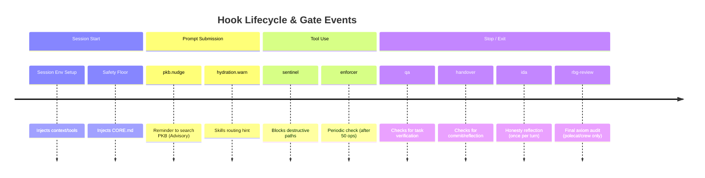

# Gates — runtime catalogue and forensic reference

**Scope.** Single source of truth for the gates that fire at session time through the academicOps hook router. Each gate section opens with a TL;DR answer card, then expands into where it lives, how it's configured, how to verify firing, and how to debug.

**Doc category.** State, per the doc-taxonomy spec (brain PKB). Kept beside the other framework-wide state docs (`AXIOMS.md`, `SURFACES.md`, `HEURISTICS.md`, `CONSTRAINTS.md`).

**What is NOT here.**

- **Pyramid-position assignments, axiom mapping, escalation rules** — see the enforcement map (repo-level SSoT for the L0–L7 regulatory pyramid; `rbg` blocks on it via P#65).
- **Hook router architecture, MCP wiring, hook I/O schemas, PATH bootstrap** — see [`aops-core/skills/aops/references/hooks.md`](../aops-core/skills/aops/references/hooks.md).
- **JSONL log schema, raw-file forensics procedures** — see [`aops-core/skills/aops/references/forensics-details.md`](../aops-core/skills/aops/references/forensics-details.md).
- **Design rationale (why the gate system is shaped this way)** — see the enforcement specs in the brain PKB: `enforcement`, `hook-router`, `ultra-vires-enforcer`, `enforcement-mechanisms`.

## At a glance

| Gate         | What it catches                                         | Fires on                              | Default | Stateful?   |
| ------------ | ------------------------------------------------------- | ------------------------------------- | ------- | ----------- |
| `sentinel`   | Destructive ops on protected env paths                  | PreToolUse (stateless)                | `block` | stateless   |
| `enforcer`   | Periodic compliance / ultra-vires drift                 | PreToolUse @ threshold                | `warn`  | counter     |
| `rbg-review` | Final rbg axiom audit before a task-bound session exits | Stop while CLOSED (polecat/crew only) | `block` | open/closed |
| `qa`         | "Done" claimed without verification                     | Stop while CLOSED                     | `warn`  | open/closed |
| `handover`   | Exit without commit / task update / reflection          | Stop while CLOSED                     | `warn`  | open/closed |
| `ida`        | Honesty / criterion-substitution at Stop                | Stop (once/turn)                      | `warn`  | open/closed |

The `Default` column above is the built-in / interactive default; `handover` (and the inert/armed split on `rbg-review`) shift on the polecat surface. For the full open/close lifecycle, the warn-vs-block contrast, and who sees each firing, see [Lifecycle, merge-vs-block & visibility](#lifecycle-merge-vs-block--visibility) immediately below.

Schema lives in [`lib/polecat_config.py`](lib/polecat_config.py); each `GateConfig` is defined in [`lib/gates/definitions.py`](lib/gates/definitions.py); mode resolution happens in [`hooks/gate_config.py`](hooks/gate_config.py). **Session scope policy**: gates only apply to sessions with their own session ID — inline Agent-tool subagents are exempt. See [`specs/enforcement/hook-router.md` § Session Scope](enforcement/hook-router.md#session-scope).

**Reserved name.** `hydration` is accepted in the `gates.*` config schema (`HYDRATION_GATE_MODE`) but **has no `GateConfig` today** — the visible hydration behaviour (skills-routing hint on UPS) runs unconditionally in the router. See [Reserved names](#reserved-names-hydration) at the bottom.

**Historical name.** `custodiet` was the previous name for the `enforcer` gate. Old references to `custodiet_*` env vars or the `custodiet` gate map one-to-one onto `enforcer`. See the ultra-vires-enforcer spec (brain PKB) §rename-note.

**`sticky_until` (engine feature).** A `GateTransition` can carry `sticky_until: list[str]` — a list of hook events that will "unstick" the gate. When such a transition fires, the engine sets `gate.sticky = True` in GateState and suppresses any subsequent transition targeting a _different_ status. When any event in the `sticky_until` list fires, the engine clears the sticky latch before evaluating triggers, so the same event can fire a normal re-arm transition. Used by the QA and handover gates to keep the gate OPEN after verification/handover until UserPromptSubmit, replacing the previous ad-hoc `qa_verified` and `handover_skill_invoked` session-state booleans.

---

## Lifecycle, merge-vs-block & visibility

> **Moved to SSoT.** The master table for gate modes, triggers, and client variations (warn-vs-block) is now in [`../ENFORCEMENT-MAP.md`](../ENFORCEMENT-MAP.md).

### Gate Events Timeline



## Config plumbing

Every gate above resolves its mode through the same path. Read this section once; the per-gate sections below only call out keys, not the resolution.

### Where polecat.yaml lives

- **Host**: `$AOPS_SESSIONS/polecat.yaml` (default), or `$AOPS_POLECAT_CONFIG` if set explicitly.
- **Polecat container**: staged in by polecat at launch; `$AOPS_POLECAT_CONFIG` points at the staged copy.
- **Example / schema**: `polecat/defaults/polecat.yaml.example`.
- **Loader**: [`lib/polecat_config.py:load_polecat_config()`](lib/polecat_config.py).

For polecat sessions, `polecat.yaml` is the primary configuration source — the polecat launcher reads it and stages the resolved gate modes as environment variables into the container. For direct CLI sessions (no polecat), the plugin's built-in defaults apply; override individual gates via environment variables in your shell or per-directory CLI settings. See the repo README § Gates for user-facing configuration instructions.

### Resolution path

`gate_config.py` reads gate modes from **environment variables** at runtime, with hardcoded fallback defaults. The polecat launcher is the intermediary that reads `polecat.yaml` and sets these env vars:

```
┌─ Polecat-launched sessions ─────────────────────────────────────────┐
│                                                                     │
│  polecat.yaml gates.{name}                                          │
│    ↓ parsed by lib/polecat_config.py                                │
│  PolecatConfig.session_defaults.gates                               │
│    ↓ .for_mode(crew|run) overlay — mode is known from the dispatch  │
│      subcommand (`polecat crew` vs `polecat run`), NOT an env label  │
│  polecat/cli.py stages resolved modes as env vars into container    │
│                                                                     │
└─────────────────────────────────────────────────────────────────────┘
                              ↓
              *_GATE_MODE env vars in the process environment
              (ENFORCER_GATE_MODE, QA_GATE_MODE, etc.)
                              ↓
┌─ All sessions (polecat or direct CLI) ──────────────────────────────┐
│                                                                     │
│  hooks/gate_config.py:__getattr__   (PEP 562 lazy resolution)      │
│    reads os.environ.get(name, default)                              │
│    ↓                                                                │
│  imported by lib/gates/definitions.py at module load                │
│    ↓ embedded in GatePolicy.verdict for each GateConfig             │
│  runtime: lib/gates/engine.py:GenericGate._evaluate_policies        │
│    ↓                                                                │
│  GateResult.verdict ∈ {allow, warn, deny}                           │
│                                                                     │
└─────────────────────────────────────────────────────────────────────┘
```

For **direct CLI sessions** (Claude Code or Gemini without polecat), no launcher sets the env vars, so `gate_config.py` falls back to its built-in defaults: all gates `warn`, hydration `off`, threshold 50. To override, set the env vars in your shell profile or per-directory CLI settings.

`gate_config.py` uses module-level `__getattr__` so config values are resolved lazily on first access — this is what lets tests monkeypatch the session env after the module is imported (call `_reset_gate_mode_cache()` to invalidate).

### Session-type overlays (polecat sessions)

The overlay applied on top of `session_defaults` is selected by the **dispatch subcommand** (`polecat crew` vs `polecat run`), resolved on the host AT DISPATCH by `polecat/cli.py` / `lib/polecat_config.py`. The container never self-identifies with a session-type label — it receives the already-resolved `*_GATE_MODE` env vars (aops-b368109a, which removed `POLECAT_SESSION_TYPE`):

| Dispatch       | Overlay applied to defaults                                       | Surfaces                                        |
| -------------- | ----------------------------------------------------------------- | ----------------------------------------------- |
| `polecat crew` | `polecat.yaml:crew_defaults`                                      | `polecat crew` interactive multi-agent sessions |
| `polecat run`  | `polecat.yaml:run_defaults`                                       | `polecat run` autonomous workers                |
| direct CLI     | No overlay — built-in defaults in `gate_config.py` apply directly | Direct CLI sessions (not polecat-launched)      |

For direct CLI sessions, polecat is not involved and the hook code reads env vars directly with its own defaults. Separately, the container is marked with `AOPS_POLECAT_CONTAINER=1` (a resolved operational signal, not a policy selector); `SessionState` derives its `session_type` (`crew` if `POLECAT_CREW_NAME` is also set, else `polecat`) from it, which the handover gate's triggers/initial-status consult. Gate **modes** are never inferred from this — they arrive pre-resolved.

### Plugin cache lifecycle

The aops-core plugin (and therefore the gates code) runs from a versioned cache directory at runtime, not directly from the source repo on the host:

- **Claude Code on host**: `~/.claude/plugins/cache/academicOps/aops-core/<ver>/` — Claude.app picks the most recent versioned dir; **does not garbage-collect older ones**. Stale dirs are a known trap (see [`SURFACES.md`](SURFACES.md) → "Claude Code CLI on host" → Known traps).
- **WSL crew container / polecat run**: `dist/aops-claude/` baked into the Docker image at build time. Pinned at image build until the image is rebuilt.
- **GHA runner**: agent prompt from `.github/agents/*.md`; no plugin runtime — gates do not fire.

To verify the cached copy matches source: `diff -ru ~/src/academicOps/aops-core/lib/gates/ ~/.claude/plugins/cache/academicOps/aops-core/<latest>/lib/gates/`.

### Hook env stripping (cross-cutting trap)

On Claude Code CLI on host (Mac, WSL host shell): the `env` block in CLI settings does **not** reliably propagate to hook subprocesses (`launchctl setenv` ignored; `.zshenv` partially sourced but `PATH` overridden). Gate-mode env vars set there may not reach the hooks. For direct CLI sessions, set gate env vars in your shell profile (`~/.zshenv`, `~/.bashrc`) instead, so they are in the process environment before Claude Code launches. See [`SURFACES.md`](SURFACES.md) → "Claude Code CLI on host" → Known traps for the full trace.

The WSL crew container and polecat-launched sessions receive env directly from the polecat launcher; no `launchctl`/`.zshenv` hop, so this trap does not apply there.

### Verifying the resolved mode at runtime

```bash
python -c '
import os, sys
sys.path.insert(0, "/path/to/aops-core")
from hooks.gate_config import (
    ENFORCER_GATE_MODE, QA_GATE_MODE, HANDOVER_GATE_MODE,
    HYDRATION_GATE_MODE, IDA_GATE_MODE, ENFORCER_TOOL_CALL_THRESHOLD,
)
print(f"enforcer={ENFORCER_GATE_MODE} threshold={ENFORCER_TOOL_CALL_THRESHOLD}")
print(f"qa={QA_GATE_MODE} handover={HANDOVER_GATE_MODE}")
print(f"ida={IDA_GATE_MODE} hydration={HYDRATION_GATE_MODE}")
'
```

If this fails, `polecat.yaml` is missing/unreadable or `$AOPS_SESSIONS` is unset — the same trap that causes gates to silently fail.

---

## `sentinel` gate

> **TL;DR.** Stateless PreToolUse gate that blocks destructive operations targeting protected user-environment paths before they execute. Defined in [`lib/gates/definitions.py`](lib/gates/definitions.py). Mode key: `gates.sentinel` / env var `SENTINEL_GATE_MODE` (default: `block`). Parity: [`aops-core/policies/deny-extension-writes.toml`](../aops-core/policies/deny-extension-writes.toml) mirrors these rules for Gemini CLI.

### What is it

A safety gate that intercepts destructive operations on protected user-environment paths before they execute. Origin: GitHub issue #106 — an agent deleted a working Gemini extension installation without evidence it was broken.

**Class of failure caught.** Accidental deletion or modification of live extension, plugin, and configuration files that the framework depends on. Unlike advisory gates (warn once), this gate defaults to `block` because environment damage can be difficult to recover from.

**Stateless design.** The sentinel gate has no open/close lifecycle. It fires on every matching PreToolUse event as long as `SENTINEL_GATE_MODE` is not `off`.

### What it protects

Protected paths (matched case-insensitively, tilde-expanded and absolute forms):

| Path                      | Rationale                                      |
| ------------------------- | ---------------------------------------------- |
| `~/.gemini/extensions/`   | Live Gemini CLI extension installations        |
| `~/.gemini/settings.json` | Gemini CLI global configuration                |
| `~/.claude/plugins/`      | Claude Code plugin installations               |
| `~/.claude/*.json`        | Claude Code config files (settings.json, etc.) |
| `~/.config/gemini/`       | Gemini CLI config directory                    |

### What triggers it

**Shell tools** (`Bash`, `run_shell_command`, `shell`, `execute_code`): blocks when the command contains both a destructive verb (word-bounded, case-insensitive) AND a protected path reference.

Destructive verbs: `rm`, `mv`, `rmdir`, `unlink`, `truncate`

**Write-file tools** (`Edit`, `Write`, `write_file`, `replace`): blocks when the `file_path` / `path` argument resolves to a protected path. No verb check — any write to a protected path is considered destructive.

### Where it lives

- **Gate config**: [`lib/gates/definitions.py`](../aops-core/lib/gates/definitions.py) — `GateConfig(name="sentinel", ...)`
- **Custom condition**: [`lib/gates/custom_conditions.py`](../aops-core/lib/gates/custom_conditions.py) — `is_destructive_env_op`
- **Mode default**: [`hooks/gate_config.py`](../aops-core/hooks/gate_config.py) — `SENTINEL_GATE_MODE = "block"`
- **Templates**: `hooks/templates/sentinel-policy-{message,context}.md`
- **Gemini parity**: [`aops-core/policies/deny-extension-writes.toml`](../aops-core/policies/deny-extension-writes.toml)
- **Tests**: `tests/hooks/test_sentinel_gate.py`

### Configuration

| Env var              | Values                 | Default | Effect                                                                                |
| -------------------- | ---------------------- | ------- | ------------------------------------------------------------------------------------- |
| `SENTINEL_GATE_MODE` | `block`, `warn`, `off` | `block` | `block`: deny the tool call; `warn`: inject advisory, allow; `off`: sentinel disabled |

In `polecat.yaml`:

```yaml
gates:
  sentinel: block   # or warn / off
```

### Verifying it is active

```bash
python -c '
import os, sys
sys.path.insert(0, "/path/to/aops-core")
from hooks.gate_config import SENTINEL_GATE_MODE
print(f"sentinel={SENTINEL_GATE_MODE}")
'
```

### Debugging

If the sentinel fires unexpectedly, check:

1. Is the matched path actually protected? `_PROTECTED_PATH_RE` in `custom_conditions.py`.
2. Is the destructive verb word-bounded? The regex uses `\b` — `rmdir` is a separate match from `rm`.
3. To opt out for a specific session: `SENTINEL_GATE_MODE=off` in the shell env before launching.

---

## `enforcer` gate

> **TL;DR.** Periodic compliance check. Counts write-tool calls since the last reset; when the count reaches `gates.enforcer_threshold` (default 50), the next non-infrastructure tool call fires a PreToolUse policy that dispatches the `rbg` subagent. Defined in [`lib/gates/definitions.py`](lib/gates/definitions.py) (`GATE_CONFIGS[1]`). Mode key: `gates.enforcer`.

### What is it

The periodic-compliance gate. Counts write operations since the last rbg audit; when the count reaches `gates.enforcer_threshold` (default 50), the gate's PreToolUse policy fires on the next non-infrastructure tool call. The policy renders a compliance report from the session transcript into a temp file and instructs the agent to invoke the `rbg` subagent. A successful dispatch resets the counter.

**Class of failure caught.** Ultra-vires drift, scope creep, unaudited long-running sessions, axiom violations the agent didn't self-catch. Enforces a periodic compliance check rather than blocking individual actions.

### Where it lives

| Concern                  | Path                                                                                                                  |
| ------------------------ | --------------------------------------------------------------------------------------------------------------------- |
| Gate definition (config) | `aops-core/lib/gates/definitions.py` (`GATE_CONFIGS[0]`)                                                              |
| Threshold + mode lookup  | `aops-core/hooks/gate_config.py` (`ENFORCER_TOOL_CALL_THRESHOLD`, `ENFORCER_GATE_MODE`)                               |
| Audit-file builder       | `aops-core/lib/gates/custom_actions.py` (`prepare_compliance_report`)                                                 |
| Templates                | `aops-core/hooks/templates/enforcer-{audit,context,countdown,instruction,policy-context,policy-message,verified}.md`  |
| Compliance subagent      | `aops-core/agents/rbg.md` (only `rbg.md` is shipped; the regex also accepts a subagent named `enforcer` if installed) |

Subagent dispatches that look like `Agent(subagent_type="enforcer")` or `Agent(subagent_type="rbg")` reset the counter via the gate's trigger.

### How it's configured

- **Mode key**: `gates.enforcer` (see [Config plumbing](#config-plumbing) for resolution). `warn` | `block` | `off`.
- **Threshold** (write ops between checks): `gates.enforcer_threshold` (default 50).
- **Countdown window**: 7 ops before threshold (`start_before=7` in the `CountdownConfig` literal — not currently in YAML).
- **Plan-mode bypass**: `POLECAT_APPROVAL_MODE=plan` skips counter increments entirely (see `engine.py:on_tool_use`).
- **Tool-category exclusions**: `infrastructure`, `always_available`, `read_only` tools do not trip the policy (`TOOL_CATEGORIES` in `gate_config.py`).
- **Mid-edit deferral**: while a TodoWrite has an `in_progress` item, the block is deferred via the `not_mid_edit` custom check (`custom_conditions.py`).

### How to verify it's firing

```bash
# Live counter (since session start or last check)
jq -r 'select(.hook_event=="PostToolUse") | .output.system_message // empty' \
  ~/.claude/projects/*/$(ls -1t ~/.claude/projects/*/ | head -1)*-hooks.jsonl \
  | grep -E '◇|Compliance check' | tail -5

# Find PreToolUse blocks where the enforcer gate denied
grep '"hook_event":"PreToolUse"' <hooks.jsonl> \
  | jq -r 'select(.output.verdict=="deny") | "\(.logged_at) \(.tool_name): \(.output.system_message[:120])"'

# Count compliance dispatches (SubagentStart for enforcer or rbg)
grep '"hook_event":"SubagentStart"' <hooks.jsonl> \
  | jq -r 'select(.subagent_type|test("enforcer|rbg"))' | wc -l
```

**Healthy fire**: PreToolUse with `tool_name` ≠ infrastructure/read-only, `output.verdict="deny"` (mode `block`) or `"warn"`, system_message starting with `✕ Compliance check required` or carrying the `enforcer-policy-context` template. SubagentStart with `subagent_type` matching `enforcer|rbg` clears the counter.

**Visible icons** (`format_gate_status_icons` in `router.py`): `◇ N` during countdown window, `◇` when over threshold.

### How to debug when it isn't

| Failure mode                                                 | Diagnostic                                                                                                                                                                                                                                                                                    |
| ------------------------------------------------------------ | --------------------------------------------------------------------------------------------------------------------------------------------------------------------------------------------------------------------------------------------------------------------------------------------- |
| Mode silently `off`                                          | `python -c "from hooks.gate_config import ENFORCER_GATE_MODE; print(ENFORCER_GATE_MODE)"` — if "off", check `polecat.yaml`.                                                                                                                                                                   |
| `polecat.yaml` unreadable / `$AOPS_SESSIONS` not in hook env | `gate_config.py` raises at import; check `~/.claude/projects/<workspace>/<base>-hooks.jsonl` for `CRITICAL: Failed to import`. Cross-ref the Mac-CLI hook env-stripping trap above.                                                                                                           |
| Gate never reaches threshold                                 | Read-only / infrastructure tools don't increment the counter by design. Confirm with `PostToolUse` entries where `tool_name` is `Edit`/`Write`/`Bash` — counter only ticks on these.                                                                                                          |
| Block deferred indefinitely                                  | Check `state.metrics.has_in_progress_todo` in the session state file — the `not_mid_edit` condition defers blocks while a TodoWrite item is `in_progress` (issue #319).                                                                                                                       |
| Subagent dispatch doesn't reset counter                      | Trigger regex: `^(aops[-_]core[:_])?(enforcer\|rbg)$` on `(PreToolUse\|SubagentStart\|SubagentStop)`. `aops-core:enforcer` and `enforcer` match; `aops_core_enforcer` does not. If dispatch was never emitted, check that the policy reached threshold (`not_mid_edit` may have deferred it). |

See [`forensics-details.md`](../aops-core/skills/aops/references/forensics-details.md#enforcer--rbg-gate) for the JSONL-level forensics procedure that complements these.

---

## `rbg-review` gate

> **TL;DR.** End-of-session axiom-audit backstop, scoped to **task-bound (polecat/crew)** sessions only. Armed `CLOSED` for polecat/crew; `OPEN` (inert) for ad hoc interactive — so interactive users do **not** eat a per-turn rbg delay. The enforcer every-N cadence (sentinel/enforcer gate) is the in-session mechanism; this gate adds only the final backstop: it **DENIES the exit Stop** of a task-bound session until the `rbg` subagent has run and returned a verdict. The trigger is **structural** (Stop event + armed flag + session type), **not** a content/NLP/keyword sniff — the qualitative judgment ("did this session comply with the axioms?") is rbg's, never a rig's. Defined in [`lib/gates/definitions.py`](../aops-core/lib/gates/definitions.py). Mode key: `gates.rbg_review` / env `RBG_REVIEW_GATE_MODE` (default `block`).

### What is it

The end-of-session axiom-audit gate. Enforces verify-before-assert / `judgment-non-delegable` at the **exit boundary of task-bound work**: a polecat/crew session cannot exit until rbg (the axiom judge, intelligence) has audited it. Reworked from the original block-every-stop #1928 (epic-f490bb11): requiring an rbg review on _every_ armed Stop made ad hoc interactive discussions eat the rbg delay each turn, which Nic rejected. The cheap per-turn self-reflection is Ida's job (Tier 1); the heavy independent rbg audit (Tier 2) is decoupled from the per-turn boundary and fires once before a task-bound session exits. Motivated by the verify-before-assert escalation (sessions Jun13-23): a prior attempt mistakenly used a test-rig / keyword sniff as the trigger; the lesson learned is that the TRIGGER must be structural and the JUDGMENT must be rbg's.

**Class of failure caught.** A task-bound (autonomous) session exiting without an independent axiom audit — unverified assertions, criterion substitution, scope drift, self-deceiving over-confidence — slipping past because no review was forced before exit. Tier 1 (Ida, self-graded) structurally cannot catch self-deception; Tier 2 (rbg, independent) can.

### Lifecycle (arm → block → clear)

- **ARM (per-surface)**: for **polecat/crew** sessions the gate starts `CLOSED` (armed) from session start via `initial_status_by_session_type` and re-arms `CLOSED` on every real `UserPromptSubmit` (the UPS re-arm trigger is `session_type_filter`ed to polecat/crew), so whenever the autonomous session attempts its exit Stop the gate is armed. For **ad hoc interactive** sessions the gate starts `OPEN` and **never** re-arms — the Stop policy never fires and interactive users eat no per-turn rbg delay. Mirrors the handover gate's per-surface posture.
- **BLOCK**: while `CLOSED` (polecat/crew only), the Stop policy returns `DENY` and injects the rbg-dispatch instruction (`prepare_rbg_review` builds the session-review file so `{temp_path}` resolves). There is deliberately **no** fire-once "open on first Stop" trigger (unlike qa/handover/ida) — that would let a retried exit Stop pass without rbg having run. The gate stays `CLOSED` across repeated Stops until rbg runs.
- **CLEAR**: when the `rbg` subagent runs (`SubagentStart`/`SubagentStop`/`PostToolUse` with `subagent_type ~ ^(aops[-_]core[:_])?rbg$`), the gate `OPEN`s, resets the escape-hatch deny counter, and latches `sticky_until=["UserPromptSubmit"]` so the rbg discharge **and any follow-up edits do not re-block / re-arm THIS turn** (gate-discharge re-trigger invariant — the rbg run itself must not loop the gate).

### Escape-hatch (loud, not silent)

After `RBG_REVIEW_DEGRADE_THRESHOLD` (default **5**, matching the router-level 5-block safety override) consecutive Stop blocks from this gate in one turn, the engine degrades `DENY → WARN-and-allow` and emits the `rbg_review.degraded` message (visible). This prevents the known **infinite-Stop-loop** incident if rbg dispatch is structurally broken. It is **failure-degradation only**, never a normal bypass — the healthy path still requires rbg to run. The router-level 5-blocks-in-2-min override (`router.py`) is a second, independent net. The per-gate threshold is wired via `GateConfig.stop_deny_downgrade_threshold` + `stop_deny_degraded_message_key`.

### Precedence / coexistence

Registered ahead of `qa`/`handover`/`ida` in `GATE_CONFIGS` so its `DENY` + rbg-dispatch instruction is delivered first; once rbg has run and the gate clears, the later Stop gates take over. This **serialises** rbg-review → qa/handover → ida cleanly. Ida is **deferred** (not consumed) while rbg-review denies, and fires its advisory normally on the post-rbg Stop — Ida is not broken. Because rbg-review is inert in interactive sessions, Ida (which is armed in all session types) is unaffected there.

### Where it lives

| Concern             | Path                                                                                                |
| ------------------- | --------------------------------------------------------------------------------------------------- |
| Gate definition     | `aops-core/lib/gates/definitions.py` (`GateConfig(name="rbg-review", ...)`)                         |
| Mode + threshold    | `aops-core/hooks/gate_config.py` (`RBG_REVIEW_GATE_MODE`, `RBG_REVIEW_DEGRADE_THRESHOLD`)           |
| Custom action       | `aops-core/lib/gates/custom_actions.py` (`prepare_rbg_review`)                                      |
| Custom conditions   | `aops-core/lib/gates/custom_conditions.py` (`is_rbg_review_block_mode`, `is_rbg_review_warn_mode`)  |
| Escape-hatch wiring | `aops-core/lib/gates/engine.py` (`_handle_stop_event` per-gate downgrade + loud message)            |
| Templates           | `aops-core/hooks/templates/rbg-review-{policy-message,policy-context,complete,degraded,context}.md` |
| Review subagent     | `aops-core/agents/rbg.md`                                                                           |
| Tests               | `tests/hooks/test_rbg_review_gate.py`                                                               |

### How it's configured

- **Mode key**: `gates.rbg_review` / `RBG_REVIEW_GATE_MODE`. `block` (default) | `warn` | `off`.
- **Escape-hatch threshold**: `RBG_REVIEW_DEGRADE_THRESHOLD` (default 5).

---

## `qa` gate

> **TL;DR.** Completion-quality gate — starts OPEN, closes when a task is claimed (`update_task` → `in_progress`), reopens when a `qa`/`marsha`/`verify` subagent runs with `sticky_until=["UserPromptSubmit"]` so writes to fix verification findings don't re-close it. Sessions without a claimed task skip the QA gate entirely. Blocks Stop while CLOSED. Defined in [`lib/gates/definitions.py`](lib/gates/definitions.py) (`GATE_CONFIGS[1]`). Mode key: `gates.qa`.

### What is it

The completion-quality gate. Starts OPEN (short interactive chats don't require verification). Closes when a task is claimed (`update_task` with `status=in_progress`). Sessions without a claimed task skip the QA gate entirely — no work claimed means nothing to verify. Reopens when a `qa` / `verify` / `marsha` subagent runs to completion — the reopen transition carries `sticky_until=["UserPromptSubmit"]`, which keeps the gate OPEN until the next user prompt so that code fixes based on verification findings don't re-close the gate (preventing the marsha→fix→Stop-blocked endless loop). On Stop, the policy blocks once per turn while the gate is CLOSED (fire-once + re-arm-on-UPS lifecycle, task-bound only). Warn-vs-block behaviour and audience are the shared Stop-gate mechanics — see [Lifecycle, merge-vs-block & visibility](#lifecycle-merge-vs-block--visibility).

**Class of failure caught.** "Done" claimed without verification: tests not run, acceptance criteria not checked, build broken on exit.

### Where it lives

| Concern           | Path                                                                                                 |
| ----------------- | ---------------------------------------------------------------------------------------------------- |
| Gate definition   | `aops-core/lib/gates/definitions.py` (`GATE_CONFIGS[1]`)                                             |
| Custom action     | `aops-core/lib/gates/custom_actions.py` (`prepare_qa_review`)                                        |
| Custom conditions | `aops-core/lib/gates/custom_conditions.py` (`has_bound_task`, `is_qa_block_mode`, `is_qa_warn_mode`) |
| Templates         | `aops-core/hooks/templates/qa-{complete,context,policy-context,policy-message}.md`                   |
| Verifier subagent | `aops-core/agents/marsha.md` (the only verifier shipped today)                                       |

### How it's configured

- **Mode**: `polecat.yaml` → `session_defaults.gates.qa` (`warn` | `block` | `off`).
- **Close trigger**: `update_task` PostToolUse with input matching `in_progress` (task claim). Write-tool use does not close the QA gate — only an explicit task claim activates it.
- **Reopen triggers**: (1) any subagent matching `^(aops-core:)?(qa|verify|marsha)$` on `SubagentStart|SubagentStop|PostToolUse` with `sticky_until=["UserPromptSubmit"]`; (2) Stop while CLOSED (fire-once — gate opens after first block so retried Stops pass).
- **Re-arm trigger**: `UserPromptSubmit` → clears sticky latch, then fires re-arm trigger → CLOSED. Only re-arms when a task is bound (`has_bound_task` custom check) — sessions without a claimed task skip the QA gate entirely. **Slash-command turns are excluded** (`prompt_exclude_patterns=SLASH_COMMAND_PROMPT_PATTERNS`): a skill invocation owns its own finishing format, so it must not re-arm the gate. The exclusion suppresses the close only — it never opens the gate.
- **Policy fires**: only on `hook_event="Stop"` while `current_status=CLOSED`. `prepare_qa_review` writes a qa-context audit file into the session dir; the policy message points the agent at it.

### How to verify it's firing

```bash
# Stop events that the qa gate blocked
grep '"hook_event":"Stop"' <hooks.jsonl> \
  | jq -r 'select(.output.verdict=="deny" and (.output.system_message|test("QA|qa|marsha"))) | .logged_at'

# Verifier completions that touched the gate
grep '"hook_event":"SubagentStop"' <hooks.jsonl> \
  | jq -r 'select(.subagent_type|test("qa|verify|marsha")) | "\(.logged_at) opened: \(.subagent_type)"'
```

### How to debug when it isn't

- **Gate stays OPEN despite work activity**: the QA gate only closes on task-claim (`update_task` with `in_progress`), not on write-tool use. Confirm a task was claimed — sessions without a claimed task skip the QA gate by design.
- **Subagent didn't reset**: check the spelled `subagent_type` against `^(aops-core:)?(qa|verify|marsha)$` — `aops-core:marsha` and `marsha` both match; `aops_core_marsha` does not.
- **Mode `off`**: confirm with `from hooks.gate_config import QA_GATE_MODE`.

---

## `handover` gate

> **TL;DR.** Exit-discipline gate. Starts OPEN, CLOSES when work begins (task bound to `in_progress` or any write-tool PostToolUse), reopens when `/end-session` or `/dump` completes with `sticky_until=["UserPromptSubmit"]`. Blocks once per turn on Stop while CLOSED (fire-once, re-arms on UPS). **Posture gate**: `warn` (merge) on the interactive surface, `block` on polecat — resolved via `resolve_posture_gate()`. Safety override: 5+ Stop denies in 2 minutes auto-approves to prevent deadlock. Warn-vs-block delivery + audience: see [Lifecycle, merge-vs-block & visibility](#lifecycle-merge-vs-block--visibility). Defined in [`lib/gates/definitions.py`](lib/gates/definitions.py) (`GATE_CONFIGS[2]`). Mode key: `gates.handover`.

### What is it

The exit-discipline gate. Starts OPEN (short interactive chats don't require handover). Closes when work begins (task bound to `in_progress`, or any write-tool PostToolUse). Reopens when the `/end-session` (canonical) or `/dump` (emergency) skill completes — the reopen transition carries `sticky_until=["UserPromptSubmit"]`, which keeps the gate OPEN until the next user prompt so that post-handover operations (git push, release_task, etc.) don't re-close it. On Stop, the policy blocks once per turn while the gate is CLOSED (fire-once + re-arm-on-UPS lifecycle). This is a **posture gate**: interactive → `warn` (advisory merged once via `additionalContext`, the turn proceeds — the "soft handover" of PR #1992); polecat → `block` (the Stop is held until handover runs). Warn-vs-block delivery and audience are the shared Stop-gate mechanics — see [Lifecycle, merge-vs-block & visibility](#lifecycle-merge-vs-block--visibility).

**Class of failure caught.** Uncommitted changes lost at exit, task left without a status update, no framework reflection captured.

### Where it lives

| Concern               | Path                                                                                                   |
| --------------------- | ------------------------------------------------------------------------------------------------------ |
| Gate definition       | `aops-core/lib/gates/definitions.py` (`GATE_CONFIGS[2]`)                                               |
| Custom condition      | `aops-core/lib/gates/custom_conditions.py` (`is_write_tool`)                                           |
| Templates             | `aops-core/hooks/templates/handover-{bound,complete,policy-message}.md`, `stop-gate-handover-block.md` |
| Skills that reopen it | `aops-core/skills/end_session/SKILL.md`, `aops-core/skills/dump/SKILL.md`                              |
| Safety override       | `aops-core/hooks/router.py` (`execute_hooks` — `stop_block_timestamps`)                                |

### How it's configured

- **Mode key**: `gates.handover` (`warn` | `block` | `off`).
- **Close triggers**: `update_task` PostToolUse with input matching `in_progress`, OR any PostToolUse where `is_write_tool` matches (Edit, Write, Bash/`run_shell_command`/`shell`/`execute_code`, etc. per `TOOL_CATEGORIES["write"]`). While handover is sticky (post-skill), close transitions are suppressed by the engine natively.
- **Reopen triggers**: (1) `Skill`/`activate_skill` PostToolUse with `subagent_type_pattern="^(aops-core:)?(handover|dump|end_session)$"` with `sticky_until=["UserPromptSubmit"]`, OR a Gemini slash-command UPS prompt matching `^\s*#\s*/(dump|end_session)`; (2) Stop while CLOSED (fire-once — gate opens after first block so retried Stops pass).
- **Re-arm trigger**: `UserPromptSubmit` (polecat/crew only) → clears sticky latch, then fires re-arm trigger → CLOSED. **Slash-command turns are excluded** (`prompt_exclude_patterns=SLASH_COMMAND_PROMPT_PATTERNS`): a finishing/meta skill (`/end-session`, `/dump`, `/remember`) must not re-close the gate it just satisfied. The write-tool / task-claim close triggers still fire, so a slash turn that does real work is still gated. Suppresses the close only — never opens.
- **Safety override**: after **5** consecutive Stop denies within 2 minutes (`router.py:execute_hooks`, set by aops-c67313ef), the gate auto-approves to prevent deadlock.
- **Bash-as-read carve-out**: while the handover gate is sticky (post-skill) or no task is bound, shell tools are treated as read-only by `is_write_tool` so the gate doesn't re-close on `git status` / `echo` after a /dump (issue aops-2283a8b0).

### How to verify it's firing

```bash
# Stop denies caused by handover
grep '"hook_event":"Stop"' <hooks.jsonl> \
  | jq -r 'select(.output.verdict=="deny" and (.output.system_message|test("Handover|handover"))) | .logged_at'

# Pattern: N denies followed by an allow → safety override fired
grep '"hook_event":"Stop"' <hooks.jsonl> | jq -r '.output.verdict' | uniq -c
```

**Visible icon**: `≡` appears in the icon strip only when the gate is OPEN **and** `sticky=True` (set by the `sticky_until` transition on skill completion).

### How to debug when it isn't

| Failure mode                                 | Diagnostic                                                                                                                                                                                                          |
| -------------------------------------------- | ------------------------------------------------------------------------------------------------------------------------------------------------------------------------------------------------------------------- |
| Stop blocked despite running `/end-session`  | Re-check the subagent_type extraction — the trigger requires the router to have populated `ctx.subagent_type` from `tool_input.skill`. Look for the PostToolUse event in the JSONL and inspect its `subagent_type`. |
| `≡` never shows after handover               | Either the skill name didn't match the trigger regex, or the gate's `sticky` flag wasn't set. Inspect the session state file (`~/.claude/projects/<workspace>/*-session.json`) for `gates.handover.sticky`.         |
| 4–5 denies pattern (safety override)         | Normal once. Repeated across sessions = agent isn't completing handover before retrying Stop. Read the CC session JSONL between denies to see what the agent did.                                                   |
| Gate closed on a `git status` after handover | The Bash-as-read carve-out depends on `handover.sticky` OR no bound task. If both are false the carve-out is off — that's by design while work is in progress.                                                      |

See [`forensics-details.md`](../aops-core/skills/aops/references/forensics-details.md#stop--handover-gate) for the JSONL-level forensics procedure.

---

## `ida` gate

> **TL;DR.** Pre-Stop honesty reminder, named for Ida B. Wells. Fires once per turn on Stop (fire-once lifecycle: CLOSED → fires → OPEN, re-arms on UPS); armed (`CLOSED`) from session start in **every** session type. Default `warn` everywhere — no per-surface posture. Warn-vs-block delivery + audience: see [Lifecycle, merge-vs-block & visibility](#lifecycle-merge-vs-block--visibility). Defined in [`lib/gates/definitions.py`](lib/gates/definitions.py) (`GATE_CONFIGS[3]`). Mode key: `gates.ida`.

### What is it

The pre-Stop honesty reminder. On the first Stop per turn, blocks the agent and injects a reminder to cite proof for assertions (file:line or command output, not reasoning) and to flag claims that were substituted, skipped, or laundered from a subagent without verification. Gate opens after the first block so retried Stops pass; re-arms on UserPromptSubmit.

**Class of failure caught.** Criterion substitution, narrative-as-proof, fabricated diagnostics, skipped verification, positive-framing bias, unverified keystone assumptions, subagent-output laundering. Targets the issues catalogued in the gate definition's docstring (#621, #563, #380, #430, #359, #798, #549, #624, #317, #100, #376, #437, #391, #416, #335, #932, #822, #714).

**Why fire-once.** Regardless of channel, the agent should see the honesty checklist **once per turn** and self-correct — not be nagged on every retried Stop. The lifecycle delivers exactly that: CLOSED → fires on first Stop → OPEN, re-arms on the next UserPromptSubmit.

**Delivery channel (harness-dependent).** _How_ the once-per-turn advisory reaches the agent is governed by the SSoT channel table, not by this gate — see [Enforcement Map](../ENFORCEMENT-MAP.md). On the **current target (CC ≥2.1.191, re-confirmed 2.1.195)** a `warn` rides `hookSpecificOutput.additionalContext` **without blocking** (the turn proceeds). Note this is _not_ user-silent: on Stop the delivered `additionalContext` also renders to the user as a `Stop hook feedback:` line — no _user-silent_ (zero user output) Stop channel exists. The quiet alternative is the `asyncRewake` Stop hook (full body to agent `<system-reminder>`, one-line `<summary>` to user; decompiled + PTY-proven 5×, [[kb-fcc2b95c]], RCA #2014) — delivery only, not compulsion. (PTY-confirmed, task aops-c0363bf8.) On **legacy CC 2.1.158** the Stop event rejected `hookSpecificOutput`/`additionalContext`, so the only agent-visible channel was `decision: "block"` + `reason` (also user-visible) and a warn had to upgrade to a block purely to deliver — which is why this gate was historically described as "block-once." That upgrade is now retired on 2.1.191. _(The inline code comment at `definitions.py:581-583` still states the legacy "no additionalContext on Stop" assumption — stale; the live behaviour is whatever `channel_spec("claude","Stop").agent_context_without_block` says.)_

### Where it lives

| Concern         | Path                                                     |
| --------------- | -------------------------------------------------------- |
| Gate definition | `aops-core/lib/gates/definitions.py` (`GATE_CONFIGS[3]`) |
| Template        | `aops-core/hooks/templates/ida-reminder.md`              |
| Mode lookup     | `aops-core/hooks/gate_config.py` (`IDA_GATE_MODE`)       |

Loaded by the aops-core plugin's `GateRegistry.initialize()` (called from `router.execute_hooks`). Fires on Stop in main-agent context — no subagent-skip, no threshold.

### How it's configured

- **Mode key**: `gates.ida` (`warn` | `block` | `off`).
- **Triggers**: (1) Stop while CLOSED → OPEN (fire-once); (2) UserPromptSubmit → CLOSED (re-arm), **excluding slash-command turns** (`prompt_exclude_patterns=SLASH_COMMAND_PROMPT_PATTERNS`). A skill invocation (`/end-session`, `/dump`, `/remember`, or any `/command`) owns its own finishing format, so it must not re-arm the honesty gate — otherwise a slash command typed after a reflection has already fired arms a second, redundant reflection on the next Stop. Suppresses the close only — it never opens the gate, so a first-turn slash command (gate still CLOSED from session start) still reflects. (3) `PreToolUse`/`AskUserQuestion` → **re-close** + inject advisory (`definitions.py:637-647`) — asking the user a question re-arms the reminder for the answer turn.
- **Stop policies**: `hook_event="Stop"`, `current_status=CLOSED` — a DENY policy (`is_ida_block_mode`) and a WARN policy (`is_ida_warn_mode`), both injecting `context_key="ida.reminder"`. Which one delivers, and to whom, is the shared Stop-gate behaviour — see [merge-vs-block & visibility](#lifecycle-merge-vs-block--visibility).
- **Default-everywhere**: `polecat.yaml.example` ships `ida: warn`. `BUILTIN_GATES` (used when no polecat.yaml is found) also sets `ida: warn`.

### How to verify it's firing

```bash
# Stop events with the ida context injection
grep '"hook_event":"Stop"' <hooks.jsonl> \
  | jq -r 'select(.output.context_injection|test("Before stopping|Ida")) | .logged_at'

# Verdict-warn rate on Stop (ida is the only Stop policy that warns without state)
grep '"hook_event":"Stop"' <hooks.jsonl> | jq -r '.output.verdict' | sort | uniq -c
```

**Healthy fire** (mode `warn`): first Stop per turn produces `output.verdict="warn"` with `output.context_injection` containing the ida-reminder template text ("Before stopping: for each claim..."). `output_for_claude` upgrades `warn + context_injection` to `decision: "block"` + `reason` so the advisory reaches the agent. Gate then opens (fire-once trigger), so subsequent Stops in the same turn produce no verdict. Re-arms on next UserPromptSubmit.

### How to debug when it isn't

| Failure mode                                          | Diagnostic                                                                                                                                                                                                                                                                                       |
| ----------------------------------------------------- | ------------------------------------------------------------------------------------------------------------------------------------------------------------------------------------------------------------------------------------------------------------------------------------------------ |
| Mode silently `off`                                   | `python -c "from hooks.gate_config import IDA_GATE_MODE; print(IDA_GATE_MODE)"` — confirm the resolved value.                                                                                                                                                                                    |
| Visible at SessionEnd but not at Stop (or vice versa) | Policy is keyed on `hook_event="Stop"`. Router maps `Stop` → `on_stop` and `SessionEnd` → `on_stop` (see `_call_gate_method`). Both should fire. If only one does, check `is_subagent` — gates are skipped in subagent context.                                                                  |
| Suppressed when another gate blocks                   | The router merges with DENY > WARN > ALLOW. A `handover` or `qa` DENY swallows the `ida` WARN's context_injection. Read the raw hook JSONL; the gate **did** evaluate, but its output was merged out.                                                                                            |
| Mode `warn` but no visible reminder in agent context  | Cross-check `output_for_claude` behaviour: when verdict is `warn` and no other gate set a system_message, the reminder is copied into `stopReason` + `systemMessage` (router.py near "WARN inertia #338"). If neither field is set in the JSONL output, the merge logic dropped it — file a bug. |

---

## Reserved names: `hydration`

`hydration` is accepted in the `gates.*` schema and exposed via `HYDRATION_GATE_MODE`, but `lib/gates/definitions.py` does not define a `hydration` `GateConfig`. The visible "hydration" behaviour is one non-blocking injection in the router:

- **Skills-routing hint** — `router.py:_run_lightweight_hydrator` adds template `hydration.warn` on every UserPromptSubmit in main-agent context.

It runs unconditionally (not gated by `gates.hydration`). Mode is a placeholder for a future `GateConfig`.

| Concern               | Path                                                        |
| --------------------- | ----------------------------------------------------------- |
| Mode placeholder      | `aops-core/lib/polecat_config.py` (`GatesConfig.hydration`) |
| Mode lookup           | `aops-core/hooks/gate_config.py` (`HYDRATION_GATE_MODE`)    |
| Active hint injector  | `aops-core/hooks/router.py` (`_run_lightweight_hydrator`)   |
| Routing-hint template | `aops-core/hooks/templates/hydration-gate-warn.md`          |

**Verify the injection landed**:

```bash
grep '"hook_event":"UserPromptSubmit"' <hooks.jsonl> \
  | jq -r 'select(.output.context_injection!=null) | "\(.logged_at) \(.output.context_injection[:120])"'
```

**Common failures**: no injection at all → confirm `is_subagent=False` and `_is_task_notification` returned False. Expected a verdict and got none → there is no policy; this is by design.

---

## Cross-references

### Authoritative on adjacent slices

- Enforcement map (repo-level) — operative register: L0–L7 regulatory pyramid (Ayres & Braithwaite 1992), axiom × mechanism cross-reference, PR-pipeline agents. `rbg` blocks on it via P#65.
- [`aops-core/skills/aops/references/hooks.md`](../aops-core/skills/aops/references/hooks.md) — hook router architecture, PATH bootstrap, MCP wiring, hook I/O schemas, Gemini differences.
- [`aops-core/skills/aops/references/forensics-details.md`](../aops-core/skills/aops/references/forensics-details.md) — JSONL log schema, per-gate forensics procedures, polecat-session identification.
- `polecat/defaults/polecat.yaml.example` (repo-level) — config schema + master environment-variable inventory.

### Design rationale (specs)

- `enforcement` spec (brain PKB) — design statement: why enforcement is shaped this way, pipeline and pyramid views, evidence loop.
- `enforcement-mechanisms` spec (brain PKB) — per-mechanism reference catalogue keyed to the L0–L11 pipeline view.
- `ultra-vires-enforcer` spec (brain PKB) — design rationale for the enforcer agent + gate.
- `hook-router` spec (brain PKB) — design rationale for the hook router.

### Source

- `aops-core/lib/gates/definitions.py` — gate config literals
- `aops-core/lib/gates/engine.py` — `GenericGate` evaluation
- `aops-core/lib/gates/{custom_actions,custom_conditions}.py` — gate-specific side effects and predicates
- `aops-core/lib/gate_types.py` — pydantic models (`GateConfig`, `GateTrigger`, `GatePolicy`, `GateState`)
- `aops-core/lib/gate_model.py` — `GateResult`, `GateVerdict`
- `aops-core/lib/polecat_config.py` — `polecat.yaml` loader; schema validator
- `aops-core/hooks/gate_config.py` — mode resolution, tool categories, subagent extraction
- `aops-core/hooks/router.py` — event dispatch, gate registry, safety override, hint injection
- `aops-core/hooks/templates/*.md` — message/context templates rendered by gates

### Doc shape

This file is a state-category SSoT per the doc-taxonomy spec (brain PKB). The per-gate "TL;DR → where → config → verify → debug" shape is reusable for the Phase C subsystem consolidations (epic `aops-2b8dd7a7`).
