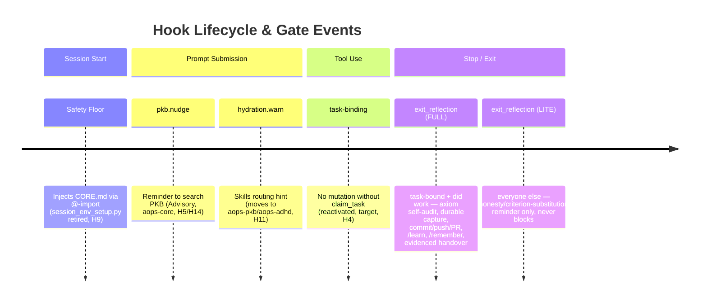

# Gates — runtime catalogue and forensic reference

**Scope.** Single source of truth for the gates that fire at session time through the academicOps hook router. Each gate section opens with a TL;DR answer card, then expands into where it lives, how it's configured, how to verify firing, and how to debug.

**Doc category.** State, per the doc-taxonomy spec (brain PKB). Kept beside the other framework-wide state docs (`AXIOMS.md`, `SURFACES.md`, `HEURISTICS.md`).

**What is NOT here.**

- **Pyramid-position assignments, axiom mapping, escalation rules** — see the enforcement map (repo-level SSoT for the L0–L7 regulatory pyramid; `rbg` blocks on it via P#65).
- **Hook router architecture, MCP wiring, hook I/O schemas, PATH bootstrap** — see [`aops-core/skills/aops/references/hooks.md`](../../aops-core/skills/aops/references/hooks.md).
- **JSONL log schema, raw-file forensics procedures** — see [`aops-core/skills/aops/references/forensics-details.md`](../../aops-core/skills/aops/references/forensics-details.md).
- **Design rationale (why the gate system is shaped this way)** — see [`specs/enforcement/enforcement.md`](enforcement.md) and [`specs/agents/rbg.md`](../agents/rbg.md).
- **Per-gate design rationale (why a given gate exists, the class of failure it defends against)** — lives in the respective agent spec: `ida` → [`specs/agents/ida.md`](../agents/ida.md#honesty-at-stop--the-ida-gate); `exit_reflection`'s RBG-lens self-audit tier → [`specs/agents/rbg.md`](../agents/rbg.md#gate-rationale-what-each-surface-defends); gates without an agent spec → [`specs/enforcement/enforcement.md`](enforcement.md). GATES.md holds the operational state (what / where / config / verify / debug).

## At a glance

**Consolidation (aops_4c2949d9, 2026-07).** The former `rbg-review` + `qa` + `handover` trio is now ONE Stop gate, `exit_reflection`, with two tiers selected per-Stop by session scope (never a session-type code branch). The turn-based `rbg` PreToolUse compliance-counter gate is **retired entirely** — nothing fires mid-session (PreToolUse) on any surface any more. See [note_296e5520](../../note_296e5520) §1 for the ratifying plan.

| Gate              | What it catches                                                                                                                                                                              | Fires on           | Close trigger                                               | Open trigger                                                                                                  |
| ----------------- | -------------------------------------------------------------------------------------------------------------------------------------------------------------------------------------------- | ------------------ | ----------------------------------------------------------- | ------------------------------------------------------------------------------------------------------------- |
| `exit_reflection` | FULL tier: axiom drift, unverified "done" claims, exit without commit/capture/handover on a task-bound session that did work. LITE tier: honesty/criterion-substitution only (never blocks). | Stop               | task claim / claim_task / write tool (sets FULL-tier scope) | reflection auditor ran, OR an honest `release_task` completion/failure, OR `/end-session`/`/dump`/`/continue` |
| task-binding      | Work without a bound task (**reactivated**, target — H4)                                                                                                                                     | PreToolUse (write) | claim_task                                                  | —                                                                                                             |

**`ida` gate — face-scoped, RATIFIED (aops_5ea32596 / note_296e5520 §3); untouched by this consolidation.** Fires on the head/face surface only, structurally absent everywhere else. See [§ `ida` gate](#ida-gate) below.

Schema lives in [`lib/polecat_config.py`](../../aops-core/lib/polecat_config.py); the `GateConfig` is defined in [`lib/gates/definitions.py`](../../aops-core/lib/gates/definitions.py); mode resolution happens in [`hooks/gate_config.py`](../../aops-core/hooks/gate_config.py). **Session scope policy (H8/H12, PreToolUse exception permanent as of aops_571771b4)**: gates fire uniformly across main sessions, subagents, and workers. The PreToolUse-skip-for-subagents exception is now **moot** for compliance gating specifically — `GATE_CONFIGS` carries no PreToolUse policy at all since the turn-based `rbg` gate was retired (aops_4c2949d9) — but the skip remains general engine behaviour for any future PreToolUse gate; see [Subagent & worker session scope](#subagent--worker-session-scope) below.

**Reserved name.** `hydration` is accepted in the `gates.*` config schema (`HYDRATION_GATE_MODE`) but **has no `GateConfig` today** — the visible hydration behaviour (skills-routing hint on UPS) runs unconditionally in the router. See [Reserved names](#reserved-names-hydration) at the bottom.

**Retired name.** `custodiet` → `rbg` → deleted (aops_4c2949d9). The turn-based PreToolUse compliance-counter gate under any of these names no longer exists in code; nothing fires mid-session on any surface. `rbg-review`, `qa`, and `handover` are also retired names — folded into `exit_reflection`.

**`sticky_until` (engine feature).** A `GateTransition` can carry `sticky_until: list[str]` — a list of hook events that will "unstick" the gate. When such a transition fires, the engine sets `gate.sticky = True` in GateState and suppresses any subsequent transition targeting a _different_ status. When any event in the `sticky_until` list fires, the engine clears the sticky latch before evaluating triggers, so the same event can fire a normal re-arm transition. Used by `exit_reflection` to keep the gate OPEN after a reflection auditor runs / legal exit fires until UserPromptSubmit.

---

## Lifecycle and Gate Events Timeline

### Two-mode Stop-gate contract (client-agnostic)

This is the canonical statement every gate's "shared Stop-gate mechanics" link points to. Stop-gate firing is driven by the `GateStatus` latch + observable session state — **never** by `raw_input.stop_hook_active` (a Claude/Gemini-only flag that agy never sends; the router-level global bypass that keyed on it has been **deleted**).

**Only `block` mode forces a continuation.** `block` emits `DENY`: the client is prevented from stopping and the agent must act before it can exit. `warn` emits `WARN`: the advisory is delivered to the agent's context for its next turn (on Claude, non-blockingly via `hookSpecificOutput.additionalContext`) without forcing a retry — the agent may act on it or genuinely stop. This is a real behavioral difference, not just a re-fire-latch difference: a `warn` gate no longer compels anything.

**Known limitation.** No available channel can BOTH deliver separate messages to the agent and the user AND force a continuation on Stop — `decision:"block"`+`reason` is the only channel that forces a retry, and it delivers the same text to both audiences (see the per-client table below). If a future client channel supported both, block-mode gates should switch to it; until then this is the accepted trade-off for enforcement.

| Mode / gate                            | Verdict | Re-fire behavior                                                                                                                                                                                                                  | Escape-hatch threshold (consecutive unsatisfied Stops/turn) |
| :------------------------------------- | :------ | :-------------------------------------------------------------------------------------------------------------------------------------------------------------------------------------------------------------------------------- | :---------------------------------------------------------- |
| `warn` (`exit_reflection`, any tier)   | `WARN`  | Fire-once: delivers once, then a warn-mode `Stop→OPEN` trigger latches the gate open so a retried Stop passes without re-delivering; re-arms on `UserPromptSubmit`. The LITE tier is WARN-only by construction — it never denies. | n/a — fire-once already bounds it                           |
| `block` (`exit_reflection`, FULL tier) | `DENY`  | Persist-until-satisfied: no fire-once; re-DENYs every Stop until a legal exit fires — reflection auditor ran, an honest `release_task` completion/failure, or `/end-session`/`/dump`/`/continue`.                                 | 5 (`EXIT_REFLECTION_DEGRADE_THRESHOLD`)                     |
| `ida` (`block`)                        | `DENY`  | Fire-once-**loud**, not persist — ida has no satisfaction predicate (there is no "ida ran" event to open the gate later), so even block mode can only force one continuation, not an open-ended loop.                             | n/a                                                         |
| `ida` (`warn`)                         | `WARN`  | Fire-once, non-blocking — same mechanics as any other warn-mode gate.                                                                                                                                                             | n/a                                                         |

The escape-hatch counter (block mode only) resets on `UserPromptSubmit` — the loop it bounds is within-turn (Stop → forced-continue → Stop …); a new user turn is new work and gets a fresh budget. Once the threshold is hit, the DENY downgrades to `WARN`-and-allow (loud, not silent).

**Per-client delivery of a BLOCK-mode DENY:**

| Client | Verdict delivery                                                                                                | Forces a retry?                                                                       |
| :----- | :-------------------------------------------------------------------------------------------------------------- | :------------------------------------------------------------------------------------ |
| Claude | `decision:"block"` + `reason` (JSON payload — exit code is not a decision channel, it is hardcoded to 0)        | Yes                                                                                   |
| Gemini | `AfterAgent` `decision:"deny"` + `reason`                                                                       | Yes                                                                                   |
| agy    | Best-effort advisory `injectSteps` — live-proven to reach the model, not the user (`ephemeralMessage` U✗/C✓/P✗) | Provisional — `terminationBehavior` hard-block is unmeasured (`AGY_STOP_PROVISIONAL`) |

Loop safety is gate-owned (fire-once latch + `stop_deny_count`, block mode only) plus the residual client-agnostic 5-blocks-in-2-min override.



The turn-based `rbg` PreToolUse compliance-counter gate (aops_4c2949d9, retired) no longer appears in the "Tool Use" section — nothing fires mid-session on any surface any more.

Honesty/criterion-substitution checking (the `ida` gate, Stop + PreToolUse `AskUserQuestion`) is omitted from this timeline for brevity, not because it was retired — see [§ `ida` gate](#ida-gate) for its disposition.

## Hook-event coverage & UserPromptSubmit origin diagnostic

Known open issue: the `exit_reflection` gate can re-arm in interactive head sessions with no human prompt visible (inherited from the former `rbg-review` gate's identical, unconditional UPS trigger). The diagnostic instrumentation below identifies WHAT re-arms it; it does not fix the re-arm.

- **Every Claude Code hook event is subscribed and logged, log-only.** `aops-core/hooks/hooks.json` registers all 30 events the installed client emits (`vQ` enum backing the settings.json `hooks` schema; SSoT copy: `client_spec.CLAUDE_ALL_EVENTS`). 10 have a `router._call_gate_method` branch (PreToolUse/PostToolUse/UserPromptSubmit/SessionStart/Stop/SessionEnd/SubagentStart/SubagentStop/PreCompact/Notification). The other 20 (`PostToolUseFailure`, `PostToolBatch`, `UserPromptExpansion`, `StopFailure`, `PostCompact`, `PermissionRequest`, `PermissionDenied`, `Setup`, `TeammateIdle`, `TaskCreated`, `TaskCompleted`, `Elicitation`, `ElicitationResult`, `ConfigChange`, `WorktreeCreate`, `WorktreeRemove`, `InstructionsLoaded`, `CwdChanged`, `FileChanged`, `MessageDisplay`) have NO gate branch — `_call_gate_method`'s if/elif chain falls through to `return None`, so they are inert by construction (exit 0, no block) and reach `main()`'s `log_hook_event` call exactly like any handled event. Re-verify the 30-event set against `extension.js` on a Claude Code version bump — it is observed, not guaranteed stable.
- **A missing/`"unknown"` `session_id` never silently drops the log entry.** `unified_logger.log_hook_event` routes those events to a global fallback sink (`~/.claude/hooks-fallback.jsonl`, override via `AOPS_HOOK_FALLBACK_LOG`), tagged `"session_id_missing": true`.
- **UserPromptSubmit diagnostic enrichment.** Every UPS log line's `output.metadata.ups_diagnostic` carries: `prompt_id` (Claude Code ≥2.1.196; `None` elsewhere — absence is itself signal), `prompt_preview` (first 80 chars), `prompt_length`, `is_task_notification` (the `router._is_task_notification` result), and `gate_transitions` — every gate whose trigger fired on this event (`gate`, `hook_event`, `trigger_index`, `from_status`/`to_status`, `status_changed`). Captured on BOTH `execute_hooks()` branches: the task-notification short-circuit (`gate_transitions` always `[]` there — no gates run) and the normal gate-dispatch fall-through (where `exit_reflection`'s unconditional UPS trigger, and any other gate's, actually shows up).
- **Gate-transition capture is engine-level**, not UPS-specific: `GenericGate._evaluate_triggers` (`aops-core/lib/gates/engine.py`) records a transition whenever a trigger's condition matched and its transition applied — even when `from_status == to_status` (e.g. `exit_reflection` re-closing an already-`CLOSED` gate), because "did this event cause the trigger to fire" is the diagnostic question, not just "did the status visibly flip". `router._dispatch_gates` collects one entry per contributing gate into `CanonicalHookOutput.metadata["gate_transitions"]` for every event, not only UserPromptSubmit; `ups_diagnostic.gate_transitions` on a UPS line is the same list, just also folded into the UPS-specific blob for convenience.

## Config plumbing

**Standing rule, all gates (H3).** Posture — armed/disarmed, on/off, which mode a surface runs in — is expressed **only** through the env-var / `polecat.yaml` plumbing described in this section. No gate anywhere in this catalogue may branch its mode on session-type, on/off flags, or other state code in the repo.

Every gate's mode resolves from a `*_GATE_MODE` environment variable, read lazily by [`hooks/gate_config.py`](../../aops-core/hooks/gate_config.py). Resolution has exactly two steps and no third (note_296e5520 §4, DEFAULTS-NONE universal): (1) the env var, if a launcher already staged it; (2) `polecat.yaml`'s explicit `face` section, resolved by `gate_config.py` itself, for any caller that reaches this module without going through a launcher. There is NO hardcoded fallback default — if polecat.yaml cannot be located or is missing a required key, this HARD-FAILS. For polecat/crew containers, the polecat launcher reads `polecat.yaml`, selects the matching surface section (`crew` or `worker` — a complete, self-contained section, not an overlay), and stages the resolved env vars into the container before the session starts — the source repo never resolves modes itself at runtime. See `gate_config.py` for the full variable list and the `__getattr__` resolution mechanics.

**No threshold config left (aops_4c2949d9).** The turn-based `rbg` gate's `gates.rbg_threshold` requirement is gone along with the gate — `_validate_gates` (`aops-core/lib/polecat_config.py`) now validates only `exit_reflection` / `hydration` / `ida`, in EVERY one of the four surface sections (`face`/`crew`/`worker`/`subagent`; A14, fail-fast, DEFAULTS-NONE universal rather than polecat-only). `EXIT_REFLECTION_DEGRADE_THRESHOLD` (default 5) is a plain constant, not a required config key — see [gate_config.py](../../aops-core/hooks/gate_config.py). For **direct CLI sessions** (Claude Code or Gemini without polecat), no launcher sets the env vars; `gate_config.py` resolves `polecat.yaml`'s `face` section itself and hard-fails if it cannot (missing/unlocatable/malformed file) — there is no more built-in-values fallback for this path. Set the env vars in your shell profile, or edit `polecat.yaml`'s `face:` section, to configure a direct CLI session's posture.

### Per-surface sections (polecat sessions)

`polecat.yaml` carries four explicit, independently-required, non-overlaid sections — `face`, `crew`, `worker`, `subagent` (note_296e5520 §4; no "session_defaults"/"crew_defaults"/"run_defaults" naming). The section selected is picked by the **dispatch subcommand** (`polecat crew` vs `polecat run`), resolved on the host AT DISPATCH by `polecat/cli.py` / `lib/polecat_config.py` (`PolecatConfig.for_surface(...)`). The container never self-identifies with a session-type label — it receives the already-resolved `*_GATE_MODE` env vars:

| Dispatch       | Section resolved (self-contained, no overlay)                            | Surfaces                                        |
| -------------- | ------------------------------------------------------------------------ | ----------------------------------------------- |
| `polecat crew` | `polecat.yaml:crew`                                                      | `polecat crew` interactive multi-agent sessions |
| `polecat run`  | `polecat.yaml:worker`                                                    | `polecat run` autonomous workers                |
| direct CLI     | `polecat.yaml:face`, resolved directly by `gate_config.py` (no launcher) | Direct CLI sessions (not polecat-launched)      |

For direct CLI sessions, polecat is not involved and the hook code resolves `polecat.yaml`'s `face` section itself (hard-failing if it can't). Separately, the container is marked with `AOPS_POLECAT_CONTAINER=1` (a resolved operational signal, not a policy selector); `SessionState` derives its `session_type` (`crew` if `POLECAT_CREW_NAME` is also set, else `polecat`) from it. This value is descriptive only (transcript metadata, forensics) — **no gate trigger, policy, or initial-status anywhere consults it**. Every gate has exactly one `initial_status` and one set of triggers, identical for every session type; per-surface differences exist ONLY because a different `*_GATE_MODE` value is in effect for that surface (via `polecat.yaml`'s matching section or, for a direct CLI session, its own `.claude/settings.json`/shell profile). Gate **modes** are never inferred from `session_type` — they arrive pre-resolved.

### Plugin cache lifecycle

The aops-core plugin (and therefore the gates code) runs from a versioned cache directory at runtime, not directly from the source repo on the host:

- **Claude Code on host**: `~/.claude/plugins/cache/academicOps/aops-core/<ver>/` — Claude.app picks the most recent versioned dir; **does not garbage-collect older ones**. Stale dirs are a known trap (see [`SURFACES.md`](../SURFACES.md) → "Claude Code CLI on host" → Known traps).
- **WSL crew container / polecat run**: `dist/aops-claude/` baked into the Docker image at build time. Pinned at image build until the image is rebuilt.
- **GHA runner**: agent prompt from `.github/agents/*.md`; no plugin runtime — gates do not fire.

To verify the cached copy matches source: `diff -ru ~/src/academicOps/aops-core/lib/gates/ ~/.claude/plugins/cache/academicOps/aops-core/<latest>/lib/gates/`.

### Hook env stripping (cross-cutting trap)

On Claude Code CLI on host (Mac, WSL host shell): the `env` block in CLI settings does **not** reliably propagate to hook subprocesses (`launchctl setenv` ignored; `.zshenv` partially sourced but `PATH` overridden). Gate-mode env vars set there may not reach the hooks. For direct CLI sessions, set gate env vars in your shell profile (`~/.zshenv`, `~/.bashrc`) instead, so they are in the process environment before Claude Code launches. See [`SURFACES.md`](../SURFACES.md) → "Claude Code CLI on host" → Known traps for the full trace.

The WSL crew container and polecat-launched sessions receive env directly from the polecat launcher; no `launchctl`/`.zshenv` hop, so this trap does not apply there.

### Verifying the resolved mode at runtime

```bash
python -c '
import os, sys
sys.path.insert(0, "/path/to/aops-core")
from hooks.gate_config import (
    EXIT_REFLECTION_GATE_MODE, EXIT_REFLECTION_DEGRADE_THRESHOLD,
    HYDRATION_GATE_MODE, IDA_GATE_MODE,
)
print(f"exit_reflection={EXIT_REFLECTION_GATE_MODE} degrade_threshold={EXIT_REFLECTION_DEGRADE_THRESHOLD}")
print(f"ida={IDA_GATE_MODE} hydration={HYDRATION_GATE_MODE}")
'
```

If this fails, `polecat.yaml` is missing/unreadable or `$AOPS_SESSIONS` is unset — the same trap that causes gates to silently fail.

---

## Subagent & worker session scope

**Current state (aops_571771b4, updated aops_4c2949d9).** Gates fire **uniformly** for every session — main, dispatched subagent, or headless worker — for every event **except PreToolUse**, which stays skipped for subagent-classified sessions as engine behaviour. That exception is now **moot in practice**: `GATE_CONFIGS` carries no PreToolUse policy at all — the only gate that ever used PreToolUse (the turn-based `rbg` compliance counter) was retired entirely (aops_4c2949d9). The skip itself is not removed from the engine (it remains a deliberate, permanent guard against blocking a subagent type with no Agent-tool access to satisfy a compliance-block demand, e.g. Explore/Plan — aops-55bcf1a2), it simply has nothing to guard today. `exit_reflection`'s FULL-tier scope check instead uses `ctx.is_subagent` directly (not the PreToolUse skip) to route subagent Stops to the LITE tier — see [§ `exit_reflection` gate](#exit_reflection-gate). `is_subagent` is detected from several signals — explicit flag, `agent_id`/`agent_type` fields, a short-hex session ID, a `/subagents/` transcript path (`lib/hook_utils.py:is_subagent_session`).

**Worker posture override (agy).** `AOPS_AGY_CLIENT=1` — set only by `polecat/cli.py` when launching a `polecat run --model antigravity` worker — forces `is_subagent=True` for that worker's entire life so it gets the same PreToolUse skip as a real subagent (a headless agy worker has no human able to action an interactive compliance prompt); the flag also carries session-type observability labelling.

---

## `exit_reflection` gate {#exit_reflection-gate}

> **TL;DR.** The single consolidated exit-reflection Stop gate (aops_4c2949d9, replacing the former `rbg-review` + `qa` + `handover` trio; the turn-based `rbg` PreToolUse compliance-counter gate is retired entirely — nothing fires mid-session on any surface). Armed `CLOSED` from session start for **every** session type — no code branch on session type anywhere in this gate (H3). Two tiers, selected per-Stop by session scope (never a session-type label): **FULL** — a task-bound main-agent session that did real work this turn — gets the complete checklist (RBG-lens self-audit, durable capture, commit→push→PR, `/aops-pkb:learn`, `/aops-pkb:remember`, an evidenced prose handover); **LITE** — subagents, sessions with no bound task, or a read-only turn on a bound task — gets a non-blocking honesty/self-reflection reminder only (the ida-gate lineage) and never denies. Defined in [`lib/gates/definitions.py`](../../aops-core/lib/gates/definitions.py). Mode key: `gates.exit_reflection` / env `EXIT_REFLECTION_GATE_MODE`. Design rationale: `specs/agents/rbg.md` (the RBG-lens tier) and [note_296e5520](../../note_296e5520) §1 (the consolidation itself).

### What is it

One Stop gate replacing three. Starts OPEN-equivalent (armed `CLOSED`) for every session. Closes (sets FULL-tier scope) when the session claims/binds a task (`update_task` → `in_progress`, or `claim_task`) or uses a write tool — `turn_did_work` tracks whether the CURRENT turn did real work, so a read-only turn on an otherwise task-bound session still gets the LITE tier (preserves the former handover gate's read-only exemption, aops-16a15a05). Which tier's policy fires is resolved by `is_exit_reflection_full_scope` in `custom_conditions.py`: `not ctx.is_subagent AND has_bound_task AND turn_did_work`.

**Class of failure caught.** All three of the retired gates' failure classes in one place: axiom drift (rbg-lens), "done" claimed without verification (qa), and exit without commit/task-update/reflection (handover).

**Legal exits (no no-legal-exit deadlock, note_296e5520 §1).** ANY of:

1. The reflection auditor actually runs — a subagent matching `^(aops[-_](core|pkb)[:_])?(rbg|qa|verify|marsha|exit[-_]reflection)$` on `SubagentStart`/`SubagentStop`/`PostToolUse`.
2. An HONEST completion or failure handback: `release_task` with `status` in `{merge_ready, done, blocked, review, partial, cancelled}` — a stated failure reason is exactly as legal an exit as a verified success.
3. `/end-session`, `/dump`, or `/continue` completes.
4. The engine's stop-deny escape hatch: `EXIT_REFLECTION_DEGRADE_THRESHOLD` (default 5) consecutive Stop denies in one turn degrades DENY → WARN-and-allow (failure-degradation only, never a normal bypass).
5. WARN-mode Stops are fire-once by construction (never persist); the LITE tier never denies at all.

### Where it lives

| Concern                               | Path                                                                                                                                                                                                                                                                                                                                                                                                             |
| ------------------------------------- | ---------------------------------------------------------------------------------------------------------------------------------------------------------------------------------------------------------------------------------------------------------------------------------------------------------------------------------------------------------------------------------------------------------------- |
| Gate definition (config)              | `aops-core/lib/gates/definitions.py` (`GateConfig(name="exit_reflection", ...)`)                                                                                                                                                                                                                                                                                                                                 |
| Mode + threshold lookup               | `aops-core/hooks/gate_config.py` (`EXIT_REFLECTION_GATE_MODE`, `EXIT_REFLECTION_DEGRADE_THRESHOLD`)                                                                                                                                                                                                                                                                                                              |
| Audit-file builder                    | `aops-core/lib/gates/custom_actions.py` (`create_audit_file(gate="exit_reflection", ...)`, `prepare_exit_reflection_full`)                                                                                                                                                                                                                                                                                       |
| Custom conditions                     | `aops-core/lib/gates/custom_conditions.py` (`is_exit_reflection_full_block_mode`, `is_exit_reflection_full_warn_mode`, `is_exit_reflection_lite_active`, `is_exit_reflection_fire_once`, `is_write_tool`, `has_bound_task`)                                                                                                                                                                                      |
| Templates                             | `aops-core/hooks/templates/exit-reflection-{context,bound,complete,policy-message,policy-context,lite-reminder,degraded}.md`                                                                                                                                                                                                                                                                                     |
| Hook-dispatched auditor (Claude Code) | `aops-core/hooks/hooks.json` — a `"type": "prompt"` Stop hook runs the same two-tier judgment DIRECTLY via the harness, in parallel with the command hook above. Excluded from the agy build (`scripts/build.py`) — agy's protojson dialect has no confirmed prompt-hook support, so agy gets the command-hook's reminder-text delivery only (note_296e5520 §1: "Fall back to reminder text where unsupported"). |
| Reflection subagents                  | `aops-pkb/agents/rbg.md`, `aops-pkb/agents/marsha.md`                                                                                                                                                                                                                                                                                                                                                            |
| Tests                                 | `tests/hooks/test_gate_lifecycle.py` (`TestExitReflectionGateOpens`, `TestExitReflectionTierSelection`, `TestStopDenyMaxFireDowngrade`), `tests/hooks/test_gate_verdict_logic.py`, `tests/hooks/test_gate_context_injection.py`, `tests/test_antigravity_hooks_build.py::test_prompt_type_hooks_dropped_for_agy`                                                                                                 |

### The audit file — how it's built and what it contains

`prepare_exit_reflection_full` (`aops-core/lib/gates/custom_actions.py`) calls `create_audit_file(session_id, "exit_reflection", ctx, bound_task_id=...)`, which:

1. **Locates the file** at a predictable per-gate, per-session path via `get_gate_file_path` (`lib/session_paths.py`).
2. **Builds the content** by parsing the live session transcript (`ctx.transcript_path`) and windowing it to the last 52 turns (a fixed constant, decoupled from any gate/env var since the turn-based `rbg` cadence it used to be sized against is retired — see `_audit_window_turns` in `custom_actions.py`). Renders through the `exit_reflection.context` template.
3. **Prepends the bound task's directive** (title + body) when a task is claimed, so a dispatched auditor can check the session stayed on-target and within authority.
4. **Appends a coverage sentinel** (`<!-- audit-complete: N turns -->`) as the last line — a `tail -3`-detectable truncated-read guard (aops-e4e90f31, #1976), carried over from the former `rbg` gate.
5. **Redacts known secrets** (`lib/secret_redaction.redact_secrets`) before writing.

### How it's configured

- **Mode key**: `gates.exit_reflection` / `EXIT_REFLECTION_GATE_MODE`. `block` | `warn` | `off` (built-in code default `off`).
- **Tier resolution — FULL**: `not ctx.is_subagent AND session_state.main_agent.current_task AND session_state.turn_did_work`. Everyone else gets LITE.
- **Close triggers** (mark FULL-tier scope): `update_task` PostToolUse with input matching `in_progress`; `claim_task` PostToolUse; any PostToolUse where `is_write_tool` matches. `is_write_tool` natively treats shell tools as read-only when the gate is sticky (post-skill) or no task is bound, so discovery commands (`git status`, etc.) don't flip a read-only turn into a FULL-tier one.
- **Legal-exit triggers** (→ `OPEN`, `sticky_until=["UserPromptSubmit"]`): `release_task` PostToolUse with `status` matching `merge_ready|done|blocked|review|partial|cancelled`; a reflection-auditor subagent run; `Skill`/`activate_skill` PostToolUse matching `^(aops-(core|pkb):)?(handover|dump|end_session|continue)$`; the Gemini slash-command / pauli-fallback equivalents.
- **Fire-once trigger**: `Stop` while `CLOSED` → `OPEN`, ONLY when `is_exit_reflection_fire_once` is true (FULL-tier warn mode, or ANY lite-tier-active mode). FULL-tier BLOCK mode deliberately has NO fire-once — it persists until a legal exit above fires or the escape hatch degrades it.
- **Re-arm trigger**: `UserPromptSubmit` → `CLOSED`, resets the escape-hatch counter, resets `turn_did_work` to `False` for the new turn. **Slash-command turns excluded** (`prompt_exclude_patterns=SLASH_COMMAND_PROMPT_PATTERNS`) — a finishing/meta skill owns its own format and must not re-arm the gate it just satisfied.
- **Policy fires**: only on `hook_event="Stop"` while `current_status=CLOSED`. FULL-tier block/warn policies call `prepare_exit_reflection_full` (builds the audit file) and render `exit_reflection.policy_message`/`exit_reflection.policy_context`. The LITE-tier policy is always WARN, has no custom_action, and renders `exit_reflection.lite_reminder` only.
- **Escape-hatch threshold**: `EXIT_REFLECTION_DEGRADE_THRESHOLD` (default 5) consecutive Stop blocks in one turn degrades `DENY` → `WARN`-and-allow (`exit_reflection.degraded` message) — failure-degradation only, not a normal bypass.

### How to verify it's firing

```bash
# Stop events exit_reflection fired on (deny = FULL-tier block mode, warn = FULL-tier warn OR any LITE-tier fire)
grep '"hook_event":"Stop"' <hooks.jsonl> \
  | jq -r 'select(.output.verdict|test("deny|warn")) | select(.output.system_message|test("[Ee]xit-reflection")) | "\(.logged_at) \(.output.verdict)"'

# Reflection-auditor runs that cleared the gate
grep '"hook_event":"SubagentStop"' <hooks.jsonl> \
  | jq -r 'select(.subagent_type|test("^(aops[-_](core|pkb)[:_])?(rbg|qa|verify|marsha)$")) | .logged_at'

# Honest legal-exit release_task calls (delivered OR a stated failure)
grep '"hook_event":"PostToolUse"' <hooks.jsonl> \
  | jq -r 'select(.tool_name|test("release_task")) | "\(.logged_at) \(.tool_input.status)"'

# Every UserPromptSubmit that RE-ARMED (closed) this gate
grep '"hook_event":"UserPromptSubmit"' <hooks.jsonl> \
  | jq -r 'select(.output.metadata.gate_transitions // [] | any(.gate=="exit_reflection"))
           | {logged_at, is_task_notification: .output.metadata.ups_diagnostic.is_task_notification,
              prompt_preview: .output.metadata.ups_diagnostic.prompt_preview}'
```

**Healthy fire, FULL tier**: `Stop` with `output.verdict="deny"` (block mode) or `"warn"` (warn mode), `system_message` carrying the `exit_reflection.policy_message` short text, `context_injection` carrying the full checklist from `exit_reflection.policy_context` including a real `{temp_path}`.

**Healthy fire, LITE tier**: `Stop` with `output.verdict="warn"` ONLY (never `"deny"`), `context_injection` carrying the `exit_reflection.lite_reminder` text.

**Visible icon**: `≡` appears in the icon strip (`format_gate_status_icons` in `router.py`) only when the gate is OPEN **and** `sticky=True` (set by the `sticky_until` transition on a legal exit).

### How to debug when it isn't

| Failure mode                                                 | Diagnostic                                                                                                                                                                                                                                                              |
| ------------------------------------------------------------ | ----------------------------------------------------------------------------------------------------------------------------------------------------------------------------------------------------------------------------------------------------------------------- |
| FULL tier never fires despite a claimed task                 | Confirm `turn_did_work=True` for THIS turn — a read-only turn (even on a task-bound session) gets LITE, not FULL, by design. Check the `update_task`/`claim_task`/write-tool close triggers actually fired.                                                             |
| Gate stays DENY forever, no legal exit visible               | Check the `EXIT_REFLECTION_DEGRADE_THRESHOLD` escape hatch — after 5 consecutive blocks in a turn it degrades to WARN-and-allow and logs `exit_reflection.degraded`. If that never fires either, the router-level 5-blocks-in-2-min override is the residual net.       |
| Auditor run doesn't clear the gate                           | Confirm the dispatched `subagent_type` matches `^(aops[-_](core\|pkb)[:_])?(rbg\|qa\|verify\|marsha\|exit[-_]reflection)$` on `SubagentStart`/`SubagentStop`/`PostToolUse`.                                                                                             |
| `release_task` doesn't clear the gate                        | Confirm the tool name matches `release_task` and `tool_input` contains a `status` key with one of `merge_ready\|done\|blocked\|review\|partial\|cancelled` — the regex tolerates both Python-repr single quotes and JSON double quotes in the stringified `tool_input`. |
| Mode silently `off`                                          | `python -c "from hooks.gate_config import EXIT_REFLECTION_GATE_MODE; print(EXIT_REFLECTION_GATE_MODE)"` — if "off", check `polecat.yaml`.                                                                                                                               |
| `≡` never shows after a legal exit                           | Either the skill/subagent name didn't match a trigger regex, or the gate's `sticky` flag wasn't set. Inspect the session state file for `gates.exit_reflection.sticky`.                                                                                                 |
| Gate closed on a `git status` after a legal exit             | The Bash-as-read carve-out depends on `exit_reflection.sticky` OR no bound task. If both are false the carve-out is off — that's by design while work is in progress.                                                                                                   |
| Hook-dispatched auditor (Claude Code prompt hook) never runs | Confirm `aops-core/hooks/hooks.json`'s `Stop` array has a `"type": "prompt"` entry (not buried under a dead `-disabled` key). Prompt hooks load at session start — restart the session after editing. Use `claude --debug` to confirm registration.                     |

See [`forensics-details.md`](../../aops-core/skills/aops/references/forensics-details.md) for the JSONL-level forensics procedure that complements these (the per-gate anchors there still say `rbg`/`qa`/`handover` pending a follow-up sync pass — the underlying JSONL fields are unchanged).

---

## `ida` gate {#ida-gate}

A Stop-triggered honesty/criterion-substitution reminder (fire-once per turn) plus a PreToolUse `AskUserQuestion` nudge. Live in code — `aops-core/lib/gates/definitions.py`, `GateConfig(name="ida", ...)`. The gate engine itself still carries zero session-type branching (see `hooks/gate_config.py`'s module docstring) — scoping is entirely a config-value split across `polecat.yaml`'s four surface sections, under DEFAULTS-NONE (no code-level fallback dict — see [§ How to configure gates](#how-to-configure-gates)):

- **Dispatched surfaces (`crew`, `worker`, `subagent`) — `off`.** `polecat/defaults/polecat.yaml.example` sets `gates.ida: off` explicitly in each of the three dispatched sections (no inheritance — each is independently required). Every polecat-launched container always gets an explicit `IDA_GATE_MODE` staged from the matching section, so this value is authoritative for every worker/sibling-agent/subagent session — the gate is structurally absent there, never merely defaulted off.
- **Head/face surface (bare interactive CLI, no polecat launcher) — `warn`.** `polecat.yaml.example`'s `face.gates.ida` is `warn` (the ONE gate whose `face` value isn't `off`) — `hooks/gate_config.py`'s `__getattr__` resolves this directly (step 2 of its two-step resolution) for any caller that reaches it without a launcher having already staged the env var, i.e. by construction the direct interactive session a researcher runs against the `ida` agent, the head/face surface [`specs/interactive-experience/head-role-charter.md`](../interactive-experience/head-role-charter.md) protects.

Design rationale for the honesty standard itself lives at [`specs/agents/ida.md#honesty-at-stop--the-ida-gate`](../agents/ida.md#honesty-at-stop--the-ida-gate). This face-scoping is the ratified disposition (aops_5ea32596, superseding the prior "OPEN pending the session-type walk" note); the residual nuance the session-type walk ([[aops_3eabb0ae]]) may still need to resolve is a single edge case — whether a long-running "WSL crew container" instance used as the live orchestrator's own daily-driver session (as opposed to a dispatched `polecat crew` sibling-agent session) should read the head-surface `warn` posture instead of the dispatched-surface `off` one; today it resolves via whatever env that specific container's launch path sets, which is outside `polecat.yaml`'s `crew`/`worker` sections entirely (see the `default` scope note in `polecat.yaml.example`).

**Verify the scoping**: `uv run pytest tests/lib/test_polecat_config.py::test_canonical_example_scopes_ida_gate_off_dispatched_surfaces tests/hooks/test_gate_config.py::TestIdaGateBareCliFallback -q`.

---

## Reserved names: `hydration`

`hydration` is accepted in the `gates.*` schema and exposed via `HYDRATION_GATE_MODE`, but `lib/gates/definitions.py` does not define a `hydration` `GateConfig`. The visible "hydration" behaviour is one non-blocking injection in the router:

- **Skills-routing hint** — `router.py:_run_lightweight_hydrator` adds template `hydration.warn` on every UserPromptSubmit in main-agent context.

It runs unconditionally (not gated by `gates.hydration`). Mode is a placeholder for a future `GateConfig`.

**Ownership (target — H11):** this router-level hint moves up to aops-pkb/aops-adhd; aops-core stops owning it. `pkb-nudge` (a separate mechanism — see [`ENFORCEMENT-MAP.md`](../../specs/ENFORCEMENT-MAP.md)) is unaffected and stays in aops-core (H14). Wiring the move is out of scope for this spec-only redraft — lands with aops-5b9e95c4.

| Concern               | Path                                                        |
| --------------------- | ----------------------------------------------------------- |
| Mode placeholder      | `aops-core/lib/polecat_config.py` (`GatesConfig.hydration`) |
| Mode lookup           | `aops-core/hooks/gate_config.py` (`HYDRATION_GATE_MODE`)    |
| Active hint injector  | `aops-core/hooks/router.py` (`_run_lightweight_hydrator`)   |
| Routing-hint template | `aops-core/hooks/templates/hydration-gate-warn.md`          |

**Verify the injection landed**:

```bash
grep '"hook_event":"UserPromptSubmit"' <hooks.jsonl> \
  | jq -r 'select(.output.context_injection!=null) | "\(.logged_at) \(.output.context_injection[:120])"'
```

**Common failures**: no hydration hint at all → confirm `is_subagent=False` and `_is_task_notification` returned False. Task-notification prompts intentionally skip the hydrator, all gates, and `pkb.nudge` — but since PR #2139 they are no longer zero-output: they receive a single `task_notification.guidance` injection (act on the notification; don't relay routine noise to the user — see [`surface-contract.md`](../adhd/surface-contract.md#gate-user-visibility) § Gate user-visibility). Expected a verdict and got none → there is no policy; this is by design.

---

## Cross-references

### Authoritative on adjacent slices

- Enforcement map (repo-level) — operative register: L0–L7 regulatory pyramid (Ayres & Braithwaite 1992), axiom × mechanism cross-reference, PR-pipeline agents. `rbg` blocks on it via P#65.
- [`aops-core/skills/aops/references/hooks.md`](../../aops-core/skills/aops/references/hooks.md) — hook router architecture, PATH bootstrap, MCP wiring, hook I/O schemas, Gemini differences.
- [`aops-core/skills/aops/references/forensics-details.md`](../../aops-core/skills/aops/references/forensics-details.md) — JSONL log schema, per-gate forensics procedures, polecat-session identification.
- `polecat/defaults/polecat.yaml.example` (repo-level) — config schema + master environment-variable inventory.

### Design rationale (specs)

- [`specs/enforcement/enforcement.md`](enforcement.md) — design statement: why enforcement is shaped this way, pipeline and pyramid views, evidence loop, the authoritative mechanism index (§6).
- [`specs/agents/rbg.md`](../agents/rbg.md) — the "ultra vires" scope distinction and the rbg agent's invocation points.
- [`specs/enforcement/pyramid.md`](pyramid.md), [`task-contract.md`](task-contract.md), [`workflow.md`](workflow.md), [`sign-off.md`](sign-off.md) — the module-boundary layer model (L0–L4); which layer owns each surviving mechanism post-H1–H18.

### Source

- `aops-core/lib/gates/definitions.py` — gate config literals
- `aops-core/lib/gates/engine.py` — `GenericGate` evaluation
- `aops-core/lib/gates/{custom_actions,custom_conditions}.py` — gate-specific side effects and predicates
- `aops-core/lib/gate_types.py` — pydantic models (`GateConfig`, `GateTrigger`, `GatePolicy`, `GateState`)
- `aops-core/lib/gate_model.py` — `GateResult`, `GateVerdict`
- `aops-core/lib/polecat_config.py` — `polecat.yaml` loader; schema validator
- `aops-core/hooks/gate_config.py` — mode resolution, tool categories, subagent extraction
- `aops-core/hooks/router.py` — event dispatch, gate registry, safety override, hint injection
- `aops-core/hooks/templates/*.md` — message/context templates rendered by gates

### Doc shape

This file is a state-category SSoT per the doc-taxonomy spec (brain PKB). The per-gate "TL;DR → where → config → verify → debug" shape is reusable for other runtime-subsystem state docs.
