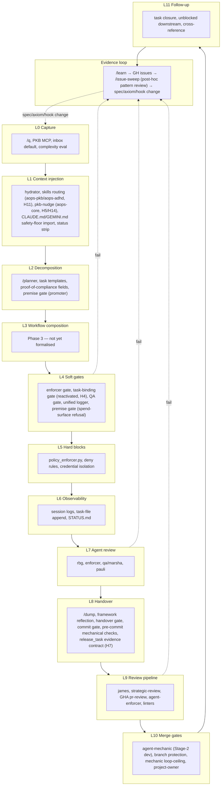

# Enforcement Architecture

**Purpose.** Enforcement's **centre of gravity is the module boundary**, not the in-session pyramid: the hydration/task-binding gate **in** (no mutating work without a task bound via `claim_task`, H4) and the `release_task`-evidence gate **out** (a completion claim must carry independent-verification evidence or a stated failure reason — the **primary enforcement point**, H7) are where the framework actually holds agents accountable. Agents are incentivised, not coerced: "land the plane" — commit → push → `release_task`, or the work is garbage-collected (H10) — is the load-bearing mechanism; see [task-contract.md](task-contract.md) for the full module-boundary contract. The in-session gate pyramid this spec catalogues (§4, §6) is the **backstop** behind that boundary, not the primary mechanism — and within that backstop role it is still **responsive, proportionate, and evidence-driven**: most work happens cheaply and constantly at the base of the pyramid; heavier measures escalate only when lower layers produce evidence they are insufficient.

**Sibling documents — single-source-of-truth split** (aops-3038d47c).

- **`specs/enforcement/enforcement.md`** (this file) — **the authoritative mechanism index.** Every enforcement mechanism has exactly one canonical spec entry, keyed by a stable name, in [§6](#6-mechanism-index-authoritative) below: what it is, what it enforces, how it's configured, its pyramid tier. Also carries the design statement — why enforcement is shaped the way it is, the pipeline/pyramid views, CBA framing. When to reach for it: "what IS this mechanism" or "where should a new rule/gate/check live."
- **`specs/ENFORCEMENT-MAP.md`** — **operative trigger register.** Records only **WHEN** each mechanism fires — trigger, surface, gate mode — and points back to the canonical entry here by name; it does not re-explain what a mechanism is. When to reach for it: "what fires on X" or "what mode is Y in right now."
- **`specs/enforcement/GATES.md`** — **runtime/forensic detail for hook-based gates.** Gates are dev-defined design features with their own operating detail — distinct from the map's configuration rows and this file's mechanism entries. GATES.md is where "how a gate operates" (where it lives in source, how to verify it's firing, how to debug it) lives. When to reach for it: a forensic-debug question about a specific gate.

## Two views of the same mechanisms

The framework has ~40 distinct enforcement mechanisms. Two organising principles are useful for thinking about them.

1. **The pipeline (temporal view).** When in the flow of work does a mechanism fire? Capture → hydration → decomposition → execution → handover → review → merge → follow-up → evidence loop. The mermaid graph in §3 shows this. Labels are `L0`–`L11`, one per pipeline layer. This view answers _when_ a mechanism fires; it is not a severity tier.
2. **The pyramid (escalation view).** Where does a mechanism sit in the regulatory pyramid (§4)? How frequently does it fire, and how invasive is it when it does? Base (high-volume, cheap, non-blocking) → middle (moderate, triggered, warns or opens gates) → tip (rare, heavy, blocks or requires human). The pyramid is the **operative framing** for add/escalate/remove decisions; positions L0–L7 in [`specs/ENFORCEMENT-MAP.md`](../../specs/ENFORCEMENT-MAP.md) are the register-of-record.

These views are **orthogonal**. The same mechanism appears in both. A pipeline-L4 mechanism (soft gate) may sit at the base of the pyramid (runs every tool call, cheap) or in the middle (triggered on threshold). The pipeline L-number is cross-reference; the pyramid position is the cost-benefit assignment.

When reasoning about a framework change, use the pipeline to decide _when_ the intervention fires and the pyramid to decide _how invasive_ it should be — then record the decision as a row in the operative state register.

**A third, orthogonal axis — the module-boundary layer model.** [`pyramid.md`](pyramid.md), [`task-contract.md`](task-contract.md), [`workflow.md`](workflow.md), and [`sign-off.md`](sign-off.md) number the spans of a single work unit as `Layer 0`–`Layer 4` (intra-task loop → turn loop → work-unit contract → workflow → sign-off). This is a **different scheme from both views above** — it reuses the digits `0`–`4` for a distinct purpose, not a third position for the same mechanism. `Layer 1` (turn loop) does not correspond to pipeline `L1` (context injection); `Layer 4` (sign-off) does not correspond to pipeline `L4` (soft gates) or pyramid position `L4`. Do not cross-reference a `Layer N` against an `L` _N_ from either view above as if they were the same axis.

## §3 Pipeline view (temporal)

Edges show control-flow in the common path (top to bottom) and the three most common failure-to-evidence arcs (dotted). The evidence loop closes back to L0 because the _output_ of the loop is spec/axiom/template changes, which propagate forward through the whole pipeline from its start.

The **premise gate** (agent judgment enforcing `judgment-non-delegable` — [`premise-gate.md`](premise-gate.md)) appears twice in this view because it acts at both ends of the spend path: the promoter records the premise judgment at **L2** (task promotion `→ queued`), and the spend surfaces (`/pull`, `/dispatch`, `/supervisor` dispatch) **hard-refuse** at **L4** a task whose premise was never judged. It is an agent judgment, not a hook.

Full catalogue of mechanisms per layer: **see [`specs/ENFORCEMENT-MAP.md`](../../specs/ENFORCEMENT-MAP.md)** — the operative rule -> mechanism register.

## §4 Pyramid view (escalation)

**Responsive regulation theory.** The pyramid is borrowed directly from Ian Ayres & John Braithwaite, _Responsive Regulation: Transcending the Deregulation Debate_ (Oxford University Press, 1992). The framework cannot force any agent to do anything — we can only create _encouragement with detection_. Given that, the choice of _where to intervene_ should follow the principle of least invasion: use the lightest mechanism that catches the failure, and escalate only when evidence shows the lighter mechanism is insufficient. The width of the pyramid at each level represents the **volume × frequency** of enforcement there: a wide base of high-volume soft mechanisms (always-on context injection, voluntary skill invocation, lifecycle hints) tapering to a sharp apex of rare severe responses (LLM-mediated review, branch protection, detached cross-incident review of accumulated reports). The narrower the level, the more reluctantly invoked.

<!-- NS: dont say what its NOT. -->

**Executive vs legislative.** The pyramid itself is neither — it is just a way to **conceptualise rules by escalation cost**, nothing more. The executive/legislative split sits one level down, in what the pyramid organises: **legislative** rules are declared in specs — axioms (the numbered A-rules in [`.agents/rules/AXIOMS.md`](../../.agents/rules/AXIOMS.md)), heuristics, and the full specs backing each system; **executive** mechanisms are the runtime agents and gates (rbg, enforcer, qa, hooks) that actually enforce those rules at whichever pyramid tier they sit. Neither layer enforces itself: a rule does nothing until an executive mechanism acts on it, and an agent has no standing to rewrite a rule mid-session (that's the `/learn` constraint on witnesses, not a property of the pyramid). Promoting a rule into `AXIOMS.md` raises its _weight_ in the L1 always-on injection mechanism — axiom status is content-weighting, not pyramid placement. (Weight comes from being a first-class axiom, not from any ordinal number; axioms are keyed by slug, see §4.0.) Looking up "what enforces `exercise-authority`?" means scanning the axiom × mechanism table in [`specs/ENFORCEMENT-MAP.md`](../../specs/ENFORCEMENT-MAP.md), not the pyramid table.

**Operative use.** The pyramid is **not** a decorative metaphor — it is the structure that organises every add/escalate/remove decision. Each mechanism in [`specs/ENFORCEMENT-MAP.md`](../../specs/ENFORCEMENT-MAP.md) carries an explicit pyramid position (L0–L7); PRs that propose enforcement changes cite that position and justify it against §4.1. The L0–L11 pipeline numbering above and the base/middle/tip tier labels below are different lenses on the same set of mechanisms — the pipeline answers _when_, the pyramid answers _how invasive_.

### §4.0 How AXIOMS.md is written (authoring principles)

<!-- NS: Not convinced this section belongs here.  -->

The legislative layer has its own form discipline. These principles govern how [`.agents/rules/AXIOMS.md`](../../.agents/rules/AXIOMS.md) and its paired review checklist [`.agents/rules/AXIOMS-REVIEW.md`](../../.agents/rules/AXIOMS-REVIEW.md) MUST be written. They are spec rules, not style preferences — an axiom that breaks them is malformed and `rbg` should flag it.

- **Each axiom targets a CLASS of problems, never an instance.** The axioms themselves OBEY the `categorical-imperative` axiom: a rule is admissible only if it is universally constructed and universally construed. An axiom written as a patch for a single incident violates the very axiom it states — it is a bill of attainder against one failure, not law.
- **Per-axiom template.** Each axiom is: a one-line normative principle + at most **3** class-level sharpening clauses **PLUS** at most **ONE** illustration + a review hook. The single `_E.g._` illustration is structurally distinct and does **not** count against the 3-clause budget — an axiom with 3 sharpening clauses and 1 illustration is compliant. The illustration must name a CLASS — never a PR number, task ID, single-client anecdote, or other enumerated instance. Where no class-level illustration is load-bearing, omit it entirely; an instance-level "e.g." is worse than none.
- **Axioms are identified by SLUG, not number.** Each axiom carries a durable, unique, semantically-meaningful slug (e.g. `judgment-non-delegable`) — never an ordinal number. References to an axiom cite its slug (e.g. `[[AXIOMS#judgment-non-delegable]]`), never a position-dependent number. _Why:_ an ordinal couples an axiom's identity to its position, so any reorder or merge renumbers the whole set and breaks every reference across the codebase — a single-source-of-truth / stable-identifier failure (the `single-source-of-truth` axiom). A slug decouples identity from position: the set can be reordered, merged, or extended without breaking a single reference, and a slug is self-documenting where a bare number is not.
- **Ordering is by DOCUMENT POSITION, not by identifier.** The Categorical Imperative sits first as the primary axiom — the one every other axiom instantiates. That primacy is expressed by position plus an explicit note in that axiom, not by a number; reordering the rest changes nobody's identity.
- **No unnumbered or afterthought tier.** Every axiom is a first-class entry. There is no appendix of lesser rules, no trailing "see also" tier carrying normative weight — first-class status is conferred by being an axiom, not by holding a low number.
- **Hard 1:1 invariant.** Every axiom in `AXIOMS.md` has exactly one correspondingly-slugged block in `AXIOMS-REVIEW.md` (the auditor questions `rbg` applies), and vice versa — no orphans on either side, keyed by slug. This is itself a `single-source-of-truth` obligation on the pair: the two files are one rule set expressed as law and as audit, and they MUST be reworked in lockstep so the slug set never diverges.

Mechanisms are placed in tiers based on **frequency of activation × invasiveness when active** — not on where they sit in the pipeline.

**Coercion and cost are orthogonal.** Invasiveness (how hard a mechanism forces) is not cost (what it takes to keep running) — conflating them misplaces two rungs specifically:

- **Auto-mode classifier (L5)**: low coercion (advisory-capable) but high cost — an LLM inference on every fire, with **theatre** as its dominant failure mode. Narrow, measurement-gated: seed a rule only where judgment is genuinely qualitative and the caught failure justifies per-call LLM cost. It's PreToolUse/per-action; end-of-turn nudges belong at the Stop-hook layer (`qa`/`handover`, L2) instead.
- **Least-privilege chokepoint/funnel (L4)**: high coercion (architecturally unforgeable — deny by default, grant only to the one agent that must act) but high recurring cost — a coordination tax on every gated call, a throughput bottleneck, and relocated assurance. Last-resort: deploy only after instruction → deterministic gate → post-hoc enforcer have demonstrably failed.

The CBA (§4.1 item 4) therefore costs _both_ axes — per-invocation cost and failure-mode cost (theatre, bottleneck, relocated assurance). Escalation is never free.

| Tier       | Definition                                                             | Mechanisms (with pipeline layer cross-reference)                                                                                                                                                                                                                                                                                                                                                                                                                                                                                                                                                                                                                                                                                                                                                                                                                                                                                                                                                   |
| ---------- | ---------------------------------------------------------------------- | -------------------------------------------------------------------------------------------------------------------------------------------------------------------------------------------------------------------------------------------------------------------------------------------------------------------------------------------------------------------------------------------------------------------------------------------------------------------------------------------------------------------------------------------------------------------------------------------------------------------------------------------------------------------------------------------------------------------------------------------------------------------------------------------------------------------------------------------------------------------------------------------------------------------------------------------------------------------------------------------------- |
| **Base**   | High-volume, low-invasiveness, non-blocking, runs constantly           | lightweight hydrator (L1), skills routing table (L1 — owned by aops-pkb/aops-adhd, H11), pkb-nudge (L1 — stays in aops-core, lowest layer, fires everywhere including subagents, H5/H14), CLAUDE.md / AGENTS.md safety-floor `@`-import (L1), gate status strip (L1), pre-commit mechanical checks (dprint/ruff/markdownlint/actionlint/no-fallbacks/uv-lock and others — local git-commit hook, pipeline L8; see [§6](#6-mechanism-index-authoritative)), unified logger (L6), task-file append (L6), session logs (L6), task template conventions (L2)                                                                                                                                                                                                                                                                                                                                                                                                                                           |
| **Middle** | Moderate volume, triggered by threshold or event, warns or opens gates | enforcer/rbg gate (L4 — threshold default 50, `gates.rbg_threshold`), rbg-review gate (L4→L2 — armed by default, posture expressed only via env vars/`polecat.yaml`, H3), task-binding gate — reactivated (L2/L4, H4), enforcer subagent invocation (L7), QA gate (L4 — live, unchanged, H10/H12), /planner decomposition checks (L2), proof-of-compliance tool fields (L2), premise gate — agent judgment, hard-refuses (promoter L2 / spend-surface refusal L4; see [premise-gate.md](premise-gate.md)), rbg subagent invocation (L7), qa / marsha subagent invocation (L7), james orchestration (L9), pr-reviewer GHA (L9), agent-enforcer GHA (L9), linter workflows (L9), commit gate (L8), `/issue-sweep` post-hoc pattern review (L11 evidence loop; see [§5](#5-evidence-loop)), CC auto-mode classifier `soft_deny` (judgment per-action gate, pipeline L4 / pyramid L5 — context-overridable deny, reason returned to the agent; see [auto-mode-classifier.md](auto-mode-classifier.md)) |
| **Tip**    | Rare, heavy — hard-blocks or requires human judgment                   | policy_enforcer.py hard blocks (L5), settings.json deny rules (L5), credential isolation (L5), handover gate (L8), in-pipeline `admit` job `pr-fix-loop` Environment gate (L10), branch protection (L10), mechanic loop-ceiling (L10), project-owner / admin approval (L10), CC auto-mode classifier `hard_deny` (pipeline L4 / pyramid L5 — absolute pre-execution block)                                                                                                                                                                                                                                                                                                                                                                                                                                                                                                                                                                                                                         |

**Default to instructions.** Agents are intelligent and instructions work in the large majority of cases; the burden of proof is on adding a mechanism, not on keeping behaviour in prose. Every new hook or gate is permanent complexity and a new place for the framework to fail. Prefer the lightest sufficient instruction; prefer making an existing instruction land (relocate, propagate, strengthen) over creating a new mechanism. The base prompt tiers (L1 SessionStart reads, L2 lifecycle injection, L3 voluntary skills) are **delivery channels**, and within each the instruction can be tuned across a wide insistence / urgency / visibility / salience / placement spectrum — see [`enforcement-design.md`](../../aops-core/skills/aops/references/enforcement-design.md) ("Within-class Insistence & Placement Spectrum"). "Escalating a failure" at a base tier means **first walking that spectrum within the current mechanism class**; crossing into a heavier mechanism class is the move of last resort, not the default.

**Escalation rules.**

- **Escalate up** only when the evidence loop (§5) shows a base-tier mechanism is being bypassed with reproducible consequences — and only after confirming the instruction was clear, salient, correctly placed, and propagated to every surface that hit the failure. A quiet, mislocated, or unpropagated instruction is **not** evidence the tier is exhausted; it's evidence the within-tier spectrum (see [`enforcement-design.md`](../../aops-core/skills/aops/references/enforcement-design.md) — "Within-class Insistence & Placement Spectrum") was never walked.
- **Bias hard against new hard gates.** Each hard gate (L5+/tip) is permanent maintenance and a new failure surface. Add/escalate proposals into the tip need §4.1 CBA evidence plus explicit demonstration that rungs 5 (relocation), 6 (propagation), and 7 (structured) of the within-class spectrum were tried — the L4 chokepoint especially (see above).
- **De-escalate down** when evidence shows a tip-tier measure has been unnecessary for a full feedback cycle — a middle-tier warn or base-tier reminder may suffice.
- **Never guess.** With no evidence either way, the current placement holds — changes come from §5 evidence, not authorial intuition.

### §4.1 PR requirements for enforcement changes

<!-- NS: this specific review stuff doesnt belong in this spec.  -->

This applies to PRs that **add, escalate, or remove** a row in [`specs/ENFORCEMENT-MAP.md`](../../specs/ENFORCEMENT-MAP.md) — a new gate, a position change (e.g. L1→L3), a new axiom, an additional hook firing surface, or removing one. Bug fixes within an existing enforcement surface at the same position (correcting wrong logic or wrong prose in an existing skill, agent, hook, or gate) do NOT require CBA — they need only a clear description of the bug and the corrective edit. User-directed architectural changes skip the ≥3 recurrence requirement but still require pyramid-position reasoning to document where the fix lands.

Any PR that adds, escalates, or removes enforcement MUST include a **Cost-Benefit Analysis** block in the PR body:

1. **Friction evidence**: ≥3 concrete recurrences with links (transcript, PR, issue, /retro report) for add/escalate proposals. Fewer than 3 → close as premature unless explicitly directed by the user.
2. **Cheapest plausible position**: which row of the pyramid could reasonably address this?
3. **Why escalate above that position (if escalating)?**: what was tried at the cheaper position; specifically why it failed, with evidence.
4. **Ongoing cost**: token cost per fire × fire frequency, or latency estimate — **and**
   the **failure-mode cost** (e.g. classifier theatre / death-by-denial; funnel
   coordination-tax + relocated assurance). A mechanism cheap per fire but corrosive when
   it misfires is not cheap. Use the Cost/Impact column format from the operative register.
5. **Reversibility**: if this doesn't reduce recurrences in the next 5 /retro reviews, how do we retire it?

Reviewers should WARN on missing CBA, BLOCK on missing items 1, 4, or 5.

### §4.2 Worked example: `exercise-authority`

`exercise-authority` ("Exercise Authority — Calibrate Capability", `.agents/rules/AXIOMS.md`) is an axiom — a rule, not a pyramid position. Its **enforcement footprint** spans multiple tiers of the executive pyramid:

| Tier | Mechanism enforcing `exercise-authority` | What it does                                                                    |
| :--- | :--------------------------------------- | :------------------------------------------------------------------------------ |
| L1   | AXIOMS.md inject                         | Always-on prompt-cached load at SessionStart; ~100 lines per session.           |
| L6   | `rbg` PR-time review                     | Reads diff against `exercise-authority`; advisory verdict for the orchestrator. |
| L6   | `marsha` QA verifier                     | Checks task-completion claims for over-deference.                               |
| L7   | `enforcer-status` GHA                    | LLM review fed into branch-protection AND-gate at merge.                        |

The decision to **promote `exercise-authority` into an axiom** (vs leaving the rule as scattered surface-text instructions) was an explicit cost-benefit decision. Axiom status raises the rule's **weight inside the L1 always-on inject mechanism**; it does not move the enforcement to a different tier. (The weight comes from the rule becoming a first-class axiom, not from any number — axioms are keyed by slug, see §4.0.)

- **Friction**: recurring over-deference across multiple agent surfaces, evidenced by repeated /retro findings.
- **Cheaper position attempted first**: surface-text L1 fixes (per-skill CORE.md / butler.md / planner). Each attempt reached one more surface; the next session hit a surface the patch hadn't reached.
- **Why axiom-promotion justified**: per-surface L1 surface-text fixes did not beat the trained "seek confirmation" reflex. Moving the rule into always-on AXIOMS.md (still L1 — same mechanism class) makes it cross-cutting in a way no per-surface edit could match. Promotion to a first-class axiom is the weight-raising act.
- **Forward cost**: ~100 lines permanent in always-on AXIOMS.md, prompt-cached. Surface citations remain L1 (≤10 lines each).
- **Future fixes** against any of `exercise-authority`'s edges should land at the cheapest sufficient position — usually L1 surface-text propagation, not new axioms. Minting a new axiom against the same root would repeat the failure mode this fix resolved.
- **Reversibility / acceptance criterion**: zero recurrences of the `exercise-authority` failure-mode tells across the next 5 /retro reviews. If the criterion fails, the documented contingency is escalation to L6 (pre-Stop LLM hook).

This serves as the template for axiom-weight escalation: the CBA must look like this, with named prior attempts and explicit reversibility. The axiom is the rule; the pyramid tiers are the mechanisms enforcing it — confusing the two leads to inflating the axiom count rather than thickening the enforcement footprint. (For a mechanism whose footprint spans two pipeline positions under a _single_ axiom, see the premise gate — [`premise-gate.md`](premise-gate.md) — which enforces `judgment-non-delegable` at both L2 promotion and L4 spend-surface refusal.)

### §4.3 How to update the operative register

1. **Observe** failure (QA, /retro, /sleep, report).
2. **File evidence** via `/learn`.
3. **Locate rule** in the axiom-keyed registry in [`specs/ENFORCEMENT-MAP.md`](../../specs/ENFORCEMENT-MAP.md).
4. **Propose position change** (escalate/demote) — cite the L0–L7 pyramid position, not the action vocabulary.
5. **Update the row** in the same PR (P#65).

## §5 Evidence loop

The pyramid _learns_ by an evidence loop: incidents become anonymised reports become patterns become recommendations become rule changes. The loop is split into a witness phase and a judge phase as a routine division of labor — the agent that lived through the failure files the forensic facts; a separate, detached context later reads accumulated reports and decides whether a change is warranted. This keeps the change driven by recurrence across incidents rather than the salience of the most recent one.

### §5.1 User story: how the framework gets better

Two flows, separated by design. The user is the client of both, but each flow runs in its own context with its own job.

#### Flow 1 — File a bug (incident phase, forensic)

> "Something just went wrong in this session."

When an agent hits friction (tool bug, missing instruction, dead end), it MUST invoke the `/learn` skill immediately at the point of discovery. One friction = one `/learn` call. Do NOT ask the user "want me to file this?" or "happy to file if you confirm" — filing friction is unilateral.

The dispatched agent reads the transcript and files a GitHub issue containing only:

1. **What happened** — quoted from the transcript.
2. **Root cause category** — one of the documented categories.
3. **Rule already in place (if any)** — which axiom, gate, hook, or skill instruction was supposed to catch this, and at what position.
4. **Impact** — concrete cost (turns burned, work to undo, trust hit).

That's it. **The /learn agent is forbidden from proposing a fix.** It is the witness, not the legislator. The user doesn't have to think about "what should the framework do about this" at file time — they just have to report what happened. If they hit the same problem three times, that's three forensic issues; the recurrence count is the evidence base later.

The user can file an issue by hand instead — same constraints. A bare "please add a gate that does X" issue is in scope to be edited down to forensic facts before it gets used.

#### Flow 2 — Improve the framework (review phase, detached; the **post-hoc pattern review** mechanism)

> "Let's look at what's piled up and decide what to actually change."

<!-- NS: DRY: move the stuff on escalation to here, keep it concise. No need to describe the mechanics of individual skills, just the operation & function -->

Periodically — when the issue queue feels heavy, or on a cadence the user sets — the user runs `/issue-sweep`. The dispatched agent enters with no prior exposure to any individual incident. It:

1. Pulls up to 20 open issues and classifies each (close-stale, comment-only, single-task, fix-epic, defer).
2. For any issue whose remediation would touch the framework (an axiom, gate, hook, skill instruction, or row of the operative register), runs the pyramid review: generalise the category → check existing mechanisms → classify the failure shape (propagation / escalation / rule absent) → default to the cheapest sufficient position → cite the specific row of the register the fix propagates from or would add.
3. Surfaces the proposed cycle to the user (`AskUserQuestion` gates on each disposition group). The user approves, edits, or defers.
4. On `y`: files fix-epics or single tasks, stamps labels, logs the cycle. Fix-epics stay `queued` until the user dispatches them via `/supervisor`.

The sweep agent will not propose **adding or escalating** a rule from one incident (a new gate, axiom, position-bump, or hook surface) — that needs ≥3 cited recurrences plus the §4.1 CBA evidence (cheaper position tried, ongoing cost, reversibility). This bar does NOT apply to **fixes** within an existing surface at the same position (a misrouting skill, a broken hook, an incomplete gate) — one clear forensic incident is sufficient for `fix-epic` or `single-task`. Nor does it apply to **directed architectural changes** the user has explicitly authorised: the user's authorisation substitutes for the recurrence count, not for the pyramid reasoning.

So: single incidents that are bugs get fixed immediately; single incidents that are escalation proposals get logged and deferred pending pattern.

#### Why the split

Recency is bias. The agent that just lived through a failure proposes fixes shaped by that failure — usually a new gate or axiom built around one incident, which doesn't fit the seamless web of existing rules. By separating the witness role from the judicial role, the framework's volume and direction of change is governed by cross-incident patterns visible from outside, not by the urgency a single failure feels from inside. The user gets to be honest in flow 1 (no need to over-frame a problem to justify a fix) and disciplined in flow 2 (no rule changes without the evidence base).

#### What the user does NOT need to do

<!-- NS: should these be user stories? shoulde they be removed if not important?  -->

- Propose remediations at /learn time. Just describe what happened.
- Worry about whether their issue duplicates an existing one. The sweep agent groups by root cause and bumps volume on duplicates.
- Choose a position (L0–L7) for any rule. The sweep agent applies the pyramid; the user gates the proposal.
- Maintain the operative register by hand. Approved fix-epics that add or move a row update [`specs/ENFORCEMENT-MAP.md`](../../specs/ENFORCEMENT-MAP.md) as part of the change (P#65).

## §6 Mechanism index (authoritative)

This is the **single canonical entry per mechanism** (aops-3038d47c): what it is, what it enforces, how it's configured, its pyramid tier. [`specs/ENFORCEMENT-MAP.md`](../../specs/ENFORCEMENT-MAP.md) rows point back here by name and carry only the trigger/level/mode; they do not restate this content. Per-gate runtime/forensic detail (source location, verify, debug): [`specs/GATES.md`](GATES.md). PR/merge pipeline contract: [`pr-pipeline.md`](../workflows/pr-pipeline.md).

**These are backstop mechanisms.** The primary enforcement point is the module boundary — the task-binding gate in, the `release_task`-evidence gate out (see Purpose above and [task-contract.md](task-contract.md)). Everything indexed below exists to catch mid-session drift the boundary check can't see (honesty, safety, periodic axiom compliance) while the boundary itself carries the incentive-first weight.

- When multiple gates fire on the same hook event, the router merges their outputs into one response.
- This is what makes "least invasion first" (§10) actually hold at the wire level: a lighter gate's `allow` can never mask a heavier gate's `deny`.

### §6.1 Live mechanisms

**Standing rule, all gates (H3).** Gate posture — armed/disarmed, on/off, which mode a surface runs in — is expressed **only** via environment variables and `polecat.yaml`. No gate's mode may be selected by on/off, session-type, or other state code in the repo; `rbg-review` (below) is the sharpest example but the constraint binds every gate in this index, not just that one. Per-gate mode-key detail: [`GATES.md`](GATES.md#config-plumbing).

| Mechanism                                                                                                                                                   | What it is                                                                                                                                                                                                                                                                | Enforces                                                  | Configured via                                                                                                                                                      | Tier       | Detail                                                                                                                                 |
| :---------------------------------------------------------------------------------------------------------------------------------------------------------- | :------------------------------------------------------------------------------------------------------------------------------------------------------------------------------------------------------------------------------------------------------------------------ | :-------------------------------------------------------- | :------------------------------------------------------------------------------------------------------------------------------------------------------------------ | :--------- | :------------------------------------------------------------------------------------------------------------------------------------- |
| `enforcer`/`rbg` gate                                                                                                                                       | Periodic PreToolUse compliance re-audit; dispatches the `rbg` subagent every N write ops.                                                                                                                                                                                 | All axioms                                                | `gates.rbg_threshold` — **50 default** (`gate_config.py:_RBG_THRESHOLD_DEFAULT`)                                                                                    | Middle     | [`GATES.md#enforcer-gate`](GATES.md#enforcer-gate)                                                                                     |
| `rbg-review` gate                                                                                                                                           | End-of-session Stop axiom audit; blocks exit until `rbg` has run.                                                                                                                                                                                                         | All axioms                                                | `gates.rbg_review` / `RBG_REVIEW_GATE_MODE` — armed by default on dispatched surfaces; posture is **env-var/`polecat.yaml` only, no on/off/session-type code** (H3) | Middle–Tip | [`GATES.md#rbg-review-gate`](GATES.md#rbg-review-gate)                                                                                 |
| `qa` gate                                                                                                                                                   | Stop completion-quality check — blocks exit on a claimed-but-unverified task.                                                                                                                                                                                             | `exercise-authority`, show-don't-tell                     | `gates.qa` — machinery unchanged (H10/H12)                                                                                                                          | Middle     | [`GATES.md#qa-gate`](GATES.md#qa-gate)                                                                                                 |
| `handover` gate                                                                                                                                             | Exit-discipline Stop check — commit / task-update / reflection before exit.                                                                                                                                                                                               | `halt-on-failure`                                         | `gates.handover` — machinery unchanged (H10/H12)                                                                                                                    | Middle–Tip | [`GATES.md#handover-gate`](GATES.md#handover-gate)                                                                                     |
| Task-binding gate                                                                                                                                           | Blocks work (mutating tool use) until a task is bound to the session via `claim_task`. **Reactivated** (H4).                                                                                                                                                              | Judgment/accountability — no work without a bound task    | Target state; wiring lands with the mechanics-separation task (aops-5b9e95c4)                                                                                       | Middle     | [`ENFORCEMENT-MAP.md`](../../specs/ENFORCEMENT-MAP.md), [task-contract.md](task-contract.md)                                           |
| `ida` gate (Stop honesty check + `AskUserQuestion` nudge)                                                                                                   | Fire-once Stop honesty/criterion-substitution reminder plus a PreToolUse `AskUserQuestion` nudge. **Still live in code** — `gates/definitions.py`'s `GateConfig(name="ida", ...)` was never removed. **Disposition OPEN**, not retired — see the correction note in §6.2. | `honest-epistemics`                                       | `gates.ida` — pending the session-type walk ([[aops_3eabb0ae]])                                                                                                     | Middle     | [`GATES.md#ida-gate`](GATES.md#ida-gate)                                                                                               |
| `pkb-nudge`                                                                                                                                                 | UserPromptSubmit static reminder to search the PKB before re-deriving procedure.                                                                                                                                                                                          | `honest-epistemics`, `single-source-of-truth`             | Always-on; stays at the **lowest layer (aops-core)**, fires everywhere incl. subagents (H5/H14)                                                                     | Base       | [`ENFORCEMENT-MAP.md`](../../specs/ENFORCEMENT-MAP.md)                                                                                 |
| Skills-routing hint (`hydration.warn`)                                                                                                                      | UserPromptSubmit routing-table hint, main session only.                                                                                                                                                                                                                   | `do-one-thing`                                            | Ownership **moves up to aops-pkb/aops-adhd** (H11) — aops-core stops injecting this at the router level                                                             | Base       | [`ENFORCEMENT-MAP.md`](../../specs/ENFORCEMENT-MAP.md)                                                                                 |
| Safety floor (`CORE.md`)                                                                                                                                    | SessionStart `@`-import — one injected copy for every surface.                                                                                                                                                                                                            | `halt-on-failure`, `data-boundaries`                      | `CLAUDE.md`/`GEMINI.md` `@`-import (no hook read — `session_env_setup.py`'s attempt at this is retired, H9)                                                         | Base       | [`ENFORCEMENT-MAP.md`](../../specs/ENFORCEMENT-MAP.md) § Known gaps                                                                    |
| Premise gate                                                                                                                                                | Two-judge (`rbg`+`pauli`) dispatch-time judgment that a task's premise clears before compute is spent.                                                                                                                                                                    | `judgment-non-delegable`                                  | `/strategic-review --premise`, dispatcher-side hard-refuse on BOUNCE                                                                                                | Middle     | [`premise-gate.md`](premise-gate.md)                                                                                                   |
| Evidence contract (`release_task`)                                                                                                                          | The completion claim must carry independent-verification evidence, or a stated failure reason. **Primary enforcement point** (H7); agents "land the plane" — commit → push → `release_task`, or the work is garbage-collected (H10).                                      | `honest-epistemics`                                       | `mem` MCP server schema floor (coordinates with B2/SEAM-2)                                                                                                          | Middle     | [task-contract.md](task-contract.md)                                                                                                   |
| Pre-commit mechanical checks                                                                                                                                | Local git-commit hooks: `dprint fmt`, `ruff`/`ruff-format`, `markdownlint-cli2`, `actionlint`, MCP-name normalizer, no-orphan-md, no-dist-commit, no-silent-fallbacks, uv-lock-check, and standard hygiene hooks.                                                         | `halt-on-failure`, `single-source-of-truth`, doc-taxonomy | `.pre-commit-config.yaml`                                                                                                                                           | Base       | `.agents/rules/RULES.md#framework-pre-commit-checks`                                                                                   |
| Project-local git-push safety hooks                                                                                                                         | Pre-push hook blocking direct pushes to `main`, installed **at provisioning** in USER work repos — not plugin code. Replaces `aops-core`'s retired `git_safety.py` (H17). Complements polecat's existing worktree-tracking fix at creation.                               | `data-boundaries`                                         | Provisioning script / project git hooks (target — lands with aops-5b9e95c4)                                                                                         | Base       | [`ENFORCEMENT-MAP.md`](../../specs/ENFORCEMENT-MAP.md)                                                                                 |
| Post-hoc pattern review (`/issue-sweep`)                                                                                                                    | Periodic detached review of accumulated `/learn` reports; judges cross-incident recurrence before proposing a rule change.                                                                                                                                                | `single-source-of-truth` (evidence-loop discipline)       | User-run cadence                                                                                                                                                    | Middle     | [§5 Evidence loop](#5-evidence-loop)                                                                                                   |
| PR-pipeline mechanisms (`enforcer-status`, `qa-status`, `admit-status`, `alignment-status`, `comment-triage-status`, branch protection, CODEOWNERS, fixers) | Sign-off layer over the whole workflow unit — see the dedicated register.                                                                                                                                                                                                 | Varies per row                                            | See register                                                                                                                                                        | Tip        | [`ENFORCEMENT-MAP.md` §3](../../specs/ENFORCEMENT-MAP.md), [`pr-pipeline.md`](../workflows/pr-pipeline.md), [sign-off.md](sign-off.md) |

**Module ownership** (H13/H16): the gate engine, every surviving gate, and observability — `unified_logger` and the transcript family (`scripts/transcript.py`, `lib/transcript_parser.py`, `transcript_paths.py`, `subagent_transcript.py`, `session_reader.py`, `session_summary.py`, `secret_redaction.py`) — stay in **aops-core**, not aops-pkb: aops-pkb is outer to the task contract, gates are inner. Only the skills-routing hint moves up (H11); `pkb-nudge` does not (H14). Ownership is a code-home decision, not a deployment restriction: observability/transcript tooling must run **wherever work gets done, including remote surfaces** (H16), not only the primary host.

**Uniform application** (H8, scope-disciplined by H12): gates fire on **all** sessions and events — main, subagent, worker — except PreToolUse, which stays skipped for subagent-classified sessions as a deliberate, permanent exception. Full mechanics and rationale → [`GATES.md` § Subagent & worker session scope](GATES.md#subagent--worker-session-scope).

### §6.2 Retired / archived (H1–H18)

Documented for traceability — these no longer exist as in-session mechanisms; the concern each addressed either moved elsewhere or is judged unnecessary given the module-boundary thesis (rulings C1–C10, P1–P13).

> **Note.** The `ida` gate REMAINS LIVE in code (`aops-core/lib/gates/definitions.py`, `GateConfig(name="ida", ...)`) and is listed in §6.1 above with disposition OPEN, pending the session-type walk ([[aops_3eabb0ae]]).

| Mechanism                                         | Disposition                                                                                                                                                                                                                                                                                                                               |
| :------------------------------------------------ | :---------------------------------------------------------------------------------------------------------------------------------------------------------------------------------------------------------------------------------------------------------------------------------------------------------------------------------------- |
| `sentinel` gate                                   | **DELETED** (H1) — failed the "no shitty NLP" rule (destructive-verb + path regex). The concern is operationalised properly by container isolation, not in-session string matching.                                                                                                                                                       |
| `session_env_setup.py` + env-provisioning quartet | **Retired from the plugin** (H9/H18) — `env_provision.py` dies with it; `agent_env.py` moves to the test harness; `host_secrets.py` parks with the (undesigned) `aops-polecat` plugin (RULING B3); `path_bootstrap.py` stays as a shim wherever gates need it. Environment correctness moves to provisioning, not per-session hook setup. |
| `ntfy_notifier`                                   | **Archived** (H15) — unused.                                                                                                                                                                                                                                                                                                              |
| `is_subagent` PostToolUse skip                    | **Retired** (H8/H12) — see Uniform application above. The PreToolUse half is **not** retired; it is a retained, permanent exception — see [§6.1 Live mechanisms](#61-live-mechanisms) and [`GATES.md` § Subagent & worker session scope](GATES.md#subagent--worker-session-scope).                                                        |
| `$AOPS_TASK_ID`                                   | **Never build on this** (H10 rider) — it has never worked. The invariant to rely on instead: one session claims exactly one task (possibly multiple subtasks).                                                                                                                                                                            |
| `git_safety.py` (aops-core)                       | **Retired from the plugin** (H17) — its only caller (`session_env_setup.py`) is gone. The push-to-main concern survives as project-local git-push safety hooks (§6.1) plus polecat's existing worktree-tracking fix at creation.                                                                                                          |

## §9 Workflow composition (Phase 3 placeholder)

Task-creating agents compose compliant workflows by combining axioms, heuristics, and procedures at task-creation time. The agent enumerates which axioms apply to the task, which heuristics flag likely hazards, and which procedures are the current recommended sequence — then assembles them into a workflow the executing agent runs.

**This layer is not yet formalised.** It is named here as pipeline L3 so the pyramid/map/mechanism specs have a consistent reference point. Phase 3 of `task-e64e29c5` and parent-epic `task-b5fec0b5` Thread 4 (workflows-as-logical-statements) carry the design work.

## §10 Design principles

1. **Layer defences** — no single mechanism is reliable. Combine base, middle, and tip tiers for any failure mode worth catching.
2. **Accept imperfection** — enforcement is encouragement with detection, not coercion. Design for drift, not for prevention.
3. **Measure before changing** — the §5 evidence loop is the authority for tier changes. Authorial intuition is not evidence.
4. **Least invasion first** — exhaust the within-prompt insistence/placement spectrum before crossing mechanism classes: gentle reminder → reasoned instruction → emphasis → **relocation** (move the instruction to the failing surface) → **propagation** (every surface that hits the failure carries the rule) → structured / parsed format. _Only then_ leave the prompt tier: conventions before templates; templates before soft gates; soft gates before hard blocks; hard blocks before human approval. Escalate only on §5 evidence — and the evidence must show the within-tier spectrum was walked, not just that the rule was once stated and once ignored. (Anti-gate bias: see §4 Escalation rules; cross-reference [`enforcement-design.md`](../../aops-core/skills/aops/references/enforcement-design.md) — "Within-class Insistence & Placement Spectrum".)
5. **Show, don't tell** — where compliance is claimed, require information that demonstrates it. Tool signatures and task templates should carry the proof into the schema rather than accept reassurance.

## §11 Component responsibilities

Enforcement failures fall into five root-cause categories:

| Category          | Definition                                                 |
| ----------------- | ---------------------------------------------------------- |
| Clarity Failure   | Instruction ambiguous or insufficiently emphasised         |
| Context Failure   | Component did not provide relevant information when needed |
| Blocking Failure  | Component did not block what it promised to block          |
| Detection Failure | Component did not catch a violation it promised to catch   |
| Gap               | No component existed for this case — create one            |

Multiple categories can apply; defence-in-depth can fail at multiple layers.

### Root-cause analysis protocol

1. Was there a rule? Check AXIOMS / HEURISTICS / project local rules.
2. Did the task suggest the correct workflow?
3. Did the agent follow the workflow? If yes, was output correct?
4. Should action have been reviewed ex ante? By whom?
5. Should action have been blocked? By what mechanism?
6. Should an ex post review have caught a problem?

If all components met their responsibilities and the failure still occurred: **Gap** — create a new mechanism at the appropriate position.
