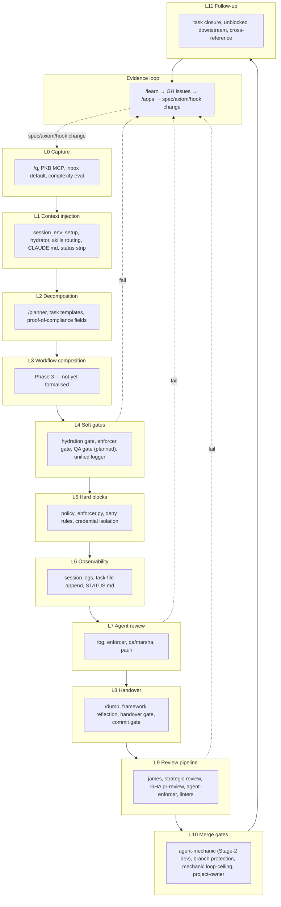

# Enforcement Architecture

> **Spec, not state.** This file is the **design statement** for how the
> aops framework enforces its rules: the regulatory pyramid that frames
> all enforcement choices, the escalation discipline, the PR
> cost-benefit requirements, the worked `exercise-authority` example, the user-facing
> witness → judge separation, and the evidence loop that drives all
> enforcement change. The **operative state register** — every
> mechanism currently in play, its pyramid position, and the axiom-keyed
> rule registry — lives in
> [`specs/ENFORCEMENT-MAP.md`](../../specs/ENFORCEMENT-MAP.md).
> `rbg` blocks on the map's currency via P#65.

**Purpose.** Enforcement is **responsive, proportionate, and evidence-driven**: most work happens cheaply and constantly at the base of the pyramid; heavier measures escalate only when lower layers produce evidence they are insufficient.

**Sibling documents.**

- **`specs/ENFORCEMENT-MAP.md`** — **operative state register** (canonical SSoT). Pyramid-position assignments, every runtime hook / pre-commit hook / gate / PR-pipeline agent, plus the axiom-keyed cross-reference. When to reach for it: "what is currently catching X" or "what does it cost."
- **`specs/enforcement/enforcement.md`** (this file) — design statement. When to reach for it: deciding where a new rule, gate, or check should live; understanding why enforcement is shaped the way it is; PR cost-benefit framing.
- **`specs/enforcement/enforcement-mechanisms.md`** — per-mechanism reference catalogue keyed to the L0–L11 pipeline view (companion design-narrative spec). When to reach for it: schema-shaped details for a single mechanism.
- **`specs/enforcement/ultra-vires-enforcer.md`** — design doc for the `enforcer` agent + PreToolUse gate.
- **`specs/enforcement/enforcement-map.md`** — redirect stub pointing at `specs/ENFORCEMENT-MAP.md` (superseded 2026-05-20).
- **`specs/GATES.md`** — **state SSoT** for the runtime gate catalogue (where each lives in source, how it's configured, how to verify firing, how to debug). When to reach for it: a forensic-debug question about a specific gate.

## Two views of the same mechanisms

The framework has ~40 distinct enforcement mechanisms. Two organising principles are useful for thinking about them.

1. **The pipeline (temporal view).** When in the flow of work does a mechanism fire? Capture → hydration → decomposition → execution → handover → review → merge → follow-up → evidence loop. The mermaid graph in §3 shows this. Labels are `L0`–`L11`, one per pipeline layer. This view answers _when_ a mechanism fires; it is not a severity tier.
2. **The pyramid (escalation view).** Where does a mechanism sit in the regulatory pyramid (§4)? How frequently does it fire, and how invasive is it when it does? Base (high-volume, cheap, non-blocking) → middle (moderate, triggered, warns or opens gates) → tip (rare, heavy, blocks or requires human). The pyramid is the **operative framing** for add/escalate/remove decisions; positions L0–L7 in [`specs/ENFORCEMENT-MAP.md`](../../specs/ENFORCEMENT-MAP.md) are the register-of-record.

These views are **orthogonal**. The same mechanism appears in both. A pipeline-L4 mechanism (soft gate) may sit at the base of the pyramid (runs every tool call, cheap) or in the middle (triggered on threshold). The pipeline L-number is cross-reference; the pyramid position is the cost-benefit assignment.

When reasoning about a framework change, use the pipeline to decide _when_ the intervention fires and the pyramid to decide _how invasive_ it should be — then record the decision as a row in the operative state register.

## §3 Pipeline view (temporal)



Edges show control-flow in the common path (top to bottom) and the three most common failure-to-evidence arcs (dotted). The evidence loop closes back to L0 because the _output_ of the loop is spec/axiom/template changes, which propagate forward through the whole pipeline from its start.

Full catalogue of mechanisms per layer: **see [`specs/enforcement/enforcement-mechanisms.md`](enforcement-mechanisms.md)** (companion). For the operative register, see [`specs/ENFORCEMENT-MAP.md`](../../specs/ENFORCEMENT-MAP.md).

## §4 Pyramid view (escalation)

**Responsive regulation theory.** The pyramid is borrowed directly from Ian Ayres & John Braithwaite, _Responsive Regulation: Transcending the Deregulation Debate_ (Oxford University Press, 1992). The framework cannot force any agent to do anything — we can only create _encouragement with detection_. Given that, the choice of _where to intervene_ should follow the principle of least invasion: use the lightest mechanism that catches the failure, and escalate only when evidence shows the lighter mechanism is insufficient. The width of the pyramid at each level represents the **volume × frequency** of enforcement there: a wide base of high-volume soft mechanisms (always-on context injection, voluntary skill invocation, lifecycle hints) tapering to a sharp apex of rare severe responses (LLM-mediated review, branch protection, detached cross-incident review of accumulated reports). The narrower the level, the more reluctantly invoked.

**Executive vs legislative.** The pyramid is **executive only** — it lists the mechanisms that act on agent behaviour. Axioms (the numbered A-rules in [`.agents/rules/AXIOMS.md`](../../.agents/rules/AXIOMS.md)) and heuristics are **legislative**: they declare what the rules are. The rules don't enforce themselves; they are _enforced by_ mechanisms across multiple pyramid tiers. Promoting a rule into `AXIOMS.md` raises its _weight_ in the L1 always-on injection mechanism — axiom status is content-weighting, not pyramid placement. (Weight comes from being a first-class axiom, not from any ordinal number; axioms are keyed by slug, see §4.0.) Looking up "what enforces `exercise-authority`?" means scanning the axiom × mechanism table in [`specs/ENFORCEMENT-MAP.md`](../../specs/ENFORCEMENT-MAP.md), not the pyramid table.

**Operative use.** The pyramid is **not** a decorative metaphor — it is the structure that organises every add/escalate/remove decision. Each mechanism in [`specs/ENFORCEMENT-MAP.md`](../../specs/ENFORCEMENT-MAP.md) carries an explicit pyramid position (L0–L7); PRs that propose enforcement changes cite that position and justify it against §4.1. The L0–L11 pipeline numbering above and the base/middle/tip tier labels below are different lenses on the same set of mechanisms — the pipeline answers _when_, the pyramid answers _how invasive_.

### §4.0 How AXIOMS.md is written (authoring principles)

The legislative layer has its own form discipline. These principles govern how [`.agents/rules/AXIOMS.md`](../../.agents/rules/AXIOMS.md) and its paired review checklist [`.agents/rules/AXIOMS-REVIEW.md`](../../.agents/rules/AXIOMS-REVIEW.md) MUST be written. They are spec rules, not style preferences — an axiom that breaks them is malformed and `rbg` should flag it.

- **Each axiom targets a CLASS of problems, never an instance.** The axioms themselves OBEY the `categorical-imperative` axiom: a rule is admissible only if it is universally constructed and universally construed. An axiom written as a patch for a single incident violates the very axiom it states — it is a bill of attainder against one failure, not law.
- **Per-axiom template.** Each axiom is: a one-line normative principle + at most **3** class-level sharpening clauses **PLUS** at most **ONE** illustration + a review hook. The single `_E.g._` illustration is structurally distinct and does **not** count against the 3-clause budget — an axiom with 3 sharpening clauses and 1 illustration is compliant. The illustration must name a CLASS — never a PR number, task ID, single-client anecdote, or other enumerated instance. Where no class-level illustration is load-bearing, omit it entirely; an instance-level "e.g." is worse than none.
- **Axioms are identified by SLUG, not number.** Each axiom carries a durable, unique, semantically-meaningful slug (e.g. `judgment-non-delegable`) — never an ordinal number. References to an axiom cite its slug (e.g. `[[AXIOMS#judgment-non-delegable]]`), never a position-dependent number. _Why:_ an ordinal couples an axiom's identity to its position, so any reorder or merge renumbers the whole set and breaks every reference across the codebase — a single-source-of-truth / stable-identifier failure (the `single-source-of-truth` axiom). A slug decouples identity from position: the set can be reordered, merged, or extended without breaking a single reference, and a slug is self-documenting where a bare number is not.
- **Ordering is by DOCUMENT POSITION, not by identifier.** The Categorical Imperative sits first as the primary axiom — the one every other axiom instantiates. That primacy is expressed by position plus an explicit note in that axiom, not by a number; reordering the rest changes nobody's identity.
- **No unnumbered or afterthought tier.** Every axiom is a first-class entry. There is no appendix of lesser rules, no trailing "see also" tier carrying normative weight — first-class status is conferred by being an axiom, not by holding a low number.
- **Hard 1:1 invariant.** Every axiom in `AXIOMS.md` has exactly one correspondingly-slugged block in `AXIOMS-REVIEW.md` (the auditor questions `rbg` applies), and vice versa — no orphans on either side, keyed by slug. This is itself a `single-source-of-truth` obligation on the pair: the two files are one rule set expressed as law and as audit, and they MUST be reworked in lockstep so the slug set never diverges.

Mechanisms are placed in tiers based on **frequency of activation × invasiveness when active** — not on where they sit in the pipeline.

**Coercion and cost are orthogonal.** Tier placement reads off _invasiveness_
(how hard a mechanism forces) — but invasiveness is not cost, and the two must not be
conflated. Some of the most coercive mechanisms are the most expensive to keep running,
and some of the least coercive are the most expensive per fire. Two rungs make this
concrete and must never sit at the cheap default bottom on a coercion reading alone:

- **The auto-mode classifier (pyramid L5)** is _low coercion_ (advisory-capable) yet
  _high cost_: a Sonnet inference + latency on every fire, with **theatre** as its
  dominant failure mode if used broadly. It is a **narrow reserved, measurement-gated**
  rung — seed a rule only where the judgment is genuinely qualitative (a deterministic
  gate would be _wrong_) AND the caught failure justifies paying LLM judgment per call.
  It is **PreToolUse / per-action**; end-of-turn reflection nudges belong at the Stop-hook
  (**ida**, L2), not here — routing an end-of-turn check through the per-action classifier
  pays per-action cost for an end-of-turn question.
- **The least-privilege chokepoint / funnel (pyramid L4)** is _high coercion_
  (architecturally unforgeable — deny `pkb_add` to all agents, grant only to the agent
  that must invoke `/planner`) yet carries a _high recurring cost_: a coordination tax on
  every gated call, a throughput bottleneck, and relocation of assurance onto the
  chokepoint agent. It is a **last-resort** rung — deploy only after instruction →
  deterministic gate → post-hoc ultra-vires enforcer have demonstrably failed.

The CBA (§4.1 item 4) therefore costs _both_ axes: per-invocation cost **and**
failure-mode cost (theatre, bottleneck, relocated assurance). Escalation is never free.

| Tier       | Definition                                                             | Mechanisms (with pipeline layer cross-reference)                                                                                                                                                                                                                                                                                                                                                                                                                                                                                                                              |
| ---------- | ---------------------------------------------------------------------- | ----------------------------------------------------------------------------------------------------------------------------------------------------------------------------------------------------------------------------------------------------------------------------------------------------------------------------------------------------------------------------------------------------------------------------------------------------------------------------------------------------------------------------------------------------------------------------- |
| **Base**   | High-volume, low-invasiveness, non-blocking, runs constantly           | lightweight hydrator (L1), skills routing table (L1), CLAUDE.md / AGENTS.md load (L1), gate status strip (L1), session_env_setup (L1), unified logger (L6), task-file append (L6), session logs (L6), task template conventions (L2)                                                                                                                                                                                                                                                                                                                                          |
| **Middle** | Moderate volume, triggered by threshold or event, warns or opens gates | hydration gate (L4), enforcer gate (L4), enforcer subagent invocation (L7), QA gate — planned (L4), /planner decomposition checks (L2), proof-of-compliance tool fields (L2), rbg subagent invocation (L7), qa / marsha subagent invocation (L7), james orchestration (L9), pr-reviewer GHA (L9), agent-enforcer GHA (L9), linter workflows (L9), commit gate (L8), CC auto-mode classifier `soft_deny` (judgment per-action gate, pipeline L4 / pyramid L5 — context-overridable deny, reason returned to the agent; see [auto-mode-classifier.md](auto-mode-classifier.md)) |
| **Tip**    | Rare, heavy — hard-blocks or requires human judgment                   | policy_enforcer.py hard blocks (L5), settings.json deny rules (L5), credential isolation (L5), handover gate (L8), in-pipeline `admit` job `pr-fix-loop` Environment gate (L10), branch protection (L10), mechanic loop-ceiling (L10), project-owner / admin approval (L10), CC auto-mode classifier `hard_deny` (pipeline L4 / pyramid L5 — absolute pre-execution block)                                                                                                                                                                                                    |

**Default to instructions.** Agents are intelligent and instructions work in the large majority of cases; the burden of proof is on adding a mechanism, not on keeping behaviour in prose. Every new hook or gate is permanent complexity and a new place for the framework to fail. Prefer the lightest sufficient instruction; prefer making an existing instruction land (relocate, propagate, strengthen) over creating a new mechanism. The base prompt tiers (L1 SessionStart reads, L2 lifecycle injection, L3 voluntary skills) are **delivery channels**, and within each the instruction can be tuned across a wide insistence / urgency / visibility / salience / placement spectrum — see [`enforcement-design.md`](../../aops-core/skills/aops/references/enforcement-design.md) ("Within-class Insistence & Placement Spectrum"). "Escalating a failure" at a base tier means **first walking that spectrum within the current mechanism class**; crossing into a heavier mechanism class is the move of last resort, not the default.

**Escalation rules.**

- **Escalate up** when the evidence loop (§5) shows a base-tier mechanism is being bypassed or ignored with reproducible consequences. A finding that "a base-tier mechanism is insufficient" REQUIRES showing the instruction was clear, salient, **correctly placed** (at the surface and lifecycle point where the failure occurred), and **propagated** to every surface that hit the failure — and was still ignored. A quiet, mislocated, or unpropagated instruction is **not** evidence the instruction tier is exhausted; it is evidence the within-tier spectrum (see [`enforcement-design.md`](../../aops-core/skills/aops/references/enforcement-design.md) — "Within-class Insistence & Placement Spectrum") was never walked. Escalating to a heavier mechanism class on the basis of an unpropagated or mislocated instruction creates a permanent gate against a failure the prompt tier never actually attempted to catch — and bakes in maintenance cost for a problem still solvable in prose.
- **Bias hard against new hard gates.** Each hard gate (L5+ / tip) is permanent
  maintenance, a new failure surface, and an instrument the framework cannot easily
  retire. The burden on add/escalate proposals into the tip is correspondingly heavier
  than for instruction-tier changes: not just §4.1 CBA evidence, but explicit
  demonstration that rungs 5 (relocation), 6 (propagation), and 7 (structured) of the
  within-class spectrum were tried. **The least-privilege chokepoint / funnel (pyramid L4)
  is a last-resort rung specifically** — its coercion is unforgeable but its recurring
  coordination cost is permanent, so it is reached only after instruction → deterministic
  gate → post-hoc enforcer have demonstrably failed (see ENFORCEMENT-MAP "Cost axis").
- **De-escalate down** when evidence shows a tip-tier measure has been unnecessary for a full feedback cycle — a middle-tier warn or base-tier reminder may be sufficient.
- **Never guess.** If there is no evidence one way or the other, the current placement holds. Changes are made from §5 evidence, not from authorial intuition.

### §4.1 PR requirements for enforcement changes

This applies to PRs that **add, escalate, or remove** a row in [`specs/ENFORCEMENT-MAP.md`](../../specs/ENFORCEMENT-MAP.md) — a new gate, a position change (e.g. L1→L3), a new axiom, an additional hook firing surface, or removing one. Bug fixes within an existing enforcement surface at the same position (correcting wrong logic or wrong prose in an existing skill, agent, hook, or gate) do NOT require CBA — they need only a clear description of the bug and the corrective edit. User-directed architectural changes skip the ≥3 recurrence requirement but still require pyramid-position reasoning to document where the fix lands.

Any PR that adds, escalates, or removes enforcement MUST include a **Cost-Benefit Analysis** block in the PR body:

1. **Friction evidence**: ≥3 concrete recurrences with links (transcript, PR, issue, /retro report) for add/escalate proposals. Fewer than 3 → close as premature unless explicitly directed by the user.
2. **Cheapest plausible position**: which row of the pyramid could reasonably address this?
3. **Why escalate above that position (if escalating)?**: what was tried at the cheaper position; specifically why it failed, with evidence.
4. **Ongoing cost**: token cost per fire × fire frequency, or latency estimate — **and**
   the **failure-mode cost** (e.g. classifier theatre / death-by-denial; funnel
   coordination-tax + relocated assurance). A mechanism cheap per fire but corrosive when
   it misfires is not cheap. Use the Cost/Impact column format from the operative register.
5. **Reversibility**: if this doesn't reduce recurrences in the next 5 /retro reviews, how do we retire it?

Reviewers should WARN on missing CBA, BLOCK on missing items 1, 4, or 5.

### §4.2 Worked example: `exercise-authority`

`exercise-authority` ("Exercise Authority — Calibrate Capability", `.agents/rules/AXIOMS.md`) is an axiom — a rule, not a pyramid position. Its **enforcement footprint** spans multiple tiers of the executive pyramid:

| Tier | Mechanism enforcing `exercise-authority` | What it does                                                                    |
| :--- | :--------------------------------------- | :------------------------------------------------------------------------------ |
| L1   | AXIOMS.md inject                         | Always-on prompt-cached load at SessionStart; ~100 lines per session.           |
| L6   | `rbg` PR-time review                     | Reads diff against `exercise-authority`; advisory verdict for the orchestrator. |
| L6   | `marsha` QA verifier                     | Checks task-completion claims for over-deference.                               |
| L7   | `enforcer-status` GHA                    | LLM review fed into branch-protection AND-gate at merge.                        |

The decision to **promote `exercise-authority` into an axiom** (vs leaving the rule as scattered surface-text instructions) was an explicit cost-benefit decision. Axiom status raises the rule's **weight inside the L1 always-on inject mechanism**; it does not move the enforcement to a different tier. (The weight comes from the rule becoming a first-class axiom, not from any number — axioms are keyed by slug, see §4.0.)

- **Friction**: 9+ over-deference recurrences across 6 agent surfaces (issue #195 thread, issue #950, plus fresh /retro evidence from 2026-05-11 sessions).
- **Cheaper position attempted first**: surface-text L1 fixes (per-skill CORE.md / butler.md / planner). Tried 9 times across the #195 history. Each attempt reached one more surface; the next session hit a surface the patch hadn't reached.
- **Why axiom-promotion justified**: per-surface L1 surface-text fixes did not beat the trained "seek confirmation" reflex. Moving the rule into always-on AXIOMS.md (still L1 — same mechanism class) makes it cross-cutting in a way no per-surface edit could match. Promotion to a first-class axiom is the weight-raising act.
- **Forward cost**: ~100 lines permanent in always-on AXIOMS.md, prompt-cached. Surface citations remain L1 (≤10 lines each).
- **Future fixes** against any of `exercise-authority`'s three edges should land at the cheapest sufficient position — usually L1 surface-text propagation, not new axioms. Minting a new axiom against the same root would repeat the failure mode this PR resolved.
- **Reversibility / acceptance criterion**: zero FM-1 through FM-7 recurrences (the `exercise-authority` failure-mode tells) across the next 5 /retro reviews. If the criterion fails, the documented contingency is L6 (pre-Stop LLM hook), per `note-23e58353`.

This serves as the template for axiom-weight escalation: the CBA must look like this, with named prior attempts and explicit reversibility. The axiom is the rule; the pyramid tiers are the mechanisms enforcing it — confusing the two leads to inflating the axiom count rather than thickening the enforcement footprint.

### §4.3 How to update the operative register

1. **Observe** failure (QA, /retro, /sleep, report).
2. **File evidence** via `/learn`.
3. **Locate rule** in the axiom-keyed registry in [`specs/ENFORCEMENT-MAP.md`](../../specs/ENFORCEMENT-MAP.md).
4. **Propose position change** (escalate/demote) — cite the L0–L7 pyramid position, not the action vocabulary.
5. **Update the row** in the same PR (P#65).

## §5 Evidence loop

The pyramid _learns_ by an evidence loop: incidents become anonymised reports become patterns become recommendations become rule changes. The loop is split into a witness phase and a judge phase as a routine division of labor — the agent that lived through the failure files the forensic facts; a separate, detached context later reads accumulated reports and decides whether a change is warranted. This keeps the change driven by recurrence across incidents rather than the salience of the most recent one.

### §5.1 User story: how the framework gets better

Two flows, separated by design. The user is the client of both, but each flow runs in its own context with its own job.

#### Flow 1 — File a bug (incident phase, forensic)

> "Something just went wrong in this session."

When an agent hits friction (tool bug, missing instruction, dead end), it MUST invoke the `/learn` skill immediately at the point of discovery. One friction = one `/learn` call. Do NOT ask the user "want me to file this?" or "happy to file if you confirm" — filing friction is unilateral.

The dispatched agent reads the transcript and files a GitHub issue containing only:

1. **What happened** — quoted from the transcript.
2. **Root cause category** — one of the documented categories.
3. **Rule already in place (if any)** — which axiom, gate, hook, or skill instruction was supposed to catch this, and at what position.
4. **Impact** — concrete cost (turns burned, work to undo, trust hit).

That's it. **The /learn agent is forbidden from proposing a fix.** It is the witness, not the legislator. The user doesn't have to think about "what should the framework do about this" at file time — they just have to report what happened. If they hit the same problem three times, that's three forensic issues; the recurrence count is the evidence base later.

The user can file an issue by hand instead — same constraints. A bare "please add a gate that does X" issue is in scope to be edited down to forensic facts before it gets used.

#### Flow 2 — Improve the framework (review phase, detached)

> "Let's look at what's piled up and decide what to actually change."

Periodically — when the issue queue feels heavy, or on a cadence the user sets — the user runs `/issue-sweep`. The dispatched agent enters with no prior exposure to any individual incident. It:

1. Pulls up to 20 open issues and classifies each (close-stale, comment-only, single-task, fix-epic, defer).
2. For any issue whose remediation would touch the framework (an axiom, gate, hook, skill instruction, or row of the operative register), runs the pyramid review: generalise the category → check existing mechanisms → classify the failure shape (propagation / escalation / rule absent) → default to the cheapest sufficient position → cite the specific row of the register the fix propagates from or would add.
3. Surfaces the proposed cycle to the user (`AskUserQuestion` gates on each disposition group). The user approves, edits, or defers.
4. On `y`: files fix-epics or single tasks, stamps labels, logs the cycle. Fix-epics stay `queued` until the user dispatches them via `/supervisor`.

The sweep agent will not propose **adding or escalating** a rule from one incident — a new gate, a new axiom, a position-bump (e.g. L1→L3), a new hook firing surface. Add-or-escalate proposals need ≥3 cited recurrences plus the CBA evidence in §4.1 (named cheaper position tried, ongoing cost, reversibility).

This bar does NOT apply to **fixes** within an existing enforcement surface at the same position — a skill that does the wrong thing, an agent prompt that misroutes, a hook with broken logic, a gate whose verdict table is incomplete. A clear forensic incident is sufficient evidence for `fix-epic` or `single-task`; sweep dispatches the fix without waiting for two more incidents. The same rule covers **directed architectural changes** the user has explicitly authorised: one incident plus user direction is sufficient — the user's authorisation substitutes for the recurrence count, not for the pyramid reasoning.

What gets deferred for pattern is the _add-or-escalate_ case: proposals to grow the enforcement surface from a single witness report. Single incidents that are bugs get fixed; single incidents that are escalation proposals get logged and either closed or deferred.

#### Why the split

Recency is bias. The agent that just lived through a failure proposes fixes shaped by that failure — usually a new gate or axiom built around one incident, which doesn't fit the seamless web of existing rules. By separating the witness role from the judicial role, the framework's volume and direction of change is governed by cross-incident patterns visible from outside, not by the urgency a single failure feels from inside. The user gets to be honest in flow 1 (no need to over-frame a problem to justify a fix) and disciplined in flow 2 (no rule changes without the evidence base).

#### What the user does NOT need to do

- Propose remediations at /learn time. Just describe what happened.
- Worry about whether their issue duplicates an existing one. The sweep agent groups by root cause and bumps volume on duplicates.
- Choose a position (L0–L7) for any rule. The sweep agent applies the pyramid; the user gates the proposal.
- Maintain the operative register by hand. Approved fix-epics that add or move a row update [`specs/ENFORCEMENT-MAP.md`](../../specs/ENFORCEMENT-MAP.md) as part of the change (P#65).

### §5.2 Implementation status

Each step names its inputs, outputs, implementation status, and location.

**Step 1 — Failure detection.** _(Implemented at sources; aggregation partial.)_ Signals originate at any pipeline layer: RBG findings, QA / marsha fails, /retro observations, user-reported problems, post-merge regressions, /sleep staleness findings, hook log patterns. Currently aggregated through ad-hoc agent invocation, not a single pipeline.

**Step 2 — `/learn` files anonymised GitHub issue.** _(Implemented.)_ Skill at `aops-core/commands/learn.md`. Anonymisation is mandatory; root-cause-analysis schema is enforced in issue body; deduplication by search-first. Repo is the framework repo. Labels: `bug`, `criticality:<level>`, plus layer-specific tags (e.g. `framework`, `enforcement`, `axiom`).

**Step 3 — Evidence accumulation.** _(Implemented via GitHub issues as durable store.)_ Issues cluster around patterns; volume × criticality informs priority. No separate database — the issue list is the evidence base.

**Step 4 — `/aops` pattern detection.** _(Aspirational — principal known gap.)_ Intended behaviour: periodic read of issue labels / bodies / close-status, detection of recurring failure modes, mapping to pyramid layers where intervention needs to change. Not yet mechanically implemented.

**Step 5 — Recommendation generation.** _(Aspirational.)_ Intended behaviour: `/aops` produces a proposed enforcement adjustment — which layer, which mechanism, escalate or de-escalate, what spec/axiom/hook change. Not yet implemented.

**Step 6 — Human decision + implementation.** _(Implemented as the normal task flow.)_ User approves the change; an agent implements it via the usual `/q` → decomposition → execution route; spec / code / axiom is updated through PR pipeline.

**Step 7 — Closing the loop.** _(Partially implemented.)_ Issues referenced by the implementing PR close automatically; [`specs/ENFORCEMENT-MAP.md`](../../specs/ENFORCEMENT-MAP.md) (operative state) updates to reflect the new intervention. The _automatic_ row update is not yet wired — done manually in the PR.

**Principal gap.** Steps 4–5 are the unbuilt piece. Failure evidence is captured reliably (Step 2) and implementation flow exists (Step 6), but the _recommendation_ connecting them is aspirational. A follow-up task should scope what `/aops` needs to do.

## §6 Per-mechanism reference

See **[`specs/enforcement/enforcement-mechanisms.md`](enforcement-mechanisms.md)** for the per-mechanism design-narrative catalogue (keyed to the L0–L11 pipeline view). For the operative register, see [`specs/ENFORCEMENT-MAP.md`](../../specs/ENFORCEMENT-MAP.md). Each mechanism is documented with a fixed schema:

```
### <Mechanism name>
- **Pipeline layer**: L<n>
- **Pyramid tier**: base | middle | tip
- **Trigger**: <event or condition>
- **Purpose**: <one sentence>
- **Location**: <file:line or module path>
- **Scope**: polecat | crew | interactive | GHA | all
- **Status**: active | warn-only | planned | disabled
```

Tier-spanning mechanisms (e.g. `/dump` handover: middle when the handover gate is open, tip when it blocks Stop) carry both tiers in the **Pyramid tier** field with a conditional clause.

### Runtime gates lifecycle

Each gate is a state machine driven by hook events. Forensic detail → [`specs/GATES.md`](../GATES.md).

| Gate     | Starts | Closes when                              | Opens when                                       | Policy event           | Policy action                     |
| -------- | ------ | ---------------------------------------- | ------------------------------------------------ | ---------------------- | --------------------------------- |
| enforcer | OPEN   | after n turns (counter-based)            | Calling `enforcer`/`rbg` subagent resets counter | PreToolUse @ threshold | Block non-read/infra tools        |
| qa       | OPEN   | Write tool used, or task → `in_progress` | `marsha`/`qa`/`verify` subagent completes        | Stop while CLOSED      | Block/warn; demand verifier       |
| handover | OPEN   | Write tool used, or task → `in_progress` | `/end_session`, `/dump`, or `handover` skill     | Stop while CLOSED      | Block/warn; demand handover       |
| ida      | CLOSED | n/a (always armed)                       | First Stop in turn (fire-once)                   | Stop while CLOSED      | Inject "show your proof" advisory |

### Mechanism catalogues

The per-mechanism catalogue — runtime hooks, pre-commit hooks, bridge guards, `CORE.md` directives, scheduled jobs, and PR-pipeline agents — lives in **[`enforcement-mechanisms.md`](enforcement-mechanisms.md)** (one fixed-schema block per mechanism, organised by pipeline layer). The current-state **rule ↔ mechanism linking**, the **hook injection trace**, and the **pyramid-position register** are in **[`specs/ENFORCEMENT-MAP.md`](../../specs/ENFORCEMENT-MAP.md)**. Per-gate forensic detail (config / verify / debug) → **[`specs/GATES.md`](../GATES.md)**. The PR/merge pipeline's canonical contract → **[`pr-pipeline.md`](../workflows/pr-pipeline.md)**. These were previously duplicated here; the tables now live in those homes so this design statement and the catalogue cannot drift apart.

## §7 Scope limits

### §7.1 Known-clients only

The framework's agent-based enforcement (rbg, enforcer, qa / marsha, pauli, james) applies **only to known clients**: polecat, crew, and interactive sessions invoked through the aops plugin. GHA agents inherit via prompt inlining at build time (see `scripts/build.py` — intentionally out of scope this cycle).

**Unknown third-party agents** running on arbitrary platforms are out of scope. The framework cannot reach them, and no gate mechanism assumes they exist. The only mechanism for third-party alignment is prompt-level: by shaping the specs / axioms / templates that any agent reads, the framework influences what third-party agents do. The pipeline is _not_ a perimeter around a trust boundary.

### §7.2 Per-client coverage table

| Client                  | Hooks?               | Gates? | rbg/enforcer?      | /dump? | PR pipeline? |
| ----------------------- | -------------------- | ------ | ------------------ | ------ | ------------ |
| Polecat                 | Yes                  | Yes    | Yes                | Yes    | Yes          |
| Crew (Claude Code)      | Yes                  | Yes    | Yes                | Yes    | Yes          |
| Interactive (local CLI) | Yes                  | Yes    | Yes                | Yes    | Yes          |
| GHA review agents       | No (inlined prompts) | No     | Yes (prompt-level) | No     | N/A          |
| Third-party agents      | No                   | No     | No                 | No     | No           |

### §7.3 Session scope

Enforcement is **session-scoped**: every execution context with its own session ID and `SessionStart` event (interactive CLI, background jobs, polecats, GHA workflows) receives the full gate and context-injection stack. Inline subagents spawned via the `Agent` tool share the parent's session ID — gates and context injection are skipped (`ctx.is_subagent` checks in `hooks/router.py`) to avoid double-enforcement and recursive loops. Observability (logging, telemetry) fires unconditionally.

This is policy, not a gap. Claude Code v2.1.69+ (2026-03-05) includes `agent_id` and `agent_type` in hook payloads for subagent-originated tool calls; `is_subagent_session()` in `lib/hook_utils.py` uses these as its primary detection method. Heuristic fallbacks remain for Gemini CLI, which does not provide equivalent fields.

Full session taxonomy and implementation pointers: [`specs/enforcement/hook-router.md` § Session Scope](hook-router.md#session-scope).

## §8 Gate mode environment variables & Operator impact

| Variable              | Default | Values                 | Controls                  |
| :-------------------- | :------ | :--------------------- | :------------------------ |
| `ENFORCER_GATE_MODE`  | `block` | `warn`, `block`        | Periodic compliance audit |
| `HYDRATION_GATE_MODE` | `off`   | `off`, `warn`, `block` | Hydration before work     |
| `QA_GATE_MODE`        | `block` | `warn`, `block`        | QA verification           |
| `HANDOVER_GATE_MODE`  | `warn`  | `warn`, `block`        | Reflection before exit    |
| `IDA_GATE_MODE`       | `warn`  | `warn`, `block`        | Honesty/proof reminder    |

## §9 Workflow composition (Phase 3 placeholder)

Task-creating agents compose compliant workflows by combining axioms, heuristics, and procedures at task-creation time. The agent enumerates which axioms apply to the task, which heuristics flag likely hazards, and which procedures are the current recommended sequence — then assembles them into a workflow the executing agent runs.

**This layer is not yet formalised.** It is named here as pipeline L3 so the pyramid/map/mechanism specs have a consistent reference point. Phase 3 of `task-e64e29c5` and parent-epic `task-b5fec0b5` Thread 4 (workflows-as-logical-statements) carry the design work.

## §10 Design principles

1. **Layer defences** — no single mechanism is reliable. Combine base, middle, and tip tiers for any failure mode worth catching.
2. **Prefer observable over invisible** — TodoWrite, task bodies, STATUS.md, gate icons. If a mechanism fires and the user cannot see it, the mechanism has not enforced.
3. **Accept imperfection** — enforcement is encouragement with detection, not coercion. Design for drift, not for prevention.
4. **Measure before changing** — the §5 evidence loop is the authority for tier changes. Authorial intuition is not evidence.
5. **Least invasion first** — exhaust the within-prompt insistence/placement spectrum before crossing mechanism classes: gentle reminder → reasoned instruction → emphasis → **relocation** (move the instruction to the failing surface) → **propagation** (every surface that hits the failure carries the rule) → structured / parsed format. _Only then_ leave the prompt tier: conventions before templates; templates before soft gates; soft gates before hard blocks; hard blocks before human approval. Escalate only on §5 evidence — and the evidence must show the within-tier spectrum was walked, not just that the rule was once stated and once ignored. (Anti-gate bias: see §4 Escalation rules; cross-reference [`enforcement-design.md`](../../aops-core/skills/aops/references/enforcement-design.md) — "Within-class Insistence & Placement Spectrum".)
6. **Show, don't tell** — where compliance is claimed, require information that demonstrates it. Tool signatures and task templates should carry the proof into the schema rather than accept reassurance.

## §11 Component responsibilities

Enforcement failures fall into five root-cause categories:

| Category          | Definition                                                 |
| ----------------- | ---------------------------------------------------------- |
| Clarity Failure   | Instruction ambiguous or insufficiently emphasised         |
| Context Failure   | Component did not provide relevant information when needed |
| Blocking Failure  | Component did not block what it promised to block          |
| Detection Failure | Component did not catch a violation it promised to catch   |
| Gap               | No component existed for this case — create one            |

Multiple categories can apply; defence-in-depth can fail at multiple layers.

### Root-cause analysis protocol

1. Was there a rule? Check AXIOMS / HEURISTICS.
2. Did the hydrator suggest the correct workflow?
3. Did the agent follow the workflow? If yes, was output correct?
4. Should a PreToolUse hook have blocked? Check hook rules.
5. Should a PostToolUse hook have detected? Check detection hooks.
6. Should a deny rule have blocked? Check `settings.json` / `policy_enforcer.py`.
7. Should a pre-commit hook have caught? Check `.pre-commit-config.yaml`.

If all components met their responsibilities and the failure still occurred: **Gap** — create a new mechanism at the appropriate position.

## §12 Verification — "Can it" ≠ "Does it"

The top failure pattern in this framework is conflating capability with actual state. An agent that checks whether code _could_ work, or what defaults _would_ be, has not verified that anything _is_ working.

| Agent checked              | Should have checked |
| -------------------------- | ------------------- |
| Framework default value    | Actual config file  |
| Code capability exists     | Feature is enabled  |
| Tool exists                | Tool is configured  |
| "Should work" / "probably" | Observed output     |

Evidence types, in decreasing order of trust:

| Type              | Definition                                 |
| ----------------- | ------------------------------------------ |
| `actual_state`    | Config files read, runtime output captured |
| `default_only`    | Only defaults checked                      |
| `capability_only` | Only documented capabilities               |
| `none`            | No evidence gathered                       |

Conclusions require `actual_state`. Anything less is a claim, not a finding.

---

**Related**

- **Operative state register (SSoT)**: [`specs/ENFORCEMENT-MAP.md`](../../specs/ENFORCEMENT-MAP.md) — pyramid-position assignments + every mechanism row. `rbg` blocks on it (P#65).
- [`specs/enforcement/enforcement-mechanisms.md`](enforcement-mechanisms.md) — per-mechanism design-narrative catalogue (companion to this file).
- [`specs/enforcement/ultra-vires-enforcer.md`](ultra-vires-enforcer.md) — enforcer agent + gate internal design.
- [`specs/enforcement/enforcement-map.md`](enforcement-map.md) — redirect stub (superseded 2026-05-20 by `specs/ENFORCEMENT-MAP.md`).
- [`.agents/rules/AXIOMS.md`](../../.agents/rules/AXIOMS.md) — universal axioms (read only by `rbg`).
- [`.agents/rules/HEURISTICS.md`](../../.agents/rules/HEURISTICS.md) — advisory heuristics.
