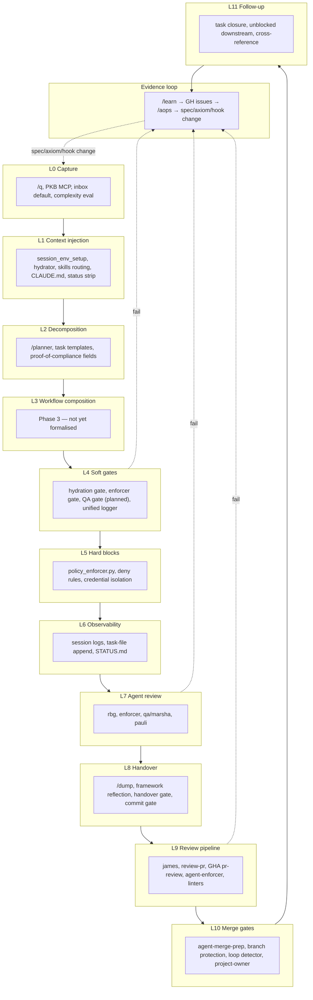

# Enforcement Architecture

> **Design narrative — not the operative ladder.** This file describes the
> design rationale of the five-layer enforcement architecture (pipeline
> view L0–L11 + pyramid view base/middle/tip + evidence loop). **The
> operative state catalogue lives in `.agents/ENFORCEMENT-MAP.md`**, which
> uses the **L0–L7 cost ladder**. `rbg` blocks on the L0–L7 cost ladder via
> P#65; **no blocking decision uses the L0–L11 pipeline view or the
> base/middle/tip pyramid below**. Both views remain in this document as
> useful conceptual frames for reasoning about *when* a mechanism fires
> and *how* it sits architecturally — they do not score severity, and
> they are not the catalogue.

**Purpose.** This document is the design statement for how the aops framework enforces its rules and maintains quality. Enforcement is **responsive, proportionate, and evidence-driven**: most work happens cheaply and constantly at the base of the pyramid; heavier measures escalate only when lower layers produce evidence they are insufficient.

**Sibling documents.**

- **`.agents/ENFORCEMENT-MAP.md`** — **operative state catalogue** (canonical SSoT). The L0–L7 cost ladder, every runtime hook, pre-commit hook, gate, and PR-pipeline agent, plus the folded axiom-keyed cross-reference. When to reach for it: any question of the form "what is currently catching X" or "what does it cost".
- **`specs/enforcement/enforcement.md`** (this file) — design statement. When to reach for it: deciding where a new rule, gate, or check should live; understanding why enforcement is shaped the way it is.
- **`specs/enforcement/enforcement-mechanisms.md`** — per-mechanism reference catalogue keyed to the L0–L11 pipeline view (spec companion to this file; design narrative, not operative). When to reach for it: the schema-shaped details (trigger, location, scope, status) for a single mechanism.
- **`specs/enforcement/ultra-vires-enforcer.md`** — design doc for the specific internal mechanism: the `enforcer` agent (formerly `custodiet`) plus its PreToolUse gate.
- **`specs/enforcement/enforcement-map.md`** — redirect stub pointing at `.agents/ENFORCEMENT-MAP.md` (superseded 2026-05-20).

## Two views of the same mechanisms

The framework has ~40 distinct enforcement mechanisms. Two independent organising principles are useful for thinking about them. **Neither is operative** — both are conceptual frames for design conversations. The operative ranking is the L0–L7 cost ladder in `.agents/ENFORCEMENT-MAP.md`.

1. **The pipeline (temporal view).** When in the flow of work does a mechanism fire? Capture → hydration → decomposition → execution → handover → review → merge → follow-up → evidence loop. The mermaid graph in §3 shows this. Labels are `L0`–`L11`, one per pipeline layer.
2. **The pyramid (escalation view).** How frequently does a mechanism fire, and how invasive is it when it does? Base (high-volume, cheap, non-blocking) → middle (moderate, triggered, warns or opens gates) → tip (rare, heavy, blocks or requires human). The tier table in §4 shows this.

These views are **orthogonal**. The same mechanism appears in both. A pipeline-L4 mechanism (soft gate) may be base-tier (runs every tool call, cheap) or middle-tier (triggered on threshold). The L-number is cross-reference, not a tier criterion. *And neither L-number nor pyramid tier is used by any blocking rule* — when an enforcement change needs ranking, use the cost ladder in `.agents/ENFORCEMENT-MAP.md`.

When reasoning about a framework change, use the pipeline to decide _when_ the intervention fires and the pyramid to decide _how invasive_ it should be — then translate the decision into a cost-ladder row in the operative state file.

## §3 Pipeline view (temporal)



Edges show control-flow in the common path (top to bottom) and the three most common failure-to-evidence arcs (dotted). The evidence loop closes back to L0 because the _output_ of the loop is spec/axiom/template changes, which propagate forward through the whole pipeline from its start.

Full catalogue of mechanisms per layer: **see `specs/enforcement/enforcement-mechanisms.md`** (companion design-narrative spec). For the operative cost-ladder catalogue, see `.agents/ENFORCEMENT-MAP.md`.

## §4 Pyramid view (escalation)

**Responsive regulation theory.** The framework cannot force any agent to do anything — we can only create _encouragement with detection_. Given that, the choice of _where to intervene_ should follow the principle of least invasion: use the lightest mechanism that catches the failure, and escalate only when evidence shows the lighter mechanism is insufficient. The pyramid makes this choice architecture explicit.

**Reminder.** The base/middle/tip tiers below are descriptive — they characterise the frequency × invasiveness of a mechanism. They are **not** the operative cost ladder. When a PR adds or escalates a mechanism, the cost-benefit reasoning happens against the L0–L7 ladder in `.agents/ENFORCEMENT-MAP.md`, not against base/middle/tip. Use this pyramid to explain *why* a mechanism sits where it does in the cost ladder, not to score it.

The L-numbers in the table below are pipeline cross-reference, not tier criteria. Mechanisms are placed in tiers based on **frequency of activation × invasiveness when active** — not on where they sit in the pipeline.

| Tier       | Definition                                                             | Mechanisms (with pipeline layer cross-reference)                                                                                                                                                                                                                                                                                                                                                                                                |
| ---------- | ---------------------------------------------------------------------- | ---------------------------------------------------------------------------------------------------------------------------------------------------------------------------------------------------------------------------------------------------------------------------------------------------------------------------------------------------------------------------------------------------------------------------------------------- |
| **Base**   | High-volume, low-invasiveness, non-blocking, runs constantly           | lightweight hydrator (L1), skills routing table (L1), CLAUDE.md / AGENTS.md load (L1), gate status strip (L1), session_env_setup (L1), unified logger (L6), task-file append (L6), session logs (L6), task template conventions (L2)                                                                                                                                                                                                            |
| **Middle** | Moderate volume, triggered by threshold or event, warns or opens gates | hydration gate (L4), enforcer gate (L4), enforcer subagent invocation (L7), QA gate — planned (L4), /planner decomposition checks (L2), proof-of-compliance tool fields (L2), rbg subagent invocation (L7), qa / marsha subagent invocation (L7), james orchestration (L9), pr-reviewer GHA (L9), agent-enforcer GHA (L9), linter workflows (L9), commit gate (L8), CC auto-mode classifier `soft_deny` rules (L4 — surfaces permission prompt) |
| **Tip**    | Rare, heavy — hard-blocks or requires human judgment                   | policy_enforcer.py hard blocks (L5), settings.json deny rules (L5), credential isolation (L5), handover gate (L8), agent-merge-prep auto-merge (L10), branch protection (L10), loop detector (L10), project-owner / admin approval (L10), CC auto-mode classifier `block` rules (L4 — pre-execution hard-deny)                                                                                                                                  |

**Escalation rules.**

- **Escalate up** when the evidence loop (§5) shows a base-tier mechanism is being bypassed or ignored with reproducible consequences.
- **De-escalate down** when evidence shows a tip-tier measure has been unnecessary for a full feedback cycle — a middle-tier warn or base-tier reminder may be sufficient.
- **Never guess.** If there is no evidence one way or the other, the current tier placement holds. Changes are made from §5 evidence, not from authorial intuition.

## §5 Evidence loop

The pyramid _learns_ by a seven-step architecture. Each step names its inputs, outputs, implementation status, and location.

**Step 1 — Failure detection.** _(Implemented at sources; aggregation partial.)_ Signals originate at any pipeline layer: RBG findings, QA / marsha fails, /retro observations, user-reported problems, post-merge regressions, /sleep staleness findings, hook log patterns. Currently aggregated through ad-hoc agent invocation, not a single pipeline.

**Step 2 — `/learn` files anonymised GitHub issue.** _(Implemented.)_ Skill at `aops-core/commands/learn.md`. Anonymisation is mandatory; root-cause-analysis schema is enforced in issue body; deduplication by search-first. Repo is the framework repo. Labels: `bug`, `criticality:<level>`, plus layer-specific tags (e.g. `framework`, `enforcement`, `axiom`).

**Step 3 — Evidence accumulation.** _(Implemented via GitHub issues as durable store.)_ Issues cluster around patterns; volume × criticality informs priority. No separate database — the issue list is the evidence base.

**Step 4 — `/aops` pattern detection.** _(Aspirational — principal known gap.)_ Intended behaviour: periodic read of issue labels / bodies / close-status, detection of recurring failure modes, mapping to pyramid layers where intervention needs to change. Not yet mechanically implemented.

**Step 5 — Recommendation generation.** _(Aspirational.)_ Intended behaviour: `/aops` produces a proposed enforcement adjustment — which layer, which mechanism, escalate or de-escalate, what spec/axiom/hook change. Not yet implemented.

**Step 6 — Human decision + implementation.** _(Implemented as the normal task flow.)_ User approves the change; an agent implements it via the usual `/q` → decomposition → execution route; spec / code / axiom is updated through PR pipeline.

**Step 7 — Closing the loop.** _(Partially implemented.)_ Issues referenced by the implementing PR close automatically; `.agents/ENFORCEMENT-MAP.md` (operative state) updates to reflect the new intervention. The _automatic_ map-row update is not yet wired — done manually in the PR.

**Principal gap.** Steps 4–5 are the unbuilt piece. Failure evidence is captured reliably (Step 2) and implementation flow exists (Step 6), but the _recommendation_ connecting them is aspirational. A follow-up task should scope what `/aops` needs to do — this is deliberately not resolved in Phase 1 because the scope depends on the enforcement-map structure this document is defining.

## §6 Per-mechanism reference

See **`specs/enforcement/enforcement-mechanisms.md`** for the per-mechanism design-narrative catalogue (keyed to the L0–L11 pipeline view; not operative). For the operative cost-ladder catalogue, see `.agents/ENFORCEMENT-MAP.md`. Each mechanism is documented with a fixed schema:

```
### <Mechanism name>
- **Pipeline layer**: L<n>
- **Pyramid tier**: base | middle | tip
- **Trigger**: <event or condition>
- **Purpose**: <one sentence>
- **Location**: <file:line or module path>
- **Scope**: polecat | crew | interactive | GHA | all
- **Status**: active | warn-only | planned | disabled
```

Tier-spanning mechanisms (e.g. `/dump` handover: middle when the handover gate is open, tip when it blocks Stop) carry both tiers in the **Pyramid tier** field with a conditional clause.

## §7 Scope limits

### §7.1 Known-clients only

The framework's agent-based enforcement (rbg, enforcer, qa / marsha, pauli, james) applies **only to known clients**: polecat, crew, and interactive sessions invoked through the aops plugin. GHA agents inherit via prompt inlining at build time (see `scripts/build.py` — intentionally out of scope this cycle).

**Unknown third-party agents** running on arbitrary platforms are out of scope. The framework cannot reach them, and no gate mechanism assumes they exist. The only mechanism for third-party alignment is prompt-level: by shaping the specs / axioms / templates that any agent reads, the framework influences what third-party agents do. The pipeline is _not_ a perimeter around a trust boundary.

### §7.2 Per-client coverage table

| Client                  | Hooks?               | Gates? | rbg/enforcer?      | /dump? | PR pipeline? |
| ----------------------- | -------------------- | ------ | ------------------ | ------ | ------------ |
| Polecat                 | Yes                  | Yes    | Yes                | Yes    | Yes          |
| Crew (Claude Code)      | Yes                  | Yes    | Yes                | Yes    | Yes          |
| Interactive (local CLI) | Yes                  | Yes    | Yes                | Yes    | Yes          |
| GHA review agents       | No (inlined prompts) | No     | Yes (prompt-level) | No     | N/A          |
| Third-party agents      | No                   | No     | No                 | No     | No           |

## §8 Operator impact — env var rename

The `custodiet` agent and gate have been renamed to `enforcer`. Operators with values set in shell profiles or `~/.env.local`:

| Old                             | New                            |
| ------------------------------- | ------------------------------ |
| `CUSTODIET_GATE_MODE`           | `ENFORCER_GATE_MODE`           |
| `CUSTODIET_TOOL_CALL_THRESHOLD` | `ENFORCER_TOOL_CALL_THRESHOLD` |

Migration is a breaking change unless a backward-compat alias is added at load time — decision deferred to the rename commit.

## §9 Workflow composition (Phase 3 placeholder)

Task-creating agents compose compliant workflows by combining axioms, heuristics, and procedures at task-creation time. The agent enumerates which axioms apply to the task, which heuristics flag likely hazards, and which procedures are the current recommended sequence — then assembles them into a workflow the executing agent runs.

**This layer is not yet formalised.** It is named here as pipeline L3 so the pyramid/map/mechanism specs have a consistent reference point. Phase 3 of `task-e64e29c5` and parent-epic `task-b5fec0b5` Thread 4 (workflows-as-logical-statements) carry the design work.

## §10 Design principles

1. **Layer defences** — no single mechanism is reliable. Combine base, middle, and tip tiers for any failure mode worth catching.
2. **Prefer observable over invisible** — TodoWrite, task bodies, STATUS.md, gate icons. If a mechanism fires and the user cannot see it, the mechanism has not enforced.
3. **Accept imperfection** — enforcement is encouragement with detection, not coercion. Design for drift, not for prevention.
4. **Measure before changing** — the §5 evidence loop is the authority for tier changes. Authorial intuition is not evidence.
5. **Least invasion first** — conventions before templates; templates before gates; soft gates before hard blocks; hard blocks before human approval. Escalate only on §5 evidence.
6. **Show, don't tell** — where compliance is claimed, require information that demonstrates it. Tool signatures and task templates should carry the proof into the schema rather than accept reassurance.

## §11 Component responsibilities

Enforcement failures fall into five root-cause categories:

| Category          | Definition                                                 |
| ----------------- | ---------------------------------------------------------- |
| Clarity Failure   | Instruction ambiguous or insufficiently emphasised         |
| Context Failure   | Component did not provide relevant information when needed |
| Blocking Failure  | Component did not block what it promised to block          |
| Detection Failure | Component did not catch a violation it promised to catch   |
| Gap               | No component existed for this case — create one            |

Multiple categories can apply; defence-in-depth can fail at multiple layers.

### Root-cause analysis protocol

1. Was there a rule? Check AXIOMS / HEURISTICS.
2. Did the hydrator suggest the correct workflow?
3. Did the agent follow the workflow? If yes, was output correct?
4. Should a PreToolUse hook have blocked? Check hook rules.
5. Should a PostToolUse hook have detected? Check detection hooks.
6. Should a deny rule have blocked? Check `settings.json` / `policy_enforcer.py`.
7. Should a pre-commit hook have caught? Check `.pre-commit-config.yaml`.

If all components met their responsibilities and the failure still occurred: **Gap** — create a new mechanism at the appropriate tier.

## §12 Verification — "Can it" ≠ "Does it"

The top failure pattern in this framework is conflating capability with actual state. An agent that checks whether code _could_ work, or what defaults _would_ be, has not verified that anything _is_ working.

| Agent checked              | Should have checked |
| -------------------------- | ------------------- |
| Framework default value    | Actual config file  |
| Code capability exists     | Feature is enabled  |
| Tool exists                | Tool is configured  |
| "Should work" / "probably" | Observed output     |

Evidence types, in decreasing order of trust:

| Type              | Definition                                 |
| ----------------- | ------------------------------------------ |
| `actual_state`    | Config files read, runtime output captured |
| `default_only`    | Only defaults checked                      |
| `capability_only` | Only documented capabilities               |
| `none`            | No evidence gathered                       |

Conclusions require `actual_state`. Anything less is a claim, not a finding.

---

**Related**

- **Operative state catalogue (SSoT)**: `.agents/ENFORCEMENT-MAP.md` — L0–L7 cost ladder + every mechanism row. `rbg` blocks on it (P#65).
- `specs/enforcement/enforcement-mechanisms.md` — per-mechanism design-narrative catalogue (companion to this file).
- `specs/enforcement/ultra-vires-enforcer.md` — enforcer agent + gate internal design.
- `specs/enforcement/enforcement-map.md` — redirect stub (superseded 2026-05-20 by `.agents/ENFORCEMENT-MAP.md`).
- `aops-core/AXIOMS.md` — universal axioms (read only by `rbg`).
- `.agents/rules/HEURISTICS.md` — advisory heuristics.
