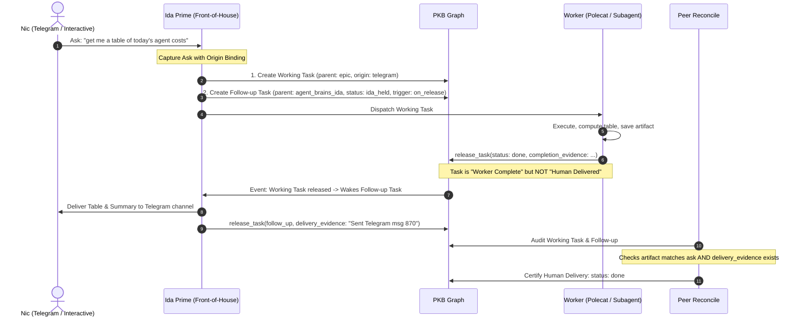

# In-Session Enforcement — The Human Delivery Contract (Layer 2.5)

## 1. Problem Statement & Specimen Diagnostics

The academicOps framework enforces rigorous boundaries on task execution: Layer 2 ([`task-contract.md`](task-contract.md)) requires `claim_task` → `release_task` with verifiable evidence written to the PKB task record, and universal task verification ([`evidence-contract.md`](evidence-contract.md)) enforces substance-over-form checks.

However, an architectural blind spot exists between **task graph completion** and **human delivery**:
> A task can be verified by peer reconcile, marked `status: done`, and archived to the graph without the resulting artifact ever reaching the human who asked for it.

### 1.1 Primary Specimen: `[[aops_twin_cost_measure_per_brief]]` (2026-10-01)
- **Originating Ask:** Nic asked via Telegram (Span `94027`, msg `845`, 2026-10-01 11:32:39 UTC / 21:32:39 AEST, session `fe878f4d-11a9-48ab-b812-789ac1aca3b8` on `nicdev`):
  > *"get me a good review of the agent work that we did today. i want to see a table that shows time and tokens per agent per task / prompt, including where the work was done, what subagents were invoked, how much each cost, etc."*
- **Execution & Storage:** Dispatched to worker session `b00be22c-2c4f-480f-9ade-0c8ea4c9d849`. The worker extracted Phoenix traces, generated the table, appended it to `20261001-daily` under `## Token spend and agent execution (Phoenix traces)`, recorded the completion summary on `aops_twin_cost_measure_per_brief`, and released the task `done`.
- **Failure Point:**
  1. *Task Contract Deficit (`specs/enforcement/task-contract.md:23-24`):* The operative return contract states: *"evidence + an output URL, written to the PKB task record."* Writing to the task record or daily note satisfies the contract text verbatim.
  2. *Reconcile False Positive (`[[aops_399289f6]]`, `[[mem_1cae6053]]`, `[[mem-96eddff7]]`):* Peer reconcile checked that the artifact existed on disk and matched the prompt requirements per `[[mem-96eddff7]]`. It accepted `done`. Reconcile had no awareness of whether the artifact reached the human requester.
  3. *Severed Front-of-House Handoff:* Front-of-house coordinator (Ida Prime) treated task closure as terminal without an outbound delivery step back to the originating Telegram channel.
  4. *Omission & Follow-Up:* The table sat unseen in `20261001-daily`. Nic was forced to ask hours later (Span `102856`, 2026-10-01 22:49:11 UTC / 2026-10-02 08:49:11 AEST):
     > *"where's the costs table i asked for?"* … *"and find a way so that you don't forget things i ask you for again please"* (Span `102886`).

### 1.2 Secondary Specimen: `[[aops_7ac5c439]]` (2026-10-01)
- **Failure Point:** Released `status: done` on `dotfiles#52` with all 7 review fixes unticked and zero checkable delivery evidence. Re-review returned `REVISE`. Form-only completion claims masquerading as done without verification or surfacing.

### 1.3 Secondary Specimen: `[[task_model_ten_tasks_properly]]` (2026-09-15)
- **Failure Point:** Released as `partial` on 2026-09-15. Without an active follow-up trigger or human delivery obligation, it stalled for 16 days unaddressed before decomposing into research.

### 1.4 Review-State Gap: `wf-human-approval`
- **Failure Point:** In universal template `wf-human-approval`, step 2 releases the task as `status: review` and stops, specifying delivery only *"in the form the project or user preferences name"*. Because no user preference names a default delivery channel, review tasks sit in `review` silently on the graph without notifying Nic.

### 1.5 Prior Structural Attempts
- `[[aops_surface_updates_to_nic]]` and `[[aops_31d8bb63]]` previously attempted to define update push channels, but were cancelled due to lack of a concrete contract binding human origin to terminal release.
- `[[task_32d3fe44]]` attempted to make the daily note a surface for dropped work, but lacked a forcing mechanism on task release.
- `[[aops_reconcile_trigger]]`: Nic parked a mechanical background daemon trigger on 2026-09-15 (*"we forget building a mechanical trigger for now"*), necessitating an event-driven and interactive design rather than an unconstrained polling daemon.

---

## 2. Architecture & Data Flow

The Human Delivery Contract sits at **Layer 2.5** of the enforcement pyramid: between single work-unit execution (Layer 2) and system-wide peer truth maintenance (Layer 3).



### 2.1 The Inbound Origin Binding
Every task initiated by a direct human ask must record an `origin` metadata block at creation time:
```yaml
origin:
  channel: telegram | claude_turn | agy_session | voice
  session_id: "fe878f4d-11a9-48ab-b812-789ac1aca3b8"
  message_id: "845" # telegram msg ID or span ID
  host: "nicdev"
  human_prompt: "get me a good review of the agent work that we did today..."
delivery_channel: telegram | interactive_stdout | daily_note
```

### 2.2 Dual-Task Capture: Working Task vs. Coordinator Follow-up
When Nic asks Ida for work that will not be executed to verified delivery in the immediate interactive turn, two tasks must be created:
1. **The Working Task**:
   - Belongs to the appropriate project/epic tree (e.g. `parent: aops_epic_task_lifecycle`).
   - Assigned to a worker, subagent, or left `ready` for dispatch.
   - Contains goal, deliverable, and acceptance criteria for the technical artifact.
   - Carries the `origin` block.
2. **The Follow-up Task**:
   - Belongs to Ida's personal task tree under `[[agent_brains]]` > `[[agent_brains_ida]]`.
   - `assignee: ida`.
   - `status: ida_held` (see §2.4).
   - Links to the working task via `depends_on: [<working_task_id>]` or frontmatter pointer.
   - **Crucial Invariant:** The follow-up task **MUST NOT** be the parent of the working task. Working tasks must live under their domain project/epic tree, preserving graph domain coherence.

#### Reconciling with `[[aops_retire_ida_request_ledger]]`
On 2026-09-17, Nic ruled: *"No separate request ledger. Every request is captured on the task graph."*
This architecture strictly honors that ruling:
- No out-of-band text file or external ledger is created.
- Follow-ups are standard first-class PKB task nodes.
- They live in the graph under `agent_brains_ida`, queryable by standard `pkb_list_tasks` tools.

### 2.3 The Human Delivery Gate
For any task carrying an `origin` block, the completion contract is not satisfied merely by writing to the PKB or creating a PR:
1. **The Terminal Delivery Condition:** A task with `origin` cannot reach `status: done` or `status: review` from the principal's perspective until an outbound delivery action occurs:
   - For `channel: telegram`: An outbound message sent to the originating chat containing the artifact summary, permanent links, and next actions.
   - For `channel: claude_turn` / `agy_session`: Direct presentation of the completed artifact to the human turn.
   - For asynchronous `status: review` (e.g. `wf-human-approval`): An outbound notification to Telegram **and** an entry added to today's daily note under `## Needs Nic's Sign-Off`.
2. **Delivery Evidence:** The releasing agent or coordinator must record `delivery_evidence`:
   ```yaml
   delivery_evidence:
     channel: telegram
     message_id: "870" # or outbound Phoenix span ID
     delivered_at: "2026-10-01T13:40:00Z"
     summary: "Delivered cost table to Telegram chat."
   ```

### 2.4 Status for Ida-Held Tasks: `ida_held`
As noted by Ida Prime (2026-10-02): *"the spec must give Ida-held follow-ups a status. Neither queued (dispatchable) nor blocked (external dependency) fits."*
- `ready` / `inbox` / `queued`: Fails because generic workers or dispatch passes would grab Ida's coordination follow-ups.
- `blocked`: Fails because it represents external blockers (waiting on upstream PR, credentials, third-party infrastructure).
- **Solution:** Introduce task status `ida_held` (or `held`):
  - Meaning: A task assigned exclusively to `ida` awaiting a concrete surfacing trigger.
  - Excluded from generic worker dispatch queues.
  - Included in Ida's focus passes and daily handover reviews.

### 2.5 The Surfacing Trigger Invariant
> **The Trigger Rule:** Every task with `status: ida_held` MUST name the trigger that will surface it. A follow-up without an explicit, verifiable trigger is rejected at intake and MUST NOT be filed.

Permitted Trigger Types:
1. **`on_release` (Event Trigger):** Woken when the referenced `depends_on` task transitions to `done`, `review`, or `partial`.
2. **`schedule` (Time Trigger):** Woken at a specific datetime or daily briefing pass (e.g., `daily_digest`).
3. **`command` (Interactive CLI Trigger):** Woken by Nic running a dedicated command.

#### Interactive CLI Trigger: `/ida:followups`
To satisfy Nic's request (Spans `103576`–`103600`):
> *"gimme a quick one line command i can run that will trigger a pass through your own assigned tasks in .claude/commands... create it in your cwd and i'll move it"*

The command script `.claude/commands/followups.md` (and CLI helper) executes:
```bash
pkb list-tasks --assignee ida --parent agent_brains_ida --status ida_held
```
and surfaces all pending Ida-held follow-ups, their linked working tasks, and current execution states.

---

## 3. Interface Contracts & Schemas

### 3.1 Task Frontmatter Schema Additions
```yaml
# Inbound origin (mandatory when task originated from human ask)
origin:
  channel: "telegram" | "claude_turn" | "agy_session" | "voice"
  session_id: string
  message_id: string
  host: string
  human_prompt: string

# Outbound delivery target
delivery_channel: "telegram" | "interactive_stdout" | "daily_note"

# Delivery evidence (mandatory to release done or review when origin is set)
delivery_evidence:
  channel: string
  message_id: string
  delivered_at: string # ISO 8601 UTC
  summary: string

# Surfacing trigger (mandatory when status is ida_held)
trigger:
  type: "on_release" | "schedule" | "command"
  specification: string # e.g. "depends_on:aops_twin_cost_measure_per_brief" or "2026-10-02T08:00:00Z"
```

### 3.2 The Reconcile Audit Gate (`[[aops_399289f6]]`, `[[mem_1cae6053]]`)
When peer reconcile audits tasks:
1. For any task where `origin` is set:
   - Does `status == 'done'`?
   - If yes: verify that `delivery_evidence` is present and resolves to a verifiable outbound event (e.g. Telegram message span or interactive turn).
   - If `delivery_evidence` is missing: **Demote task status to `review` or `inbox`** with rejection reason: *"Artifact exists but human delivery was not evidenced."*
2. For any task where `status == 'ida_held'`:
   - Does `trigger` exist and resolve?
   - If `trigger` is missing: **Demote task to `inbox`**.

### 3.3 Rule Wording for `/q` and Instructions Ledger

The following rule is incorporated into `plugins/ida/skills/q/SKILL.md` and `plugins/ida/agents/ida.md`:

```markdown
### Rule: Human Delivery & Follow-up Decoupling
1. **Origin Binding:** When capturing any ask originating from Nic (via Telegram, interactive CLI, or voice), record the `origin` block in frontmatter with channel, session_id, message_id, host, and prompt.
2. **Dual-Task Capture:** If the ask will not be executed to verified delivery in the immediate turn and is not part of an actively monitored project pipeline, create two distinct tasks:
   - **The Working Task:** Placed under the relevant project/epic tree, assigned to an execution agent.
   - **The Follow-Up Task:** Placed under `agent_brains_ida` with `assignee: ida`, `status: ida_held`, `depends_on: [<working_task_id>]`, and a concrete `trigger`. The follow-up MUST NOT be the parent of the working task.
3. **No Unanchored Follow-ups:** Every `ida_held` task MUST name a valid `trigger` (`on_release`, `schedule`, or `command`). Never file a follow-up without a trigger.
4. **Delivery Gate:** Never claim `done` or `review` on a task with human origin until the artifact or review call is actively delivered back to Nic via his originating channel.
```

---

## 4. Acceptance Criteria & Test Strategy

### 4.1 Falsifiable Acceptance Criteria
- [ ] **AC-1 (Origin Schema):** Tasks created via `/q` from human channels store `origin` and `delivery_channel` frontmatter.
- [ ] **AC-2 (Follow-up Placement):** Ida-held follow-ups are placed under `agent_brains_ida`, never as parents of working tasks.
- [ ] **AC-3 (Trigger Mandate):** Creation of a task with `status: ida_held` lacking `trigger` is rejected by PKB validation.
- [ ] **AC-4 (Delivery Gate Enforcement):** `pkb_release_task` with `status: done` on an `origin`-bearing task requires `delivery_evidence`.
- [ ] **AC-5 (Reconcile Catch):** Peer reconcile demotes any `done` task with `origin` that lacks valid `delivery_evidence`.
- [ ] **AC-6 (Review-State Delivery):** Tasks released to `review` via `wf-human-approval` deliver an approval card to Telegram and the daily note `## Needs Nic's Sign-Off`.
- [ ] **AC-7 (Interactive Trigger):** `.claude/commands/followups.md` reliably lists all `ida_held` tasks.

### 4.2 Test & Verification Plan
1. **Mock Specimen Test (Reproduce 2026-10-01 Failure):**
   - Setup: Task created with `origin: { channel: 'telegram', session_id: 'test-123' }`.
   - Worker generates artifact and calls `pkb_release_task(status: 'done')` with `completion_evidence` only.
   - Assertion: Reconcile rejects completion because `delivery_evidence` is missing.
2. **Dual-Task Graph Test:**
   - Execute `/q` on an asynchronous human ask.
   - Assertion: Graph contains working task under project epic, follow-up task under `agent_brains_ida`, neither is parent of the other, follow-up carries `trigger: on_release`.
3. **CLI Command Test:**
   - Run `.claude/commands/followups.md` with tasks in `ida_held` state.
   - Assertion: Output formats pending follow-ups cleanly with linked working task status.
