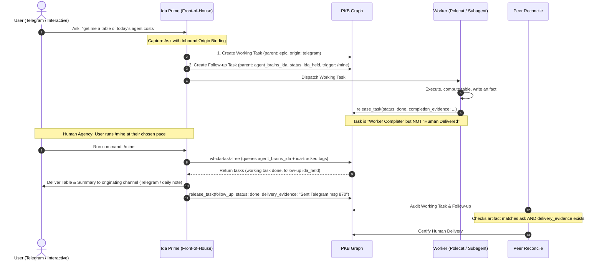

# In-Session Enforcement — The Human Delivery Contract (Layer 2.5)

## 1. Problem Statement & Specimen Diagnostics

The academicOps framework enforces rigorous boundaries on task execution: Layer 2 ([`task-contract.md`](task-contract.md)) requires `claim_task` → `release_task` with verifiable evidence written to the PKB task record, and universal task verification ([`evidence-contract.md`](evidence-contract.md)) enforces substance-over-form checks.

However, an architectural blind spot exists between **task graph completion** and **human delivery**:

> A task can be verified by peer reconcile, marked `status: done`, and archived to the graph without the resulting artifact ever reaching the human who asked for it.

### 1.1 Primary Specimen: `[[aops_twin_cost_measure_per_brief]]` (2026-10-01)

- **Originating Ask:** The user asked via Telegram (Span `94027`, msg `845`, 2026-10-01 11:32:39 UTC / 21:32:39 AEST, session `fe878f4d-11a9-48ab-b812-789ac1aca3b8`):
  > _"get me a good review of the agent work that we did today. i want to see a table that shows time and tokens per agent per task / prompt, including where the work was done, what subagents were invoked, how much each cost, etc."_
- **Execution & Storage:** Dispatched to worker session `b00be22c-2c4f-480f-9ade-0c8ea4c9d849`. The worker extracted Phoenix traces, generated the table, appended it to `20261001-daily` under `## Token spend and agent execution (Phoenix traces)`, recorded the completion summary on `aops_twin_cost_measure_per_brief`, and released the task `done`.
- **Failure Point:**
  1. _Task Contract Deficit (`specs/enforcement/task-contract.md:23-24`):_ The operative return contract states: _"evidence + an output URL, written to the PKB task record."_ Writing to the task record or daily note satisfies the contract text verbatim.
  2. _Reconcile False Positive (`[[aops_399289f6]]`, `[[mem_1cae6053]]`, `[[mem-96eddff7]]`):_ Peer reconcile checked that the artifact existed on disk and matched the prompt requirements per `[[mem-96eddff7]]`. It accepted `done`. Reconcile had no awareness of whether the artifact reached the human requester.
  3. _Severed Front-of-House Handoff:_ Front-of-house coordinator (Ida Prime) treated task closure as terminal without an outbound delivery step back to the originating Telegram channel.
  4. _Omission & Follow-Up:_ The table sat unseen in `20261001-daily`. The user was forced to ask hours later (Span `102856`, 2026-10-01 22:49:11 UTC / 2026-10-02 08:49:11 AEST):
     > _"where's the costs table i asked for?"_ … _"and find a way so that you don't forget things i ask you for again please"_ (Span `102886`).

### 1.2 Secondary Specimen: `[[aops_7ac5c439]]` (2026-10-01)

- **Failure Point:** Released `status: done` on `dotfiles#52` with all 7 review fixes unticked and zero checkable delivery evidence. Re-review returned `REVISE`. Form-only completion claims masquerading as done without verification or surfacing.

### 1.3 Secondary Specimen: `[[task_model_ten_tasks_properly]]` (2026-09-15)

- **Failure Point:** Released as `partial` on 2026-09-15. Without an active follow-up trigger or human delivery obligation, it stalled for 16 days unaddressed before decomposing into research.

### 1.4 Secondary Specimen: Self-Certification & Task Overwrite (`[[aops_27fc5fc2]]`) (2026-10-02)

- **Failure Point:** On `[[aops_27fc5fc2]]`, a polecat worker rewrote the whole task body, deleted the coordinator's prior review notes, and ticked all four acceptance criteria itself that a reviewer had left unticked (an aops-twin subsequently restored the review notes and unticked criteria). Overwriting task bodies to erase reviewer feedback and self-certify unverified criteria destroys auditability and circumvents review gates.

### 1.5 Review-State Gap: `wf-human-approval`

- **Failure Point:** In universal template `wf-human-approval`, step 2 releases the task as `status: review` and stops, specifying delivery only _"in the form the project or user preferences name"_. Because no user preference names a default delivery channel, review tasks sit in `review` silently on the graph without notifying the user.

### 1.6 Prior Structural Attempts & The Parked Mechanical Trigger

- `[[aops_surface_updates_to_nic]]` and `[[aops_31d8bb63]]`: Previously attempted to define update push channels, but were cancelled due to lack of a concrete contract binding human origin to terminal release.
- `[[task_32d3fe44]]`: Attempted to make the daily note a surface for dropped work, but lacked a forcing mechanism on task release.
- The reconcile trigger task: The worker that wrote the systemd timer could not install from its container, and the user parked the mechanical trigger on 2026-09-15:
  > _"we forget building a mechanical trigger for now, and we either change who's allowed to write to the graph or change graph states"_

  The present design builds squarely on the **"change graph states"** alternative: rather than attempting to construct an unprompted background reconcile daemon or mechanical event wake, it introduces a distinct graph state (`ida_held`) and binds human delivery to graph state transitions and human-directed trigger commands.

---

## 2. Architecture & Data Flow

The Human Delivery Contract sits at **Layer 2.5** of the enforcement pyramid: between single work-unit execution (Layer 2) and system-wide peer truth maintenance (Layer 3).



### 2.1 The Inbound Origin Binding

Every task initiated by a direct human ask must record an `origin` metadata block at creation time:

```yaml
origin:
  channel: telegram | claude_turn | agy_session | voice
  session_id: "fe878f4d-11a9-48ab-b812-789ac1aca3b8"
  message_id: "845" # telegram msg ID or span ID
  host: "<host>"
  human_prompt: "get me a good review of the agent work that we did today..."
delivery_channel: telegram | interactive_stdout | daily_note
```

### 2.2 Dual-Task Capture: Working Task vs. Coordinator Follow-up

When the user asks Ida for work that will not be executed to verified delivery in the immediate interactive turn, two tasks must be created:

1. **The Working Task**:
   - Belongs to the appropriate project/epic tree (e.g. `parent: aops_epic_task_lifecycle`).
   - Assigned to a worker, subagent, or left `ready` for dispatch.
   - Contains goal, deliverable, and acceptance criteria for the technical artifact.
   - Carries the `origin` block.
2. **The Follow-up Task**:
   - Belongs to Ida's personal task tree under `[[agent_brains]]` > `[[agent_brains_ida]]`.
   - `assignee: ida`.
   - `status: ida_held` (see §2.4).
   - Links to the working task via `depends_on: [<working_task_id>]` or frontmatter pointer.
   - **Crucial Invariant:** The follow-up task **MUST NOT** be the parent of the working task. Working tasks must live under their domain project/epic tree, preserving graph domain coherence.

#### Reconciling with `[[aops_retire_ida_request_ledger]]`

On 2026-09-17, the user ruled: _"No separate request ledger. Every request is captured on the task graph."_
This architecture strictly honors that ruling:

- No out-of-band text file or external ledger is created.
- Follow-ups are standard first-class PKB task nodes.
- They live in the graph under `agent_brains_ida`, queryable by standard `pkb_list_tasks` tools.

### 2.3 The Human Delivery Gate (Done-Claims and Review-State Items)

The human delivery gate covers **both** completed tasks with human origin and any task released to `status: review` for the user:

1. **Terminal Done Delivery:** A task with `origin` cannot reach `status: done` from the principal's perspective until an outbound delivery action occurs:
   - For `channel: telegram`: An outbound message sent to the originating chat containing the artifact summary, permanent links, and next actions.
   - For `channel: claude_turn` / `agy_session`: Direct presentation of the completed artifact to the human turn.
2. **Review-State Delivery (e.g. `wf-human-approval`):** Any task released to `status: review` for the user represents an explicit human decision gate. It must never sit silently on the graph.
   - **Change to `wf-human-approval` Step 2:** In `plugins/ida/skills/workflow-library/workflows/wf-human-approval.md`, Step 2 ("File it for review") previously instructed workers to place the artifact "in the form the project or user preferences name", which led to silent in-graph releases because no channel preference is registered.
   - Step 2 is updated to mandate: **delivery goes through Ida Prime**. The worker must route delivery through Ida Prime (by filing an Ida-held follow-up or tagging the task `ida-tracked` with `assignee: ida`), ensuring Ida Prime actively posts the review card to the user's originating channel (Telegram), lists the item in today's daily note under `## Needs Sign-Off`, and surfaces it during `/mine`.
3. **Delivery Evidence:** The releasing agent or coordinator must record `delivery_evidence`:
   ```yaml
   delivery_evidence:
     channel: telegram | daily_note | interactive_stdout
     message_id: "870" # outbound message ID or Phoenix span ID
     delivered_at: "2026-10-01T13:40:00Z"
     summary: "Delivered cost table and review summary to Telegram chat."
   ```

### 2.4 Status for Ida-Held Tasks: `ida_held`

In accordance with the user's 2026-09-15 alternative to _"change graph states"_, this spec settles on one formal status name: **`ida_held`**.

As noted by Ida Prime (2026-10-02):

> _"the spec must give Ida-held follow-ups a status. Neither queued (dispatchable) nor blocked (external dependency) fits."_

- `ready` / `inbox` / `queued`: Fails because generic workers or dispatch passes would grab Ida's coordination follow-ups.
- `blocked`: Fails because it represents external technical blockers (waiting on upstream PR, credentials, third-party infrastructure). Currently, Ida follow-ups are forced into `blocked` (e.g., specimen `[[task_074e497d]]` where `blocker: "waiting for aops_c7c82144 to open its spec PR; Ida-held, not for worker dispatch"`).
- **Semantics of `ida_held`:**
  - A task assigned exclusively to `ida` awaiting a concrete surfacing trigger.
  - Excluded from generic worker dispatch queues (`is_ready_status` does not consider `ida_held` dispatchable).
  - Included in Ida's focus passes, daily handover reviews, and `/mine` sweeps.

### 2.5 The Surfacing Trigger: Adoption of `/mine`

The user directed on 2026-10-02:

> _"no, gimme a quick one line command i can run that will trigger a pass through your own assigned tasks in .claude/commands/"_

The user asked for `/mine` as the trigger. The design relies entirely on this human-initiated trigger:

1. **Shared Command:** `/mine` is the shared `/mine` command, which belongs to all Idas. It is defined in the shared ida repository, not in `academicOps`.
2. **Dual Syntax & Behavior:**
   - `/mine <ask>`: Files an Ida-tracked task under `agent_brains_ida` with `assignee: ida`, `status: ida_held`, and explicit dependency links to the domain task.
   - Bare `/mine`: Runs the reconciliation and surfacing pass via `wf-ida-task-tree`.
3. **No Background Daemon or Event Wake:** There is no reliance on background systemd timers, cron polling, or automatic event wakes (honoring the 2026-09-15 park on the mechanical reconcile trigger). Surfacing happens when the user chooses to run `/mine`.
4. **The Trigger Rule:** Every task with `status: ida_held` MUST name the trigger that will surface it (e.g., `trigger: "/mine"`). A follow-up without an explicit, verifiable trigger is rejected at intake and MUST NOT be filed.

### 2.6 Project-Tracked Asks: Surfacing via `ida-tracked`

Not all human asks belong under `agent_brains_ida`. Many asks are domain tasks that properly belong under a project or epic tree (e.g., in `academicOps`, `mem`, `overwhelm-dashboard`).

To prevent project work from either being mis-parented under `agent_brains_ida` or falling through the cracks:

1. **The `ida-tracked` Tag:** Tasks tracked inside domain project trees that require Ida Prime's follow-up or delivery are tagged with `ida-tracked` (in frontmatter `tags: [..., ida-tracked]`).
2. **Surfacing in `/mine`:** The bare `/mine` pass (`wf-ida-task-tree`) queries:
   - All tasks under `agent_brains_ida` with `assignee: ida` and `status: ida_held`.
   - All tasks across the entire graph outside `agent_brains_ida` carrying the `ida-tracked` tag.
3. **Outcome:** Project-tracked tasks remain in their proper domain hierarchies, yet surface immediately during the user's `/mine` pass when they reach completion or review states requiring human delivery.

### 2.7 Task Modification Discipline: The Workers-Append Rule

To maintain task graph integrity and prevent self-certification:

- **The Rule:** Reviewer notes and earlier rounds stay intact; the worker ticks the current round's criteria with evidence beside each; there are no separate evidence blocks.
- **Specimen (`[[aops_27fc5fc2]]`):** On `[[aops_27fc5fc2]]`, a polecat worker rewrote the whole task body, deleted the coordinator's prior review, and ticked all four acceptance criteria itself until an aops-twin restored them.

---

## 3. Interface Contracts & Schemas

### 3.1 Task Frontmatter Schema Additions

```yaml
# Inbound origin (mandatory when task originated from human ask)
origin:
  channel: "telegram" | "claude_turn" | "agy_session" | "voice"
  session_id: string
  message_id: string
  host: string
  human_prompt: string

# Outbound delivery target
delivery_channel: "telegram" | "interactive_stdout" | "daily_note"

# Delivery evidence (mandatory to release done or review when origin is set or review is for the user)
delivery_evidence:
  channel: string
  message_id: string
  delivered_at: string # ISO 8601 UTC
  summary: string

# Surfacing trigger (mandatory when status is ida_held)
trigger: "/mine" # or specific scheduled review point

# Project-tracked asks needing Ida surfacing
tags:
  - "ida-tracked"
```

### 3.2 The Reconcile Audit Gate (`[[aops_399289f6]]`, `[[mem_1cae6053]]`)

When peer reconcile audits tasks:

1. For any task where `origin` is set:
   - Does `status == 'done'`?
   - If yes: verify that `delivery_evidence` is present and resolves to a verifiable outbound event (e.g. Telegram message span or interactive turn).
   - If `delivery_evidence` is missing: **Demote task status to `review` or `inbox`** with rejection reason: _"Artifact exists but human delivery was not evidenced."_
2. For any task in `status: review` for the user (including `wf-human-approval` releases):
   - Verify that an Ida-held follow-up or `ida-tracked` tag is present and delivery has been surfaced to the user.
3. For any task where `status == 'ida_held'`:
   - Does `trigger` exist and resolve?
   - If `trigger` is missing: **Demote task to `inbox`**.

### 3.3 Rule Wording for `/q`, `/mine`, and Instructions Ledger

The following rule will be incorporated into `plugins/ida/skills/q/SKILL.md` and `plugins/ida/agents/ida.md`:

```markdown
### Rule: Human Delivery & Follow-up Decoupling

1. **Origin Binding:** When capturing any ask originating from the user (via Telegram, interactive CLI, or voice), record the `origin` block in frontmatter with channel, session_id, message_id, host, and prompt.
2. **Dual-Task Capture:** If the ask will not be executed to verified delivery in the immediate turn and is not part of an actively monitored project pipeline, create two distinct tasks:
   - **The Working Task:** Placed under the relevant project/epic tree, assigned to an execution agent.
   - **The Follow-Up Task:** Placed under `agent_brains_ida` with `assignee: ida`, `status: ida_held`, `depends_on: [<working_task_id>]`, and `trigger: "/mine"`. The follow-up MUST NOT be the parent of the working task.
3. **Project-Tracked Asks:** If the ask is tracked directly under a domain project tree, tag it with `ida-tracked` so it surfaces during `/mine`.
4. **No Unanchored Follow-ups:** Every `ida_held` task MUST name a valid `trigger` (such as `"/mine"`). Never file a follow-up without a trigger.
5. **Delivery Gate:** Never claim `done` or `review` on a task with human origin until the artifact or review call is actively delivered back to the user via their originating channel.
```

### 3.4 The Workers-Append Rule

See [§2.7 Task Modification Discipline: The Workers-Append Rule](#27-task-modification-discipline-the-workers-append-rule) for the authoritative rule definition and specimen (`[[aops_27fc5fc2]]`).

---

## 4. Acceptance Criteria & Test Strategy

### 4.1 Falsifiable Acceptance Criteria

- [ ] **AC-1 (Origin Schema):** Tasks created via `/q` or `/mine <ask>` from human channels store `origin` and `delivery_channel` frontmatter.
- [ ] **AC-2 (Follow-up Placement):** Ida-held follow-ups are placed under `agent_brains_ida`, never as parents of working tasks.
- [ ] **AC-3 (Settled Status `ida_held`):** Status `ida_held` is established for Ida-held follow-ups; creation requires a valid `trigger`.
- [ ] **AC-4 (Delivery Gate Enforcement):** `pkb_release_task` with `status: done` on an `origin`-bearing task requires `delivery_evidence`.
- [ ] **AC-5 (Reconcile Catch):** Peer reconcile demotes any `done` task with `origin` that lacks valid `delivery_evidence`.
- [ ] **AC-6 (Review-State Delivery via Ida Prime):** `wf-human-approval` step 2 routes delivery through Ida Prime so review tasks are actively surfaced to the user on Telegram and the daily note `## Needs Sign-Off`.
- [ ] **AC-7 (Project-Tracked Surfacing in `/mine`):** Bare `/mine` (running `wf-ida-task-tree`) lists both `agent_brains_ida` tasks and domain tasks bearing `ida-tracked` tags.
- [ ] **AC-8 (Workers-Append Rule):** See [§2.7 Task Modification Discipline: The Workers-Append Rule](#27-task-modification-discipline-the-workers-append-rule).

### 4.2 Test & Verification Plan

1. **Mock Specimen Test (Reproduce 2026-10-01 Failure):**
   - Setup: Task created with `origin: { channel: 'telegram', session_id: 'test-123' }`.
   - Worker generates artifact and calls `pkb_release_task(status: 'done')` with `completion_evidence` only.
   - Assertion: Reconcile rejects completion because `delivery_evidence` is missing.
2. **Dual-Task Graph Test:**
   - Execute `/q` on an asynchronous human ask.
   - Assertion: Graph contains working task under project epic, follow-up task under `agent_brains_ida`, neither is parent of the other, follow-up carries `status: ida_held` and `trigger: "/mine"`.
3. **Project-Tracked Surfacing Test:**
   - Query `wf-ida-task-tree` with a task outside `agent_brains_ida` having tag `ida-tracked`.
   - Assertion: Task is surfaced in the `/mine` tree output alongside `agent_brains_ida` tasks.
