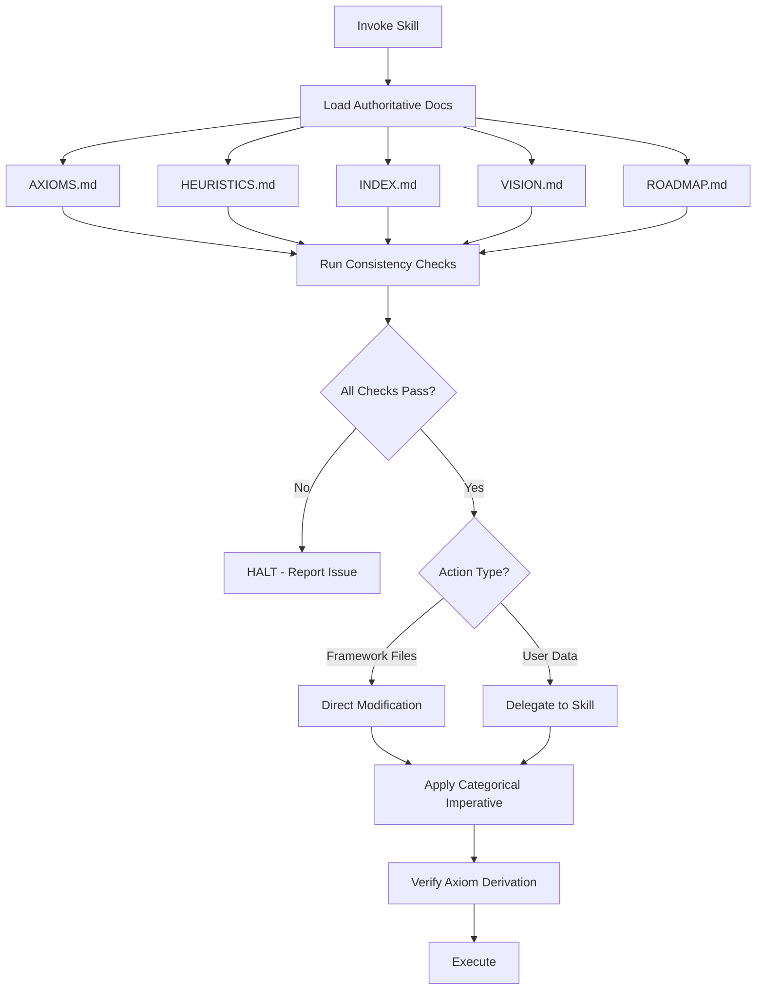

# Framework Skill

**Status**: Implemented
See [[skills/framework/SKILL.md]] for full implementation.

## Workflow



## Purpose

Categorical framework governance. Ensures every action is justifiable as a universal rule derived from axioms, and delegates user data operations to appropriate skills.

## Problem Statement

Framework modification risks:

- Ad-hoc changes that don't generalize
- Violations of DRY (duplicate information)
- Files placed in wrong locations
- Missing axiom derivation for conventions
- Direct modification of user data

## Solution

A skill that treats every change as a universal rule, enforces consistency checks before any action, and delegates user data operations to specialized skills.

## How It Works

### Invocation

```
Skill(skill="framework")
```

Invoke before modifying framework infrastructure OR when making any change that should become a generalizable pattern.

### Core Behaviors

**1. Mandatory Introspection (First Step)**

Before ANY action, load all authoritative documents:

1. `AXIOMS.md` - Inviolable principles
2. `HEURISTICS.md` - Empirically validated guidance
3. `INDEX.md` - Authoritative file tree
4. `VISION.md` - Goals and scope
5. `ROADMAP.md` - Current status

**2. Consistency Checks**

| Check                | Question                                    | Failure = HALT             |
| -------------------- | ------------------------------------------- | -------------------------- |
| Axiom derivation     | Which axiom(s) justify this change?         | Cannot identify axiom      |
| INDEX placement      | Does INDEX.md define where this belongs?    | Location not in INDEX      |
| DRY compliance       | Is this information stated exactly once?    | Duplicate exists elsewhere |
| VISION alignment     | Does VISION.md support this capability?     | Outside stated scope       |
| Namespace uniqueness | Does name conflict with existing component? | Name collision detected    |

**3. Categorical Imperative**

Every action must be justifiable as a universal rule:

- State the generalizable principle
- Check if rule exists in framework docs
- If no rule exists: propose, get approval, document
- Ad-hoc actions are PROHIBITED

**4. File Boundary Enforcement**

| Location      | Action                     | Reason                                  |
| ------------- | -------------------------- | --------------------------------------- |
| `$AOPS/*`     | Direct modification OK     | Framework files                         |
| `$ACA_DATA/*` | **MUST delegate to skill** | User data requires repeatable processes |

### HALT Protocol

When encountering something that cannot be derived:

1. STOP - Do not guess or work around
2. STATE - "I cannot determine [X] because [Y]"
3. ASK - Use AskUserQuestion for clarification
4. DOCUMENT - Once resolved, add rule to appropriate location

### Reference Documentation

- [[../skills/framework/references/hooks_guide.md]] - Hook system architecture
- [[../skills/framework/references/script-design-guide.md]] - Script design principles
- [[../skills/framework/references/e2e-test-harness.md]] - Test harness infrastructure
- [[../skills/framework/references/claude-code-config.md]] - Claude Code configuration

### Workflows

- [[../skills/framework/workflows/01-design-new-component.md]] - Adding hooks, skills, scripts
- [[../skills/framework/workflows/02-debug-framework-issue.md]] - Deep Root Cause Analysis
- [[../skills/framework/workflows/03-experiment-design.md]] - Framework experiments
- [[../skills/framework/workflows/04-monitor-prevent-bloat.md]] - Anti-bloat practices
- [[../skills/framework/workflows/06-develop-specification.md]] - Writing specs

## Relationships

### Depends On

- [[AXIOMS]] for principles
- [[HEURISTICS]] for validated patterns
- [[INDEX.md]] for file placement
- [[VISION.md]] for scope

### Used By

- Any work modifying framework infrastructure
- Pattern establishment workflows
- Skill creation and maintenance

### Delegates To

- [[remember]] for knowledge persistence
- [[tasks]] for task management
- [[analyst]] for data analysis (with "FRAMEWORK SKILL CHECKED" token)

## Success Criteria

1. **Axiom derivation enforced**: Every action traces to axiom
2. **Consistency checks pass**: No duplicate content, correct placement
3. **Categorical imperative**: No ad-hoc actions
4. **Skill delegation**: User data modified only via skills
5. **HALT on ambiguity**: No guessing or workarounds

## Design Rationale

**Why mandatory introspection?**

Without loading all authoritative documents, agents proceed with incomplete knowledge and create inconsistencies. Loading all five docs ensures every action is informed by complete framework state.

**Why categorical imperative?**

Ad-hoc actions fragment the framework. Every change that's worth making is worth generalizing. If it can't be stated as a universal rule, it shouldn't be done.

**Why delegate user data?**

User data requires repeatable processes. One-off scripts and manual changes violate the categorical imperative. Building a skill first ensures the process is generalizable.

**Why HALT protocol?**

Guessing and workarounds create silent inconsistencies. Explicitly halting and asking preserves framework integrity and surfaces gaps for proper resolution.
