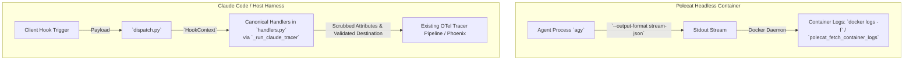

# Feature Specification: Session Event Stream Telemetry Forwarder (Native Hook & Stream Integration)

## 1. Problem Statement

academicOps agent sessions execute across disparate runtimes and dispatch surfaces: interactive developer terminals (Claude Code CLI and agy CLI), background subagents, and headless containerized execution (Polecat workers).

Session observability across these surfaces has previously faced two distinct limitations:
1. **Post-hoc batch transcript extraction** (`specs/transcript-pipeline.md`, `lib/py/transcripts/`): Parses raw `transcript.jsonl` files only after a session completes, providing zero live visibility while an agent is actively executing.
2. **Real-time visibility during execution**: While hook-based OpenTelemetry tracing (`plugins/ida/hooks/claude_code_tracer.py`, `agy_tracer.py`) sends turn and tool spans to Arize Phoenix, operators and orchestrators monitoring long-running headless container workers or background sessions need direct, real-time access to the session event stream as it occurs.

In accordance with [`specs/agents/ida-supervision-migration.md`](../agents/ida-supervision-migration.md) ("*Ida may judge what has been brought back to her. She may not go and get it*"), interactive supervisory agents (such as `ida`) do not drive workers or observe live worker execution turns; live execution driving, container monitoring, and exit-signal waiting belong strictly to orchestrators (`orchestrate`), container tooling, and human operators per [`specs/polecat/spec-observability.md`](../polecat/spec-observability.md).

To observe active sessions without violating [`.agents/rules/polling.md`](../../.agents/rules/polling.md) (no disk tailing or sleep loops) and without violating [`plugins/rbg/axioms/proportionate.md`](../../plugins/rbg/axioms/proportionate.md) (building bespoke daemon forwarders), academicOps adopts the least mechanism across the class:
- **Headless container workers**: Standardize the native client streaming flag (`--output-format stream-json`) and consume the event stream via native container log streaming (`docker logs -f` and `polecat_fetch_container_logs`), requiring **0 lines** of new application forwarding code.
- **In-process hook tracing**: Rely on existing canonical hook handlers in [`plugins/ida/hooks/handlers.py`](../../plugins/ida/hooks/handlers.py) and OTel turn tracing in [`claude_code_tracer.py`](../../plugins/ida/hooks/claude_code_tracer.py). In accordance with the canonical OpenInference trace model, traces are strictly turn-scoped (`UserPromptSubmit` to `Stop`), grouping turns under `session.id` and avoiding out-of-turn span machinery.
- **Data boundaries**: Explicitly validate exporter destination endpoints against an authorized allowlist and enforce pattern-based token scrubbing before any cross-boundary telemetry export (`plugins/rbg/axioms/data-boundaries.md`).

## 2. Acceptance Criteria

### User Persona
*Dr. Aris Thorne (Systems Operator & Orchestrator)*: "I oversee long-running headless container workers and automated background sessions. I need real-time, streaming visibility into session events as they unfold to detect faults and hangs, using the platform's native streaming capabilities without maintaining bespoke forwarding daemons, without polling files on disk, and without leaking credentials across trust boundaries."

### Acceptance Criteria
- **AC-1: Native Container Stream Streaming (`use-native-mechanism`)**: Headless container workers (Polecat) are configured with `--output-format stream-json`. The real-time event stream is emitted directly to stdout and consumed via standard container log streaming (`docker logs -f` / `polecat_fetch_container_logs`). Zero bespoke forwarder processes, sidecars, or disk tailers are deployed.
- **AC-2: Canonical In-Memory OTel Dispatch (`single-source-of-truth`, `proportionate`)**: In-process hook events are captured in memory and dispatched via existing canonical hook handlers in `plugins/ida/hooks/handlers.py` and `_run_claude_tracer` into the existing OpenTelemetry tracer pipeline (`claude_code_tracer.py` / `agy_tracer.py`). Traces adhere strictly to turn boundaries without inventing out-of-turn spans or parallel schemas.
- **AC-3: Data Boundary Enforcement (`data-boundaries`)**: Before emitting spans across process or network boundaries:
  1. *Destination Authorization*: The target telemetry endpoint (`OTEL_EXPORTER_OTLP_ENDPOINT`) is parsed with `urllib.parse.urlsplit` and verified against an explicit destination allowlist (e.g., authorized local Phoenix collector on `nicwin_polecat_workers` or `http://localhost:*`); transmission to unlisted destinations is refused with an audit warning.
  2. *Scrubbing & Redaction*: In addition to environment variable matching, all payload attributes must pass through regex-based scrubbing for known secret token patterns (`ghp_[A-Za-z0-9_]{36,}`, `sk-[A-Za-z0-9_-]{20,}`, `Bearer\s+[A-Za-z0-9_\-\.]{20,}`) in `_truncate` before span export.
- **AC-4: Zero Shell or Disk Polling (`polling`)**: No file seek loops, `sleep` loops, or bash polling scripts are permitted on `transcript.jsonl`. Telemetry ingestion is strictly event-driven in memory at hook invocation or via push stdout streams.
- **AC-5: Headless Worker Invariants (`headless-workers`)**: Polecat container launch configurations omit interactive permission prompt hooks (`PermissionRequest`, `PermissionDenied`), preventing dispatch overhead and deadlocks in non-interactive runtimes.
- **AC-6: Non-blocking Execution & Graceful Degradation**: Telemetry export errors or unavailable collectors must never block or crash the executing agent turn. Tracer errors are caught and logged at `warning` level.

## 3. Scope

### In Scope
- **Polecat Runner Invocation Flag**: Standardizing `--output-format stream-json` in Polecat container launch definitions (`plugins/aops/skills/polecat/`, `specs/polecat/spec-observability.md`), enabling real-time NDJSON event streaming to stdout with 0 lines of new application code.
- **Data Boundaries Destination Validation & Regex Redaction**: Enhancing `_truncate` in `claude_code_tracer.py` with regex token patterns and adding `_validate_exporter_destination(endpoint)` during tracer config discovery using `urllib.parse.urlsplit`.
- **Headless Hook Configuration**: Updating container hook manifests to exclude interactive permission hooks for Polecat workers.

### Out of Scope (Explicitly Cut under Proportionate)
- **NO Bespoke Forwarder Daemon**: No standalone forwarding process, background service, or sidecar daemon.
- **NO File-Tailing Engine (`StreamTailer`)**: No disk polling or file-descriptor seeking against `transcript.jsonl`.
- **NO Custom Queue / Backpressure Machinery**: No custom FIFO ring buffers or circuit breaker logic.
- **NO Bespoke Transport Sinks**: No custom Unix domain sockets, named pipes, or custom HTTP/SSE servers. Telemetry relies exclusively on native container stdout logging and the existing OpenTelemetry OTLP pipeline.
- **NO Out-of-Turn Tracer Spans**: No bespoke spans for `SessionStart` outside active turn roots.
- **NO Dual Schemas**: No custom `SessionEvent` dataclass competing with OpenTelemetry/OpenInference conventions.
- **NO Live Driving by Ida**: `ida` remains strictly an interactive face performing post-hoc handback adjudication, not live container driving.

## 4. Dependencies & Infrastructure

- **Runtimes & Clients**:
  - `agy` native CLI streaming: `--output-format stream-json`.
  - Claude Code hook dispatch runtime: `plugins/ida/hooks/dispatch.py`.
- **Container Runtime**: Docker daemon standard logging (`docker logs -f` / `polecat_fetch_container_logs`).
- **Telemetry Infrastructure**: Existing OpenTelemetry tracer (`plugins/ida/hooks/claude_code_tracer.py`, `agy_tracer.py`) and Arize Phoenix collector.
- **Rules & Axioms**:
  - `.agents/rules/use-native-mechanism.md`
  - `.agents/rules/polling.md`
  - `.agents/rules/headless-workers.md`
  - `plugins/rbg/axioms/proportionate.md`
  - `plugins/rbg/axioms/data-boundaries.md`
  - `plugins/rbg/axioms/single-source-of-truth.md`
  - `plugins/rbg/axioms/closure.md`
  - `plugins/rbg/axioms/honest-epistemics.md`

## 5. Test and Verification Design

Each acceptance criterion maps to direct automated verification:

| Criterion | Verification Method | Test Description |
| :--- | :--- | :--- |
| **AC-1 (Native Streaming)** | Configuration / CLI Test | Assert that Polecat container runner passes `--output-format stream-json` when launching `agy`, and verify NDJSON lines are readable via `docker logs`. |
| **AC-2 (Canonical OTel)** | Unit Test (`tests/test_claude_code_tracer_session_events.py`) | Dispatch turn events through `handlers.HANDLERS`; assert that events are captured via canonical handlers and forwarded to the collecting OTel exporter as child spans of the turn root. |
| **AC-3 (Data Boundaries)** | Unit Test | 1. Test destination validation: assert tracer refuses export and logs warning when `OTEL_EXPORTER_OTLP_ENDPOINT` is set to an unauthorized destination (e.g. `http://evil.com:4318`).<br/>2. Test token scrubbing: assert payloads with `ghp_*`, `sk-*`, and Bearer tokens are redacted to `<REDACTED_SECRET>` by `_truncate`. |
| **AC-4 (No Polling)** | Code Inspection & Linter | Verify that no file seek loops, `sleep` calls, or bash loops exist in the telemetry forwarding path. |
| **AC-5 (Headless Invariants)** | Integration Test | Verify that Polecat container hook manifests omit interactive permission prompt hooks. |
| **AC-6 (Non-blocking)** | Unit Test | Simulate an OTel exporter error / timeout; assert the hook handler catches the error, logs a warning, and returns cleanly without raising an exception. |

## 6. Implementation Approach

The capability is delivered using the minimum mechanism across the class:



### 1. Container Streaming (0 lines of new application forwarding code)
Launch configurations in Polecat specify `--output-format stream-json`. The agent runtime outputs real-time NDJSON events directly to stdout, which the Docker daemon buffers and streams natively via `docker logs -f` or `polecat_fetch_container_logs`.

### 2. In-Process Hook Dispatch (0 lines of new routing code)
Tracer hooks in `plugins/ida/hooks/handlers.py` and `claude_code_tracer.py` already route turn events (`UserPromptSubmit`, `PreToolUse`, `PostToolUse`, `Notification`, `PermissionRequest`, `PermissionDenied`, `PreCompact`, `PostCompact`, `StopFailure`, `Stop`) as child spans of the turn's root span. No parallel routing or out-of-turn machinery is added.

### 3. Data Boundaries Destination Validation & Regex Redaction (~15 lines in `claude_code_tracer.py`)
In `_truncate(value)`:
```python
# Pattern-based secret redaction
TOKEN_PATTERNS = (
    re.compile(r"ghp_[A-Za-z0-9_]{36,}"),
    re.compile(r"sk-[A-Za-z0-9_-]{20,}"),
    re.compile(r"Bearer\s+[A-Za-z0-9_\-\.]{20,}"),
)
for pattern in TOKEN_PATTERNS:
    s = pattern.sub("<REDACTED_SECRET>", s)
```
In `_validate_exporter_destination(endpoint: str) -> bool`:
```python
# Normalize schemeless endpoints so urlsplit cleanly extracts hostname
url = endpoint if "://" in endpoint else f"//{endpoint}"
parsed = urllib.parse.urlsplit(url)
hostname = (parsed.hostname or "").lower()
# Authorized destinations: localhost, loopback, or compose worker network
ALLOWED_HOSTS = {"localhost", "127.0.0.1", "nicwin_polecat_workers"}
return hostname in ALLOWED_HOSTS
```
If `_validate_exporter_destination` returns `False`, `discover_config` returns `None` and logs an authorization warning, halting outbound span transmission per `plugins/rbg/axioms/data-boundaries.md`.

## 7. Effort and Risk Assessment

- **Effort Estimate**:
  - Container launch configuration update: 0.25 days
  - Destination validation and regex scrubbing in `_truncate`: 0.25 days
  - Unit tests: 0.25 days
  - **Total**: 0.75 engineering days.
- **Risk Assessment**:
  - *Architectural Divergence*: None; builds exclusively upon canonical OTel and native Docker mechanisms.
  - *Data Boundary Security*: High confidence; enforces both URL-parsed destination allowlists and multi-pattern scrubbing.
  - *Performance Impact*: Negligible (< 1 ms per hook event, 0 extra processes).
