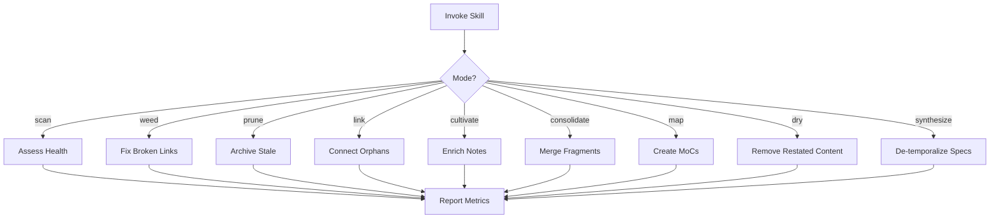

# Garden Skill

**Status**: Implemented
See [[skills/garden/SKILL.md]] for full implementation.

## Workflow



## Purpose

Incremental PKM maintenance. Small regular attention beats massive occasional cleanups. Tends the knowledge base bit by bit.

## Problem Statement

Knowledge base entropy:
- Dead links and outdated content accumulate
- Orphan files become invisible
- Sparse notes lack context
- Content restated instead of linked (DRY violations)
- Implemented specs retain deliberation cruft

## Solution

A skill with focused gardening modes for specific maintenance activities, designed for 15-30 minute sessions. Works in small batches, surfaces decisions for confirmation.

## How It Works

### Invocation

```
Skill(skill="garden", args="<mode> [area]")
```

### Gardening Modes

| Mode | Activity |
|------|----------|
| **scan** | Health check. Count orphans, broken links, stale content |
| **weed** | Fix broken wikilinks, remove dead references |
| **prune** | Archive stale sessions, compress verbose notes |
| **link** | Connect orphans, add missing wikilinks per [[HEURISTICS#H34]] |
| **cultivate** | Add missing frontmatter, expand sparse notes |
| **consolidate** | Merge notes on same topic, extract patterns |
| **map** | Create/update MoCs (Maps of Content) |
| **dry** | Find restated content, replace with links |
| **synthesize** | Strip deliberation artifacts from implemented specs |

### Link Mode Details

Enforces semantic link density per [[HEURISTICS#H34]]:
1. Zero-backlink orphans: Files with no incoming links
2. Semantic orphans: Files in same folder with overlapping topics, no mutual links
3. Hub disconnection: Project hubs not linking to key content
4. Missing bidirectional links: A references B's topic, both should link

### Synthesize Mode Details

De-temporalizes content:
- **Sacred (never touch)**: User-written notes, research records, primary documents
- **Can de-temporalize**: Agent-generated event logs, decision options sections, temporal markers

Workflow:
1. Find implemented specs with deliberation cruft
2. Archive rationale to decisions/ if valuable
3. Strip from spec, preserve acceptance criteria
4. Delete temporal files whose value is in git

### DRY Enforcement

Core docs (AXIOMS, ACCOMMODATIONS, HEURISTICS, RULES) apply everywhere implicitly:
- Don't restate content from core docs
- Don't even link unless specific section is uniquely relevant
- Remove sections labeled "from [[X]]" that duplicate content

### Health Metrics

| Metric | Target |
|--------|--------|
| Orphan rate | <5% |
| Link density | >2 per note |
| Broken links | 0 |
| MoC coverage | >90% |
| DRY violations | 0 |

## Relationships

### Depends On
- [[HEURISTICS#H34]] for semantic link density rules
- [[HEURISTICS#H23]] for synthesize behavior
- [[AXIOMS#13]] (Trust Version Control) for temporal file deletion
- Memory server for semantic orphan detection

### Used By
- Routine maintenance workflow
- Post-project cleanup
- Knowledge base health monitoring

### Integrates With
- [[remember]] for knowledge creation (garden maintains what remember creates)
- Obsidian graph visualization (garden improves graph connectivity)

## Success Criteria

1. **Small batches**: 3-5 notes at a time
2. **User confirmation**: Decisions surfaced before deletions
3. **Frequent commits**: Logical chunks committed
4. **Session length**: 15-30 minutes max
5. **No user content deleted**: Only agent-generated temporal records

## Design Rationale

**Why incremental?**

Marathon cleanup sessions are unsustainable and create cognitive overload. Small, frequent gardening is sustainable and catches issues early.

**Why DRY enforcement?**

Restated content creates maintenance burden and drifts from source. Core docs are loaded automatically - no need to repeat their content.

**Why synthesize mode?**

Specs accumulate temporal noise during design. After implementation, this noise obscures the current state. Synthesizing converts deliberation artifacts into clean reference documentation.

**Why preserve user content?**

Agent-generated event logs can be safely deleted (git has the commits). User-authored notes, meeting records, and observations are sacred primary sources.
