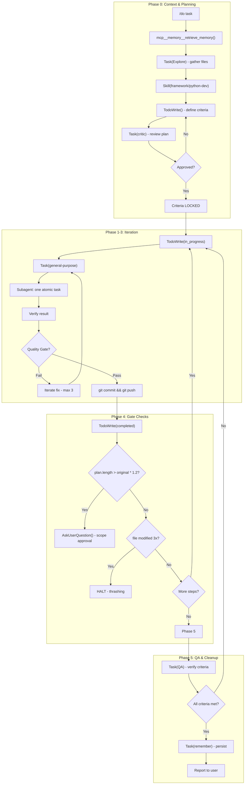

# Hypervisor

**Status**: Implemented

The hypervisor is the brain of academicOps - a pure orchestration layer that controls the plan to control the work.

## Workflow with Mechanisms

## Purpose

Orchestrate multi-agent workflows with quality gates, acceptance criteria lock, and scope drift detection. The hypervisor enforces discipline on subagents to ensure reliable task completion.

## Problem Statement

Multi-agent workflows risk:
- Subagents making autonomous decisions that derail scope
- Acceptance criteria shifting mid-workflow
- Quality gates skipped under pressure
- Scope creep without detection
- Thrashing on the same file without progress
- Implementation details leaking to orchestration layer

## Solution

A pure orchestration layer with NO implementation tools. Can only spawn subagents, invoke skills, track progress, and ask questions. Enforces workflow templates, locked acceptance criteria, and mandatory quality gates.

## Core Contract (Inviolable)

**Allowed tools ONLY**: Task, Skill, TodoWrite, AskUserQuestion, mcp__memory__retrieve_memory

The hypervisor:
- ❌ CANNOT Read, Edit, Write, Bash, Grep, Glob
- ✅ CAN spawn subagents to do implementation work
- ✅ CAN invoke skills for specialized behavior
- ✅ CAN track progress with TodoWrite
- ✅ CAN ask user clarifying questions
- ✅ CAN search memory for context

## Five-Phase Workflow

| Phase | Purpose | Mechanisms |
|-------|---------|------------|
| 0. Planning | Load workflow, define acceptance criteria, create plan, critic review | `mcp__memory__retrieve_memory`, `Task(Explore)`, `Skill()`, `TodoWrite`, `Task(critic)` |
| 1-3. Iteration | Execute atomic steps per workflow template | `TodoWrite(in_progress)`, `Task(general-purpose)`, `git commit && push` |
| 4. Gate | Verify quality, detect scope drift, check for thrashing | `TodoWrite(completed)`, plan length check, file modification count |
| 5. Completion | QA verification, document outcomes, final report | `Task(QA)`, `Task(remember)`, user report |

## Acceptance Criteria Lock

Before ANY implementation:
1. Define acceptance criteria with Plan agent
2. Present for user approval
3. Populate TodoWrite with ALL steps (including QA)
4. **Criteria become IMMUTABLE** once locked

If criteria cannot be met: HALT and report. No goal post shifting.

## Quality Enforcement

**Scope Drift Detection**: If plan grows >20% from original, STOP and get user approval via `AskUserQuestion`.

**Thrashing Detection**: If same file modified 3+ times without progress, STOP and ask for help.

**Iteration Protocol**: On failure, hypervisor decides fix strategy and iterates (max 3 attempts). Does NOT ask user.

**Commit Each Cycle**: Changes committed AND pushed before next iteration.

## Relationships

### Depends On
- [[AXIOMS]] #1 (Categorical Imperative), #22 (Acceptance Criteria Own Success)
- [[HEURISTICS]] #H14 (Mandatory Second Opinion), #H25 (User-Centric Criteria)
- Workflow templates in `skills/hypervisor/workflows/`

### Uses
- [[critic]] agent - Plan review before implementation
- General-purpose subagents - Implementation work
- [[tasks]] skill - Document outcomes
- [[remember]] skill - Persist learnings

### Workflows (bundled)
- `workflows/tdd.md` - Test-first development
- `workflows/batch-review.md` - Parallel batch processing

## Success Criteria

1. **No implementation leakage**: Hypervisor never uses Read/Edit/Write/Bash
2. **Locked criteria**: Acceptance criteria immutable after approval
3. **Atomic steps**: Subagents do one task, report back, wait for next
4. **Scope control**: Drift >20% requires explicit approval
5. **Quality gates**: Every iteration passes workflow-specific validation
6. **Persistence**: Each cycle committed and pushed before next

## Design Rationale

**Why no implementation tools?**

Per [[AXIOMS]] #1: Actions must flow through generalizable patterns. The hypervisor's job is orchestration, not implementation. Giving implementation tools would let it bypass the discipline it's meant to enforce. Tool restriction is mechanically enforced by Claude Code.

**Why acceptance criteria lock?**

Per [[AXIOMS]] #22: Acceptance criteria own success. Agents naturally rationalize and weaken criteria when implementation gets hard. Locking criteria before work begins prevents goal post shifting. If criteria can't be met, that's signal to HALT, not to weaken requirements.

**Why atomic steps?**

Subagents left unsupervised make autonomous decisions that accumulate into mess. One atomic step at a time keeps the hypervisor in control. Wait for report, verify result, then issue next step.

**Why scope drift detection?**

Scope creep is invisible until it's too late. Quantifying plan growth (>20%) makes it visible. Getting explicit approval for scope expansion prevents runaway projects.
