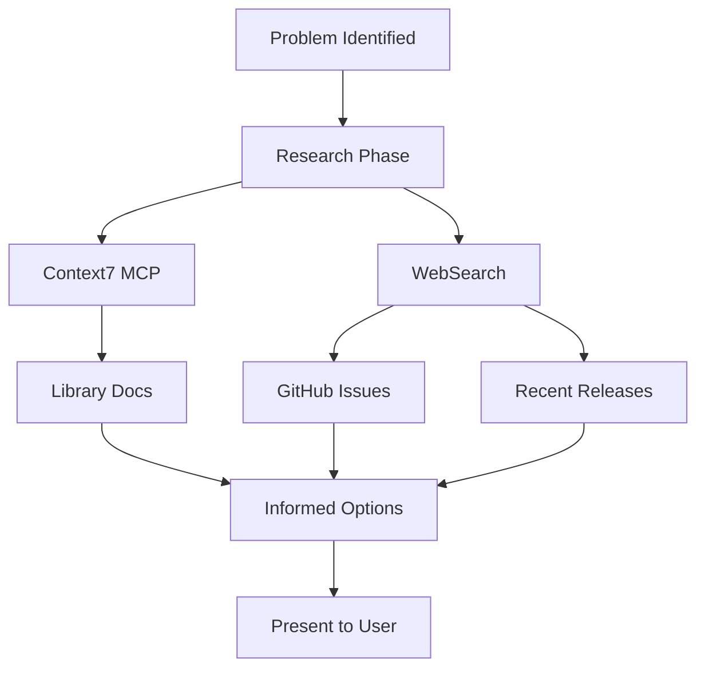

# Informed Improvement Options

**Status**: Requirement (Phase 1 in progress)

## Workflow

## Statement

As a user, I want to be presented with options for improving the framework that are informed by:
1. **Up-to-date knowledge about exactly how our existing tools work** and can be configured
2. **Up-to-date awareness of what other people are doing** in unrelated projects that use a similar technology stack (including new tools and new features)

## Context

Current state: Diagnosis of framework issues is good - we can identify problems clearly. But when proposing fixes, agents often have limited imagination because they:
- Don't know the full capabilities of tools we already use (Claude Code, MCP servers, hooks, etc.)
- Don't know about new features released after their training cutoff
- Don't know what patterns other teams have found effective in similar contexts

## Acceptance Criteria

1. **Tool capability awareness**: When proposing fixes, agent demonstrates knowledge of relevant configuration options, hidden features, and lesser-known capabilities of tools already in use
2. **External research**: Agent actively searches for how others solve similar problems before proposing solutions
3. **Recency-aware**: Agent uses web search to check for recent releases, new features, or updated documentation
4. **Options informed by research**: Proposed options cite sources (docs, blog posts, GitHub discussions) rather than relying solely on training knowledge

## Example Scenario

**Problem**: Intent-router subagent can't access cache files written by parent process

**Uninformed response** (what we have now):
- Pass content directly
- Use memory server
- Embed in agent definition

**Informed response** (what we want):
- "Claude Code's Task tool has a `inherit_env` parameter added in v1.2.3 that may address sandbox isolation - [link to docs]"
- "Looking at GitHub issues, others have worked around this by using shared temp directories with explicit permissions - [link]"
- "The Playwright MCP team solved a similar problem using X approach - worth investigating"

## Implementation Decision

**Chosen approach**: Context7 MCP + WebSearch in /meta workflow

### Phase 1: Context7 MCP
- Install Context7 MCP server for up-to-date library documentation
- Add to capabilities.md so prompt router can recommend it
- API key in `${CONTEXT7_API_KEY}`

### Phase 2: WebSearch in /meta (future)
- Add mandatory WebSearch step before proposing fixes
- Search for GitHub issues, recent releases, external solutions
