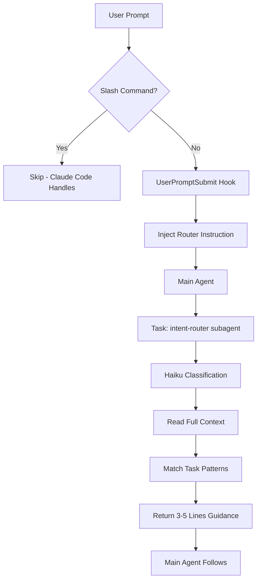

# Intent Router

**Status**: Superseded by `/do` command and Prompt Enricher specs

The hook-based approach described below was replaced by:
- **`/do` command** (`specs/do-command.md`) - explicit invocation for prompt enrichment
- **Prompt Enricher** (`specs/prompt-enricher.md`) - planned automatic enrichment via UserPromptSubmit

The intent-router AGENT (`agents/intent-router.md`) still exists and is spawned by `/do`.

---

## Original Design (Historical Reference)



## Problem Statement

Agents are good at *following* skills but bad at *choosing* to use them. Despite being told which skills exist, agents frequently:
- Skip skill invocation for framework operations
- Bypass validation instead of fixing root causes
- Forget structural requirements (TodoWrite, Plan Mode, verification)
- Repeat known failure patterns (H28: no acceptance testing, H3: claim success without verification)

User shouldn't have to explicitly say "use skill X" every time.

## Solution: Intelligent First Intervention

The intent router IS **Level 2 enforcement** (see [[enforcement]]). It replaces static JIT injection with intelligent, adaptive intervention.

### Router Capabilities

The router handles ALL of:
- **Context insertion** - provides information agent needs for THIS task
- **Directives** - tells agent what to do (not generic rules)
- **Skill/tool suggestions** - recommends which skills to invoke
- **Workflow guidance** - steers to Plan Mode, TodoWrite, verification
- **Subagent delegation** - recommends Task() for appropriate work

### Classification

A Haiku subagent classifies each prompt against:
1. **Task type** → appropriate workflow (debug, feature dev, question, etc.)
2. **Known failure patterns** → preventive guidance from HEURISTICS.md
3. **Required structures** → TodoWrite, Plan Mode, acceptance testing per H28

Main agent stays clean - classification context doesn't clog it.

## Architecture (Superseded)

**Current implementation**: See `commands/do.md` and `agents/intent-router.md`

Original hook-based flow (not implemented):
```
User prompt
    ↓
UserPromptSubmit hook (user_prompt_submit.py)
    ↓
├─ /slash? → Skip (Claude Code handles)
│
└─ Other → Inject: "ROUTE FIRST: invoke intent-router"
    ↓
Main agent invokes Task(subagent_type="intent-router", model="haiku")
    ↓
Haiku subagent:
  - Reads full context (hooks/prompts/intent-router.md)
  - Classifies prompt against task patterns
  - Returns 3-5 lines of filtered guidance
    ↓
Main agent receives ONLY filtered output
(classification logic disappears from context)
```

## Key Files

| File | Purpose |
|------|---------|
| `commands/do.md` | `/do` command - explicit invocation entry point |
| `agents/intent-router.md` | Agent definition - spawned by `/do` |
| `specs/prompt-enricher.md` | Planned automatic enrichment via UserPromptSubmit |

## What Gets Injected

**Slash commands:** Nothing (Claude Code handles natively)

**Other prompts:**
```
ROUTE FIRST: Invoke the intent router before proceeding:
Task(subagent_type="intent-router", model="haiku", prompt="Read [temp-file] and return guidance")
Follow the router's output.
```

## Task Classification

The router classifies prompts and returns task-specific guidance:

| Pattern | Guidance | Failure Prevention |
|---------|----------|-------------------|
| Framework files | Skill("framework"), Plan Mode, TodoWrite, critic | H2: Skill-first |
| Feature development | TodoWrite with acceptance testing, Plan Mode | H28: Mandatory acceptance testing |
| CC component dev | Skill("plugin-dev:*"), validation scripts | H3: Verify before assert |
| Debug/error | VERIFY STATE FIRST, TodoWrite checklist, cite evidence | H5: Quote errors exactly |
| Question | Answer then STOP, no implementing | H19: Questions need answers |
| Multi-step work | TodoWrite, commit after logical units | H28: Include e2e verification |
| Knowledge persist | Skill("remember"), search memory first | H12: Semantic search |

## Failure Pattern Awareness

The router knows common failure patterns and injects preventive guidance:

| Heuristic | Failure Pattern | Router Injects |
|-----------|-----------------|----------------|
| H3 | Claiming success without verification | "VERIFY before asserting complete" |
| H19 | Jumping to action on questions | "ANSWER first, then STOP" |
| H28 | Skipping acceptance testing | "TodoWrite MUST include e2e verification" |
| H2 | Skipping skill invocation | "Invoke Skill(X) for context" |
| H27 | Redesigning during debug | "Fix within current design, don't pivot" |

The router prompt (`hooks/prompts/intent-router.md`) should reference these patterns explicitly.

## Acceptance Criteria

1. **Guidance relevance**: Router returns appropriate guidance for task type
   - Framework edits → includes Skill("framework"), Plan Mode
   - Questions → includes "Answer then STOP"
   - Debug → includes "VERIFY STATE FIRST"

2. **Agents follow guidance**: Main agent actually invokes recommended skills/modes
   - Measure: skill invocation rate before/after router suggestion

3. **Token efficiency**: Classification context stays in subagent
   - Main agent receives ~4 lines, not 60+ lines of rules

4. **Latency acceptable**: Router adds minimal delay
   - Target: <5s total for classification

5. **No false gates**: Router never blocks valid prompts
   - Slash commands bypass completely
   - Simple tasks get "just do it" guidance

## Failure Modes

| Failure | Detection | Recovery |
|---------|-----------|----------|
| Router adds latency | User complaint, >10s delays | Disable hook in settings.json |
| Guidance ignored | Skill bypass continues | Strengthen prompt, add enforcement hook |
| Bad recommendations | Irrelevant skill suggestions | Tune task patterns in prompt |

## Enforcement Escalation

The router is Level 2 enforcement. If agents ignore router guidance:

| Detection | Escalation |
|-----------|------------|
| Skill not invoked after router recommended | Level 4: PreToolUse hook blocks until Skill called |
| TodoWrite missing acceptance testing | Level 5: PostToolUse hook demands correction |
| Wrong tool for domain | Level 3a: Tool restriction via workflow |

## Open Questions

1. **Compliance verification**: How do we detect when router guidance is ignored?
   - Options: PostToolUse hook, session analysis, learning logs

2. **Router prompt maintenance**: How do we keep failure patterns in sync with HEURISTICS.md?
   - Option: Script that extracts high-confidence heuristics into router prompt
