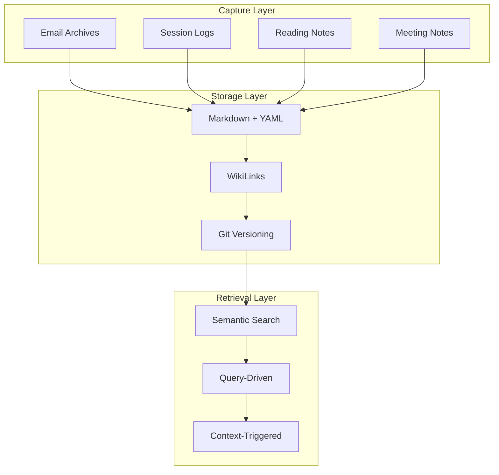

# Knowledge Management Philosophy

**Status**: Active (guiding principles)

## Core Model



**Vision**: Capture everything. Deliver just-in-time.

## Foundational User Stories

These are non-negotiable requirements. Every design decision must support them.

| # | User Story | Rationale |
|---|------------|-----------|
| US1 | **Human-readable without tools** - I can open any file with a text editor and read it | No lock-in, survives any tool failure |
| US2 | **Standard format** - Markdown with YAML frontmatter and wikilinks | Works with Obsidian, VS Code, GitHub, any future tool |
| US3 | **Git-native versioning** - I can use git history to see or restore any previous state | Time travel, incremental backup, diff-friendly |
| US4 | **Incremental sync** - I can sync a subset of files without full-repo operations | Works on slow connections, selective device sync |
| US5 | **Accessible anywhere** - I can access the knowledge base from any device | Cross-device workflow is core requirement |
| US6 | **No database dependency** - The files ARE the data, not a cache of some database | Resilient, inspectable, portable |
| US7 | **Seamless background capture** - Useful information from agent conversations (including incidental/serendipitous observations) is captured automatically, transparently, reliably | Conversations generate valuable insights that shouldn't require manual extraction |

**Corollary**: Any "smart" features (semantic search, [[memory server]], embeddings) are **overlays** on the markdown files, not replacements. If the overlay fails, the files remain fully usable.

---

## Vision

**Capture everything. Deliver just-in-time.**

Build a knowledge management system that:
1. **Captures comprehensively** - No information is too small, too old, or too tangential to preserve
2. **Delivers precisely** - Information surfaces exactly when needed, at the right detail level, never proactively
3. **Reduces cognitive load** - System remembers so the user doesn't have to

## The Problem

### Current State: Cognitive Overload

Academic work generates massive information flow:
- 500+ emails/day with tasks, papers, grants, collaborations
- 20+ years of research history across shifting domains
- Dense networks of people, projects, concepts, events
- Cross-cutting themes that span decades (e.g., "copyright" from CC work 2006 → ML copyright 2024)

**[[ADHD]] amplifies the challenge:**
- Working memory limitations make manual triage exhausting
- Context switching is expensive
- Information gets lost between interruptions
- Revisiting decisions requires reconstructing entire context

### Failed Approaches

**Approach A: Selective Capture** (doesn't work)
- Decide what's "important" at capture time
- **Problem**: Can't predict future relevance
- **Problem**: Triage decisions drain cognitive energy
- **Problem**: Information loss is permanent

**Approach B: Folder Hierarchies** (doesn't work)
- Organize into projects/categories
- **Problem**: Cross-cutting themes don't fit hierarchies
- **Problem**: Retrieval requires remembering structure
- **Problem**: Refactoring is expensive

**Approach C: Proactive Summaries** (doesn't work)
- Generate daily digests, status reports, briefings
- **Problem**: Information overload - too much to read
- **Problem**: Wrong detail level - either too shallow or too deep
- **Problem**: Delivered when NOT needed, missing when needed

## Design Principles

### 1. Comprehensive Capture (Everything)

**Principle**: The act of capturing information should require ZERO cognitive judgment about importance or relevance.

**Implementation:**
- Email archives → bmem entities (contacts, projects, events)
- Session logs → automatically extracted insights
- Reading notes → atomic observations with relations
- Meeting notes → structured entities with participants/outcomes
- Even "trivial" information (lunch discussion, hallway conversation)

**Rationale:**
- Importance is unknowable at capture time
- Judgment fatigue blocks capture entirely
- Storage is cheap, cognitive load is expensive
- Semantic search makes "everything" tractable

**Anti-pattern**: "Is this worth saving?" → If you're asking, save it.

### 2. [[Just-in-Time]] Delivery (Never Proactive)

**Principle**: Information surfaces in response to need, not anticipation of need.

**Implementation:**
- Query-driven retrieval: "What do I know about X?"
- Context-triggered: Working in project Y → relevant history surfaces
- Abstraction-aware: Answer at the level asked
  - "Who's John?" → Contact info
  - "What's my history with John?" → Collaborations, papers, meetings
  - "What did John say about copyright?" → Specific observations
- Temporal filtering: Prefer recent by default, historical when explicitly sought

**Rationale:**
- User attention is scarce - every proactive message has cost
- Relevance depends on current context, which system can't predict
- Just-in-time = zero cost when not needed, immediate value when needed

**Anti-pattern**: Daily digests, status emails, "you might want to know..." notifications

### 3. [[Semantic Search|Semantic Retrieval]] (Not Structural)

**Principle**: Find by meaning, not by location or filename.

**Implementation:**
- Semantic search via embeddings
- [[wikilinks|WikiLinks]] for explicit relations
- Tags for faceted filtering
- Entity types for structural queries
- Observations for atomic facts

**Rationale:**
- Humans think in concepts, not file paths
- Same concept spans multiple projects/years
- Relationships more important than categories

**Anti-pattern**: "Where did I save that?" → Search should make location irrelevant

### 4. Temporal Context (Recency vs History)

**Principle**: Default to recent, but make historical accessible.

**Implementation:**
- Metadata markers: `status: completed`, `active_period: 2006-2009`, `relevance: current`
- Temporal tags: `#historical-2006-2009`, `#current-work`
- Explicit historical queries: "Creative Commons work" returns archived content
- Current-domain queries: "copyright" returns recent ML work, not CC archives

**Rationale:**
- Most queries are about current work
- Historical context valuable when explicitly sought
- Temporal drift: "copyright" meant different things in 2006 vs 2024

**Success criteria**: Archive search protocol (see `archive-search-protocol.md`)

### 5. Incremental Context Building (Depth on Demand)

**Principle**: Start shallow, go deep only when needed.

**Implementation:**
- Level 0: Entity exists (title, permalink)
- Level 1: Context section (1-2 sentence summary)
- Level 2: Observations (5-10 atomic facts)
- Level 3: Relations (how this connects to other entities)
- Level 4: Full content (detailed notes, full history)

**Rationale:**
- Most queries need surface-level information
- Deep dives are rare but must be possible
- Skimmability reduces cognitive load

**Anti-pattern**: Every answer includes full history → Information overload

### 6. Compounding Value Over Time

**Principle**: Knowledge base gets MORE valuable as it grows, not less.

**Implementation:**
- Semantic connections emerge from quantity
- Patterns visible only with 10+ years of data
- Cross-pollination: Old insights inform new work
- Longitudinal analysis: Track evolution of ideas/collaborations

**Rationale:**
- Archive search protocol prevents pollution
- Quality metadata enables temporal filtering
- Comprehensive capture creates compound returns

**Success metric**: Can answer "How has my thinking on X evolved?" across decades

## Architecture Implications

### bmem Format Requirements

To support this philosophy, bmem entities must have:

**Mandatory fields:**
```yaml
title: Clear, searchable title
permalink: Stable identifier
type: note
tags: Semantic tags for filtering
created: Capture timestamp
```

**Temporal context (for historical content):**
```yaml
status: completed | in-progress | planned
active_period: YYYY-YYYY
relevance: current | historical-only
completion_date: YYYY-MM-DD (if completed)
```

**Semantic structure:**
```markdown
## Context
One-paragraph summary - the "Level 1" answer

## Observations
- [category] Atomic facts with inline #tags
- Minimum 3-5 observations for searchability

## Success Criteria

### Capture Success

**Quantitative:**
- 90%+ of actionable information extracted from email archives
- Session insights captured without manual intervention
- Zero "I forgot about that" moments that could have been captured

**Qualitative:**
- User never thinks "Should I save this?"
- Capture feels frictionless, not burdensome
- Information loss is system failure, not user failure

### Retrieval Success

**Quantitative:**
- 80%+ of queries return relevant results in top 5
- Archive Pollution Score < 0.3 for current-domain queries
- Historical recall > 90% for explicit queries
- 95%+ of searches don't require location knowledge

**Qualitative:**
- User thinks "What do I know about X?" not "Where did I save X?"
- Results are "just enough" - not too much, not too little
- Historical content accessible but not intrusive

### Functional Retrieval Tests (MANDATORY)

**These tests MUST pass for retrieval to be considered working. Run via `uv run pytest tests/test_bmem_retrieval.py`**

#### Test 1: Single-term queries return results
```python
def test_single_term_returns_results():
    """Known terms that exist in corpus must return results"""
    for term in ["workaround", "agent", "framework", "task"]:
        result = search_notes(term)
        assert len(result["results"]) > 0, f"'{term}' should return results"
```

#### Test 2: Two-term queries don't fail catastrophically
```python
def test_two_term_queries():
    """Common two-term combinations should return results"""
    result = search_notes("agent behavior")
    assert len(result["results"]) > 0
```

#### Test 3: Multi-term graceful degradation (CRITICAL)
```python
def test_multi_term_degradation():
    """Adding terms must NOT cause zero results when subsets match.

    This is the key bug: 'agent subagent behavior lazy workaround bypass'
    returned 0 results while 'agent behavior' and 'workaround' each
    returned 10 results. This is unacceptable.
    """
    # If individual terms return results...
    single_results = [
        search_notes("agent"),
        search_notes("workaround"),
        search_notes("bypass")
    ]
    any_single_has_results = any(len(r["results"]) > 0 for r in single_results)

    # ...then combining them should NOT return zero
    combined = search_notes("agent workaround bypass")

    if any_single_has_results:
        assert len(combined["results"]) > 0, (
            "Multi-term query returned 0 results but individual terms had matches. "
            "Search should use OR semantics or fallback to semantic search."
        )
```

#### Test 4: Semantic search fallback
```python
def test_semantic_fallback_for_complex_queries():
    """When text search fails, semantic search should succeed"""
    # Complex natural language query
    text_result = search_notes(
        "agent subagent behavior lazy workaround bypass",
        search_type="text"
    )
    semantic_result = search_notes(
        "agent subagent behavior lazy workaround bypass",
        search_type="semantic"
    )

    # At least ONE search type must return results for known concepts
    assert len(text_result["results"]) > 0 or len(semantic_result["results"]) > 0, (
        "Neither text nor semantic search returned results for known concepts"
    )
```

#### Test 5: Search doesn't silently fail
```python
def test_search_never_silently_fails():
    """Search must either return results OR raise an error, never silent zero"""
    # Query with terms that definitely exist in any knowledge base
    result = search_notes("the")  # Common word
    # Should either find something or explicitly indicate "no match"
    # Empty results for common terms indicates broken search
    assert len(result["results"]) > 0 or "no_results_reason" in result
```

#### Test 6: Recent activity returns content
```python
def test_recent_activity_not_empty():
    """recent_activity should return content if knowledge base has data"""
    result = recent_activity(timeframe="30d")
    # If KB has been used in last 30 days, should have results
    # Empty result when KB is active = broken
```

**Failure mode documentation**: If any test fails, the search is NOT fit for purpose. Do not rationalize failures - fix the underlying search implementation or escalate to bmem maintainers.

### System Success

**Quantitative:**
- Knowledge base grows linearly with work (not quadratically with manual curation)
- Query response time < 2 seconds
- Zero broken WikiLinks
- 100% bmem validation pass rate

**Qualitative:**
- System feels like external memory, not filing cabinet
- User trusts that captured information will be findable
- Cognitive load measurably reduced (fewer "lost task" incidents)

## Evolution Path

### Stage 1: Manual Capture with bmem (Current)

- User creates entities manually
- Semantic search via MCP
- WikiLinks for relations
- **Blocker**: Capture friction too high

### Stage 2: Automated Extraction (In Progress)

- Email archives → bmem entities
- Session logs → insight extraction
- Automated observation generation
- **Goal**: Zero-friction capture

### Stage 3: Context-Aware Retrieval (Future)

- Queries understand working context
- "Recent" auto-filters by current project dates
- Proactive archival tagging for aging content
- **Goal**: Just-in-time precision

### Stage 4: Insight Discovery (Future)

- Pattern detection across years
- "Your work on X connects to Y in ways you haven't noticed"
- Longitudinal evolution tracking
- **Goal**: Compounding value realization

### Stage 5: Proactive Assistance (Far Future)

- System anticipates *specific* needs (not general summaries)
- "You're meeting with John - here's your collaboration history"
- "Writing about copyright - relevant: your 2008 CC work + 2024 ML work"
- **Constraint**: Still just-in-time, never ambient noise

## Design Tensions and Resolutions

### Tension 1: Everything vs Noise

**Problem**: Comprehensive capture creates massive corpus. How to avoid search result overload?

**Resolution**:
- Archival metadata (temporal context)
- Semantic ranking (relevance over recency when appropriate)
- Abstraction-aware responses (shallow by default)
- Protocol: Archive search pollution testing

### Tension 2: Historical Preservation vs Current Focus

**Problem**: Want archives accessible but not dominant.

**Resolution**:
- Status/temporal metadata
- Query interpretation: "copyright" ≠ "historical copyright"
- Explicit filtering: Can request historical when wanted
- Protocol: See `archive-search-protocol.md`

### Tension 3: Zero-Friction Capture vs Quality Metadata

**Problem**: Comprehensive tagging is work. How to capture without burden?

**Resolution**:
- Automated extraction (email → entities)
- Inference from content (LLMs extract observations)
- Progressive enhancement (add tags as patterns emerge)
- Not perfect metadata, "good enough" metadata

### Tension 4: Just-in-Time vs Proactive Learning

**Problem**: Sometimes you don't know what you don't know.

**Resolution**:
- Just-in-time ≠ no discovery
- Exploratory queries: "What do I have about X?"
- Graph traversal: Follow WikiLinks from known → unknown
- Proactive only for *specific* triggers (e.g., opening meeting agenda)
- NEVER ambient "FYI" notifications

## Comparison to Other Approaches

### vs. Zettelkasten

**Similarity**: Atomic notes, WikiLinks, emergent structure

**Difference**:
- Zettelkasten: Curated, high-effort, synthesis-focused
- bmem: Comprehensive, low-effort, retrieval-focused
- Zettelkasten: "Notes for thinking"
- bmem: "External memory for everything"

### vs. Second Brain (Forte)

**Similarity**: Comprehensive capture, digital knowledge base

**Difference**:
- Second Brain: PARA folders, manual curation, progressive summarization
- bmem: Semantic search, automated extraction, just-in-time retrieval
- Second Brain: "Organize to retrieve"
- bmem: "Search to retrieve"

### vs. Logseq / Roam

**Similarity**: Daily notes, WikiLinks, graph navigation

**Difference**:
- Logseq: Chronological primary structure, manual linking
- bmem: Entity-centric structure, semantic search
- Logseq: "Daily journal with links"
- bmem: "Semantic knowledge graph"

### vs. Notion / Databases

**Similarity**: Structured data, relations, queries

**Difference**:
- Notion: Manual schema, hierarchical, GUI-driven
- bmem: Markdown files, flat structure, search-driven
- Notion: "Structured database"
- bmem: "Searchable markdown"

## Key Insights

1. **Capture ≠ Retrieval**: Optimize separately
   - Capture: Minimize friction, maximize coverage
   - Retrieval: Maximize precision, minimize noise

2. **Temporal context is first-class metadata**
   - Not just `created` date
   - Active period, completion date, relevance status
   - Essential for multi-decade knowledge bases

3. **"Everything" is tractable with semantic search**
   - Old model: "Store less because search is hard"
   - New model: "Store everything because search is good"

4. **Just-in-time > Proactive for cognitive load**
   - Every notification is an interruption
   - Query-driven = zero cost when not needed
   - Proactive assistance only for specific, high-value triggers

5. **Archives are assets, not liabilities**
   - With proper metadata and search
   - Pollution is solvable (see protocol)
   - Longitudinal patterns emerge only with comprehensive history
