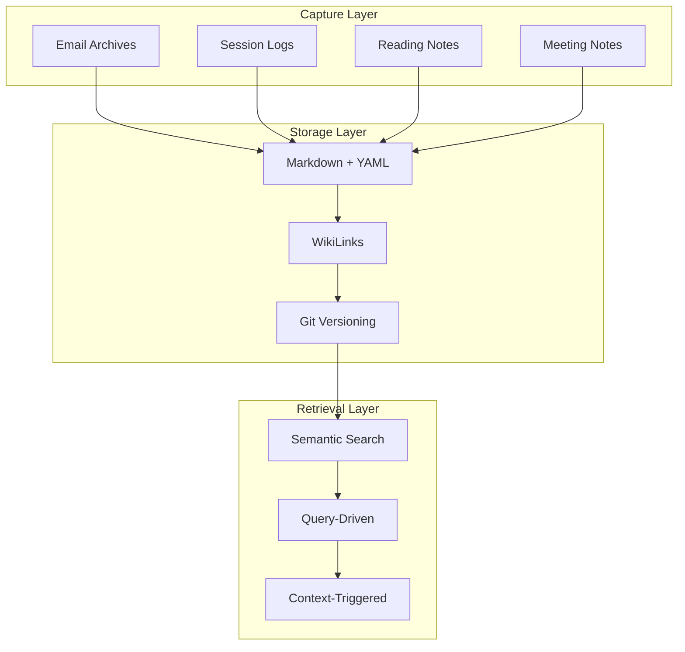

<!-- NS: edit to remove bmem structure (observation sections etc) -->

# Knowledge Management Philosophy

**Status**: Active (guiding principles)

## Core Model



**Vision**: Capture everything. Deliver just-in-time.

## Foundational User Stories

These are non-negotiable requirements. Every design decision must support them.

| #   | User Story                                                                                                                                                                         | Rationale                                                                         |
| --- | ---------------------------------------------------------------------------------------------------------------------------------------------------------------------------------- | --------------------------------------------------------------------------------- |
| US1 | **Human-readable without tools** - I can open any file with a text editor and read it                                                                                              | No lock-in, survives any tool failure                                             |
| US2 | **Standard format** - Markdown with YAML frontmatter and wikilinks                                                                                                                 | Works with Obsidian, VS Code, GitHub, any future tool                             |
| US3 | **Git-native versioning** - I can use git history to see or restore any previous state                                                                                             | Time travel, incremental backup, diff-friendly                                    |
| US4 | **Incremental sync** - I can sync a subset of files without full-repo operations                                                                                                   | Works on slow connections, selective device sync                                  |
| US5 | **Accessible anywhere** - I can access the knowledge base from any device                                                                                                          | Cross-device workflow is core requirement                                         |
| US6 | **No database dependency** - The files ARE the data, not a cache of some database                                                                                                  | Resilient, inspectable, portable                                                  |
| US7 | **Seamless background capture** - Useful information from agent conversations (including incidental/serendipitous observations) is captured automatically, transparently, reliably | Conversations generate valuable insights that shouldn't require manual extraction |

**Corollary**: Any "smart" features (semantic search, [[memory server]], embeddings) are **overlays** on the markdown files, not replacements. If the overlay fails, the files remain fully usable.

## Vision

**Capture everything. Deliver just-in-time.**

Build a knowledge management system that:

1. **Captures comprehensively** - No information is too small, too old, or too tangential to preserve
2. **Delivers precisely** - Information surfaces exactly when needed, at the right detail level, never proactively
3. **Reduces cognitive load** - System remembers so the user doesn't have to

## The Problem

### Current State: Cognitive Overload

Academic work generates massive information flow:

- 500+ emails/day with tasks, papers, grants, collaborations
- 20+ years of research history across shifting domains
- Dense networks of people, projects, concepts, events
- Cross-cutting themes that span decades (e.g., "copyright" from CC work 2006 → ML copyright 2024)

**[[ADHD]] amplifies the challenge:**

- Working memory limitations make manual triage exhausting
- Context switching is expensive
- Information gets lost between interruptions
- Revisiting decisions requires reconstructing entire context

### Failed Approaches

| Approach            | Why It Fails                                                             |
| ------------------- | ------------------------------------------------------------------------ |
| Selective Capture   | Can't predict future relevance; triage drains energy; loss is permanent  |
| Folder Hierarchies  | Cross-cutting themes don't fit; retrieval requires remembering structure |
| Proactive Summaries | Information overload; wrong detail level; delivered when NOT needed      |

## Design Principles

| # | Principle                                                                     | Implementation                                            | Anti-pattern                                 |
| - | ----------------------------------------------------------------------------- | --------------------------------------------------------- | -------------------------------------------- |
| 1 | **Comprehensive Capture**: Zero cognitive judgment on importance              | Email/sessions/notes → entities automatically             | "Is this worth saving?" → If asking, save it |
| 2 | **[[Just-in-Time]] Delivery**: Surfaces in response to need, not anticipation | Query-driven, context-triggered, abstraction-aware        | Daily digests, "you might want to know..."   |
| 3 | **[[Semantic Search\|Semantic Retrieval]]**: Find by meaning, not location    | Embeddings + WikiLinks + tags + entity types              | "Where did I save that?"                     |
| 4 | **Temporal Context**: Default recent, historical when explicit                | Status/period metadata, temporal tags                     | Mixing current with 20-year-old archives     |
| 5 | **Depth on Demand**: Start shallow, go deep only when needed                  | Levels: title → summary → observations → relations → full | Every answer includes full history           |
| 6 | **Compounding Value**: More valuable as it grows                              | Semantic connections, patterns across years               | Archive pollution (see protocol)             |

## Architecture Implications

### bmem Format Requirements

To support this philosophy, bmem entities must have:

**Mandatory fields:**

```yaml
title: Clear, searchable title
permalink: Stable identifier
type: note
tags: Semantic tags for filtering
created: Capture timestamp
```

**Temporal context (for historical content):**

```yaml
status: completed | in-progress | planned
active_period: YYYY-YYYY
relevance: current | historical-only
completion_date: YYYY-MM-DD (if completed)
```

**Semantic structure:**

```markdown
## Context

One-paragraph summary - the "Level 1" answer

## Observations

- [category] Atomic facts with inline #tags
- Minimum 3-5 observations for searchability

## Success Criteria

### Capture Success

**Quantitative:**

- 90%+ of actionable information extracted from email archives
- Session insights captured without manual intervention
- Zero "I forgot about that" moments that could have been captured

**Qualitative:**

- User never thinks "Should I save this?"
- Capture feels frictionless, not burdensome
- Information loss is system failure, not user failure

### Retrieval Success

**Quantitative:**

- 80%+ of queries return relevant results in top 5
- Archive Pollution Score < 0.3 for current-domain queries
- Historical recall > 90% for explicit queries
- 95%+ of searches don't require location knowledge

**Qualitative:**

- User thinks "What do I know about X?" not "Where did I save X?"
- Results are "just enough" - not too much, not too little
- Historical content accessible but not intrusive

### Functional Retrieval Tests (MANDATORY)

**Run via**: `uv run pytest tests/test_bmem_retrieval.py`

Tests verify: single-term queries, multi-term graceful degradation, semantic search fallback, and no silent failures. If any test fails, search is NOT fit for purpose - fix the implementation, don't rationalize failures.

### System Success

**Quantitative:**

- Knowledge base grows linearly with work (not quadratically with manual curation)
- Query response time < 2 seconds
- Zero broken WikiLinks
- 100% bmem validation pass rate

**Qualitative:**

- System feels like external memory, not filing cabinet
- User trusts that captured information will be findable
- Cognitive load measurably reduced (fewer "lost task" incidents)

## Key Tensions (Resolved)

| Tension                           | Resolution                                                                  |
| --------------------------------- | --------------------------------------------------------------------------- |
| Everything vs Noise               | Archival metadata + semantic ranking + abstraction-aware responses          |
| Historical vs Current             | Status/temporal metadata + query interpretation + explicit filtering        |
| Zero-Friction vs Quality Metadata | Automated extraction + inference + progressive enhancement                  |
| Just-in-Time vs Discovery         | Exploratory queries + graph traversal; proactive only for specific triggers |

## Comparison to Other Approaches

| Approach             | Similarity                 | Key Difference                                                                     |
| -------------------- | -------------------------- | ---------------------------------------------------------------------------------- |
| Zettelkasten         | Atomic notes, WikiLinks    | Zettelkasten is curated/synthesis-focused; bmem is comprehensive/retrieval-focused |
| Second Brain (Forte) | Comprehensive capture      | PARA folders vs semantic search; "organize to retrieve" vs "search to retrieve"    |
| Logseq/Roam          | Daily notes, WikiLinks     | Chronological vs entity-centric; manual linking vs semantic search                 |
| Notion               | Structured data, relations | Manual schema/GUI vs flat markdown/search-driven                                   |

## Key Insights

1. **Capture ≠ Retrieval**: Optimize separately
   - Capture: Minimize friction, maximize coverage
   - Retrieval: Maximize precision, minimize noise

2. **Temporal context is first-class metadata**
   - Not just `created` date
   - Active period, completion date, relevance status
   - Essential for multi-decade knowledge bases

3. **"Everything" is tractable with semantic search**
   - Old model: "Store less because search is hard"
   - New model: "Store everything because search is good"

4. **Just-in-time > Proactive for cognitive load**
   - Every notification is an interruption
   - Query-driven = zero cost when not needed
   - Proactive assistance only for specific, high-value triggers

5. **Archives are assets, not liabilities**
   - With proper metadata and search
   - Pollution is solvable (see protocol)
   - Longitudinal patterns emerge only with comprehensive history
```
