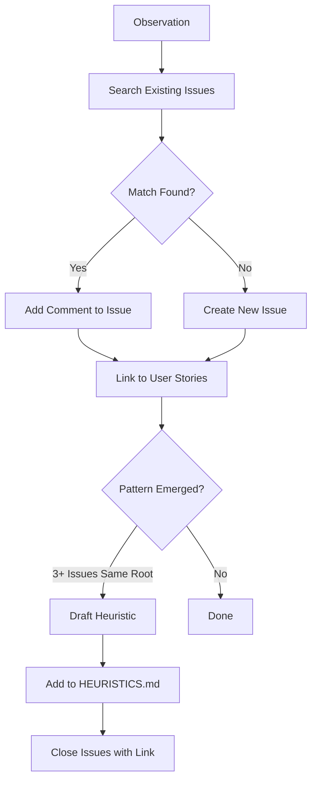

# Learning-Log Skill

**Status**: Implemented

## Workflow



## Purpose

Document agent behavior patterns as GitHub Issues, enabling pattern recognition across sessions and synthesis into framework heuristics.

## Problem Statement

Framework learning risks:
- Observations scattered across local files (hard to search)
- Same pattern logged multiple times without connection
- Patterns identified but never synthesized into actionable guidance
- File-related errors logged without proper investigation
- Claims made without verification

## Solution

A skill that routes all observations to GitHub Issues (per [[AXIOMS]] #28), enforces investigation protocols, and triggers synthesis when patterns emerge.

## How It Works

### Invocation

```
/log [observation]
```

or

```
Skill(skill="learning-log")
```

Invoke when documenting agent failures, success patterns, or framework observations.

### Core Workflow

**Phase 1: Search Existing Issues**

```bash
gh issue list --repo nicsuzor/academicOps --label "[category]" --search "[keywords]" --state open
```

**Phase 2: Create or Update**

- If match exists → add comment with new observation
- If no match → create new Issue with standard format

**Phase 3: Link to User Stories**

Check `ROADMAP.md` User Stories table; link if applicable.

**Phase 4: Synthesis Check**

When pattern emerges (3+ Issues with same root cause):
1. Draft heuristic for HEURISTICS.md
2. Close Issues with link to synthesized content

### Issue Categories (Labels)

| Label | Use For | Level |
|-------|---------|-------|
| `bug` | Component-level bugs (script errors) | component |
| `learning` | Agent behavior patterns | pattern |
| `experiment` | Systemic investigations | systemic |
| `devlog` | Development observations | varies |
| `decision` | Architectural choices | varies |

Default to `learning` if unclear.

### File Error Investigation Protocol

When error involves file operations, MUST investigate:

1. **Identify affected files** - Get exact path(s)
2. **Check modification time** - `stat` or `ls -la`
3. **Find sessions in window** - 30 minutes before mtime
4. **Search for Write/Edit operations** - Grep session JSONLs

Include investigation results in Issue. If inconclusive, state explicitly.

### Root Cause Verification

All claims require direct evidence:
- "File was/wasn't written" → verify with `ls -la`
- "Hook blocked operation" → check hook output AND outcome
- "Error was X" → cite exact error message

If cannot verify, mark "Unverified" in Root Cause.

### Synthesis Triggers

- Same root cause in 3+ Issues
- Pattern spans multiple sessions/dates
- Actionable heuristic becomes clear

### Synthesis Process

1. Identify pattern across Issues
2. Draft heuristic per HEURISTICS.md format
3. Add to HEURISTICS.md with evidence references
4. Close Issues: "Synthesized to HEURISTICS.md H[n]"

Closed Issues remain searchable via GitHub.

## Relationships

### Depends On
- [[AXIOMS]] #28 (Current State Machine - episodic → GitHub Issues)
- [[HEURISTICS]] - Synthesis destination
- GitHub CLI (`gh`) for Issue operations

### Used By
- Any agent observing framework behavior
- Post-session analysis workflows
- `/log` command

### Integrates With
- [[transcript]] skill - Session JSONL → readable transcript for analysis
- [[ROADMAP]] - User Stories linkage

## Success Criteria

1. **GitHub Issues only**: No local episodic files in `$ACA_DATA`
2. **Search-before-create**: Duplicate observations added as comments
3. **Verified claims**: Root causes backed by evidence
4. **Investigation protocol**: File errors properly traced
5. **Synthesis flow**: Patterns graduate to HEURISTICS.md

## Design Rationale

**Why GitHub Issues?**

Per [[AXIOMS]] #28: Episodic content (observations at a point in time) goes to GitHub Issues. Issues provide structured storage with timelines, comments, labels, and search. They're purpose-built for tracking observations over time.

**Why investigation protocol?**

File-related errors often get logged with speculation ("agent may have...") instead of evidence. The protocol forces actual investigation: check mtime, find sessions, search for operations. Inconclusive results are explicitly marked.

**Why synthesis triggers?**

Individual observations have limited value. Patterns that recur 3+ times indicate systematic issues worth encoding as heuristics. Synthesis converts noisy observations into actionable guidance.

**Why DO ONE THING?**

This skill documents only. Fixing issues while logging them conflates concerns and makes it unclear what actually happened. Log first, fix separately.
