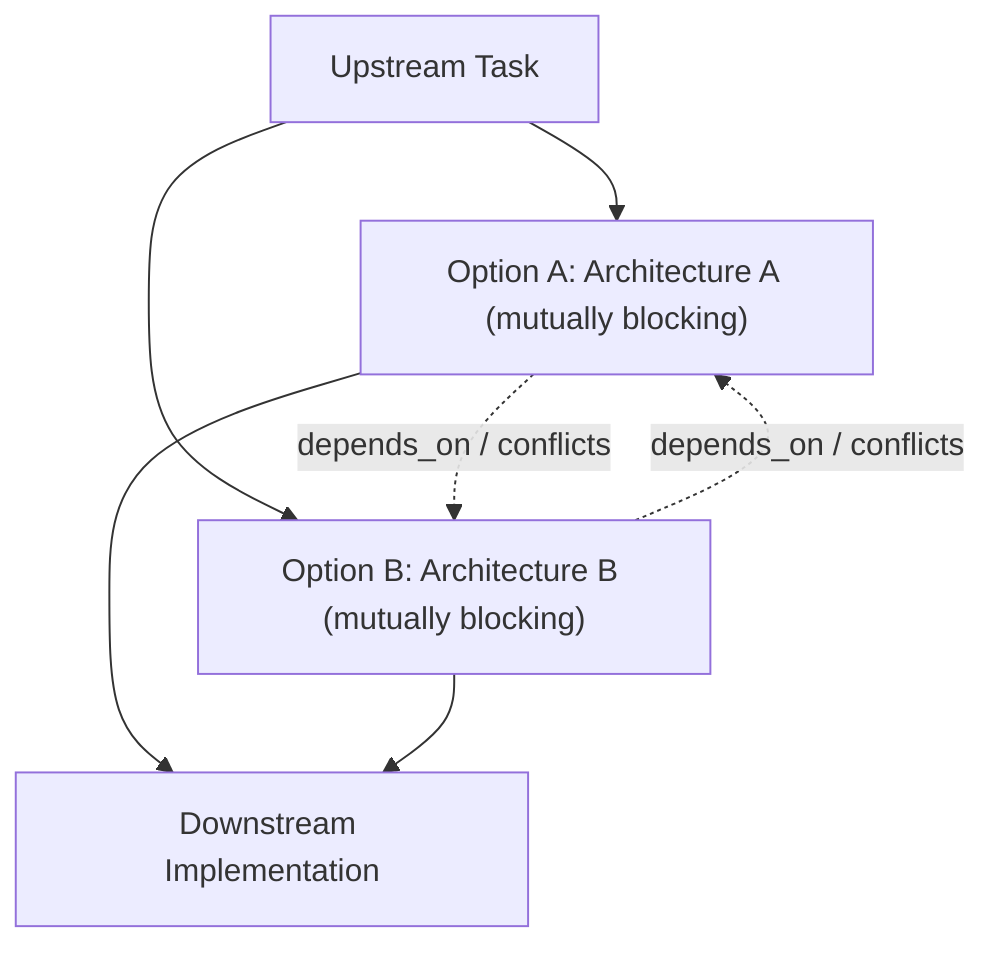

# Task Naming, Filename Standards, and Graph-Relationship Decision Representation

Authoritative specification for task names, filenames, and the structural representation of decisions on the strategic task graph.

- **Stated Purpose:** Establishes unambiguous, enforceable standards for naming tasks and files, resolves the root causes of the historical `nic: decision: xyz` anti-pattern, and defines how decisions and questions emerge from graph relationships rather than static decision tasks.
- **Primary Audience:** Framework architects, planning agents (`pauli`, `ida`), dispatch engines, and human developers authoring or reviewing tasks, notes, and specs.
- **Current Truth / SSoT:** For task execution boundaries, see [`../enforcement/task-contract.md`](../enforcement/task-contract.md); for document classification, see [`doc-taxonomy.md`](doc-taxonomy.md).

---

## 1. Task Naming Standard

Tasks are actionable units of work. Their titles must communicate clear operational intent at a glance:

1. **Verb-Led Imperative:** Every task title begins with an active imperative verb describing the concrete outcome to achieve (e.g., `Implement X`, `Refactor Y`, `Verify Z`, `Extract A from B`).
2. **Brief and Descriptive:** Titles must be concise (typically 4–10 words) yet sufficiently descriptive that an executor or supervisor understands the objective without reading the body.
3. **No Person's Name in Titles or Filenames:** A task title, note title, or filename must **never** contain a person's name or moniker (e.g., `nic: decision: ...`, `nic-task-...`, `for-nic.md`). Assignment and human involvement belong exclusively in frontmatter metadata fields (`assigned_to:`, `assignee:`).
4. **No Artificial Type Prefixes:** Do not encode categories into titles (e.g., avoid `DECISION: ...`, `SPIKE: ...`, `TASK: ...`). Node taxonomy and classification are expressed through frontmatter (`type:`, `classification:`) and graph topology.

### Examples

| Non-Compliant Title                      | Compliant Title                                                  | Frontmatter / Metadata                      |
| :--------------------------------------- | :--------------------------------------------------------------- | :------------------------------------------ |
| `nic: decision: choose database backend` | `Evaluate and select database backend`                           | `assigned_to: nic`, `classification: spike` |
| `DECISION (Nic): otel exporter endpoint` | `Resolve OpenTelemetry trace exporter endpoint`                  | `assigned_to: nic`                          |
| `Task for Alice: fix auth retry bug`     | `Fix authentication retry timeout`                               | `assigned_to: alice`                        |
| `Refactoring`                            | `Refactor hook dispatch pipeline to eliminate duplicate parsing` | `project: aops`                             |

---

## 2. Filename Standard

Filenames identify files within repositories and knowledge bases:

1. **Kebab-Case:** All lowercase alphanumeric characters separated by hyphens (e.g., `doc-taxonomy.md`, `task-contract.md`).
2. **Purpose-Driven and Descriptive:** Names reflect what the file contains or accomplishes, not historical circumstance or author identity.
3. **No Person's Name:** Filenames never include individual names or personal prefixes.
4. **Appropriate Directory Placement:** Files reside in directories defined by [`doc-taxonomy.md`](doc-taxonomy.md) (`specs/`, `plugins/`, `lib/`, `.agents/`).

---

## 3. Root-Cause Analysis & Resolution of "nic: decision: xyz"

### Forensic Root Cause

Historical forensic evidence from the PKB (`goal_ws_question_surfacing`, `aops_69a90166`) establishes that titles shaped like `nic: decision: xyz` emerged from three compounding systemic factors:

1. **Legacy Prompt Doctrine:** An early rule in `.agents/CORE.md` (recorded 2026-08-13) explicitly instructed agents: _"every question to Nic must be filed as a decision node assigned to Nic... the chat sentence is the notification, the node is the record"_. Agents took this instruction literally and began prefixing task titles with `nic: decision: ...` or `DECISION (Nic): ...`.
2. **Capability Grant & Suppression Gap:** When interactive asking tools (`AskUserQuestion`) were temporarily omitted from agent tool grants or suppressed by agent heuristics against interrupting, agents fell back to dumping questions onto the graph as static tasks.
3. **Absence of a Drain Mechanism:** Decision tasks accumulated indefinitely on the graph (~25 stale open nodes), stalling workflows and creating noise without ever driving execution.

### Resolution at the Source

1. **Abolition of Standalone Decision Tasks:** Standalone "decision" tasks are strictly prohibited across all prompts, skills, and documentation.
2. **Proper Field Separation:** Identity and assignment are strictly confined to `assigned_to:` / `assignee:`.
3. **Direct Interactive Resolution:** Interactive, in-session questions are asked immediately via `AskUserQuestion` rather than converted into backlog items.

---

## 4. Graph-Relationship Decision Representation

Decisions and open questions are structural properties of the graph, not static todo-list items. In accordance with the information-theoretic graph taxonomy (`taxonomy-145ee0cd`):



### Representation Principles

1. **Mutually Exclusive Option Nodes:**
   - When a design fork or architectural choice arises, represent the alternatives as concrete option branches/nodes (e.g. `Option A: Use SQLite` and `Option B: Use DuckDB`).
   - The options are wired as mutually blocking or conflicting branches. Progress on downstream work is blocked until one option is chosen and the unselected alternative is cancelled or deleted.
2. **Dynamic Emergence of Questions:**
   - Open architectural decisions are surfaced dynamically by agents inspecting graph topology (detecting unresolved option forks on the critical path) rather than by querying a bucket of stale "decision" tickets.
3. **Empirical Unknowns as Spikes/Probes:**
   - Where a decision depends on missing runtime data or benchmarks, mint an empirical probe task (`classification: spike`, e.g. `Benchmark SQLite vs DuckDB query latency`). Wire the blocked work `depends_on` the probe.
4. **Resolution by Pruning:**
   - Deciding an option consists of selecting the winning node, completing/adopting it, and cancelling/pruning the competing node (`status: cancelled`). This immediately unblocks downstream dependency edges without manual decision-task administrative overhead.

---

## 5. Task Body Brevity, Structure, and Canonical Template

Task bodies are executable instructions for cold executors, not project diaries, architectural essays, or discussion forums.

### Rules of Task Body Authoring

1. **Strictly Concise:** Task bodies are 50–150 words for atomic tasks (up to ~300 words for complex multi-outcome briefed units).
2. **No Extraneous Sections:** Never add sections such as `Background`, `Narrative`, `References`, `Contextual Analysis`, `Task History`, or `Implementation Plan`.
3. **No Prose Task Links:** Never link other tasks from within the body (e.g. no "blocks #123" or "relates to task X"). Task relationships live exclusively as graph edges (`depends_on`, `contributes_to`, `supersedes`).
4. **Pointers Point to Knowledge, Not Tasks:** `[[wikilinks]]` in a task body point solely to durable knowledge (specs, notes, references) that the executor must consult, with a ≤1-clause statement of purpose.

### Canonical Task Template

```markdown
## Goal

1. Concrete outcome 1
2. Concrete outcome 2

## Deliverable

`path/to/artifact`

## Scope

- In: Concrete inclusion
- Out: Adjacent exclusion (no rationale)

## Acceptance criteria

- [ ] Observable end-state condition 1
- [ ] Observable end-state condition 2

## Pointers

- [[spec_or_note_id]] — purpose (e.g. "schema contract", "precedent")
```

### Concrete Example

```markdown
## Goal

1. Migrate configuration loader to Pydantic v2 settings model.
2. Deprecate legacy dict-based config parser.

## Deliverable

`lib/config/loader.py`

## Scope

- In: `Settings` class validation and env var mapping.
- Out: CLI flag parsing (handled in `cli.py`).

## Acceptance criteria

- [ ] `Settings.from_env()` loads valid config from environment variables.
- [ ] Invalid config raises structured `ValidationError`.
- [ ] All existing config unit tests pass.

## Pointers

- [[spec_pydantic_migration]] — schema contract
```

---

## 6. Graph Edge Economy & Hierarchy Invariant

Graph density means meaningful semantic and causal connectivity, not redundant combinatorial wiring:

1. **Parent/Child is Already an Edge:** Setting `parent_id` on a node automatically places and connects it within the parent's hierarchy.
2. **No Redundant Descendant Wiring:** Do **not** wire edges between siblings or descendants under the same parent unless there is a specific, verifiable interaction (such as an explicit causal dependency `depends_on`, `supersedes`, or cross-branch data flow).
3. **Density Means Causal and Strategic Edges:** Densify the graph by wiring `contributes_to` (with `stated_weight` to the target/goal it serves), hard `depends_on` (real blockers), and `supersedes` (replacing obsolete nodes).
