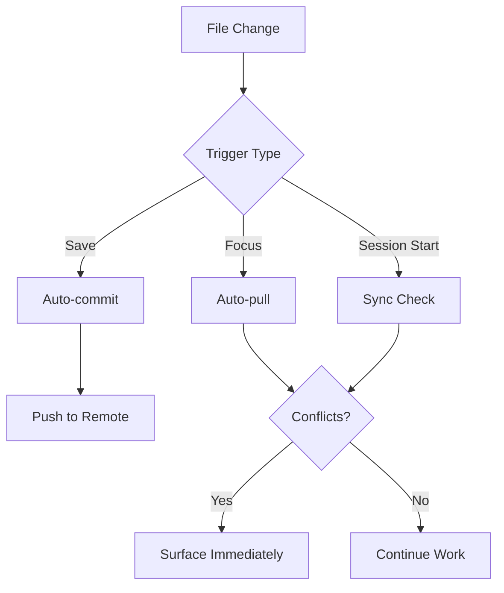

# Multi-Terminal Sync

**Status**: Implementing - approach chosen

## Workflow

## User Story

**As a** user working simultaneously in multiple terminals on any number of machines,
**I want** everything version controlled transparently and always up to date,
**So that** I never lose work and always have current state regardless of which terminal/machine I'm using.

## Acceptance Criteria

1. Changes made in one terminal are available in others without manual intervention
2. Git operations happen transparently (no manual pull/push required for routine work)
3. Conflicts are surfaced immediately when they occur, not discovered later
4. Works across multiple machines (Mac laptop, Debian servers, etc.)
5. No data loss from concurrent edits

## Current State

- **Manual**: User must remember to commit/pull/push
- **Partial automation**: Pre-commit hooks validate, but no auto-sync
- **Conflict discovery**: Often late, during explicit git operations
- **Cross-device**: tmux grouped sessions help within a machine, not across machines

## Implementation Approach (Decision: 2025-12-29)

**Chosen solution**: Layered auto-commit with accepted gaps

| Layer | Tool | Triggers | Coverage |
|-------|------|----------|----------|
| 1. Obsidian edits | **obsidian-git plugin** | Configurable (interval, on close) | `~/writing/` when Obsidian open |
| 2. Claude Code | **PostToolUse hook** (`autocommit_state.py`) | After Write/Edit to `data/`, memory MCP calls, task scripts | Claude Code sessions |
| 3. Manual | User runs `git commit/push` | Explicit | Everything else |

**Why this approach**:
- obsidian-git handles most knowledge base work (where user spends editing time)
- PostToolUse hook already works for Claude Code sessions
- No complex file watchers or daemons to maintain
- Accepted gap: VS Code edits outside both require manual commit (infrequent)

**Tradeoffs accepted**:
- ❌ Not 100% coverage (VS Code direct edits)
- ❌ obsidian-git only works when Obsidian is running
- ✅ Simple, low-maintenance
- ✅ Uses existing tools
- ✅ Covers 90%+ of actual editing

**Setup required**:
- [ ] Install obsidian-git plugin in Obsidian
- [ ] Configure auto-commit interval (suggest: 5-10 min)
- [x] PostToolUse hook already configured

## Implementation Options (Evaluated)

1. **Auto-commit on file save** - Hook/watcher commits changes automatically → **Rejected** (noisy, battery drain)
2. **Auto-pull on terminal focus** - Fetch/merge when switching to a terminal → **Future** (useful addition)
3. **Real-time sync** - Syncthing/rsync for files, git for versioning → **Rejected** (complexity)
4. **Session start sync** - Hooks ensure latest state when starting Claude Code → **Partial** (autocommit does fetch/rebase)
5. **Background sync daemon** - Process watches for changes and syncs periodically → **Rejected** (complexity)
6. **Obsidian plugin** - obsidian-git handles vault auto-commit → **Chosen** (covers main editing)

## Constraints

- Must not break manual git workflows when desired
- Must handle conflicts gracefully (surface, not auto-resolve)
- Must work with private repos and sensitive data
- Should not require extensive configuration per-machine

## Questions to Resolve

- What triggers sync? (time-based, file-save, terminal focus, session start)
- Auto-commit granularity? (per-file, per-session, batched)
- Conflict notification mechanism? (terminal alert, dashboard, notification)
- Scope? (all repos, specific repos, academicOps-managed only)

## Notes

Captured 2025-12-23. This is a foundational workflow need that affects ALL work, not just framework development. The solution should be invisible when working and loud when there are problems.
