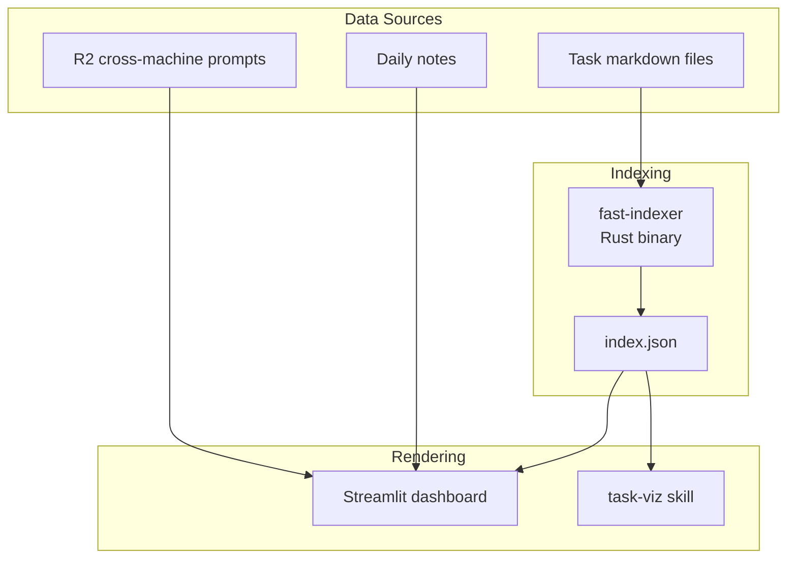

# Overwhelm Dashboard

Single system for task visibility and cognitive load management.

## Architecture



## Core Problem

Task state is scattered and not visible where needed. User returns to terminal and can't remember what they were doing across multiple machines and projects.

## User Story

**As** an overwhelmed academic with ADHD,
**I want** one place that shows all my tasks and what I was working on,
**So that** I can recover context quickly and stay oriented.

## Streamlist dashboard
### Data source
index.json (created by [[fast-indexer]])
**Consumers**:
- [[Task MCP server]] - `rebuild_index()` wraps fast-indexer
- [[Overwhelm dashboard]] - reads index.json directly
- [[task-viz]] - generates graph visualizations

### Streamlit Dashboard

Location: `aops/lib/overwhelm/`

Renders task state and session context. No LLM calls in render path.

**Invocation**:
```bash
cd $AOPS && uv run streamlit run lib/overwhelm/dashboard.py
```

### Data Flow

```
Task files ──> fast-indexer ──> index.json ──> Dashboard
                                    │
                                    └──> Task MCP server
                                    └──> task-viz

Agent sessions --> session state json files --> Dashboard
```

**Key principle**: Dashboard is pure rendering. All computation happens in fast-indexer or pre-computed synthesis.

## Index Schema (index.json)

```json
{
  "generated": "2026-01-21T10:00:00Z",
  "total_tasks": 42,
  "tasks": [
    {
      "id": "20260121-task-slug",
      "title": "Task title",
      "status": "active",
      "priority": 0,
      "project": "project-slug",
      "due": "2026-01-25",
      "parent": "20260120-parent-task",
      "depends_on": ["20260119-dependency"],
      "tags": ["tag1", "tag2"],
      "file": "data/aops/tasks/20260121-task-slug.md"
    }
  ],
  "priority_by_project": {
    "aops": ["task-1", "task-2"],
    "uncategorized": ["misc-task"]
  },
  "priority_by_due": {
    "overdue": [],
    "this_week": ["task-1"],
    "next_week": [],
    "later": ["task-2"],
    "no_date": ["misc-task"]
  }
}
```

## Dashboard Panels

| Panel | Purpose | Data Source |
|-------|---------|-------------|
| **NOW** | Current focus from daily notes | Daily note parsing |
| **Priority Tasks** | P0/P1 tasks grouped by project | index.json |
| **Blockers** | Tasks with unmet dependencies (red-themed) | index.json computed relationships |
| **Done Today** | Completed items | index.json + daily notes |
| **Active Sessions** | What sessions are working on | R2 prompts + local JSONL |

### Active Sessions Panel

Shows per-session context for "where did I leave off" recovery:

```
📍 ACTIVE SESSIONS (3)

┌─────────────────────────────────────────────────────┐
│ abc1234 @ macbook | writing | 5m ago                │
│ "Review implementation plan..."                      │
│ ▶ Update dashboard session panel                    │
│ □ +3 pending                                        │
└─────────────────────────────────────────────────────┘
```

- **Session ID**: First 7 chars of UUID
- **Meta**: hostname | project | time ago
- **Last prompt**: Most recent user prompt (truncated)
- **In-progress**: Current TodoWrite item
- **Pending**: Count of remaining todos

## Design Principles

### Context Recovery, Not Decision Support

The dashboard answers:
- **What's running where?** - Multiple terminals, multiple projects
- **Where did I leave off?** - Per-project context recovery
- **What's the state of X?** - Quick status check

It does NOT try to:
- Recommend ONE thing to do
- Hide options or force single-focus mode
- Make decisions for the user

### Anti-Patterns

- GPS/directive mode that hides options
- Single-focus design that ignores multitasking reality
- Over-indexing on "recommend ONE thing"
- Assuming decision paralysis when the problem is memory

### Information Density

- Show top priorities with "X more" indicators
- Group by project for orientation
- LLM synthesis for human-readable summaries (pre-computed, not in render path)

## Acceptance Criteria

- [x] fast-indexer generates valid index.json from task files
- [ ] Dashboard renders index.json without errors
- [ ] Cross-machine prompts visible via R2 integration
- [ ] Mobile/tablet accessible via browser
- [ ] Graceful degradation when data sources unavailable
- [ ] No LLM calls in render path (pre-computed synthesis only)

## Related

- [[aops-0a7f6861]] - EPIC: fast-indexer adoption
- [[Task MCP server]] - Primary task operations interface
- [[task-viz]] - Network graph visualization (standalone skill)
- [[fast-indexer]] - Rust binary for index generation
