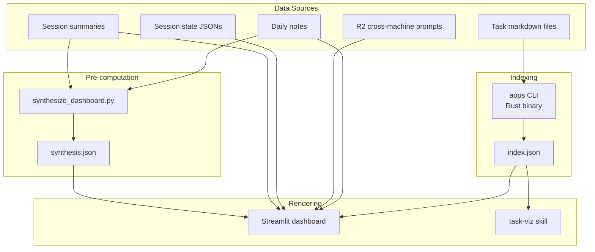

# Overwhelm Dashboard

## Giving Effect

- [[lib/overwhelm/dashboard.py]] — Streamlit dashboard (main rendering)
- [[lib/overwhelm/task_manager_ui.py]] — Task CRUD UI components
- `aops` CLI (nicsuzor/mem) — Rust binary for PKB indexing and graph export
- [[specs/task-map.md]] — Task map visualization spec (extracted)
- [[archived/specs/dashboard-narrative.md]] — Narrative synthesis design (partially implemented)
- [[skills/task-viz/SKILL.md]] — Task visualization skill (JSON, GraphML, DOT output)
- [[skills/dashboard/SKILL.md]] — Cognitive Load Dashboard skill
- [[mcp__pkb__get_network_metrics]] — Graph metrics for dashboard
- [[mcp__pkb__reindex]] — Index rebuild using `aops` CLI
- [[aops-core/lib/path_reconstructor.py]] — Path reconstruction logic
- [[aops-core/lib/transcript_parser.py]] — `extract_timeline_events()` function
- [[aops-core/lib/session_analyzer.py]] — Session analysis and TodoWrite extraction
- [[aops-core/lib/session_context.py]] — Session context model
- [[scripts/synthesize_dashboard.py]] — LLM synthesis → synthesis.json

Single system for task visibility and cognitive load management.

## Architecture



## Core Problem

Task state is scattered and not visible where needed. User returns to terminal and can't remember what they were doing across multiple machines and projects.

## The User

Nic is an academic with ADHD who runs parallel workstreams across multiple machines, terminals, and projects. His working memory is limited but his ambition isn't — at any given time there are 500+ tasks across research, tooling, governance, and teaching, with dozens of agent sessions running in parallel.

The dashboard exists because Nic's brain can't hold all this state. He needs an external system that reconstructs context for him: what was happening, what he intended, what got dropped, and what needs attention now. Off-the-shelf dashboards fail because they're designed for people who remember what they were doing — Nic often doesn't.

## User Stories

### US-D1: I can tell what's happening right now

**As** Nic returning to my desk after a break (or a context switch, or a meeting, or just losing track),
**I want** to see at a glance what's actively running and what state it's in,
**So that** I don't accidentally duplicate work or interrupt an agent mid-task.

**What "right now" means**: Sessions with activity in the last 4 hours. Not yesterday. Not last week. Now.

**What I need to see for each active session**: What I asked it to do (my initial prompt, not the agent's summary of itself). What it's currently doing (in-progress step). Whether it needs me (waiting for input, errored, or finished and awaiting review).

**Acceptance test**: Nic opens the dashboard and within 5 seconds can count how many agents are actively running and whether any need his attention.

### US-D2: I can recover what I was doing before I got distracted

**As** Nic who just realized I've been down a rabbit hole for 2 hours and have lost track of my original plan,
**I want** to see what I started today, what I intended, and what got dropped,
**So that** I can pick up the threads I care about rather than continuing to drift.

**What this means**: The dashboard should show _my_ path — what I asked for, in what order, across which projects. Not what agents did (that's their business). My prompts, my context switches, my dropped threads. Dropped threads are the most actionable: things I started but didn't finish. They should appear first.

**Acceptance test**: Nic can identify at least one dropped thread from today within 10 seconds of opening the dashboard.

### US-D3: I can see today's story, not just today's data

**As** Nic who runs 10+ parallel sessions and can't hold the narrative in my head,
**I want** a brief human-readable summary that tells today's story — what started, what got sidetracked, what's still hanging,
**So that** I can orient myself in 15 seconds without reading through session logs.

**What this means**: The synthesis panel. Not a list of accomplishments — a _narrative_. "Started on the dashboard improvements, got pulled into a Rust compilation issue, HDR review still waiting from yesterday." 3–5 bullets, written for a human, pre-computed by an LLM so it's ready instantly.

**Acceptance test**: Nic reads the synthesis narrative and it matches his lived experience of the day. If it's stale (>60 min), the dashboard flags it.

### US-D4: I can see what each project needs from me

**As** Nic who works across 6+ projects simultaneously,
**I want** per-project cards that show: what's actively being worked on, what's next in the queue, and what was recently accomplished,
**So that** I can quickly check in on any project without opening terminals or task files.

**What this means**: Project boxes with three sections per project — current work (agents running), next priorities (sorted by priority from index.json), and recent completions (so I can see momentum). Projects with more active work should appear first. Empty projects should be hidden.

**Acceptance test**: Nic can answer "what's the status of project X?" for any active project within 5 seconds by finding its card.

### US-D5: I can see what I was working on yesterday and earlier this week

**As** Nic who lost a whole day to meetings and needs to pick up where I left off,
**I want** paused sessions (4–24h old) to be visible but de-emphasized, with enough context to resume them,
**So that** I can decide which threads to pick back up without hunting through terminal history.

**What this means**: Paused sessions appear in a collapsed/subdued section below active work. Each shows: what I was doing (initial prompt), the outcome (merged, completed, needs follow-up), and a re-entry point. Stale sessions (>24h) are not shown inline — they get an archive prompt.

**Acceptance test**: Nic can find a session from yesterday and understand what it was doing without expanding more than one click.

### US-D6: I can capture a thought without losing my place

**As** Nic who just had an idea while looking at the dashboard,
**I want** to quickly capture a task or note without navigating away,
**So that** the idea doesn't evaporate while I context-switch to a different tool.

**What this means**: A quick-capture input somewhere on the dashboard — text area + optional tags + submit. Creates a task in the PKB inbox. Minimal friction: no project selector required, no priority required, just a title and go.

**Acceptance test**: Nic can go from "I just thought of something" to "it's captured" in under 5 seconds.

### US-D7: The dashboard doesn't overwhelm me

**As** Nic whose whole problem is overwhelm,
**I want** the dashboard itself to not be another source of cognitive overload,
**So that** opening it calms me down rather than stressing me out more.

**What this means**: The page can't be an endless scroll of every piece of information the system has. Sections must be collapsible. Stale/irrelevant data must be hidden by default. The most important information (what's running now, what's dropped, what needs me) must be above the fold. Dense data (full project grids, graph visualizations) must be below or collapsed.

**Acceptance test**: The dashboard's above-the-fold content (before scrolling) answers the three critical questions: "What's running?", "What's dropped?", and "What needs me?"

## Page Layout

Single-page Streamlit app. Content flows top-to-bottom. Sidebar provides page navigation and time range filters.

### Actual Section Ordering (as implemented)

1. **Spotlight Epic** — Progress bar for the most active open epic
2. **Task Graph** — Interactive network visualization (see [[specs/task-map.md]])
3. **Current Activity** — Agent count and active session indicator
4. **Focus Synthesis** — LLM-generated narrative + status cards (from synthesis.json)
5. **Daily Story** — Today's accomplishments from session analysis
6. **Where You Left Off** — Active session cards (< 4h) + paused session cards (4–24h)
7. **Your Path** — Dropped threads + timeline reconstruction
8. **Recent Prompts** — Collapsible list of recent user prompts
9. **Project Grid** — Per-project cards with epics, completed, up next, recently
10. **Quick Capture** — Text input for capturing tasks

### Sidebar

| Control                | Options                                                    | Purpose                        |
| ---------------------- | ---------------------------------------------------------- | ------------------------------ |
| Page selector          | Dashboard, Manage Tasks, Session Summary, Network Analysis | Navigate between views         |
| Completed time range   | 4H, 24H, 7D                                                | Filter completed tasks display |
| Context recovery range | Configurable hours                                         | Adjust WLO/Path time window    |

### Section Specifications

#### Spotlight Epic

Dynamically selects the most active open epic (most non-done children) and renders a progress panel: title, percentage bar, and a 3-card grid showing done/in-progress/blocked counts.

**Data source**: `load_tasks_from_index()` — filters for `type == "epic"` with open status, scores by active child count.

**Giving effect**: `render_spotlight_epic()` in dashboard.py

#### Task Graph

See [[specs/task-map.md]].

#### Focus Synthesis

Pre-computed LLM synthesis displayed as a panel. Shows narrative bullets, status cards (accomplishments, alignment, context, blockers, tokens), session insights (skill compliance, corrections, failures, context gaps), and a suggestion.

**Data source**: `$ACA_DATA/dashboard/synthesis.json` — produced by `scripts/synthesize_dashboard.py` (runs outside the render path). Token metrics aggregated from session summaries.

**Giving effect**: `load_synthesis()`, `load_token_metrics()`, inline HTML rendering in dashboard.py. See also [[archived/specs/dashboard-narrative.md]] for the narrative synthesis design.

**Staleness**: Shows age in minutes; displays STALE badge if >60 minutes old.

#### Where You Left Off

Session cards for active and paused work, implementing the session triage model.

**Active bucket** (<4h): Rich card layout with project name, timestamp, goal text (from prompt or TodoWrite), progress bar (completed/total steps), current task + next task, status badge (Running / Needs You).

**Paused bucket** (4–24h): Collapsible cards with outcome text, accomplishment summary, and reentry link. Subdued opacity.

**Stale sessions** (>24h): Currently hidden entirely. Spec calls for an archive prompt — not yet implemented.

**Data sources**: R2 cross-machine prompts, local session state files (`~/.claude/projects/<project>/{date}-{hash}/session-state.json`), session summaries.

**Giving effect**: `fetch_session_activity()`, `get_where_you_left_off()`, inline HTML rendering.

#### Your Path (Path Reconstruction)

Reconstructs the user's actual path across sessions: what was started, what deviated, what got dropped.

**Dropped threads** displayed first (most actionable for context recovery): tasks created/claimed but not completed, grouped by project with colored borders.

**Timeline threads** displayed as horizontal-scroll cards per project: initial goal, git branch, session ID, and a colored-dot timeline of events (prompts, task creates, completions, updates, claims).

**Data source**: `reconstruct_path()` from `aops-core/lib/path_reconstructor.py`, which reads session summary JSONs.

**Giving effect**: `reconstruct_path()`, inline HTML rendering. Event types: `user_prompt`, `task_create`, `task_complete`, `task_claim`, `task_update`.

**ADHD design**: Dropped threads shown first because that's the most actionable information for context recovery. Timeline is scannable — events are one line each, not paragraphs. Directive framing — "YOUR PATH" not "Session History".

#### Recent Prompts

Collapsible expander showing user prompts from session summaries for the last 7 days. Grouped by session, displayed in copyable `st.code()` blocks.

**Data source**: `~/writing/sessions/summaries/*.json` → `prompts` field.

**Giving effect**: `get_recent_prompts(days=7)`, `render_recent_prompts()`.

#### Project Grid

Grid of project cards (responsive, 350px min-width). Each card contains:

| Section       | Content                                                   | Data Source                   |
| ------------- | --------------------------------------------------------- | ----------------------------- |
| **Header**    | Project name, color-coded border                          | Project metadata              |
| **Epics**     | Active epic titles + progress bars (max 3)                | index.json                    |
| **Completed** | Recently completed tasks with time_ago (max 3 + "X more") | index.json, time range filter |
| **Up Next**   | Top 3 priority incomplete tasks with priority badges      | index.json                    |
| **Recently**  | Recent accomplishments from daily log (max 3)             | Daily notes                   |

**Sorting**: Projects sorted by activity score: +1000 per active session, +100 if has P0 task, + recency bonus.

**Filtering**: Empty projects hidden. Sub-projects roll up to parents.

**Giving effect**: Inline rendering loop in dashboard.py.

#### Quick Capture

Text area + tags input + submit button. Creates a task in the PKB inbox via `TaskStorage.create_task()`.

**Giving effect**: Inline rendering at bottom of dashboard.py.

## Session Context Model

**Core principle**: A session is a **conversation thread**, not an agent process. The user recognizes sessions by what they asked, not by agent IDs.

### What Makes a Session Identifiable

The user identifies "which terminal is this?" by:

1. **Initial prompt** — What they first asked the agent to do
2. **Follow-up prompts** — Subsequent requests that shaped the work
3. **Working directory/project** — Secondary context

### Session Context Schema

Each displayed session MUST include:

```json
{
  "session_id": "abc123",
  "project": "academicOps",
  "initial_prompt": "Review PR #42 for the aops CLI changes",
  "follow_up_prompts": [
    "Also check the test coverage",
    "Fix the linting errors you found"
  ],
  "last_user_message": "Fix the linting errors you found",
  "current_status": "Fixing 3 linting errors in src/indexer.rs",
  "planned_next_step": "Run tests after fixes, then mark PR ready for review",
  "last_activity": "2026-02-03T10:30:00Z",
  "started": "2026-02-03T09:15:00Z"
}
```

### Session Display

**Good** (conversation-centric):

```
📍 academicOps (2h ago)
   Started: "Review PR #42 for aops CLI changes"
   Now: Fixing 3 linting errors
   Next: Run tests, mark PR ready
```

**Bad** (agent-centric — REJECTED):

```
🤖 unknown: No specific task (started 165h ago)
```

### Minimum Viable Context

A session MUST have at least initial prompt OR current task status. If neither exists, session is not displayed (hidden as "unidentified"). Sessions showing "unknown: No specific task" provide zero value and MUST be filtered out or prompted for archival.

### Session Triage

**Always apply** recency-based triage:

| Bucket         | Definition                | Display                                      |
| -------------- | ------------------------- | -------------------------------------------- |
| **Active Now** | Activity within 4 hours   | Full session cards with conversation context |
| **Paused**     | 4-24 hours since activity | Collapsed cards, click to expand             |
| **Stale**      | >24 hours since activity  | Archive prompt (see below)                   |

Within buckets, group by project for orientation.

### Stale Session Handling

Sessions >24h without activity are **not displayed in the main list**. Instead:

```
┌─────────────────────────────────────────────────────┐
│ 📦 12 stale sessions (no activity >24h)             │
│                                                     │
│ [Archive All]  [Review & Select]  [Dismiss]         │
└─────────────────────────────────────────────────────┘
```

**Archive** = Move session state to archive folder, remove from active display.
**Review** = Expand to see session summaries, select which to archive.
**Dismiss** = Hide prompt for this dashboard visit (reappears next load).

## Design Principles

### ADHD Accommodation

- **Dropped threads first** — most actionable information for context recovery
- **Scannable, not studyable** — one-line items, colored indicators, no paragraph-level reading required
- **Reactive design** — reconstructs from existing data; no pre-planning required from user
- **Directive framing** — "YOUR PATH" not "Session History"; "NEEDS YOU" not "Status: waiting"
- **Collapsible density** — important information above the fold; detail available on demand
- **No flat displays at scale** — bucket, group, and summarize; never dump 499 items in a list

### Context Recovery, Not Decision Support

The dashboard answers:

- **What's running where?** — Multiple terminals, multiple projects
- **Where did I leave off?** — Per-project context recovery
- **What's the state of X?** — Quick status check

It does NOT try to: recommend ONE thing to do, hide options, force single-focus, or make decisions for the user.

### Scale Considerations

| Session Count | Primary Problem                          | Solution                          |
| ------------- | ---------------------------------------- | --------------------------------- |
| 1-10 sessions | **Memory**: "What was I doing?"          | Context recovery (current design) |
| 10+ sessions  | **Prioritization**: "Which one matters?" | Session triage with buckets       |

### Anti-Patterns

**Decision-support anti-patterns:**

- GPS/directive mode that hides options
- Single-focus design that ignores multitasking reality
- Over-indexing on "recommend ONE thing" at baseline scale
- Assuming decision paralysis when the problem is memory at baseline scale

**Display anti-patterns:**

- **Agent-centric display**: Showing "499 agents running" instead of meaningful session context
- **Unknown/empty sessions**: Displaying "unknown: No specific task" provides zero value
- **Flat lists at scale**: 499 items in a list creates paralysis, not orientation
- **Ignoring recency**: Treating 275h-old sessions the same as 2h-old sessions
- **Truncation that destroys meaning**: Cutting prompts to 60 chars makes them useless

**The litmus test**: If a user sees a session entry and can't answer "what was I doing there?", the display has failed.

### Information Density

- Show top priorities with "X more" indicators
- Group by project for orientation
- LLM synthesis for human-readable summaries (pre-computed, not in render path)

## Known Issues (Audit Feb 2026)

### Section ordering doesn't match ADHD priority

The current layout puts the task graph first, then synthesis, then Where You Left Off. For an ADHD user returning to work, the most urgent questions are "what's running?" and "what's dropped?" — these are answered by Where You Left Off and Your Path, which are buried below the graph and synthesis panel. The graph provides structural overview (important but not urgent); synthesis provides narrative (important but requires synthesis.json to exist). The most critical sections for context recovery should be above the fold.

### Stale session archive prompt not implemented

The spec calls for a "📦 12 stale sessions" prompt with Archive All / Review / Dismiss buttons. The implementation simply hides sessions >24h entirely. Stale sessions are invisible rather than explicitly archived.

### Session context filtering too aggressive

`_has_meaningful_context()` filters out sessions with "unknown" project or descriptions <10 chars. This may hide valid sessions that have meaningful context in other fields (e.g., TodoWrite state). The filter should check multiple fields before rejecting a session.

### Synthesis section fails silently when synthesis.json missing

The entire Focus Synthesis panel disappears when synthesis.json doesn't exist or is stale. No fallback message or prompt to regenerate. The user sees a gap in the layout with no explanation.

### Path reconstruction import fragility

`reconstruct_path()` is called but wrapped in a broad try/except that silently swallows all errors. If the path_reconstructor module isn't importable or the data format changes, the entire Your Path section vanishes with no error message.

### Project boxes don't show agent activity

Project box spec calls for "WORKING NOW" showing active sessions, but the implementation loads sessions_by_project without rendering them in the project cards. The connection between active sessions and their project cards is broken.

### UP NEXT doesn't show task status

Priority tasks in the UP NEXT section show priority badges (P0, P1, P2) but not status (blocked, in_progress, waiting). A blocked P1 task looks identical to an active P1 task. Blocked tasks in UP NEXT should be visually flagged so the user doesn't try to pick them up.

### Page is too long

10+ sections create a very long page. Only Recent Prompts and Paused Sessions are collapsible; everything else is always expanded. The user must scroll extensively to reach project cards or quick capture.

### Spotlight epic has no drill-down

The spotlight epic shows aggregated counts (done/in-progress/blocked) but clicking the epic title does nothing. There's no way to see which specific tasks are in the epic without going to the task manager or opening files.

## Task Management Interface

CRUD operations for tasks directly through the dashboard UI.

### Required Operations

| Operation    | UI Element                      | Backend                  |
| ------------ | ------------------------------- | ------------------------ |
| **Create**   | Quick task form in sidebar      | Task MCP `create_task`   |
| **Read**     | Task details on node click      | Task MCP `get_task`      |
| **Update**   | Inline edit on task card        | Task MCP `update_task`   |
| **Delete**   | Delete button with confirmation | Task MCP `delete_task`   |
| **Complete** | Checkbox/button on task card    | Task MCP `complete_task` |

### Inline Task Editor

When a task node is clicked or a task card is selected:

```
┌──────────────────────────────────────────────────┐
│ ✏️ Edit Task: Fix fallback violations            │
├──────────────────────────────────────────────────┤
│ Title:    [Fix fallback violations in X.py    ] │
│ Status:   [active ▼]  Priority: [P1 ▼]         │
│ Project:  [aops ▼]    Due: [____-__-__]        │
│ Tags:     [bug, framework]                      │
├──────────────────────────────────────────────────┤
│ Body:                                            │
│ ┌────────────────────────────────────────────┐  │
│ │ Description markdown...                    │  │
│ └────────────────────────────────────────────┘  │
├──────────────────────────────────────────────────┤
│ [Save]  [Cancel]  [Complete ✓]  [Delete 🗑️]     │
└──────────────────────────────────────────────────┘
```

### Task Operations Design Principles

- **Non-blocking**: Task operations should not freeze the UI
- **Optimistic updates**: Show changes immediately, sync in background
- **Minimal clicks**: Common operations (complete, change status) in 1-2 clicks
- **Context preservation**: Editing a task shouldn't lose graph position

## Acceptance Criteria

### Core Rendering

- [x] `aops` CLI generates valid index.json from task files
- [ ] Dashboard renders index.json without errors
- [ ] Cross-machine prompts visible via R2 integration
- [ ] Graceful degradation when data sources unavailable (synthesis.json, session states, daily notes)
- [ ] No LLM calls in render path (pre-computed synthesis only)

### Session Display (Critical)

- [ ] Each session shows initial prompt (what user asked)
- [ ] Each session shows current status or planned next step
- [ ] Sessions without meaningful context are hidden (not "unknown: No specific task")
- [ ] Truncation preserves enough context to identify session (≥120 chars minimum)
- [ ] Recency triage applied: Active (<4h), Paused (4-24h), Stale (>24h)
- [ ] Stale sessions trigger auto-archive prompt, not flat list display
- [ ] User can answer "what was I doing?" for every displayed session

### Session Triage

- [ ] Active sessions (last 4h) shown with full conversation context
- [ ] Paused sessions (4-24h) shown collapsed, expandable
- [ ] Stale sessions (>24h) show archive prompt with count
- [ ] Archive action moves session to archive, removes from display
- [ ] Review action expands stale sessions for selective archival

### Path Reconstruction

- [ ] Dropped threads shown first, grouped by project
- [ ] Timeline events scannable (one line each with colored dots)
- [ ] Path section visible even when synthesis.json is missing
- [ ] Low-signal events filtered without losing important context

### Synthesis

- [ ] Narrative panel shows 3-5 bullet summary of today's story
- [ ] Staleness clearly indicated when >60 minutes
- [ ] Graceful fallback when synthesis.json missing (message + regeneration hint)

### Project Boxes

- [ ] Projects sorted by activity (active agents first)
- [ ] Each project shows active work, next priorities, and recent completions
- [ ] UP NEXT shows task status, not just priority
- [ ] Empty projects hidden
- [ ] Sub-projects roll up to parent project cards

### Task Management

- [ ] Create task from dashboard UI
- [ ] Edit task inline (title, status, priority, project)
- [ ] Complete task with single click
- [ ] Delete task with confirmation
- [ ] Changes sync to task files immediately

### Graph Visualization

See [[specs/task-map.md#Acceptance Criteria]].

## Related

- [[specs/task-map.md]] — Task map visualization spec
- [[archived/specs/dashboard-narrative.md]] — Narrative synthesis design
- [[Task MCP server]] — Primary task operations interface
- [[task-viz]] — Network graph visualization (standalone skill)
- `aops` CLI (nicsuzor/mem) — Rust binary for index and graph generation
