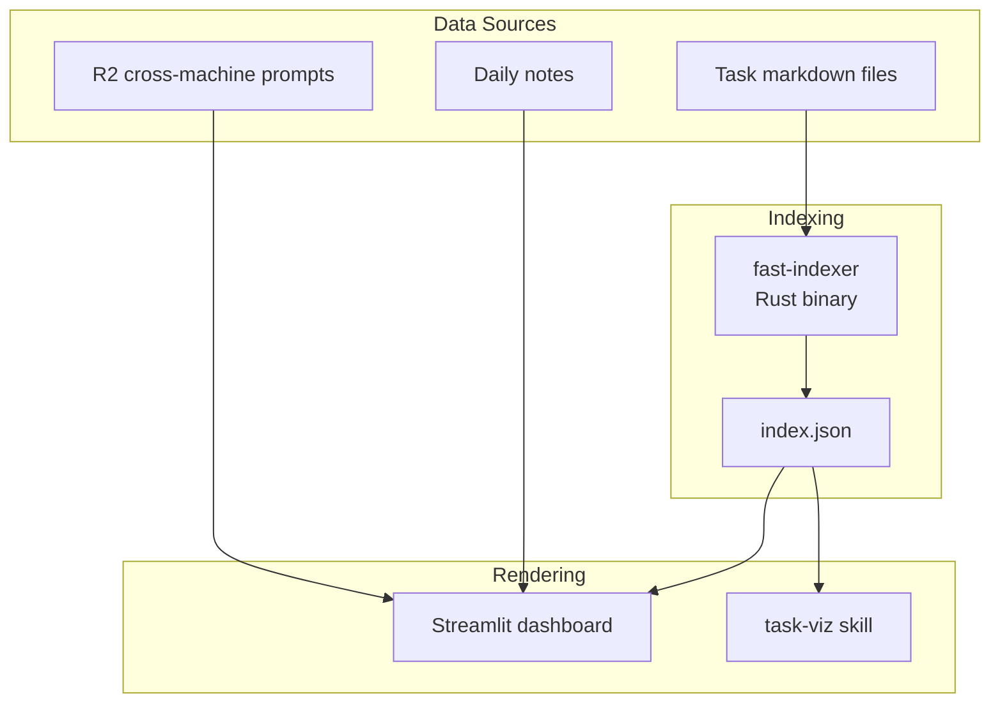

# Overwhelm Dashboard

Single system for task visibility and cognitive load management.

## Architecture



## Core Problem

Task state is scattered and not visible where needed. User returns to terminal and can't remember what they were doing across multiple machines and projects.

## User Story

**As** an overwhelmed academic with ADHD,
**I want** one place that shows all my tasks and what I was working on,
**So that** I can recover context quickly and stay oriented.

## Streamlit Dashboard
### Data source
index.json (created by [[fast-indexer]])
**Consumers**:
- [[Task MCP server]] - `rebuild_index()` wraps fast-indexer
- [[Overwhelm dashboard]] - reads index.json directly
- [[task-viz]] - generates graph visualizations

### Streamlit Dashboard

Location: `aops/lib/overwhelm/`

Renders task state and session context. No LLM calls in render path.

**Invocation**:
```bash
cd $AOPS && uv run streamlit run lib/overwhelm/dashboard.py
```

### Data Flow

```
Task files ──> fast-indexer ──> index.json ──> Dashboard
                                    │
                                    └──> Task MCP server
                                    └──> task-viz

Agent sessions --> session state json files --> Dashboard
```

**Key principle**: Dashboard is pure rendering. All computation happens in fast-indexer or pre-computed synthesis.

## Index Schema (index.json)

```json
{
  "generated": "2026-01-21T10:00:00Z",
  "total_tasks": 42,
  "tasks": [
    {
      "id": "20260121-task-slug",
      "title": "Task title",
      "status": "active",
      "priority": 0,
      "project": "project-slug",
      "due": "2026-01-25",
      "parent": "20260120-parent-task",
      "depends_on": ["20260119-dependency"],
      "tags": ["tag1", "tag2"],
      "file": "data/aops/tasks/20260121-task-slug.md"
    }
  ],
  "priority_by_project": {
    "aops": ["task-1", "task-2"],
    "uncategorized": ["misc-task"]
  },
  "priority_by_due": {
    "overdue": [],
    "this_week": ["task-1"],
    "next_week": [],
    "later": ["task-2"],
    "no_date": ["misc-task"]
  }
}
```

## Dashboard Panels

| Panel | Purpose | Data Source |
|-------|---------|-------------|
| **NOW** | Current focus from daily notes | Daily note parsing |
| **Task log**  | What's been happening | tasks mcp |
| **Priority Tasks** | P0/P1 tasks grouped by project | index.json |
| **Blockers** | Tasks with unmet dependencies (red-themed) | index.json computed relationships |
| **Done Today** | Completed items | index.json + daily notes |
| **Active Sessions** | What sessions are working on | R2 prompts + local JSONL |

### Task log

Shows real-time view of tasks checked out, completed, added.

### Active Sessions Panel

Shows per-session context for "where did I leave off" recovery:

```
📍 ACTIVE SESSIONS (3)

┌─────────────────────────────────────────────────────┐
│ abc1234 @ macbook | writing | 5m ago                │
│ "Review implementation plan..."                      │
│ ▶ Update dashboard session panel                    │
| x Read implementation plan                          |
│ □ +3 pending                                        │
└─────────────────────────────────────────────────────┘
```

- **Session ID**: First 7 chars of UUID
- **Meta**: hostname | project | time ago
- **Last prompt**: Most recent user prompt
- **In-progress**: Current TodoWrite item
- **Pending**: Count of remaining todos

#### Session Card Parameters

| Parameter | Value | Rationale |
|-----------|-------|-----------|
| **Truncation length** | 120 chars | 60 chars loses key entities; 120 captures verb + object + context |
| **Time window (Active Now)** | 4 hours | 24h too wide; 4h = realistic "recently touched" window |
| **Fallback context** | Empty or real git context | "Local activity" is noise; show nothing or extract `git branch`, touched files |

**Context extraction priority** (from `dashboard.py:604+`):
1. Current Task (`state.main_agent.current_task`)
2. Last Prompt (`state.main_agent.last_prompt`)
3. Hydration Original Prompt (`state.hydration.original_prompt`)
4. **Fallback**: Show git branch + modified files, OR show nothing

**Do not**: Display "Local activity" placeholder. It adds noise without information.

### Task Graph Tab

Visualizes the task network and calculates health metrics. Accessible via the "🕸️ Task Graph" tab.

**Data Sources**:
- `graph.json` from fast-indexer (node-link format)
- Most recent `task-viz*.svg` for visualization

**Health Metrics Displayed**:

| Metric | What it measures | Healthy signal |
|--------|------------------|----------------|
| **Sequencing (Clumping Ratio)** | Max level width ÷ avg level width | < 3.0 |
| **Branching Factor** | Avg/max children per node | Max ≤ 10 |
| **Priority Inheritance** | Children with lower priority than parent | 0 violations |
| **Connectivity** | Number of disconnected subgraphs | 1 component |
| **Strategic Reachability** | % of tasks reachable from goals | ≥ 95% |
| **Chain Depth** | Longest goal→task path | Longer = better sequencing |

**Features**:
- Scrollable SVG graph display (max-height 400px)
- Color-coded health cards (green=healthy, yellow=warning, red=problem)
- Lists specific priority violations if any
- Lists orphan tasks not connected to goals

## Design Principles

### Context Recovery, Not Decision Support

The dashboard answers:
- **What's running where?** - Multiple terminals, multiple projects
- **Where did I leave off?** - Per-project context recovery
- **What's the state of X?** - Quick status check

It does NOT try to:
- Recommend ONE thing to do
- Hide options or force single-focus mode
- Make decisions for the user

### Scale Considerations

The problem changes at scale:

| Session Count | Primary Problem | Solution |
|--------------|-----------------|----------|
| 1-10 sessions | **Memory**: "What was I doing?" | Context recovery (current design) |
| 10+ sessions | **Prioritization**: "Which one matters?" | Session triage (see below) |

At 10+ active sessions, displaying a flat list creates decision paralysis. The dashboard must shift from pure context recovery to **context recovery with triage assistance**.

### Session Triage

When session count exceeds threshold (default: 10), apply recency-based triage:

| Bucket | Definition | Display |
|--------|-----------|---------|
| **Active Now** | Activity within 4 hours | Full session cards, expanded |
| **Paused** | 4-24 hours since activity | Collapsed cards, click to expand |
| **Stale** | >24 hours since activity | Grouped summary: "X stale sessions" |

Within buckets, group by project for orientation.

**Implementation**: `fetch_session_activity(hours=4)` for Active Now bucket.

### Anti-Patterns

- GPS/directive mode that hides options
- Single-focus design that ignores multitasking reality
- Over-indexing on "recommend ONE thing" *at baseline scale*
- Assuming decision paralysis when the problem is memory *at baseline scale*
- **Ignoring scale transitions**: Flat lists work for 5 sessions, not 50

### Information Density

- Show top priorities with "X more" indicators
- Group by project for orientation
- LLM synthesis for human-readable summaries (pre-computed, not in render path)

## Implementation Phasing

### Phase 1: Parameter Tuning (Non-Breaking)

Quick wins that don't change UI structure:

| Change | File | Line | Effort |
|--------|------|------|--------|
| Truncation 60→120 chars | `dashboard.py` | 1782 | 1 line |
| Time window 24h→4h | `dashboard.py` | 1916 | 1 line |
| Kill "Local activity" fallback | `dashboard.py` | 604 | Replace with `""` or git context |

### Phase 2: Session Triage UI (Breaking)

Structural changes requiring new components:

1. **Recency bucket logic**: Categorize sessions into Active Now / Paused / Stale
2. **Collapsible cards**: Implement expand/collapse for Paused bucket
3. **Grouped summary**: "X stale sessions" with drill-down
4. **Project grouping**: Within-bucket organization

### Phase 3: Rich Fallback Context (Optional)

If Phase 1 fallback removal leaves too many empty cards:

1. Extract git branch from session state
2. Show recently modified files
3. Parse working directory for project indicators

## Acceptance Criteria

- [x] fast-indexer generates valid index.json from task files
- [ ] Dashboard renders index.json without errors
- [ ] Cross-machine prompts visible via R2 integration
- [ ] Mobile/tablet accessible via browser
- [ ] Graceful degradation when data sources unavailable
- [ ] No LLM calls in render path (pre-computed synthesis only)
- [ ] Truncation length ≥120 chars for session prompts
- [ ] Active sessions use 4h window (not 24h)
- [ ] No "Local activity" placeholder displayed
- [ ] Session triage buckets visible when count >10

## Related

- [[aops-0a7f6861]] - EPIC: fast-indexer adoption
- [[Task MCP server]] - Primary task operations interface
- [[task-viz]] - Network graph visualization (standalone skill)
- [[fast-indexer]] - Rust binary for index generation
