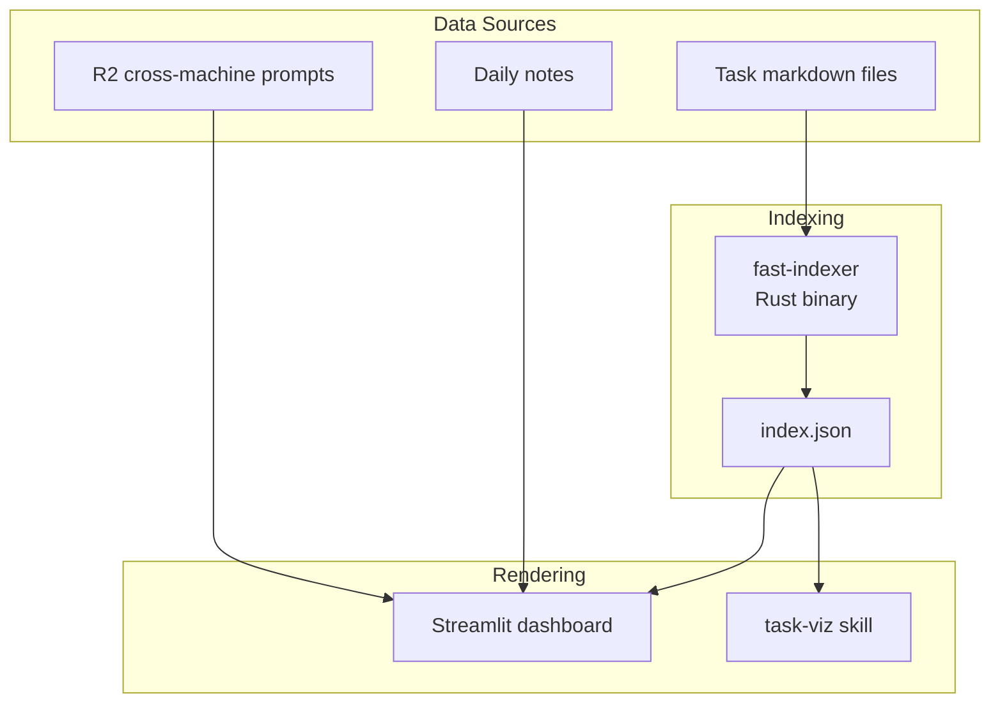

# Overwhelm Dashboard

Single system for task visibility and cognitive load management.

## Architecture



## Core Problem

Task state is scattered and not visible where needed. User returns to terminal and can't remember what they were doing across multiple machines and projects.

## User Story

**As** an overwhelmed academic with ADHD,
**I want** one place that shows all my tasks and what I was working on,
**So that** I can recover context quickly and stay oriented.

## Streamlist dashboard
### Data source
index.json (created by [[fast-indexer]])
**Consumers**:
- [[Task MCP server]] - `rebuild_index()` wraps fast-indexer
- [[Overwhelm dashboard]] - reads index.json directly
- [[task-viz]] - generates graph visualizations

### Streamlit Dashboard

Location: `aops/lib/overwhelm/`

Renders task state and session context. No LLM calls in render path.

**Invocation**:
```bash
cd $AOPS && uv run streamlit run lib/overwhelm/dashboard.py
```

**Panels**:

| Panel | Purpose |
|-------|---------|
| NOW | Current focus from daily notes |
| Priority Tasks | P0/P1 tasks grouped by project |
| Blockers | Tasks with unmet dependencies |
| Done Today | Completed items |
| Active Sessions | What current sessions are working on and what they've recently completed |

### Data Flow

```
Task files ──> fast-indexer ──> index.json ──> Dashboard
                                    │
                                    └──> Task MCP server
                                    └──> task-viz

Agent sessions --> session state json files --> Dashboard
```

**Key principle**: Dashboard is pure rendering. All computation happens in fast-indexer or pre-computed synthesis.

## Design Principles

### Context Recovery, Not Decision Support

The dashboard answers:
- **What's running where?** - Multiple terminals, multiple projects
- **Where did I leave off?** - Per-project context recovery
- **What's the state of X?** - Quick status check

It does NOT try to:
- Recommend ONE thing to do
- Hide options or force single-focus mode
- Make decisions for the user

### Information Density

- Show top priorities with "X more" indicators
- Group by project for orientation
- LLM synthesis for human-readable summaries (pre-computed)

## Acceptance Criteria

- [ ] fast-indexer generates valid index.json from task files
- [ ] Dashboard renders index.json without errors
- [ ] Cross-machine prompts visible via R2 integration
- [ ] Mobile/tablet accessible via browser
- [ ] Graceful degradation when data sources unavailable

## Related

- [[aops-0a7f6861]] - EPIC: fast-indexer adoption
- [[Task MCP server]] - Primary task operations interface
- [[task-viz]] - Network graph visualization
